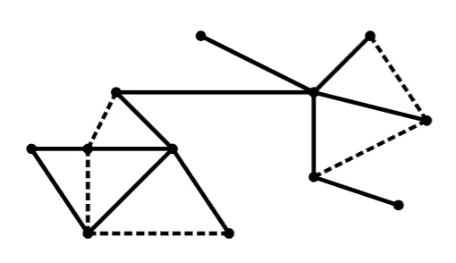
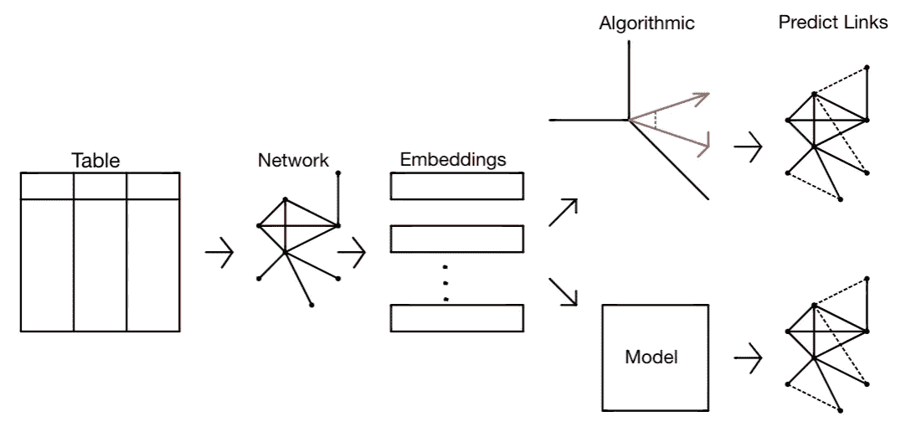
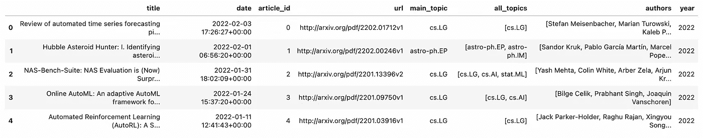
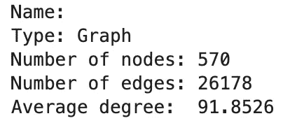
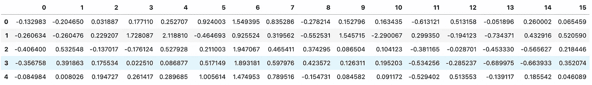
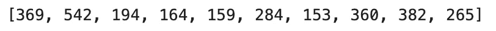
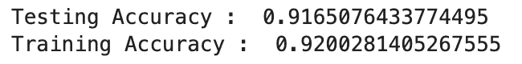
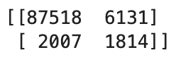
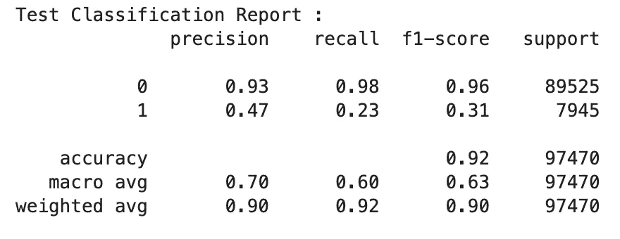

# 使用 Node2Vec 的链接预测推荐引擎

> 原文：<https://towardsdatascience.com/link-prediction-recommendation-engines-with-node2vec-c97c429351a8>

## 在 Python 中使用节点嵌入进行链接预测


图片由 [Preethi Viswanathan](https://unsplash.com/@sallybrad2016) 从 [Unsplash](https://unsplash.com/photos/h5fsy4E4FMY) 拍摄

本文将介绍链接预测背后的基本直觉，并展示一种基于嵌入的方法，说明如何使用链接预测来解决推荐系统问题。

我还将概述一个实践问题，并指导读者如何用 Python 实现所提出的解决方案。使用网络分析解决推荐系统中的问题时，这是一种常见的方法。

本文的重点是向读者展示如何使用 node2vec 嵌入和余弦相似性或 node2vec 嵌入和基于建模的方法来实现解决链路预测问题的算法方法。如果你对 node2vec 不熟悉，我以前写过一篇关于它的文章，你可以在下面看看。

[](/node2vec-explained-db86a319e9ab)  

推荐系统环境中的 Node2Vec 可用于基于邻居的应用。这是因为 node2vec 保留了网络的初始结构，来自 node2vec 的嵌入是量化是否应该有连接一对节点的边的好方法。

**目录**

*   什么是链接预测？
*   链路预测的应用
*   问题陈述
*   解决方案架构
    -需求
*   数据
*   创建网络
*   应用节点 2Vec
*   带距离测量的建议
*   基于建模的建议
    -创建训练数据
    -训练模型
    -评估模型
    -生成预测
*   结束语
*   资源

# 什么是链接预测？

推荐引擎有很多解决问题的方法。这些解决方案包括算法方法、链接预测算法、基于嵌入的解决方案等。链接预测也称为图完成，这是图论中的一个常见问题。最简单的形式是，给定一个网络，你想知道一对节点之间是否应该有边。根据您使用的网络类型，此定义会略有不同。有向/多向图可以有稍微不同的解释，但是识别网络中缺失边的基本概念仍然存在。



给定一个图 G，让实线代表当前存在于图中的边，虚线代表应该存在于图中但当前不存在的边。图片由作者提供。

当处理时间网络(随时间变化的网络)时，链路预测中的问题也很常见。给定一个时间步长为 t 的网络 G，您可能想要预测时间步长为 t+1 的图 G 的边。

# 链路预测的应用

使用链接预测来解决问题的主要应用是在构建推荐系统的环境中。像亚马逊、脸书和推特这样的顶级公司很可能已经尝试/已经在他们的推荐引擎中实现了某种形式的链接预测。从尝试向他们的用户推荐产品，到推荐你可能感兴趣的其他用户。当您的网络随着时间的推移而变化和增长时，这更是一种有趣的解决问题的方法。

要知道，好的建议取决于你如何定义问题以及你想给出的建议。你必须记住影响用户行为的各种指标，这些指标反映了用户喜欢什么，不喜欢什么，与用户相关的兴趣以及这些东西是如何相互交织在一起的。

# 问题陈述

给定 arXiv 上发表的各种研究论文的主题数据，我们希望建立一个管道，根据它们的相似性将两篇论文连接起来。

# 解决方案架构

为此，我们将创建一个网络，其中节点作为文章，边基于连接这些文章对的所有主题连接这些节点。在创建这个网络时，我们将使用 node2vec 来生成与每篇文章相关的节点嵌入。最后，我将向您展示通过嵌入构建推荐系统的两种不同方法，首先是基于余弦相似性的算法方法。然后是基于建模的方法，该方法将允许我们训练二进制分类模型，该二进制分类模型将指示一对节点是否应该具有边。这将是一个监督学习模型，其中输入将是一对节点，输出将是二进制的，也就是说，节点是否应该连接到网络中。



代表建议的解决方案的体系结构。图片由作者提供。

## 要求

```
Python=3.8.8
arxiv=1.4.2
networkx=2.5
pandas=1.2.4
numpy=1.20.1
node2vec=0.4.4
sklearn=0.24.1
```

如果没有安装 node2vec 包，这里的[是通过命令行安装的库文档。同样，你可以用 Python 安装 arXiv 包，使用下面的指令](https://pypi.org/project/node2vec/)[这里](https://pypi.org/project/arxiv/)。

# 数据

我们将使用 arXiv API 来收集与各种关键字相关的研究论文和出版物的数据。基于他们 API 的 arXiv 使用条款，它是完全免费的，并鼓励使用。有关其使用条款的更多信息，请参考其文档，您可以在此处找到[。](https://arxiv.org/help/api/tou)

在本文中，我将向您展示如何通过 Python 调用 API 来收集我们今天构建的模型所需的以下信息。如果你想通过其他编程语言使用这个 API，或者只是想了解更多关于如何使用这个 API 的信息，我强烈建议你参考他们的文档，你可以在这里找到。

我们想要点击 arXiv API 来收集一些关于基于我们上面确定的查询的最新研究论文的信息。这将允许我们根据研究论文数据创建一个网络，然后我们可以尝试预测该网络上的链接。出于本文的目的，我将在每个查询中搜索最多 100 个结果，但是您不必为自己设置相同的约束。arXiv API 允许用户每次查询达到 300，000 个结果[1]。下面概述的函数将生成一个获取以下信息的 CSV:
`title, date, article_id, url, main_topic, all_topics, authors, year`
您可以获取更多类似于`links, summary, article`的信息，但我决定不这样做，因为这些特性不会真正用于本分析和教程。

下面是我点击 arXiv API 时得到的输出示例。根据您选择查询的关键字和时间，您可能会收到不同的信息。



点击 arXiv API 的示例 CSV 结果(图片由作者提供)

如果您在获取数据时遇到问题，我上传了一个示例 CSV 到我的 GitHub，供您下载、使用和跟随。这里可以找到[。](https://github.com/vatsal220/medium_articles/blob/main/link_prediction/data/arxiv_data.csv)

# 创建网络

现在我们已经使用 axXiv API 获取了数据，我们可以生成一个网络。该网络将具有以下结构，节点将是 article _ ids，边将是连接一对文章的所有主题。例如，具有以下主题`astro-physics`和`statistics`的 article_id 1 可以连接到具有主题`statistics`的 article_id 10 和具有主题`astro-physics`和`math`的 article_id 7。这将是一个多边网络，其中每条边的权重为 1。

以下是我生成的与网络相关的统计数据:



研究网络统计。图片由作者提供。

# 应用节点 2Vec

这个组件将包括在上面生成的图上运行 node2vec，并为该网络创建相关的节点嵌入。这些嵌入将在接下来的工作中发挥至关重要的作用，因为它们是构建链接预测模型所必需的主要功能。

以下是从研究网络生成的嵌入的样本输出。索引上的值对应于节点，而列代表每个嵌入维度。我选择生成一个 16 维的嵌入空间，因此列名从 0 到 15。



通过 node2vec 生成的网络嵌入的示例输出。图片由作者提供。

# 带距离测量的建议

现在我们有了一个表示网络中每个节点的嵌入向量，我们可以使用距离度量，如余弦相似度、欧几里德距离、曼哈顿距离等。来测量节点之间的距离。我们通过使用这些距离度量所做的假设是，彼此非常接近的节点也应该有一条连接彼此的边。这是一个很好的假设，因为 node2vec 试图保留原始输入图的初始结构。现在，我们可以编写代码，使用余弦相似性(或不同的距离度量)来测量两个向量之间的相似性水平，并识别当前在它们之间没有边但具有较大相似性的节点对，应该在它们之间创建边。对于多重/加权/有向图，这种解释可能不同。选择并使用一个适合你要解决的网络和问题的相似性度量。还要注意，不同的度量有不同的解释，对于这个问题，你要选择最大的余弦相似性得分，而如果你要使用像欧几里德距离这样的东西，你要选择两个向量之间的最小距离。

另外，我确实想提到，在解决这类问题时，维数灾难非常普遍。特别是当使用欧几里德距离来测量高维向量之间的距离时，这尤其成问题。术语“高维度”是广义的，可以有多种解释，一个维度“高”的阈值没有严格的定义，并且因问题而异。不去深究事物背后的数学，欧几里德距离对于稀疏或高维向量来说并不是一个好的度量。你可以参考 stack exchange 上的这两个帖子( [post1](https://stats.stackexchange.com/questions/29627/euclidean-distance-is-usually-not-good-for-sparse-data-and-more-general-case) ， [post2](https://stats.stackexchange.com/questions/99171/why-is-euclidean-distance-not-a-good-metric-in-high-dimensions) )，它概括了为什么会出现这种情况的数学推理。

关于维数灾难的更多信息，请参考华盛顿大学计算机科学系的这篇论文。



连接到文章 id 1 的推荐链接。这些是目前网络中不存在的链路。图片由作者提供。

# 基于建模的建议

在本节中，我们将构建一个二元分类器来预测一对边连接或不连接的概率。要做到这一点，我们首先需要识别所有可以形成边的节点对，并识别在原始网络中它们之间已经有边的那些节点对的子集。然后，我们可以组合与所有可能的边相关联的嵌入(通过向量相加),并将其传递到训练测试分割函数中，以生成训练和测试分区，并传递到分类模型中。

我将在本教程中使用的模型将是一个梯度推进分类器，对于你自己的问题和实验，我建议你尝试各种不同的分类器，并选择整体表现最好的一个。我们正在构建一个二进制分类器，但是在几乎所有的情况下，不管输入数据/网络如何，这个分类器都会存在类别不平衡。由于我们采用了网络中可能形成的所有可能的边的组合，结果是 N^N(其中 n 是网络中的节点数)，它是指数级的大。唯一不会是二元分类器的方法是如果你的图几乎是完全连通的。

## 创建培训数据

## 火车模型

## 评估模型

当处理类不平衡时，我们不能用传统的准确性度量来评估模型的性能。这是因为如果模型连续预测具有更大数据量的类，那么不管模型从不预测另一个类，它仍将实现高水平的准确性。解决这个问题的方法是使用像马修斯相关系数这样的指标。

> MCC 本质上是-1 和+1 之间的相关系数值。系数+1 表示完美预测，0 表示平均随机预测，而-1 表示反向预测。该统计也称为 phi 系数。【https://en.wikipedia.org/wiki/Phi_coefficient】-[-](https://en.wikipedia.org/wiki/Phi_coefficient)-【3】



与梯度提升分类器相关联的训练和测试精度。图片由作者提供。


测试数据的 MCC 分数。图片由作者提供。



测试数据的分类报告。图片由作者提供。



测试分类报告。图片由作者提供。

## 生成预测

很明显，您可以看到，对于给定的任务，这是一个性能很差的模型(通过 MCC、ft-score、recall 和 precision 反映出来)。但这没关系，因为这篇文章只是出于教育目的。并不是你用来解决某个特定问题的每种方法都会成功，通常不是方法的问题，而是数据的问题。在本教程中，数据肯定是错误的，因为我只使用了一个实际研究网络的小样本，如果我从 arXiv 获取更多数据，就可以得到这个样本。但是这样做也会增加本文许多不同部分的计算复杂度(比如运行 node2vec、生成所有可能的边对、训练模型等。).

# 结束语

希望这篇文章揭示了如何通过节点嵌入构建一个链接预测管道。我已经研究了链接预测的算法方法和基于模型的方法。

请注意，本文涉及的主题并不简单，它们不应该是解决推荐系统问题的首选。大多数数据科学家在解决问题时遵循的经验法则是，如果简单的解决方案有效，那么更复杂的解决方案也应该有效。涉及协作过滤/基于内容的推荐系统中的较简单的解决方案通常很容易实现，并且产生相对信息丰富的结果以及更复杂的解决方案是否也能解决该问题的指示。由于各种原因(如训练时间、可解释性、模型推理时间等)，通常用神经网络来解决问题(如 node2vec)并不是最好的方法。).

关于如何在推荐系统中实现更简单的解决方案，您可以参考我写的另一篇文章。

[](/recommendation-systems-explained-a42fc60591ed)  

此外，如果你想在与这个项目相关的 jupyter 笔记本中进行跟进，你可以参考我的 [GitHub](https://github.com/vatsal220/medium_articles/blob/main/link_prediction/link_prediction.ipynb) 。

# 资源

*   [1]https://arxiv.org/help/api/user-manual
*   [2]https://pypi.org/project/arxiv/
*   [3][https://en.wikipedia.org/wiki/Phi_coefficient](https://en.wikipedia.org/wiki/Phi_coefficient)

如果你喜欢这篇文章，这里有一些我写的其他文章，你可能也会喜欢。

[](/word2vec-explained-49c52b4ccb71)  [](/linear-algebra-explained-through-graph-theory-1c79711e9a20)  [](/mining-modelling-character-networks-part-i-e37e4878c467)  [](https://vatsal12-p.medium.com/mining-modelling-character-networks-part-ii-a3d77de89638)  [](/bayesian-a-b-testing-explained-344a6df88c1a) [## 贝叶斯 A/B 测试解释

towardsdatascience.com](/bayesian-a-b-testing-explained-344a6df88c1a) [](/markov-chain-explained-210581d7a4a9)  [](https://pub.towardsai.net/dynamic-time-warping-explained-fbb24c1e079b) 