# LinkedIn 数据科学家面试问题

> 原文：<https://towardsdatascience.com/linkedin-data-scientist-interview-questions-e401b81a9208>

## *在本文中，我们将解答一个常见的 LinkedIn 数据科学家面试问题，这些问题需要广泛的 SQL 技能*


作者在 [Canva](https://canva.com/) 上创建的图片

我们正在解决的 LinkedIn 数据科学家面试问题有多种解决方法，但我们将通过一小步一小步来简化解决问题的过程。请继续阅读，看看我们如何利用一个可以应用于任何数据科学挑战的框架，将这个中等难度的 LinkedIn 数据科学家面试问题分解为更易于管理的部分。

LinkedIn 成立于 2003 年，目标是将世界各地的专业人士和专家联系起来，以促进他们的职业成功。LinkedIn 在全球拥有超过 7.5 亿会员，比任何其他社交网络都拥有更多专业人士，从刚刚开始职业生涯的人到所有财富 500 强公司的高管。在运营上，LinkedIn 是一家全球性公司，拥有各种各样的收入模式，涉及营销、人才、销售和会员解决方案。

# LinkedIn 的数据科学家职位

LinkedIn 数据科学家职位通常为数据科学团队工作，该团队属于更大的数据工程部门。作为数据科学团队的一员，您将利用来自 7 亿多名成员的数据，为产品、销售、营销、经济、基础设施和其他团队提供见解。这些数据见解将推动战略，应用统计推断和算法进行优化，并构建工程解决方案来扩展 LinkedIn 的持续业务目标和长期公司愿景。

LinkedIn 的数据科学家职位需要具备 SQL、结构化和非结构化数据、分布式数据系统、R 或 Python 等编程语言、数据工作流等方面的技能。关于领英数据科学团队的更多信息，[这里是他们的官方网页](https://engineering.linkedin.com/teams/data/data-science)。

# LinkedIn 数据科学家面试问题中测试的概念


作者在 [Canva](https://canva.com/) 创建的图像

你在 Linkedin 数据科学家面试挑战中展示的主要 SQL 技能包括:

*   对数据列使用基本算术运算
*   使用子查询
*   使用连接来组合数据表
*   如何使用天花板功能
*   如何将整数数据转换成浮点数据
*   使用 WHERE 筛选出结果

我们接下来要看的问题需要这些概念中的一些知识，你将能够在 StrataScratch 平台上你自己的代码中应用它们，以更好地理解它们，并为面试做好准备。

# LinkedIn 数据科学家面试问题

**高风险项目**

这个问题是在 LinkedIn 的一个数据科学家职位的面试中听到的。它的标题是“风险项目”，关键的挑战是使用来自不同集合的数据发现哪些 LinkedIn 项目超出了预算。

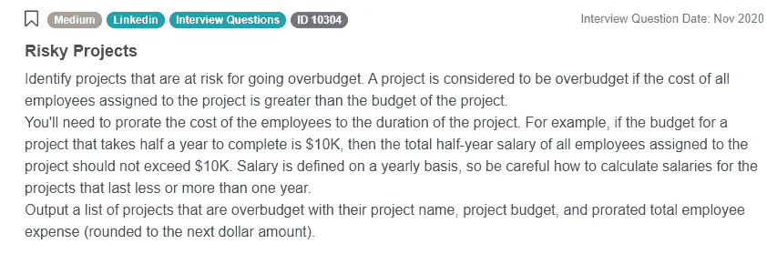

截图来自 [StrataScratch](https://platform.stratascratch.com/coding/10304-risky-projects?python=&utm_source=blog&utm_medium=click&utm_campaign=medium)

问题链接:[https://platform . stratascratch . com/coding/10304-risky-projects](https://platform.stratascratch.com/coding/10304-risky-projects?python=&utm_source=blog&utm_medium=click&utm_campaign=medium)

最终，问题是要求我们使用员工工资、项目长度和项目预算来确定哪些项目超出了预期。

这个 LinkedIn 数据科学家面试问题实际上是中等难度，而不是中等难度，因为正如我们将看到的，答案需要子查询、几个列计算和连接多个数据表。虽然有很多方法可以解决这个问题，但我们将重点关注一个灵活的解决方案，它展示了我们对几个重要 SQL 概念的了解。

# 解决问题的框架

回答数据科学问题时最重要的原则之一就是从框架入手。我们将概述一个三步框架，它为我们通过代码处理和解决这个问题建立了一个逻辑过程。我们正在使这个框架适应手头的问题，但是，通过一些简单的调整，你可以设计任何其他的问题。以下是我们的步骤:

**1。了解你的数据:**
a)。首先查看问题给出的所有列，并对数据做出一些假设。如果给你多张表格，记下每张表格给你的是哪些数据，以及你在回答问题时可能需要这些数据。
b)。如果您无法理解该模式，请尝试查看一些示例数据。查看前几行，尝试找出值与其各自列相关的原因。如果你一开始没有得到任何价值观，不要犹豫向 LinkedIn 面试官索要。查看示例数据可以帮助您确定解决方案的限制，或者确定是否需要针对边缘情况扩展解决方案。

**2。制定你的方法:**
一)。开始写下逻辑编程或代码步骤。不需要先按顺序。事实上，我们在这里提供的解决方案也不合适，因为在这个问题中，我们在获取工资之前会查询项目日期。
b)。确定执行计算时必须使用的主要函数很有帮助。尝试将问题陈述和数据转换成一系列 SQL 函数。
c)。想出解决办法的时候尽量不要沉默。你的 LinkedIn 面试官会想了解你是如何处理问题的。你可以要求他们澄清，并期望他们指定你是否必须从头开始写。

**3。代码执行:**
a)。重要的是以这样一种方式构建代码，以避免呈现过于简单或过于复杂的解决方案。利用子查询之间的空白空间来保持您的解决方案整洁有序。注释掉一个你以后想返回的代码块从来都没有坏处。
b)。遵循您在开始时概述的步骤。这将帮助你避免混淆，并确保你回答了所有的问题。
c)。最重要的是，仔细考虑你的函数和操作。使用这些井可以产生有效和通用的解决方案。
d)。与 LinkedIn 面试官交流你的代码。当你开始写作时，他们会评估你解决问题的能力。

## 了解您的数据

我们框架的第一步是检查我们的数据。通常情况下，你不会接触到实际数据，也不能像 LinkedIn 那样在面试中执行代码。通常，你必须理解数据，而不是根据面试官给你的模式和信息做出假设。

在这个 LinkedIn 数据科学家面试问题的例子中，这个问题为我们提供了三个表的模式，所以我们需要从查看每个表中的内容开始。

**linkedin_projects**

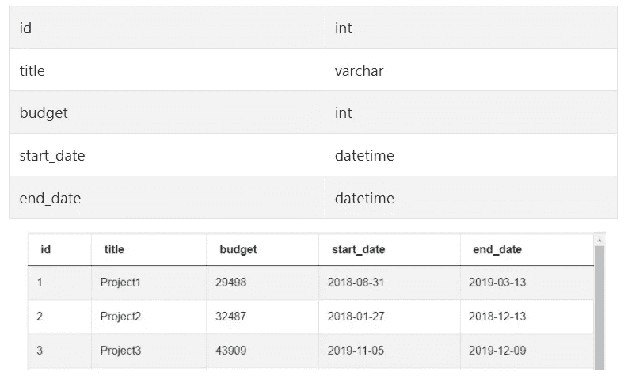

截图来自 [StrataScratch](https://platform.stratascratch.com/coding/10304-risky-projects?python=&utm_source=blog&utm_medium=click&utm_campaign=medium)

这个 linkedin_projects 表告诉我们一个项目已经运行了多长时间，它的预算和它的 id。

**linkedin_emp_projects**

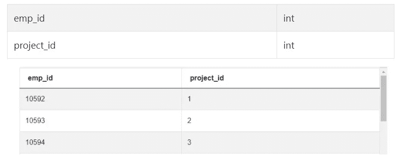

截图来自 [StrataScratch](https://platform.stratascratch.com/coding/10304-risky-projects?python=&utm_source=blog&utm_medium=click&utm_campaign=medium)

linkedin_emp_projects 表显示了哪些员工参与了哪些项目。

**linkedin_employees**

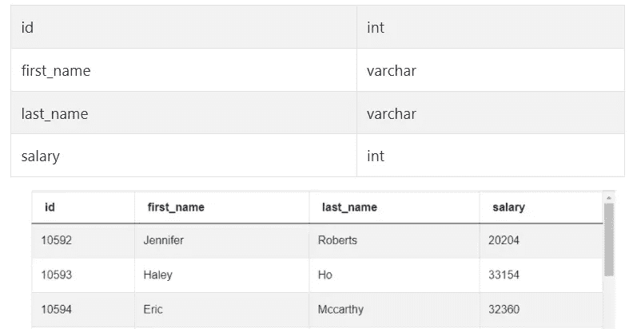

截图来自 [StrataScratch](https://platform.stratascratch.com/coding/10304-risky-projects?python=&utm_source=blog&utm_medium=click&utm_campaign=medium)

Linkedin_employees 告诉我们每个员工的工资和他们的 id。因为我们需要知道工资、员工和项目 id、项目长度和项目预算来计算哪些项目超出了预算，我们将不得不使用 id[连接所有三个表](https://www.stratascratch.com/blog/how-to-join-3-or-more-tables-in-sql/?utm_source=blog&utm_medium=click&utm_campaign=medium)中的数据。在这一点上，我们还可以得出结论，我们将能够丢弃一些不相关的列，如项目标题和员工的名字和姓氏。

## 解决方案:

**制定办法**

根据我们的框架，我们想要概述一些翻译成代码的一般步骤。我们将保持它的高级别，稍后会变得更具体，但是最初概述这些步骤将使编写代码更容易。以下是一般步骤:

1.  查询 linkedin_projects 并使用减法和浮点类型转换来获得以年为单位的总项目持续时间
2.  当我们在员工 id 上连接 linkedin_emp_projects 和 linkedin_employees 表以获得每个项目 id 的年薪时，将我们的第一个查询放在一边
3.  加入我们对项目 id 上的项目年薪的初始查询
4.  通过将项目年薪乘以项目持续时间来计算按比例分配的员工费用，并使用 CEILING 函数来完成我们的输出
5.  使用 WHERE 子句筛选超出预算的项目

**计算项目工期**

让我们将我们列出的一般步骤转换成功能性的 SQL 代码。对于第一步，我们首先查询 linkedin_projects 表，并从项目开始日期中减去项目结束日期。我们不必担心奇怪的差异，因为结束日期总是在开始日期之后。由于我们的工资数据以年为单位，我们还必须将项目长度转换为年的分数，并且需要将其转换为浮点小数，以避免结果四舍五入为 0。

```
SELECT id,
       title,
       budget,
       start_date,
       end_date,
       end_date - start_date AS project_duration
FROM linkedin_projects
```

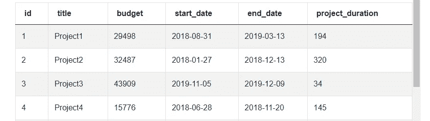

截图来自 [StrataScratch](https://platform.stratascratch.com/coding/10304-risky-projects?python=&utm_source=blog&utm_medium=click&utm_campaign=medium)

我们有以天为单位的项目持续时间，所以我们要用它除以 365，得到以年为单位的项目持续时间，以便与年薪进行比较:

```
SELECT id,
       title,
       budget,
       start_date,
       end_date,
       (end_date - start_date)/365 AS project_duration
FROM linkedin_projects
```

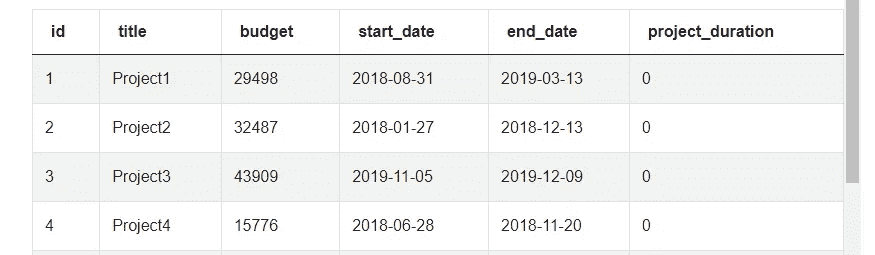

截图来自 [StrataScratch](https://platform.stratascratch.com/coding/10304-risky-projects?python=&utm_source=blog&utm_medium=click&utm_campaign=medium)

因为我们除以整数，所以我们的计算向下舍入到 0，因为所有项目都小于年。让我们将分母 365 转换为浮点数，以获得以年为单位的项目持续时间的小数值。

```
SELECT id,
       title,
       budget,
       start_date,
       end_date,
       (end_date - start_date)/365::float AS project_duration
FROM linkedin_projects
```


截图来自 [StrataScratch](https://platform.stratascratch.com/coding/10304-risky-projects?python=&utm_source=blog&utm_medium=click&utm_campaign=medium)

现在我们将项目持续时间作为一年的小数部分。我们可以稍后使用这个值和项目中所有员工的集体年薪来获得项目总支出。

**计算每个项目员工的年薪**

在我们构建下一个查询时，请随意注释掉您现有的代码。在我们继续之前，有一个机会可以交互地测试一下上一节中的项目持续时间计算和本节中的每个项目的年薪查询:

```
SELECT *
FROM linkedin_emp_projects ep
JOIN linkedin_employees e ON ep.emp_id = e.id
```

问题链接:[https://platform . stratascratch . com/coding/10304-risky-projects](https://platform.stratascratch.com/coding/10304-risky-projects?python=&utm_source=blog&utm_medium=click&utm_campaign=medium)

由于我们需要知道一个项目中所有员工的年薪，我们的下一步包括将显示哪些员工在哪些项目中工作的 linked_emp_projects 与 linkedin_employees 中的员工薪金数据相结合，以获得每个项目的薪金。我们看到这两个表都有一个雇员 id 列，所以很明显要在这些 id 上连接它们。

请记住，我们需要合计每个项目的工资，所以我们也将按项目 id 分组。

```
SELECT project_id,
       SUM(salary) AS project_yearly_salary
FROM linkedin_emp_projects ep
JOIN linkedin_employees e ON ep.emp_id = e.id
GROUP BY project_id
```

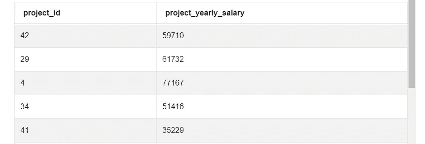

截图来自 [StrataScratch](https://platform.stratascratch.com/coding/10304-risky-projects?python=&utm_source=blog&utm_medium=click&utm_campaign=medium)

我们现在有了项目年薪，很明显我们的下一步是将项目年薪数据集与 linkedin_projects 数据集相结合。

**连接所有数据集**

我们将取消对原始代码的注释，并加入 project_id 上的数据集。注意，为了完成连接，我们将我们的项目年薪数据集封装并命名。

```
SELECT id,
       title,
       budget,
       start_date,
       end_date,
       (end_date - start_date)/365::float AS project_duration,
       project_yearly_salary
FROM linkedin_projects
JOIN
  (SELECT project_id,
          SUM(salary) AS project_yearly_salary
   FROM linkedin_emp_projects ep
   JOIN linkedin_employees e ON ep.emp_id = e.id
   GROUP BY project_id) yearly_salary ON linkedin_projects.id = yearly_salary.project_id
```

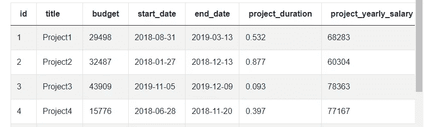

截图来自 [StrataScratch](https://platform.stratascratch.com/coding/10304-risky-projects?python=&utm_source=blog&utm_medium=click&utm_campaign=medium)

这就完成了所有数据集的连接。在一张表上，我们有任何给定项目计算是否超出预算所需的所有信息。从这一点出发，我们可以丢弃一些列，比如 id 和日期，以简化我们的表。

```
SELECT title,
       budget,
       (end_date - start_date)/365::float AS project_duration,
       project_yearly_salary
```

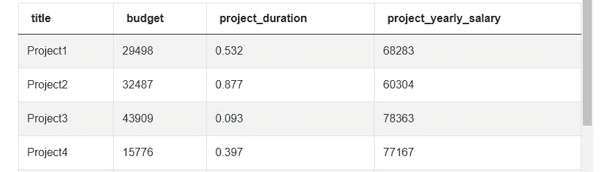

截图来自 [StrataScratch](https://platform.stratascratch.com/coding/10304-risky-projects?python=&utm_source=blog&utm_medium=click&utm_campaign=medium)

**计算按比例分摊的员工费用**

在我们结束 LinkedIn 数据科学家面试问题的最后两步之前，还有一个机会来互动练习这个问题。看看您能否完成每个项目的费用计算，并确定哪些项目超出了预算:

```
SELECT id,
       budget,
       (end_date - start_date)/365::float AS project_duration,
       project_yearly_salary
FROM linkedin_projects
JOIN
  (SELECT project_id,
          SUM(salary) AS project_yearly_salary
   FROM linkedin_emp_projects ep
   JOIN linkedin_employees e ON ep.emp_id = e.id
   GROUP BY project_id) yearly_salary ON linkedin_projects.id = yearly_salary.project_id
```

问题链接:[https://platform . stratascratch . com/coding/10304-risky-projects](https://platform.stratascratch.com/coding/10304-risky-projects?python=&utm_source=blog&utm_medium=click&utm_campaign=medium)

按比例分配的员工费用是一个相当简单的计算，只需要我们将项目持续时间乘以项目年薪。

```
SELECT title,
       budget,
       (end_date - start_date)/365::float * project_yearly_salary AS prorated_employee_expense
FROM linkedin_projects
JOIN
  (SELECT project_id,
          SUM(salary) AS project_yearly_salary
   FROM linkedin_emp_projects ep
   JOIN linkedin_employees e ON ep.emp_id = e.id
   GROUP BY project_id) yearly_salary 
```

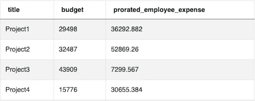

截图来自 [StrataScratch](https://platform.stratascratch.com/coding/10304-risky-projects?python=&utm_source=blog&utm_medium=click&utm_campaign=medium)

我们的输出没有四舍五入，所以我们应用了一个上限函数来得到一个按比例分摊的 _employee_expense，其格式可以更好地与预算进行比较。请记住，上限函数将返回大于或等于输入的最小整数值，因此它总是向上舍入任何不等于整数的浮点。

```
SELECT title,
       budget,
       CEILING((end_date - start_date)/365::float* project_yearly_salary) AS prorated_employee_expense
FROM linkedin_projects
```

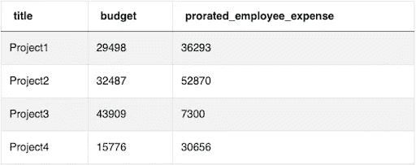

截图来自 [StrataScratch](https://platform.stratascratch.com/coding/10304-risky-projects?python=&utm_source=blog&utm_medium=click&utm_campaign=medium)

我们的费用被四舍五入，看起来更符合预算数字。为了最终确定我们的答案，我们所要做的就是将预算与按比例分摊的员工费用进行比较。

**筛选超预算项目**

此时，我们实际上是在比较两个整数，分别代表项目的预算和项目的按比例分摊的员工费用。因为问题要求我们只显示超出预算的项目，所以我们可以使用 WHERE 子句过滤掉任何低于预算的项目。请记住，由于 SQL 语法的限制，我们必须在 WHERE 子句中重复按比例计算员工费用。以下是我们完整的解决方案:

```
SELECT title,
       budget,
       CEILING((end_date - start_date)/365::float * project_yearly_salary) AS prorated_employee_expense
FROM linkedin_projects
JOIN
  (SELECT project_id,
          SUM(salary) AS project_yearly_salary
   FROM linkedin_emp_projects ep
   JOIN linkedin_employees e ON ep.emp_id = e.id
   GROUP BY project_id) yearly_salary ON linkedin_projects.id = yearly_salary.project_id
WHERE ((end_date - start_date)/365::float*project_yearly_salary) > budget 
```

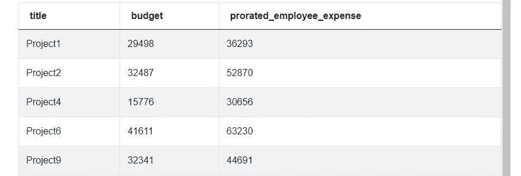

截图来自 [StrataScratch](https://platform.stratascratch.com/coding/10304-risky-projects?python=&utm_source=blog&utm_medium=click&utm_campaign=medium)

这个新的输出显示我们遗漏了几个与低于预算的项目相关的项目。虽然结果包含的项目不止这五个，但您会看到所有结果的“按比例分配的 _ 员工 _ 费用”值都高于项目的预算。

我们现在已经找到了正确的答案。该解决方案最终变得有点复杂，需要多个连接、算术运算和类型操作，但它仍然足够灵活，可以处理遵循该模式的各种数据集。此外，它展示了你的面试官可能欣赏的各种不同的 SQL 技能。

# 结论

在本文中，我们用复杂但健壮的代码解决了一个中等难度的 LinkedIn 数据科学家面试问题。这不是回答这个问题的唯一方法，所以我们建议尝试看看你是否能想出其他更有效或更无效的方法。

你可以尝试回答其他 [SQL 面试问题](https://www.stratascratch.com/blog/sql-interview-questions-you-must-prepare-the-ultimate-guide/?utm_source=blog&utm_medium=click&utm_campaign=medium)来提高你的技能[准备数据科学面试](https://www.stratascratch.com/blog/5-tips-to-prepare-for-a-data-science-interview/?utm_source=blog&utm_medium=click&utm_campaign=medium)。

【https://www.stratascratch.com】最初发表于<https://www.stratascratch.com/blog/linkedin-data-scientist-interview-questions/?utm_source=blog&utm_medium=click&utm_campaign=medium>**。**