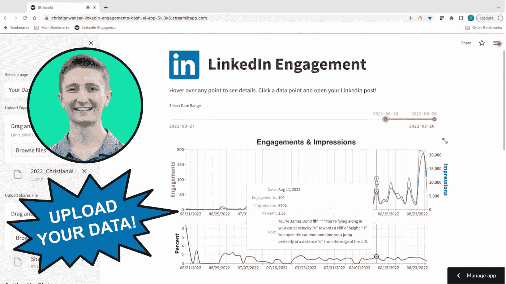
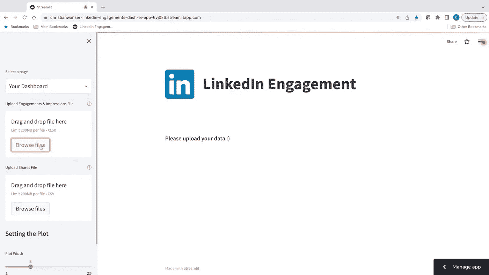
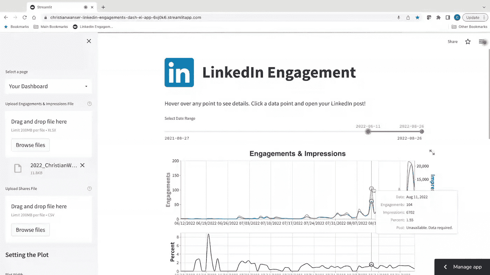
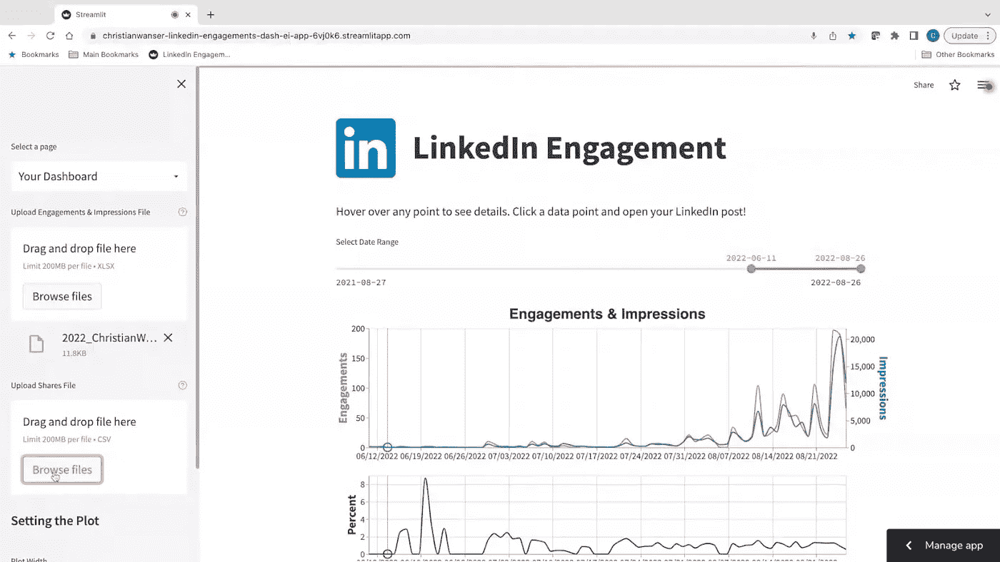
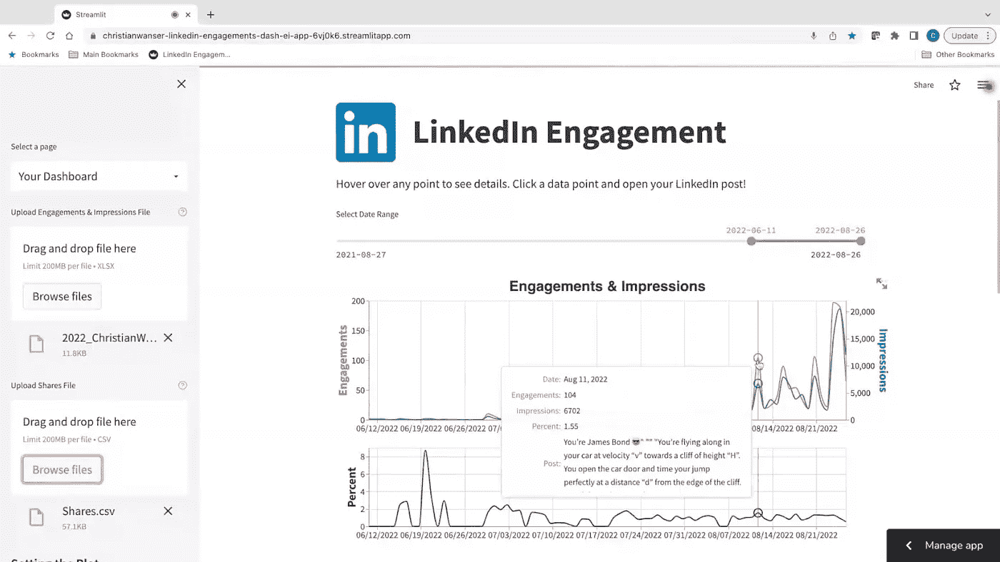
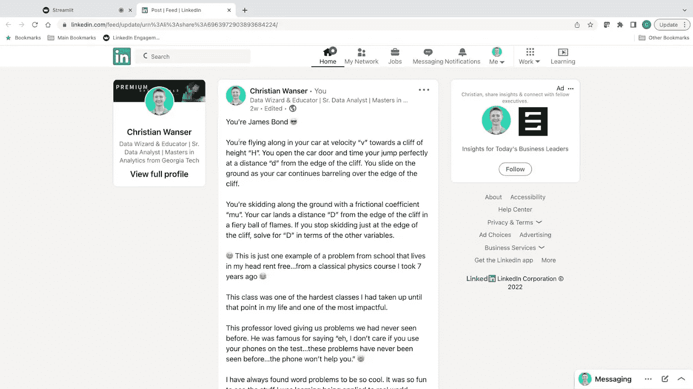
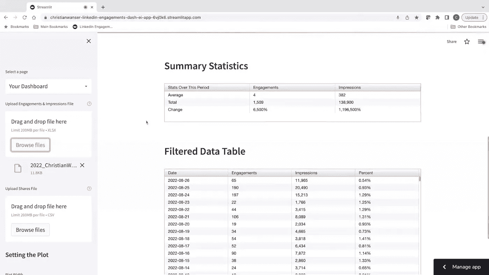
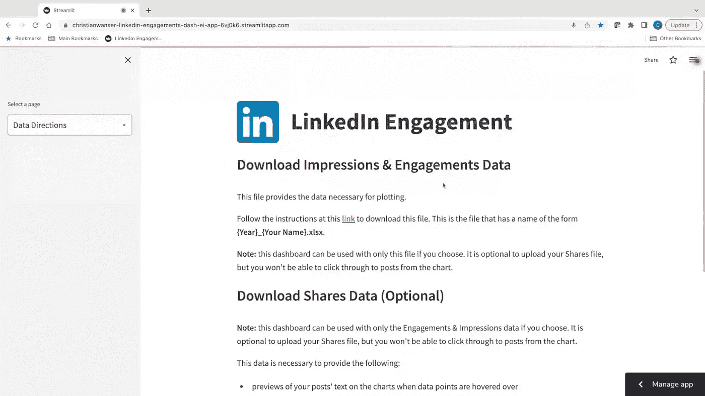

# LinkedIn 敬业度仪表板(使用 Streamlit 构建)

> 原文：<https://towardsdatascience.com/linkedin-engagement-dashboard-built-with-streamlit-f7edf0e1707d>

## 你的帖子有多吸引人？

杰森·德沃尔在 [Unsplash](https://unsplash.com?utm_source=medium&utm_medium=referral) 上拍摄的照片

> 这个 Streamlit 应用程序使您能够上传您的互动、印象和分享数据，以分析您的互动后！

# 概观

本文将带您浏览使这个 Streamlit 应用程序运行的代码！

我将介绍以下内容:

*   创建一个**多页面简化应用**
*   创建各种**图表元素**和**小部件**
*   **加载用户数据**
*   创建一个垂直条到**跟踪光标位置**
*   创建**交互式工具提示**
*   启用数据点上的**点进**以**打开超链接**(在本例中，LinkedIn 帖子)
*   创建**牛郎星图表**
*   使用 **layer()** 和 **vconcat()** 函数创建**复合图表**
*   创建**交互式聚集表格**

我在本文的最后添加了一个 YouTube 视频，它给了你一个仪表盘界面的演示。

我还包含了我的 **GitHub 库**的链接。

希望你喜欢**并请留下你的评论**！

LinkedIn 敬业度仪表板概述。图片作者。

# 代码

我将带你浏览这个 Streamlit 应用程序背后的代码，它是使用 **Visual Studio 代码 IDE** 用 **Python** 编写的。

## 导入库

首先，我们将导入必要的库，包括:

*   **操作系统**用于文件导航
*   **openpyxl** 用于文件读取
*   **streamlit** 用于构建 app！
*   熊猫和熊猫因为我们爱它们
*   **AgGrid** 用于漂亮的桌子
*   **日期时间**用于处理日期和时间
*   **牛郎星**为了好看的剧情

## Requirements.txt

确保为 Streamlit 创建一个 requirements.txt 文件，以便从您的存储库中访问。我在下面包含了我的应用程序的文件。

## 多页应用程序

我将跳到代码的末尾，为我开始定义页面函数的下一部分提供上下文。

对于我的应用程序，我想创建多个页面，这样界面就不会太拥挤。我希望仪表板本身有自己的页面。

因此，为了做到这一点，我定义了多个页面，包括对应于登录页面、仪表板和数据方向的 main_page、page2 和 page3。下面的代码使用 selectbox()函数创建一个下拉列表，其中包含侧栏中的导航页面。

## 主页

这是我的 LinkedIn Engagement Dashboard 应用程序的登录页面。

应用程序的主页或登录页提供了应用程序用途和功能的背景。图片作者。

在这段代码中，我定义了应用程序的主页或登录页。

我首先定义页面标题，在 repo 中提供 LinkedIn 徽标图像的相对路径，并使用 image()函数。

然后，我使用 sidebar.markdown()函数在侧栏中提供信息。

在页面主体中，我使用 subheader()函数定义了副标题。

我以添加 LinkedIn 徽标图像的相同方式向页面添加了另一个图像，只是这次我没有定义宽度。这允许图像占据屏幕宽度。

## 仪表板(应用程序启动)

为了开始谈论仪表板，我将实际上进一步跳过代码，因为由于应用程序启动时没有加载数据而引发了一个异常。

代码首先“尝试”读取 excel 文件，但是它还不存在，因为用户还没有上传他们的文件。

这个异常导致下面的视图，其中屏幕提示用户“请上传您的数据:)”。请参见下面的异常处理代码。

由于开始时没有上载 Excel 文件，引发了异常。在侧边栏上传 Excel 文件。图片作者。

## 仪表板

好了，下面的下一段代码是函数 page2()的“顶部”，它定义了仪表板页面。

与上一页一样，我用 LinkedIn 徽标定义了页眉。

我使用 file_uploader()函数来加载约定和印象 Excel。xlsx)文件。文件名的格式为{Year}_{Your Name}.xlsx。

注意，我要求文件类型是. xlsx 文件。这就是从 LinkedIn 下载互动和印象数据的方式，这与您从 LinkedIn 数据存档中获得的 Shares.csv 文件形成对比。

函数 page3()覆盖了数据方向页面，我将进一步讨论它。此页面提供了有关如何从 LinkedIn 下载雇佣和印象数据以及从 LinkedIn 请求您的数据存档以获取 Shares.csv 文件的详细信息。

与。xlsx file_uploader()，我为帮助工具提示提供了对要上传的数据以及如何获取数据的描述。

我还定义了变量 file1_details 来包含各种文件细节，以备不时之需。

page2()的代码继续尝试将 Excel 文件作为熊猫数据帧 df 读取。如果成功，我就将日期变量转换为 Date 类型，而不是它加载时的 datetime 类型。这使得以后的情节更加清晰。

如果文件读取失败，数据帧 df 被定义为空白。

继续 page2() —正如我们将在一段时间内做的那样，我编写了类似的代码，以作为 file2 加载到 Shares.csv 文件中。

请注意，这次要求文件是. csv 文件。

与我们处理文件 1 的方式类似，我们将尝试将文件 2 作为名为 df2 的熊猫数据帧来读取。

如果该读取失败，df2 将被定义为空数据帧。

## 上传数据

一旦用户上传了约定和印象数据，他们将看到如下所示的界面。仪表板正在运行，不需要任何进一步的数据。

但是，请看一下工具提示。请注意，Post 字段显示“不可用。需要数据。这是因为用户尚未上传 Shares.csv 文件。

未上传 Shares.csv 文件时显示工具提示。发布字段将显示“不可用。需要数据。图片作者。

如果用户选择上传他们的 Shares.csv 文件，他们只需按照与。xlsx 文件，但是在底部的文件上传器小部件中。

在侧边栏上传 Shares.csv 文件。图片作者。

当 Shares.csv 文件上传后，工具提示将显示一个帖子预览，如下所示。

工具提示包含文章预览。图片作者。

## 准备数据

在这里，我尝试在 df2 数据帧中定义新的列，它保存股票数据(参见后面的异常解释)。

*   将新的日期时间列定义为最初的日期
*   重新定义日期列，使其仅包含日期类型，而不是日期时间类型
*   定义一个新的时间列，仅包含日期时间列的时间部分
*   为清晰起见，将 ShareCommentary 列重命名为 Post(该列是工具提示中显示的帖子预览内容)

然后，我通过合并(左连接)包含雇佣和印象数据的数据帧 df 和 df2(共享数据)来覆盖 df。

我在 Post 和 ShareLink (url)列中填入 nan 值。如果某一天没有帖子，则“帖子”列中的值将变为“今天没有帖子”如果 ShareLink 列中没有值，我将 nan 替换为 LinkedIn Feed 页面(如果您在没有发布帖子的某一天单击，将会转到 LinkedIn Feed 页面)。

如果这种操纵数据的尝试失败了(由于 df2 为空，因为用户还没有上传他们的共享数据)，Post 列将填充“不可用”。需要数据。所有的 ShareLink 值都将成为 LinkedIn Feed 页面。

## 设定情节

我为用户提供了调整绘图宽度和高度的选项，如果他们希望在更大的范围内查看数据的话。

这可以通过使用 slider()函数在侧边栏中找到。

## 日期范围过滤器

在这里，我为用户定义了日期范围过滤器，以便能够选择时间窗口。

我在日期列中将默认范围设置为最小日期到最大日期。我再次使用 slider()函数为用户提供过滤数据和调整时间窗口的方法。

然后，根据滑块的任何变化重新定义数据帧 df。

在这里，我还定义了 df 的 Percent 列，它是任何给定一天的参与度除以印象数。

## 创建交互式图表

我将一个新的数据帧源定义为等同于数据帧 df。

然后我创建一个选择，根据鼠标位置的 x 值选择最近的点。

我用日期列定义的 x 轴创建了基本图表，并指定了日期格式。

然后，我将第 1 行和第 2 行定义为约定和印象行。

## 好戏来了

这下一部分是这次冒险中我最头疼的原因。我在这个仪表板上创建的图表不同于我在网上看到的任何例子。我在一个子情节上有两个折线图，每条线都有自己的 y 轴，然后这个子情节堆叠在另一个情节的顶部。

很长一段时间以来，我遇到的问题是我的主要 y 轴标签，而“约定”的刻度也显示在辅助 y 轴上。所以，我有大量的相互堆叠的刻度线和两个 y 轴标签，“参与”和“印象”挤在一起。

我反复尝试解决这个问题，但就是想不通。因此我下面的标签截图。这在任何编码冒险中都不是独特的经历(更不用说学习像 Streamlit 这样的新工具了)，但这是痛苦的。我不得不离开这个问题，然后不断回到这个问题，试图解决它。我失败了很多次。

幸运的是，有一个快乐的结局！我最终在搜索另一个问题时找到了答案！下面我来说说分辨率。

任何写代码的人的生活。看看这些标签！图片作者。

## 更多绘图

那么我是怎么知道如何固定第二个 y 轴的呢？因为我有两个堆叠的图表，我想我应该在图表组合上放置 resolve_scale()函数。Altair 和 Streamlit 对可以配置的内容和位置很挑剔。所以，我认为我把它放在组合图上而不是单个图表上是正确的。

结果是，带有 y = 'independent '条件的 resolve_scale()必须直接放在行上。为此，我使用 layer()函数将 line1 和 line2 分层，然后在线上使用 resolve_scale()。呜！成功了！

接下来，我根据上面定义的最近距离来定义选择器。这告诉我们光标的 x 值。

我定义了 points1 和 points2(以及后面的 points3 ),以包含详细说明日期、约定、印象、百分比和帖子的工具提示。这些工具提示的例子和图片已经在前面提供了。这里有一个例子，展示了我做的一个詹姆斯·邦德帖子的预览。

工具提示包含文章预览。图片作者。

这些点只有在悬停在它们上方时才变得可见。点击任何一点，href 域告诉应用程序将用户带到 ShareLink，这是与给定数据点相关联的 LinkedIn 帖子 url。

下面提供了用户点击时 LinkedIn 帖子的示例。

下面是图表中某一天用户点击 LinkedIn 帖子的一个例子。

用户点击数据点后的 LinkedIn 帖子示例。图片作者。

## 垂直滚动条和百分比图

有了两个堆叠的图表，我想让时间导航尽可能容易。为此，我创建了一个垂直滚动条(称为 rule ),再次使用 nearest 跟踪光标在图表上的移动。

然后，我以类似于定义上图的方式定义下图。我用日期列定义的 x 轴定义了 base2 图表。

我用与上面定义点 1 和点 2 相同的方式将线 3 定义为百分比线和点 3。

## 绑定图表元素

我使用 layer()函数绑定了上下图表的图表元素。还记得我之前是怎么把第一行和第二行变成直线的吗？

我将线条、选择器、点 1、点 2 和 rule 组合成上部图表，并根据用户选择的绘图宽度和高度定义动态属性。

我对下面的图表做了同样的事情，将第 3 行、第 3 点和 rule 组合起来，使其变得更低。

## 最终图表

为了更好地总结，我使用了 altair_chart()函数来绘制最终的图表。

在此过程中，我使用 vconcat()函数进行垂直连接，以堆叠上面和下面的图表。

还记得我说过 altair 和 streamlit 对你配置的内容和地点很挑剔吗？此时，我可以分别使用 configure_points()和 configure_axis()函数配置点和轴。

## 汇总统计数据

我可以选择显示用户定义的时间段内的参与和印象的汇总统计数据，或者显示有数据的天数的平均值。

我选择了用户选择的时间段内的汇总统计数据，因为这对我最有意义。

基于用户定义的日期范围的汇总统计和过滤数据表。图片作者。

下面是生成汇总统计表的代码。

我在用户定义的时间段内确定参与度和印象的平均值、总数和变化，并在这里进行一些格式化。

我使用 AgGrid 生成了一个更漂亮的汇总统计表。

## 过滤数据表

接下来，我生成了经过过滤的数据表，它为用户提供了他们所选择的时间段内的数据。

基于用户定义的日期范围的汇总统计和过滤数据表。图片作者。

我定义了一个新的数据帧 output_df，因为我需要执行进一步的格式更改，并且我不想更改 df 数据帧。

然后，我再次使用 AgGrid 生成过滤后的数据表。

**异常(无数据)** 这里是对尚未上传数据的事件的异常处理，这在前面已经讨论过了，但是为了完整起见，在代码中出现在这里。

## 数据方向

通过了仪表板页面的代码！最后是数据方向页面，它为用户提供了从哪里下载该应用程序所需数据的说明。

向用户提供数据背景以及如何获取数据的数据说明页。图片作者。

和前面的页面一样，我用 LinkedIn 徽标定义了标题。

然后我使用 subheader()和 markdown()来打出指令！

## 将这一切结合在一起

不要停止跟随！这是最重要的部分。

这里，我使用上面创建的所有页面函数，包括 main_page()、page2()和 page3()，并使用 selectbox()创建页面导航。

瞧啊。你有一个 LinkedIn 约会仪表板。

点击下面的链接查看我的 YouTube 视频和 GitHub repo。

# 仪表板界面演练

这里有一段我带你浏览 LinkedIn 互动仪表盘界面的 YouTube 视频。

# GitHub 知识库

此代码的 GitHub repo 可以在下面的链接中找到。

 [## GitHub-Christian wanser/LinkedIn-订婚-Dash

### 此时您不能执行该操作。您已使用另一个标签页或窗口登录。您已在另一个选项卡中注销，或者…

github.com](https://github.com/christianwanser/LinkedIn-Engagements-Dash.git) 

# 摘要

我使用 Streamlit 创建了一个 LinkedIn Engagements Dashboard 应用程序，允许用户上传他们的参与、印象和共享数据，以分析他们的参与后活动！

查看我的 LinkedIn 约会仪表板，让我知道你的想法！

# 直到下一次…

喜欢这些内容吗？关注我在媒体上看到未来的职位！[成为中级会员](https://medium.com/@ChristianWritesData/membership)这样你就可以无限阅读文章了。相信我，值得！

如果你对数据专业人员的生活有任何疑问，请随时在 [LinkedIn](https://www.linkedin.com/in/christian-wanser/) 或 [Twitter](https://twitter.com/ChrisWritesData) 上联系我！

 [## 加入我的推荐链接-基督教万瑟媒体

### 作为一个媒体会员，你的会员费的一部分会给你阅读的作家，你可以完全接触到每一个故事…

medium.com](https://medium.com/@ChristianWritesData/membership)