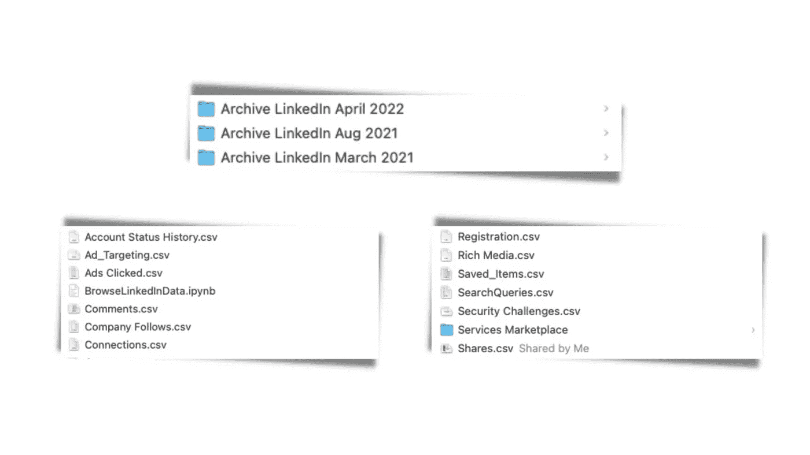
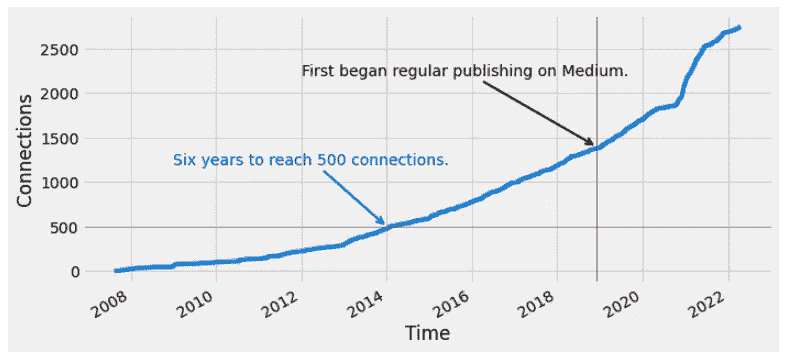
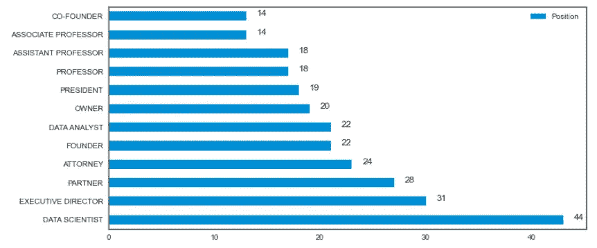
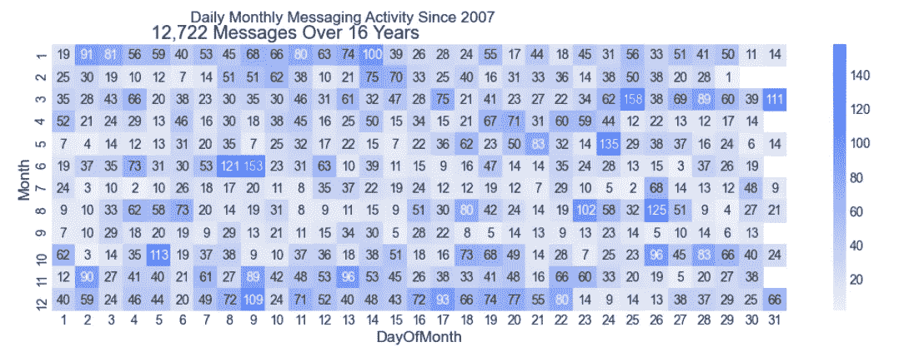
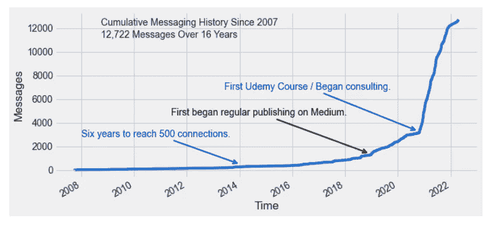

# LinkedIn:你从来不知道的最好的示例数据源

> 原文：<https://towardsdatascience.com/linkedin-the-best-example-data-source-you-never-knew-737d624f24b7>

## 使用本指南了解和浏览 LinkedIn 允许您从个人资料中下载的数据

TLDR:这篇文章不是关于网络抓取的。它使用 LinkedIn 授权的“获取数据副本”服务来演示如何将该数据用于培训、测试和演示目的。

# 概观

本文将向读者介绍 LinkedIn 的“获取数据副本”服务，并探讨如何将这些数据用作学习、测试、培训和开发目的的示例数据。

本文及其讨论的数据至少有两个好的用途:

1.  将 LinkedIn 数据用于培训、测试和演示目的。-就像我之前说的:LinkedIn 数据是你从来不知道的最好的示例数据源。
2.  使用这篇文章作为 LinkedIn 数据的指南。—在寻找新颖的“真实世界”数据作为培训、测试或演示示例时，这是一个好去处。
3.  将本文用作数据可视化指南。—下面的示例包括条形图、折线图以及其他带有注释、数据标签和其他细微增强的图表。

# 介绍

我收集和研究 LinkedIn 的数据已经有一年多了。下面是我从 LinkedIn 下载和收集的文件的屏幕截图(使用他们授权的“获取你的数据的副本”门户)。



我定期从 LinkedIn.com 下载 LinkedIn 数据后的文件和文件夹的屏幕截图。图片鸣谢:作者截屏。

您也可以通过点击 LinkedIn 主页右上角的“我”图标>然后点击“设置与隐私”>然后点击“获取您数据的副本”来访问您的数据

LinkedIn 几乎花了一整天来准备你的摘录。值得等待。一旦您获得了数据的副本，您将有近 40 个 CSV 文件可供探索。不同的用户会有不同的结果，因为不是所有的用户都有来自 LinkedIn 所有功能集的数据。

我之前使用这个数据来显示`pd.crosstab()`和`pd.pivot_table()`之间的差异。

[](/crosstab-or-pivot-table-in-pandas-deciding-when-to-use-which-a8ee3a9adfd0)  

# LinkedIn 的数据

每个用户将体验到略微不同的结果。在这里，我列出了三个 CSV 文件，我怀疑大多数用户都可以使用，并且我认为它们是最有趣的。我们从`connections.csv`开始，列出你所有的关系。然后`receipts.csv`也就是你在 LinkedIn 上消费的记录。然后我们转到`messages.csv`，它是根据你发送和接收的信息直观命名的。

LinkedIn 的数据有点神秘。文档不完整。个人请求:请[阅读本文档](https://www.linkedin.com/help/linkedin/answer/50191?trk=psettings-data-export_api&lang=en)—[然后提交一份请求，要求 LinkedIn 改进文档](https://www.linkedin.com/help/linkedin/solve/contact)。比如 LinkedIn 文档`endorsements_received.csv`没有`endorsements_given.csv`。

# 特定数据文件

## 连接(Connections.csv)

从 connections.csv 开始。注意，这个 csv 需要使用`header`参数来指定第一行数据。使用`index_col='Connected On'`和`parse_dates=True`参数将连接的日期作为索引。

```
connections = pd.read_csv('Connections.csv', 
                          header=2, 
                          index_col='Connected On',
                          parse_dates=True)
```

这些数据会告诉你每个关系的名字、姓氏、电子邮件地址、公司和职位。使用下面的代码，你可以在 LinkedIn 上绘制你的人脉增长图。

```
plt.style.use('fivethirtyeight')
connections['count'] = 1
connections['count'] = connections['count'].cumsum()
connections['count'].plot(xlabel='Time',
                          ylabel='Connections',
                          figsize=(10,5))plt.axhline(500, color='red', linewidth=.5)
plt.axvline(pd.to_datetime('2018-12-1'), 
            color='black', linewidth=.5)plt.annotate('Six years to reach 500 connections.', 
             xy=(pd.to_datetime('2014-01-01'), 500),
             xytext=(pd.to_datetime('2009-01-01'), 1200),
             color='blue',
             arrowprops={'arrowstyle':'->',
                         'linewidth':2,
                         'color':'blue'})plt.annotate('First began regular publishing on Medium.', 
             xy=(pd.to_datetime('2018-12-01'), 1400),
             xytext=(pd.to_datetime('2012-01-01'), 2200),
             color='black',
             arrowprops={'arrowstyle':'->',
                         'linewidth':2,
                         'color':'black'})
```

对于结果:



显示 LinkedIn 上连接增长的折线图。图片来源:作者的插图由代码和数据生成，如本文所示。

你也可能对你的关系的性质感兴趣。考虑一个柱状图，它显示了你的关系中最常见的职位头衔的出现频率。

在我的人脉中，有 2081 个独特的职位头衔。在我的人脉中，最常见的职位头衔是“数据科学家”(44 个人脉)，其次是“执行董事”(31 个人脉)。以下代码将这些标题可视化:

```
plt.style.use('seaborn-white')
connections['Position'] = 
   connections['Position'].str.upper()
top_titles = 
    pd.DataFrame(connections['Position'].value_counts().head(12))
top_titles.plot.barh(figsize=(10,5))
# Add bar height labels.
for i in range(12):
    plt.text(top_titles.iloc[i][0]+1, 
             i, top_titles.iloc[i][0]+1, fontsize=12)
```



显示我的 LinkedIn 联系人中常用职位的条形图。图片来源:作者的插图由代码和数据生成，如本文所示。

## 您的支出(Receipts.csv)

原来这些年来我在 LinkedIn 上花了大约 380 美元。我的第一笔交易是 19.95 美元，是他们的“求职者基本订阅(每月)”服务。

在一行代码中你可以得到你的总支出(假设你花了任何东西，并且有一个`receipts.csv`文件:

```
pd.read_csv('receipts.csv')['Total Amount'].sum()
```

## 您的消息(Messages.csv)

该文件包含您在 LinkedIn 上的消息历史记录。有一个“对话 ID”、“对话标题”、“发件人”、“发件人配置文件 URL”、“日期”、“内容”和“文件夹”栏

我甚至不知道你可以在 LinkedIn 的文件夹里存档信息。你可能有兴趣知道你发信息的频率，在一个月的哪几天，一年的什么时候。热图会对此有所帮助。

你发送和接收了多少信息？

```
pd.read_csv('messages.csv').shape[0]
```

你的第一条信息是什么？你给谁发信息了？您说什么？

```
pd.read_csv('messages.csv',
             index_col='DATE',
             parse_dates=True).sort_index().iloc[0]
```

以下代码版本可能会揭示您的消息传递历史。首先，热图显示了你一整年的发信息习惯。

```
# Load the messages data.
messages = pd.read_csv('messages.csv',
                       index_col='DATE',
                       parse_dates=True)# Get the next year in number format
ny = int(str(date.today())[:4]) + 1# Create a data frame for next year.
ny = pd.date_range(start=f'1/1/{ny}', 
                   end=f'12/31/{ny}')# Populate next year with zero messages in each day
ny = pd.DataFrame({'Count':[0] * len(ny)}, 
                  index=ny)# Prepare data for visualization
mv  = pd.DataFrame(messages.index)\
      .set_index('DATE').tz_localize(None)mv['Count'] = 1
mv = pd.concat([mv, ny])
# Create visualization axes
mv['Year'] = pd.DatetimeIndex(mv.index).year
mv['Month'] = pd.DatetimeIndex(mv.index).month
mv['DayOfMonth'] = pd.DatetimeIndex(mv.index).day
mv['DayOfWeek'] = pd.DatetimeIndex(mv.index).dayofweek
mv['HourOfDat'] = pd.DatetimeIndex(mv.index).hour# Make the plot
tot_mgs = mv['Count'].sum()
plt.figure(figsize = (16,5))
total_messages = mv['Count'].sum()
sns.heatmap(pd.pivot_table(mv, 
                           values='Count', 
                           index='Month', 
                           columns='DayOfMonth',
                           aggfunc='sum'),
            cmap=my_blues,
            annot=True,
            fmt='g')
plt.suptitle(
    f'Daily Monthly Messaging Activity Since {mv["Year"].min()}', 
    horizontalalignment='right')
plt.title(
    f'{tot_mgs:,} Messages Over {mv["Year"].max() - mv["Year"].min()} Years',
    horizontalalignment='right')
```

对于以下结果:



热图显示了 16 年期间每天和每月的消息历史和数量。图片来源:作者的插图由代码和数据生成，如本文所示。

其次，折线图将显示一段时间内的累积量。

```
plt.style.use('fivethirtyeight')
messages.sort_index(inplace=True)
messages['count'] = 1
messages['count'] = messages['count'].cumsum()
messages['count'].plot(xlabel='Time',
                       ylabel='Messages',
                       figsize=(10,5))plt.annotate('Six years to reach 500 connections.', 
             xy=(pd.to_datetime('2014-01-01'), 500),
             xytext=(pd.to_datetime('2008-01-01'), 2800),
             color='blue',
             arrowprops={'arrowstyle':'->',
                         'linewidth':2,
                         'color':'blue'})plt.annotate('First began regular publishing on Medium.', 
             xy=(pd.to_datetime('2018-12-01'), 1400),
             xytext=(pd.to_datetime('2011-06-01'), 4600),
             color='black',
             arrowprops={'arrowstyle':'->',
                         'linewidth':2,
                         'color':'black'})plt.annotate('First Udemy Course / Began consulting.', 
             xy=(pd.to_datetime('2020-10-01'), 3300),
             xytext=(pd.to_datetime('2013-06-01'), 6800),
             color='blue',
             arrowprops={'arrowstyle':'->',
                         'linewidth':2,
                         'color':'blue'})plt.text(
    pd.to_datetime('2008-10-01'), 12200,
    f'Cumulative Messaging History Since {mv["Year"].min()}')plt.text(
    pd.to_datetime('2008-10-01'), 11200,
    f'{total_messages:,} Messages Over {mv["Year"].max() - mv["Year"].min()} Years')
```

对于结果:



折线图显示通过 LinkedIn 发送或接收的消息历史和消息量。图片来源:作者的插图由代码和数据生成，如本文所示。

# 结论

对于希望使用“新”或有趣数据的人来说，有些常见的建议是从社交媒体获取自己的数据。这篇文章超越了这个建议，提供了当你开始研究你自己的社交媒体数据时，你可能会发现的一些数据。


格雷格·布拉在 [Unsplash](https://unsplash.com?utm_source=medium&utm_medium=referral) 上的照片

# 感谢阅读

你准备好了解更多关于数据科学职业的信息了吗？我进行一对一的职业辅导，并有一份每周电子邮件列表，帮助专业求职者获取数据。联系我了解更多信息。

感谢阅读。把你的想法和主意发给我。你可以写信只是为了说声嗨。如果你真的需要告诉我是怎么错的，我期待着尽快和你聊天。推特:[@ adamrossnelson](https://twitter.com/adamrossnelson)LinkedIn:[亚当罗斯尼尔森](https://www.linkedin.com/in/arnelson/)。


照片由 [Greg Bulla](https://unsplash.com/@gregbulla?utm_source=medium&utm_medium=referral) 在 [Unsplash](https://unsplash.com?utm_source=medium&utm_medium=referral) 上拍摄