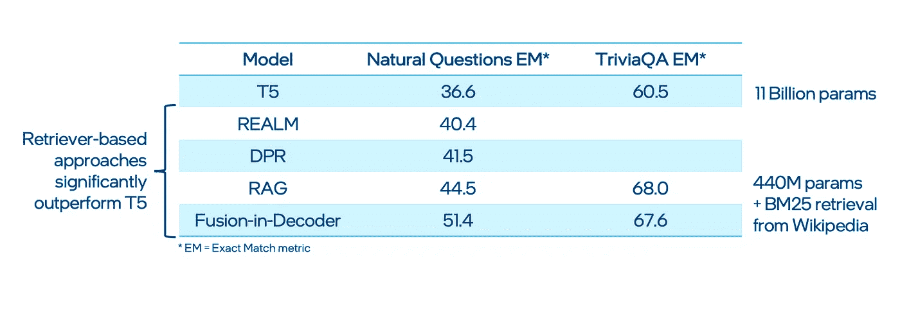
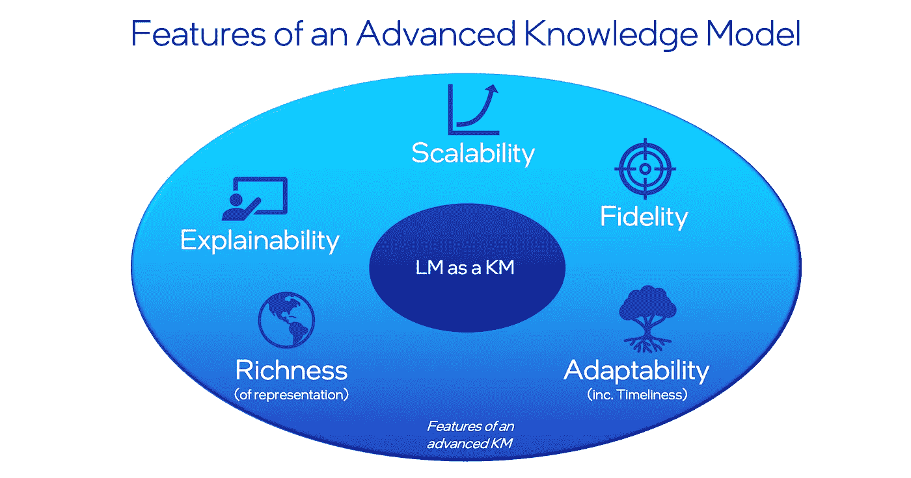
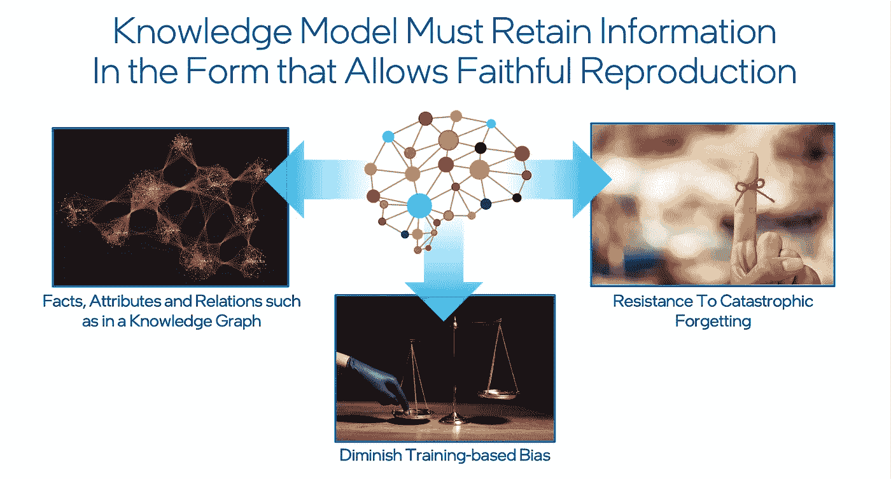
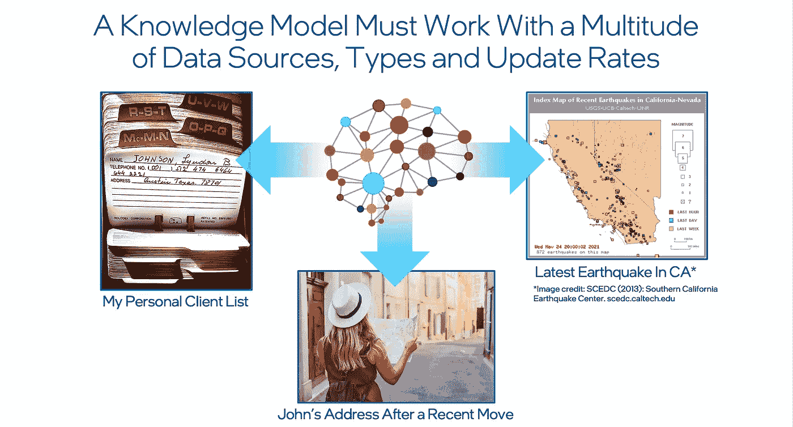
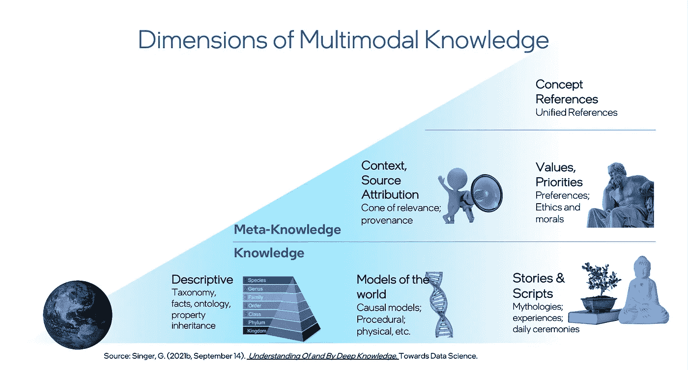
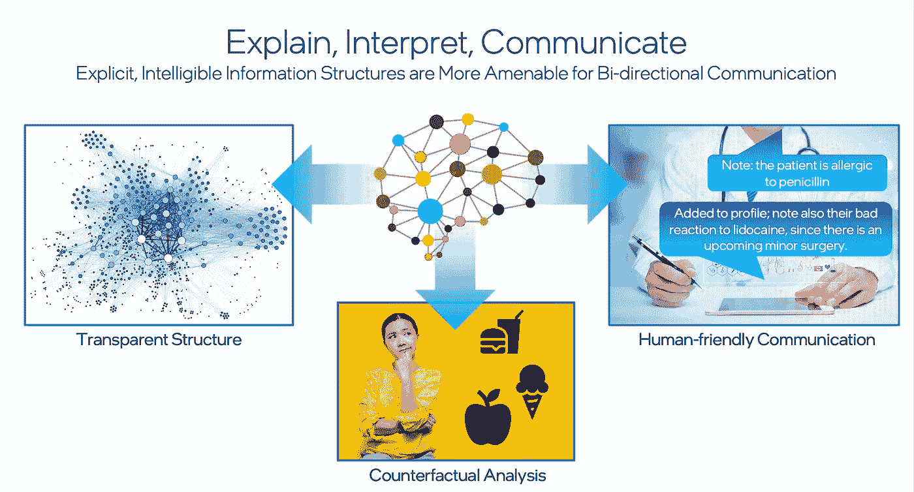

# LM！=KM:语言模型无法支持下一代人工智能知识模型需求的五个原因

> 原文：<https://towardsdatascience.com/lm-km-3e81e1e1c3ae>

## [行业笔记](https://towardsdatascience.com/tagged/notes-from-industry)

# **LM！=KM:语言模型无法支持下一代人工智能知识模型需求的五大原因**

图片来源: [CoreDESIGN](https://stock.adobe.com/contributor/207461122/coredesign) 通过 Adobe Stock。

**大型语言模型(LMs)已经证明它们可以作为相对较好的知识模型(KMs)。但是，它们是否擅长执行实现真正智能的认知人工智能系统所需的所有功能？我认为，答案是否定的。这篇文章将讨论构成高级知识管理的五种能力，以及这些领域如何不能被目前形式的 LMs 轻易解决。这些能力是可扩展性、保真性、适应性、丰富性和可解释性。**

下一波人工智能将转向更高的认知功能，如常识推理、抽象洞察、新技能的获取以及复杂信息的新颖使用。丰富的、结构深刻的、多样的、不断发展的知识将是基础。允许人工智能系统组织其世界观、理解意义并展示对事件和任务的理解的知识结构将可能处于更高水平的机器智能的中心。因此，了解所需的高级知识模型(KM)特征并评估当代完全封装的端到端生成语言模型(LMs)对于满足这些要求的适用性是有价值的。

像 GPT-3 和 T5 这样的 LMs 作为潜在的知识来源，在研究人员中越来越受欢迎，经常获得相当大的成功。例如，叶筋·崔的团队开创了像[生成知识提示](https://arxiv.org/abs/2110.08387)和[象征性知识蒸馏](https://arxiv.org/abs/2110.07178)这样的方法，通过查询像 GPT-3 这样的大型 LM 成功地提取了高质量的常识关系。显然，这种方法可以带来价值，因为它们允许自动创建数据库，而无需模式工程、预设关系或人工监督。

人们很希望 LMs 能够逐步发展，以提供从[知识库](https://en.wikipedia.org/wiki/Knowledge_base)获得的全部能力。然而，尽管它们有许多优点和有价值的用途，LMs 有几个结构上的限制，使它们更难成为一个优秀的、功能更多的知识库和知识接口。例如，在开放领域问答这样的基准测试中可以看到，基于检索器的方法[明显优于](https://arxiv.org/abs/2007.01282)生成式 LMs。

图一。对于开放领域问题回答，基于检索器的方法优于生成式 LMs。数据来源:[【3】](https://arxiv.org/abs/2007.01282)。图片鸣谢:加迪·辛格。

应当注意，LMs 被设计成执行下一个单词预测，而不是为了存储知识的特定目的。因此，即使他们在某些情况下可能做得很好，[他们的架构不是表现知识的最佳方式](https://arxiv.org/abs/2104.10809)，是[不同于人类记忆](https://baicsworkshop.github.io/pdf/BAICS_22.pdf)，并且他们的表现对于知识相关的任务来说不是流线型的。

为了更好地理解这些缺点，考虑一下一个先进的知识管理能够做些什么。我提出了五种主要能力:可伸缩性、保真性、适应性、丰富性和可解释性。

图二。先进知识管理的五个特征。图片鸣谢:加迪·辛格。

让我们更详细地看一下它们。

# **可扩展性**

显然，世界上有大量的信息。大型 LMs 在其容量允许的情况下在参数存储器中存储尽可能多的相关信息，并以训练效率为代价提供快速访问。这种模型通常需要非常大的数据语料库和大量的时间投资来实现性能改进，因此在部署后它们可以访问的信息范围有限。基于检索的方法(例如图 1 中引用的方法)扩展了可靠可访问信息的范围，远远超出了 LM 中编码的内容。2021 年 12 月，作为 [DeepMind 的复古](https://arxiv.org/abs/2112.04426)的一部分，进一步展示了检索适应规模的基本价值。通过[在语言技能(嵌入在模型中)和从具有万亿级表征的数据库中检索的外部知识之间建立分离](http://jalammar.github.io/illustrated-retrieval-transformer/)，他们证明了与 280B 参数 Gopher 和 178B 参数 Jurrasic-1 相比，其 7B 参数 RETRO 的结果有了实质性的改善。

然而，检索系统可能缺乏在综合知识的帮助下可以实现的细微差别。一般来说，设计为高速访问相关信息而优化的系统会在规模和便利性之间产生固有的矛盾，未来的系统预计会具有复杂的分层访问架构。正如博客[“没有人能统治所有人”](/no-one-rung-to-rule-them-all-208a178df594)中所详述的，经济高效的信息访问需要分层的架构，这意味着知识管理必须包括处理每一层的专门模块。

例如，我们可能想要区分每十次访问的数据项和每十万亿次只需要访问的数据项。在计算机系统中提供访问层次结构，可以根据数据需要访问的频率来分离数据，并为每个频率层设计不同的硬件架构(想想高速缓存寄存器与计算机中的硬盘驱动器)。

最常使用的知识(或需要最方便的知识)也应该是最容易访问的，这需要更昂贵的体系结构，并限制了该层的最大经济可行容量。例如，随着计算机架构中存储容量的增加，系统必须牺牲一些访问速度(图 3)。

图 3。规模与速度层级。图片鸣谢:加迪·辛格。

一个理想的知识管理必须是可扩展的，并且包括人类文明积累的全部智慧(达到人工智能执行和进化可能需要的程度)。该系统还必须能够快速执行最关键和时间敏感的任务，并且可能需要一个如上所述的分层体系结构。虽然 LMs 可以通过对大型语料库的训练来获取关于世界的知识，但它们没有以优化方式存储知识的特定架构。

# **保真度**

一个知识管理必须具有高度的保真度，也就是说，它必须允许事实、属性和关系的再现，这些事实、属性和关系是它们的起源所固有的，并且不依赖于它们发生的统计数据。即使两者之间的置信界限不同，单次观测记录的精度也必须等同于经过良好测试的多次观测理论的精度。高保真度的知识管理不太容易出现[灾难性遗忘](https://www.pnas.org/content/114/13/3521.short)或其他类型的信息衰减，并允许针对各种类型的基于训练的偏差进行明确的保护。

图 4。KMs 必须保留允许忠实复制的信息。图片鸣谢:加迪·辛格。

一般来说，LMs 和机器学习(ML)模型在这个维度上有些弱。虽然有许多方法可以缓解这个问题，但没有人期望 LM 能够摆脱这种偏见。相反，LM 必须依赖专门的模块和外部进程。

# **适应性**

知识管理必须处理许多数据源、类型和更新速率。一个小办公室的牙医需要处理患者信息，随着患者信息的变化随时更新，并将不同的数据类型与同一患者相关联(文本文件中的诊断、x 光图像)。每个患者记录在每次就诊的基础上进行更新。另一方面，金融机构处理完全不同类型的信息，更新速度更快，数据量更大。这种类型的系统实际上取决于它处理新信息的速度，以发现欺诈和错误。

图 5。知识管理的适应性。图片来源:加迪·辛格和 [SCEDC](https://scedc.caltech.edu/) 。

今天的 LMs，即使它们可能已经在最近的数据上被训练，在局部改变网络以反映孤立数据点的增加或改变方面也不那么有效。任何微调都需要完全或至少实质性的更新，这远远超出了所添加或更改的数据点的范围，并且有破坏存储在同一系统中的无关知识的风险。一个先进的知识管理不能有这种限制。它需要处理具有不同数据类型的各种信息源，并且它必须允许与相关知识的变化速度相匹配的经济和及时的更新。

# **丰富度**

另一种能力是破译知识的丰富性，这是捕捉通过语言和其他形式表达的知识中所有复杂关系的能力。正如在关于[知识维度](/understanding-of-and-by-deep-knowledge-aac5ede75169)的文章中所讨论的，知识可以分为知识和元知识。直接知识可以是描述性的，如分类学和本体论，或者财产继承。这种类型的知识可以以许多不同的形式存储:语言、3D 点云、声音、图像等。它也可以代表世界的*模型，例如因果、程序或物理模型。最后，它可以包括*故事和剧本*，如神话、经历描述、日常仪式等。*

图 6。多模态知识的维度。图片鸣谢:加迪·辛格。

元知识维度和结构包括来源属性、价值和优先顺序以及概念。人类可以根据信息来源的可信度来区分它们。例如，人们不能指望黄色媒体上的普通点击诱饵像《自然科学杂志》上的一篇文章一样可信。

人类还在他们的价值体系和偏好的背景下评估信息，并将其封装到概念结构中，以便长期存储和推理。虽然 LMs 反映了这些知识维度的一个子集(例如，GPT-3 似乎很清楚典型的笑话脚本)，但它们似乎只代表了知识维度的一个部分子集。很可能需要一个不同的架构来捕捉人类知识的全部丰富性。

# **交代**

当人工智能与人类互动时，特别是在医疗、金融或执法应用等高风险任务上，它解释其选择和沟通的能力自然变得非常重要。这种可解释性和可解释性在明确的、可理解的知识来源的帮助下更容易实现。显性知识允许一个透明的结构，可以检查，编辑和整合到因果推理或反事实推理模块。它为人工智能和人类用户之间的交流提供了一个更好的基础，在这里信息可以被交换、采纳、吸收和反馈。

图 7。知识管理的可解释性。图片鸣谢:加迪·辛格。

# **结论**

一个端到端的 LM，无论多大或多贵，都不能完成一个更先进的 KM 所要求的所有功能来支持下一代的 AI 能力。但这表明了什么是可以支持下一代人工智能系统的实际架构？在推理和[知识图的自动扩展](https://arxiv.org/abs/2110.07178)等领域已经取得了一些初步进展，在描述知识架构蓝图的三个层次时，我已经[进行了深入的讨论。](/thrill-k-a-blueprint-for-the-next-generation-of-machine-intelligence-7ddacddfa0fe#e6a1-20df55d5621c)

无论未来如何，都需要行业努力开发具有涵盖五种能力的知识管理系统的人工智能系统，以便我们可以实现真正智能的认知人工智能。在未来的博客中，我们将讨论一些在未来人工智能系统中开发这些能力的潜在方法。

# **参考文献**

1.刘，刘，a，陆，x，韦勒克，s，西，p，布拉斯，R. L，…和 Hajishirzi，H. (2021)。常识推理的生成知识提示。 *arXiv 预印本 arXiv:2110.08387* 。

2.韦斯特，p .，巴加瓦图拉，c .，赫塞尔，j .，黄，J. D .，江，l .，布拉斯，R. L .，…，崔永元(2021)。符号知识提炼:从一般语言模型到常识模型。 *arXiv 预印本 arXiv:2110.07178* 。

3.伊萨卡和格雷夫(2020 年)。利用生成模型的段落检索进行开放领域问答。arXiv 预印本 arXiv:2007.01282 。

4.Merrill，w .，Goldberg，y .，Schwartz，r .，& Smith，N. A. (2021)。从非基础形式获取意义的可证明的局限性:未来的语言模型将理解什么？。 *arXiv 预印本 arXiv:2104.10809* 。

5.Nematzadeh，a .，Ruder，s .，和 Yogatama，D. (2020 年)。人类和人工语言处理系统中的记忆。在*ICLR 关于沟通人工智能和认知科学研讨会的会议录*。

6.歌手 g(2021 年 12 月 21 日)。没有人能统治所有人:解决基于知识的人工智能中的规模和权宜之计。中等。[https://towards data science . com/no-one-rung-to-rule-them-all-208 a 178 df 594](/no-one-rung-to-rule-them-all-208a178df594)

7.Kirkpatrick，j .，Pascanu，r .，Rabinowitz，n .，Veness，j .，Desjardins，g .，鲁苏，A. A .，… & Hadsell，R. (2017)。克服神经网络中的灾难性遗忘。*美国国家科学院院刊*， *114* (13)，3521–3526。

8.歌手 g(2021 a，12 月 19 日)。*对深度知识的理解和运用——走向数据科学*。中等。[https://towards data science . com/understanding-of-and-by-deep-knowledge-aac5 ede 75169](/understanding-of-and-by-deep-knowledge-aac5ede75169)

9.布兰文，G. (2020 年 6 月 19 日)。 *GPT-3 创作小说*。[https://www.gwern.net/GPT-3#humor](https://www.gwern.net/GPT-3#humor)

10.歌手 g(2021 b，12 月 20 日)。 *Thrill-K:下一代机器智能蓝图*。中等。[https://towards data science . com/thrill-k-a-blue print-for-the-next-generation-of-machine-intelligence-7 ddacddfa 0 Fe # e6a 1-20df 55d 5621 c](/thrill-k-a-blueprint-for-the-next-generation-of-machine-intelligence-7ddacddfa0fe#e6a1-20df55d5621c)

11.Borgeaud，s .，Mensch，a .，Hoffmann，j .，Cai，t .，Rutherford，e .，Millican，k .，… & Sifre，L. (2021)。通过从数万亿个标记中检索来改进语言模型。 *arXiv 预印本 arXiv:2112.04426* 。

12.j . alam mar(2022 年 1 月 3 日)。*图示检索变压器*。[http://jalammar . github . io/illustrated-retrieval-transformer/](http://jalammar.github.io/illustrated-retrieval-transformer/)