# Wordle 中加载的单词

> 原文：<https://towardsdatascience.com/loaded-words-in-wordle-e78cb36f1e3c>

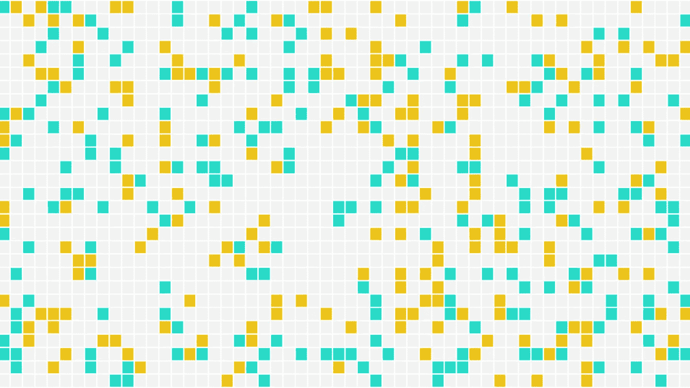

图片作者。

## 沃尔多

## 为什么“最好的”单词不是最好的

在过去的几周里，我注意到脸书上张贴了越来越多的绿色、黄色和黑色/白色网格，就在那时我发现了 [Wordle](https://www.powerlanguage.co.uk/wordle/) 。我被迷住了——与其说是以人类的方式玩游戏，不如说是开发一个系统来尝试最佳地玩游戏。当我阅读其他作者的现有作品时，我发现对起始/种子词的强调势不可挡。然而，对于最好的选择，却有相互矛盾的建议。很明显，除了种子词之外，还有其他更好的玩法！

这篇文章的主要贡献是解释为什么我们应该对“最好的”Wordle 种子词持保留态度，通过展示 Wordle 策略的其他组成部分影响这些词。

# 沃尔多上的字

关于这个主题已经写了许多文章。大多数作者使用模拟来寻找最佳的起始/种子词，同时固定其他参数(稍后将详细介绍)。一些推荐的种子词基于最终的游戏结果，其他的基于计算预期信息增益的算法。下表总结了每位作者的一般方法和建议。

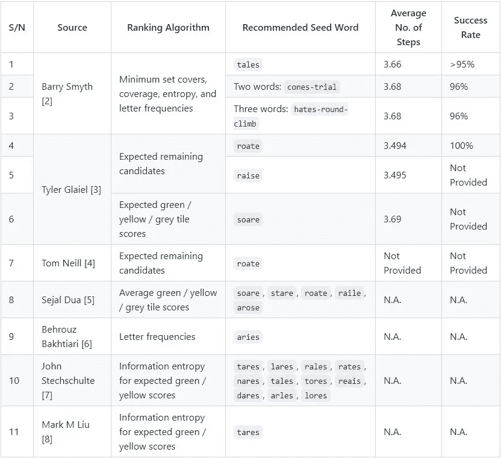

关于沃尔多的文章。图片作者。

Wordle 是一个相对较新的游戏，覆盖整个解决方案空间需要大量的努力和计算能力。因此，还有许多想法有待探索，还有许多问题有待解决。第一个问题是，正如更全面的研究(主要是[史密斯](/what-i-learned-from-playing-more-than-a-million-games-of-wordle-7b69a40dbfdb))所暗示的那样，最优策略不仅仅是种子词那么简单。第二个问题是“最佳”有不同的定义，并且不是所有的研究都包括足够的指标来衡量战略的绩效。

# 行动纲要

这篇文章试图解决上述问题。这篇文章的目的和主要观点列在这里。

首先，我们表明“最佳”种子词取决于 Wordle 策略的其他组成部分:

*   Wordle 策略的其他组成部分是**排序算法**和**决策规则**，用于在解决问题和收集信息之间进行优先排序。
*   排名算法严重影响了 Wordle 的性能。
*   选择的**度量**也决定了什么是最好的意思，因此，什么词是最好的。

其次，我们引入了几个度量标准来衡量性能并定义什么是“最好的”。这些是:

*   达成解决方案所需的平均步骤数
*   解决方案成功率
*   在 3 步或更短时间内解决的挑战比例

# 游戏

对于门外汉来说，Wordle 是 5 个字母单词的策划者，加上一些社交媒体上的羞辱。这个游戏的目的是在六次尝试中猜出一个未公开的单词。在每次猜测中，Wordle 会告诉你每个字母是否:

*   在正确的位置(绿色)
*   在单词中，但是错误的点(黄色)
*   根本不在这个词里(灰色)

这就是全部了！这听起来很简单，但是这个游戏并不简单，因为有太多的可能性。在 Wordle 中，有 2，315 个可能的解决方案单词，以及另外 10，657 个被接受为猜测的单词(“支持单词”)。因此，我们的机器人的目标是利用 12，972 个候选词的完整集合，在六次尝试中将 2，315 个解决词的集合减少到一个。

> ***注:*** *全套文字可以从网站主脚本中检索。使用浏览器的开发人员控制台来访问它。*

# 沃尔策略

就像幸运之轮一样，在 Wordle 中，我们在绿色、黄色和灰色瓷砖方面平衡了**解决**(猜测我们认为是解决方案的单词)和**收集信息**(使用单词梳理出解决方案中可能的字母)。人类可能会采取以下策略:

1.  **第一轮:收集尽可能多的信息。**我们在这一点上没有信息，所以我们选择一些统计上最优的种子词。第一次猜测越准确，我们收集的信息就越多。
2.  **第 2 轮:利用第 1 轮的反馈，收集尽可能多的信息*。虽然我们可以通过两步解决游戏来获得巨大的街头信誉，但这是非常困难的。因此，我们在第二轮中能做的最好的事情就是通过使用与种子单词字母完全不同的单词来收集更多的信息。***
3.  **第三轮:看情况！如果我们获得了足够的信息，我们就可以着手解决问题了。否则，为了安全起见，选择另一个词来获得更多线索可能会更好。**
4.  第四轮:还是要看情况。我们做的和第三轮一样。我们可以通过优先解决问题而不是收集信息来变得更加积极。
5.  第 5 轮:还是那句话，看情况。我们的做法与第 3 轮和第 4 轮相同。到目前为止，我们应该已经缩小了解决方案的范围。
6.  **第 6 轮:100%解决。到第六轮时，我们完全有可能仍有几个可行的解决方案。如果仍然不清楚解决方案是什么，就猜一猜吧！我们会失去什么？**

我们可以看到，战略不仅仅是种子词。它还包括(1)优先解决与收集信息的决策规则，以及(2)选择单词的方法。

> ***注意:*** *如果我们在游戏开始前应用排名算法对整个候选集进行排名，我们实际上可以将种子词作为策略组件一起删除。事实上，这正是上述资料 8-11 中的作者所做的。*

# 模拟单词

## 概观

我的 Wordle bot 遵循广义策略，并实现了该策略的另外两个组成部分:决策规则和选择单词的排序算法。

机器人开始于(1)包括所有 12，972 个被接受单词的候选集合，以及(2)包括所有 2，315 个解单词的解集合。它将重复测量(1)和(2)，并在每次游戏过程中更新它们。机器人一次移动一步，在每一步/每一轮中做同样的事情:

1.  将剩余的候选人和解决方案放入排名算法中，以计算每个候选人的分数。
2.  根据分数对剩下的候选人进行排序。
3.  提交得分最高的候选人作为该步骤的猜测。
4.  使用反馈来(a)筛选候选方案和(b)筛选潜在的解决方案。我们还排除已经被猜测的候选项，以及包含不再存在于剩余解集中的字母的候选项，即它们对于进一步过滤候选项没有价值。
5.  从步骤 1 开始重复，直到步骤 4 的反馈为`GGGGG`。

我开发了一个`Wordle`类来简化游戏，不管是模拟的还是其他的。由于这不是这篇文章的重点，我将跳过它的实现细节。你可以在我的 [GitHub repo](https://github.com/chrischow/wordle_solver) 获取完整代码。我提到这个课程只是为了简单地展示我是如何运行模拟的。

```
def play_game(input_word, solution):

    game = Wordle(wordle, wordle_answers, solution=solution, verbose=False)

    while not game.solved:
        if game.step == 0:
            game.guess(input_word)
        else:
            game.guess(game.optimisations[method.lower()].word.iloc[0])
        game.optimise(method='expected_gyx', n_jobs=-2)

    return game.records()
```

在决定所有步骤之前，机器人**不使用蛮力**来列举所有游戏*结果*。这太耗费计算量了。

## 排名算法

排序算法可以说是策略中最关键的部分，因为它决定了哪些猜测是可用的。决策规则仅在算法提供的可用猜测中做出决定，种子词可以被认为是排名算法的*产品*，在游戏开始前计算。

我的 Wordle bot 有几个内置选项:(1)字母频率，(2)预期的绿色、黄色和灰色瓷砖，以及(3)预期的剩余候选的最大数量。每个算法计算所有剩余候选项相对于剩余解决方案的分数。

**字母频率** 该算法根据组成单词的字母的流行程度对单词进行排序:

1.  计算所有剩余解决方案中字母出现的频率
2.  创建一个字母到计数的查找表
3.  通过计算候选单词中字母的频率得分总和，对每个剩余的候选单词进行评分
4.  挑选得分最高的候选人

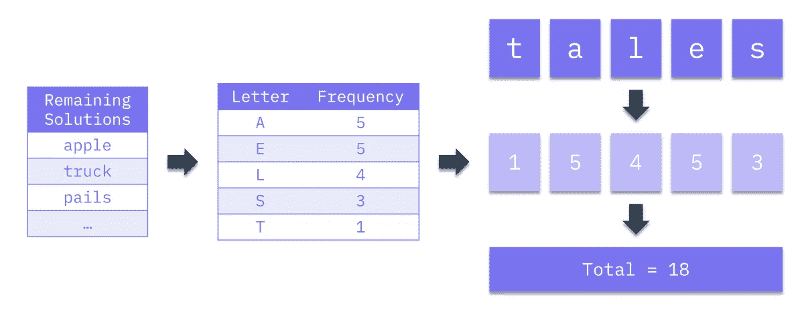

计算字母频率分数。作者图片

**期望的绿色/黄色/灰色块分数** 该算法基于返回的绿色块和黄色块的数量，通过所有剩余解决方案的平均，根据获得的期望信息对单词进行排序。为了简单起见，我称之为 GYX 分数，因为我在对`Wordle`类的反馈中用灰色(`X`)编码。对于每个剩余的候选人:

1.  针对每个剩余的解决方案执行以下操作:
    —针对该解决方案计算反馈
    —计算`GYX Score = 2 * No. of Greens + No. of Yellows`
2.  巩固 GYX 分数列表
3.  取所有分数的平均值，得出该候选人的单一分数

最后，挑选得分最高的候选人。

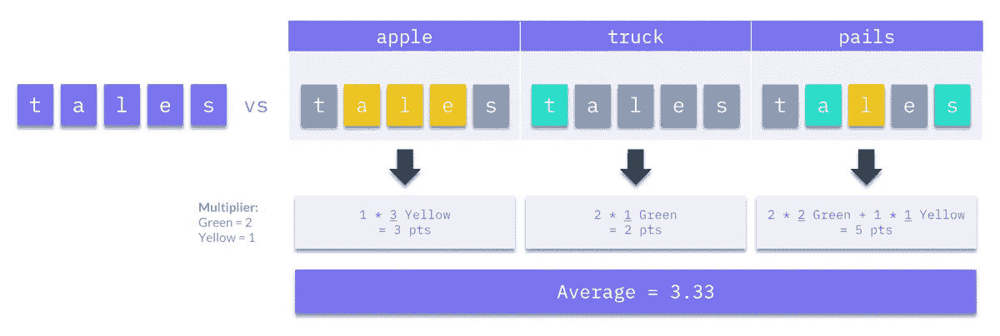

计算预期的 GYX 分数。图片作者。

**剩余候选项的最大数量** 该算法根据候选项在最坏的情况下，在所有剩余的解决方案中可能被排除/留下的可能性来对候选项进行排序。这个想法是选择最能减少候选词集的词。对于每个剩余的候选人:

1.  对每个剩余的解决方案执行以下操作:
    —计算对该解决方案的反馈
    —使用反馈来过滤剩余的候选集(的副本)
    —计算剩余的候选数
2.  合并计数列表
3.  取所有计数中的最大值

最后，选择得分最低的候选人，因为它在最坏的情况下留下了最少的可能性。

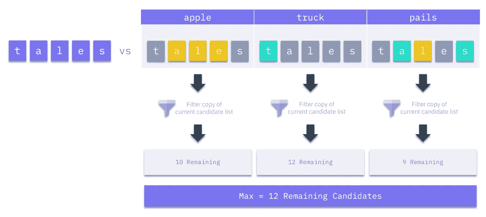

计算剩余候选人的最大数量。图片作者。

## 决策规则

基线决策规则是，只有在剩下 20 个或更少的解决方案时，我们才会猜测解决方案单词。这与我们的战略相一致，当我们在解决方案上达成一致时，我们优先解决问题，而不是收集信息。

测试的另一个可选决策规则是纯粹根据流行度来选择单词，流行度是通过维基百科文章中的词频来衡量的(来源:[Lexipedia](https://en.lexipedia.org/)【9】)。当只剩下 10 个解决方案时，规则开始生效，并且**被置于基准规则**之上。我任意选择了 10 个剩余解的阈值，尽管我确信有更好的方法来选择这个数字。根据这一规则，机器人会在剩下的答案中猜出最受欢迎的单词。

## 模拟配置

我将上一节中各种来源推荐的每个单词(见下文)与 2315 个解决方案单词的完整集合进行了 5 次对比，每个排序算法/决策规则配置一次。

种子词:

```
1\. arles    10\. rates
2\. arose    11\. reais
3\. dares    12\. roate
4\. lares    13\. soare
5\. lores    14\. stare
6\. nares    15\. tales
7\. raile    16\. tares
8\. raise    17\. tores
9\. rales
```

排序算法和决策规则:

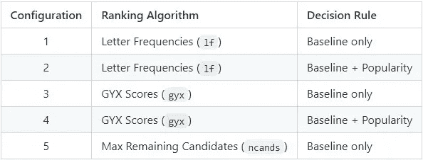

测试了排名算法和决策规则配置。图片作者。

总的来说，在总共 **196，775 场**的 Wordle 游戏中，有 17 个“最佳”单词被 5 种策略和 2，315 个解决单词所取代。

从现在开始，为了简单起见，我将把排名算法和决策规则的组合称为**排名算法/算法**，因为排名算法主要负责游戏的进展。

## 韵律学

最后，在我们讨论模拟结果之前，这些是建议的指标，允许其他作者与测试的策略进行比较:

1.  达成解决方案所需的平均步骤数
2.  解决方案成功率
3.  在 3 步或更短时间内解决的挑战比例

总的来说，这些指标告诉我们(1)就步骤而言，该策略总体上有多好，(2)它可以解决 2，315 个解决方案单词中的多大比例，以及(3)机器人在尽可能少的步骤中解决挑战方面有多好(即街头信誉)。

# 结果

## 总体结果

总的来说，结果表明“最佳”种子词取决于(1)其他策略组件——尤其是排序算法——以及(2)所使用的性能指标。以下是相应策略设置和指标的排名第一的种子词:

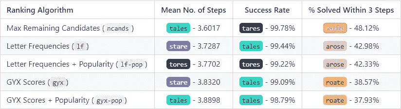

按排序算法和度量得出的总体结果。图片作者。

下面，我给出了 17 个“最佳”种子词在各种排序算法和指标中得分的方框图。我还强调了几个种子词的分数和进展，这些种子词在整个排名算法中一直排在前几名。

首先，我们注意到对性能影响最大的是**排序算法**。我们看到三个度量中的每一个的种子词性能的分布有明显的差异。特别地，最大剩余候选排序算法比其他算法表现得好得多，使得表现最差的种子词比所有其他策略中表现最好的种子词表现得更好。

第二，当使用不同的**排序算法**时，我们看到“最佳”种子词改变了排序。这一点对某些人来说比其他人更明显。例如，`tores`在解决 GYX 分数算法的平均步骤中排名 6-7，在字母频率算法中排名 1-2，然后在最大候选数算法中排名第 6。

。这让我们有理由相信，使用不同的算法可能会产生不同的“最佳”种子词。

第三，“最佳”种子词并不是所有**指标**中的最佳。事实上，每个指标都有不同的最优*策略*。在各种排序算法中表现相对较好的种子词是:`stare`、`tales`、`tares`、`tores`和`roate`。这些在下面的图表中用各自的颜色标出。

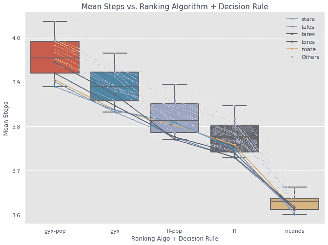

图片作者。

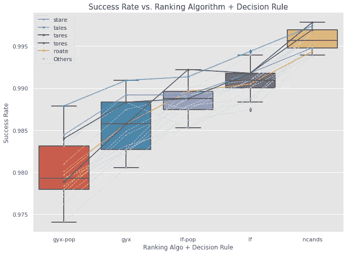

图片作者。

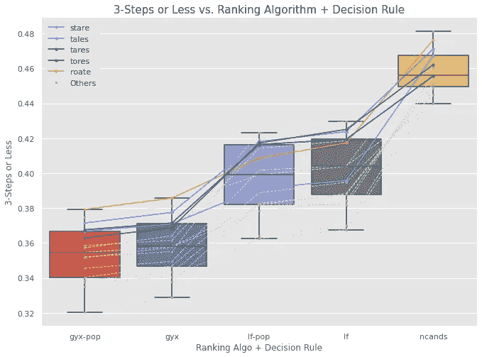

图片作者。

## “最佳”策略

接下来，我们放大每个指标的前 5 个策略。它们都涉及到**最大剩余候选数**排序算法和**基线**决策规则。结果显示了不同的种子词对于不同的目标有多好。

基于达成解决方案的**平均步骤数的最佳策略是:**

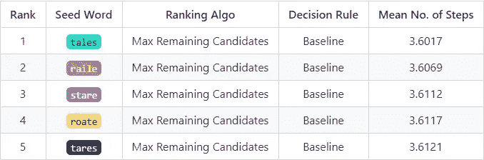

图片作者。

按**解决方案成功率**排名的顶级策略非常接近。排名 1 到 2 和 2 到 3 之间的差异是 0.0432%，这相当于 2315 场比赛中只有 1 场。


图片作者。

按在 3 个步骤或更少步骤内解决的挑战比例**列出的最佳策略是:**

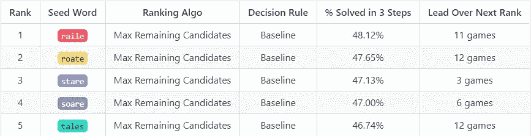

图片作者。

# 限制:对于机器人，由机器人

这篇文章和其他类似文章的发现的主要局限性是，推荐的种子词不一定适用于随便写写文章的人。我们已经表明，最佳种子词取决于您如何玩游戏以及您试图优化的指标。除非你能像机器人一样玩游戏，拥有(1)关于解空间的完美信息和(2)使用排序算法评估其中一大块的计算能力，否则最佳种子词*对你来说*可能会不同。

也就是说，对于人类玩家来说，专注于种子词是可行的，因为这是可操作的。如果我们真的需要一个关于使用什么种子词的建议，我们应该看看那些在三个指标**和**以及各种排名算法中表现良好的词(在上图中用它们各自的颜色标出)。他们可以在不同风格的游戏中表现出色，但是需要更多的工作来用一个更像人类的机器人来验证这一点，并理解为什么这些单词工作得很好。

# 结论

在这篇文章中，我们展示了改变策略的其他部分，即(1)排序算法和(2)在解决与信息收集之间进行优先排序的决策规则，会影响“最佳”种子词。讨论中的度量标准，无论是(I)达到解决方案的平均步骤数，(ii)成功率，还是(iii)在 3 个步骤内解决的挑战的比例，对于确定“最佳”的含义以及“最佳”种子词是什么都很重要。

基于这些结论，我们不应该简单地接受基于与非人类机器人玩的模拟游戏的结果而产生的种子词推荐。需要更深一层的探究，以确定那些不管谁或什么在使用它们，也不管游戏是如何进行的都有效的词。

## 参考

1.  J.沃德尔，powerlanguage.co.uk。
2.  B.Smyth，[我从玩了一百多万场 Wordle](/what-i-learned-from-playing-more-than-a-million-games-of-wordle-7b69a40dbfdb) (2022)的游戏中学到了什么，走向数据科学。
3.  T.格莱伊尔，[Wordle](https://medium.com/@tglaiel/the-mathematically-optimal-first-guess-in-wordle-cbcb03c19b0a)(2021)中数学上最优的第一次猜测，中等。
4.  T.尼尔，[破坏乐趣:一个 Wordle 自动解算器](https://notfunatparties.substack.com/p/wordle-solver) (2022)，在派对上不好玩。
5.  南 Dua，[深入探究 Wordle，新疫情谜题热潮](/a-deep-dive-into-wordle-the-new-pandemic-puzzle-craze-9732d97bf723) (2022)，走向数据科学。
6.  B.Bakhtiari，[关于 Wordle](/a-frequency-analysis-on-wordle-9c5778283363) (2022)的一句话，走向数据科学。
7.  J.Stechschulte， [🟩🟩🟩🟩🟩优 Wordle](/optimal-wordle-d8c2f2805704) (2022)，走向数据科学。
8.  米（meter 的缩写））刘明辉，[在说什么？](https://markmliu.medium.com/what-in-the-wordle-5dc5ed94fe2) (2022)，中等。