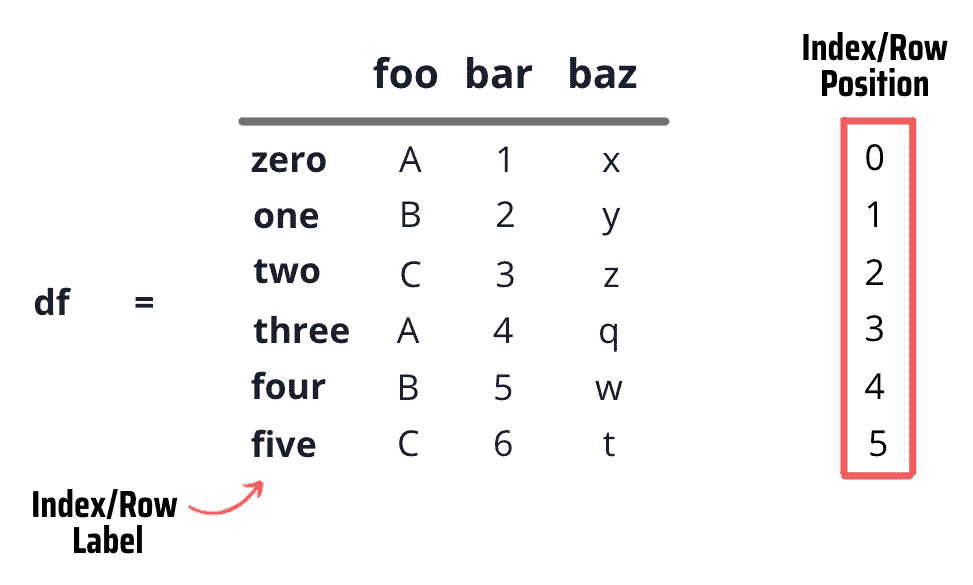
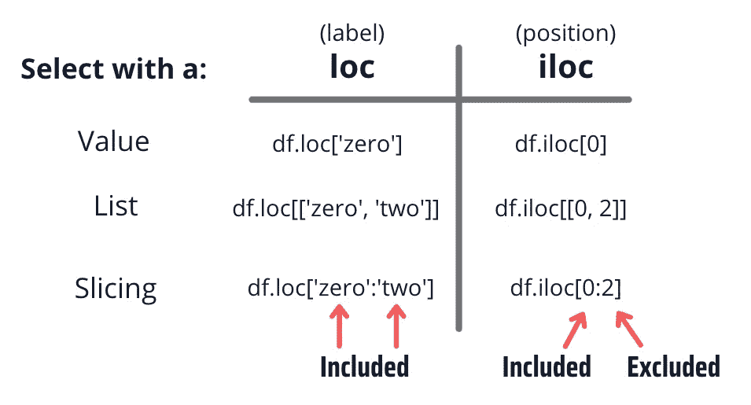
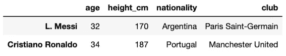
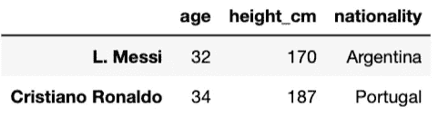
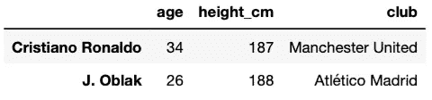
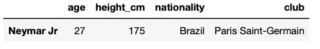

# 熊猫中的 loc 与 iloc。区别就在这里。

> 原文：<https://towardsdatascience.com/loc-vs-iloc-in-pandas-heres-the-difference-16cd4bcbecab>

## 如何使用 loc 和 iloc 在 Pandas 中选择行和列


尼尔和祖玛·斯科特在的 [Unsplash 上的](https://unsplash.com?utm_source=medium&utm_medium=referral)[照片](https://unsplash.com/@valenciascott?utm_source=medium&utm_medium=referral)

当谈到在熊猫中选择数据时，有不同的选择。其中最流行的就是用`loc`和`iloc`，但是两者有什么区别呢？

当我开始学习 Pandas 时，我也有同样的问题，在本文中，我将向您展示 Pandas 中使用`loc`和`iloc`选择数据的主要区别，并展示一些示例来说明这一点。

到本文结束时，您将知道如何使用`loc`和`iloc`选择单个值、多行和多列。

# loc 和 iloc 之间的区别

`loc`和`iloc`的主要区别在于`loc`是基于标签的(您需要指定行和列标签),而`iloc`是基于整数位置的(您需要通过整数位置值指定行和列，从 0 开始)

> 下面是更好理解这一点的实际例子。你可以观看我的 YouTube 视频，也可以继续阅读这篇文章。

考虑具有以下行标签和行位置的数据帧:



作者图片

现在让我们看看如何使用 loc 和 iloc 选择随机元素:



作者图片

在上面的例子中，`loc`和`iloc`返回相同的输出，除了最后一个元素被包含在`loc`中而被排除在`iloc`之外。

# 使用 loc 和 iloc 从数据帧中选择元素

为了详细了解 loc 和 iloc 之间的差异，让我们创建一个包含顶级足球运动员基本信息的数据框架。

下面是创建这个小数据框架的代码:

下面是运行代码后您应该获得的数据帧:


作者图片

现在让我们看看如何用单个值、列表和切片从数据帧中选择元素。

## 选择具有单个值的数据

我们可以通过添加一个值作为输入来定位带有`loc`和`iloc`的元素。下面是要遵循的语法:

*   `loc[row_label, column_label]`
*   `iloc[row_position, column_position]`

比方说我们想得到莱昂内尔·梅西的身高。

```
# *get the height of L.Messi*# **loc**
>>> df.loc['L. Messi', 'height_cm']
# **iloc**
>>> df.iloc[0, 1]170
```

如您所见，`loc`需要“L.Messi”和“height_cm ”,因为它们是行/列标签，而`iloc`需要 0 和 1，因为它们是行/列位置。两种方法得到的输出一样 170，这是梅西的身高。

现在我们来看看 c 罗的身高。

```
*#* *get the* height *of Cristiano Ronaldo*# **loc**
>>> df.loc['Cristiano Ronaldo', 'height_cm']
# **iloc**
>>> df.iloc[1, 1]187
```

如果您想获得特定行/列的所有数据，使用`loc`和`iloc`中的`:`。

```
*#* *get all the data about L.Messi*# **loc**
>>> df.loc['L. Messi', :]
# **iloc**
>>> df.iloc[0, :]age                             32
height_cm                      170
nationality              Argentina
club           Paris Saint-Germain
```

## 用列表选择多行/多列

我们可以使用标签/位置列表来选择分别带有`loc`和`iloc`的多行和多列。

```
*# get all data about L.Messi and Cristiano Ronaldo*# **loc**
>>> df.loc[['L. Messi', 'Cristiano Ronaldo']]
# **iloc**
>>> df.iloc[[0, 1]]
```

以下是我们选择的输出:



作者图片

现在我们通过将' height_cm '列标签/'1 '列位置分别加到`loc`和`iloc`上，只得到这两个球员的身高。

```
*# get the height of L.Messi and Cristiano Ronaldo*# **loc**
>>> df.loc[['L. Messi', 'Cristiano Ronaldo'], 'height_cm']
# **iloc**
>>> df.iloc[[0, 1], 1]L. Messi             170
Cristiano Ronaldo    187
```

## 用切片选择多行/多列

我们也可以用一个带有`loc`和`iloc`的切片选择多个行和列。

让我们做一个切片，得到列'年龄'，'身高 _ 厘米'，和'国籍'。

```
*# slice column labels: from age to nationality**#* ***loc***
>>> players = ['L. Messi', 'Cristiano Ronaldo']
>>> df.loc[players, 'age':'nationality']
***# iloc***
>>> players = [0, 1]
>>> df.iloc[players, 0:3] # age:nationality+1
```

与列表不同，当我们选择带有切片的元素时，最后一个元素“nationality”包含在`loc`方法中，而最后一个元素“3”在`iloc`中被排除。

下面是我们得到的`loc`和`iloc`的输出:



作者图片

## 带条件选择

每当您想要基于某些条件选择元素时，请记住`iloc`需要一个布尔列表，因此我们必须使用`list()`函数将我们的系列转换为布尔列表。

```
*# one condition: select player with height above 180cm****# loc***
columns = ['age', 'height_cm', 'club']
df.loc[df['height_cm']>180, columns]
***# iloc***
columns = [0,1,3]
df.iloc[list(df['height_cm']>180), columns]
```

下面是我们得到的`loc`和`iloc`的输出:



作者图片

同样的规则也适用于你想要应用多个条件的情况。比如说我们想获得在 PSG *打过球的身高 180cm 以上的球员。*

```
*# multiple conditions: select player with height above 180cm that played in PSG****# loc***
df.loc[(df['height_cm']>170) & (df['club']=='Paris Saint-Germain'), :]
***# iloc***
df.iloc[list((df['height_cm']>170) & (df['club']=='Paris Saint-Germain')), :]
```

下面是我们得到的`loc`和`iloc`的输出:



作者图片

就是这样！现在你可以使用`loc`和`iloc`从数据帧中选择元素了。你可以在我的 [Github](https://github.com/ifrankandrade/python-course-for-excel-users.git) 上找到这篇文章写的所有代码。

[](https://frankandrade.ck.page/bd063ff2d3)

**如果你喜欢阅读这样的故事，并想支持我成为一名作家，可以考虑报名成为一名媒体成员。每月 5 美元，让您可以无限制地访问数以千计的 Python 指南和数据科学文章。如果你用[我的链接](https://frank-andrade.medium.com/membership)注册，我会赚一小笔佣金，不需要你额外付费。**

**[](https://frank-andrade.medium.com/membership) **