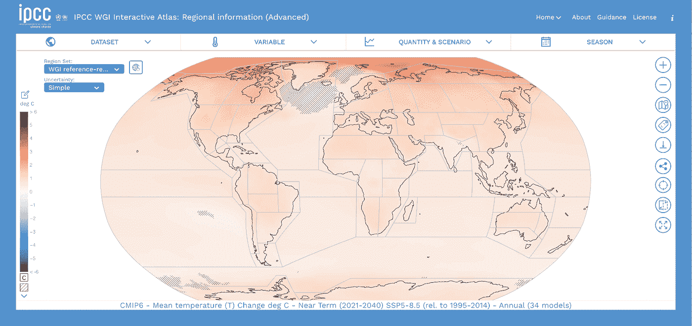
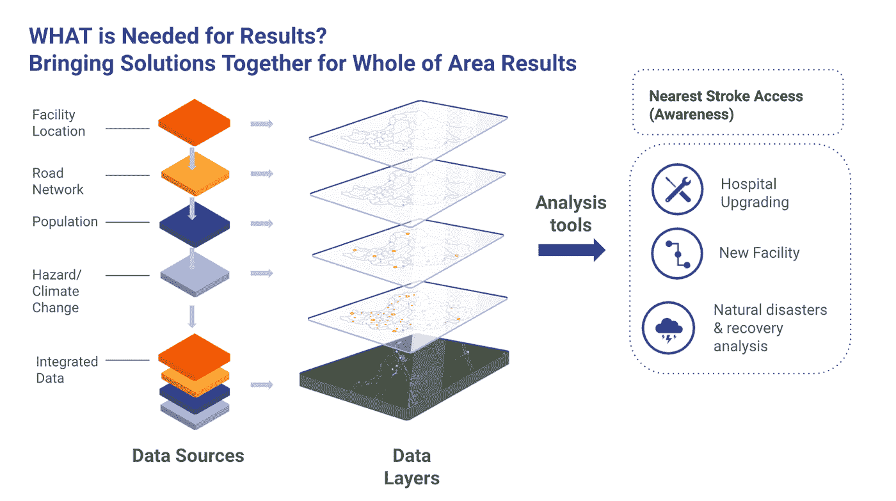
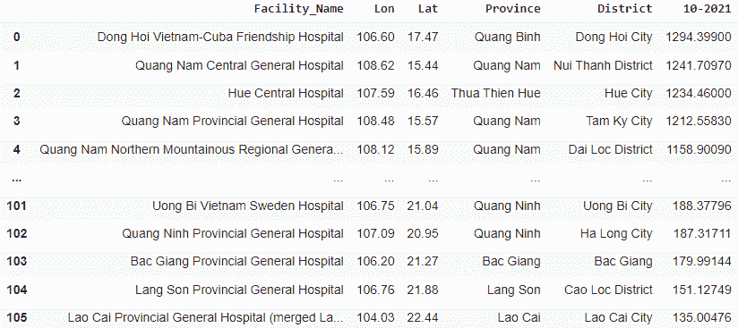
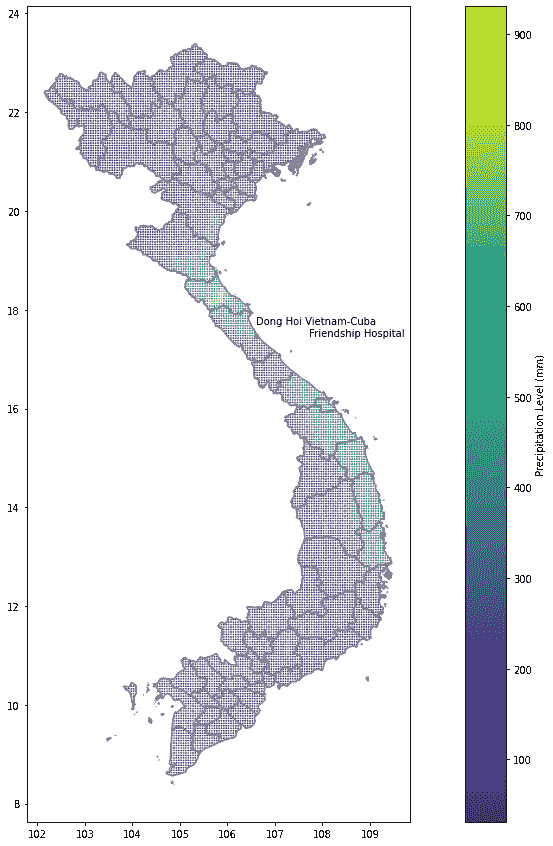
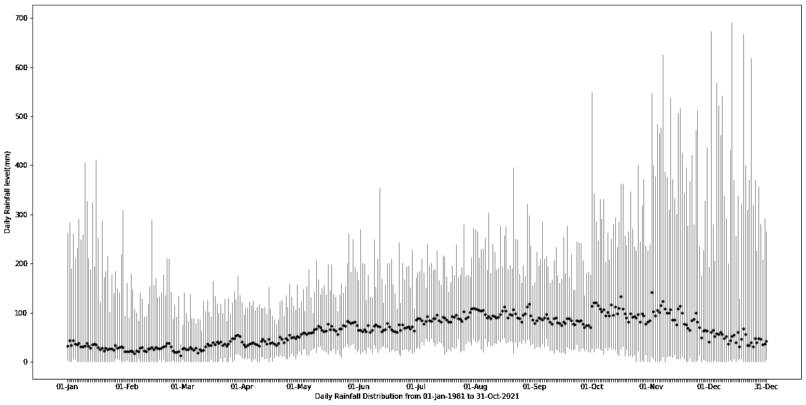
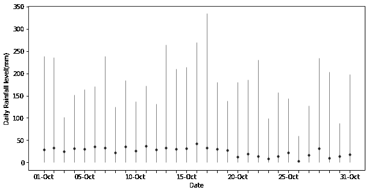
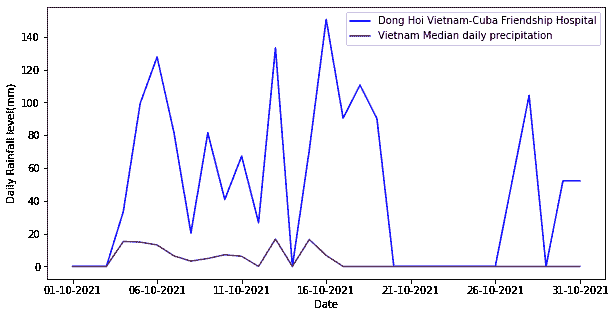

# 当地气候分析:越南卫生机构的雨水暴露

> 原文：<https://towardsdatascience.com/local-climate-analytics-health-facility-rain-exposure-in-vietnam-6f7a40442e83>

## 在基于云的 Jupyter 笔记本 Python 环境中处理地理空间卫星影像数据，以测量关键公共基础设施的降雨情况

*这项工作完全使用公开可用的数据完成，与*[*Anh Tu \u Phan*](https://medium.com/@phantuan0594/about)*、*[*parva thy Krishnan*](https://parvathykrishnank.medium.com/)*和*[*Hieu Danh Luu*](https://medium.com/@hluu)*合著。所有错误和遗漏都是作者的。*

*“水，到处都是水，没有一滴可以喝”*

塞缪尔·泰勒·柯尔律治的诗，[《古舟子咏》](https://www.poetryfoundation.org/poems/43997/the-rime-of-the-ancient-mariner-text-of-1834)

水体，[越南宁城 thuận](https://unsplash.com/s/photos/ninh-thu%E1%BA%ADn%2C-vietnam)，作者[范怀忠](https://unsplash.com/photos/xao3RL-egBw)

在这个大数据时代，能够更好地洞察当地天气和气候变化风险的地理空间数据层正在激增。但对于为世界各地政府工作的最终用户，以及寻求支持他们的更懂技术的数据科学家来说，以灵活有效的方式利用这些资源来解决一线问题可能具有挑战性。

如何实现这种大数据映射洞察，以提供实用的本地洞察？我们展示了如何使用[基于云的 Jupyter 笔记本 Python 环境(cJPNE)](https://www.google.com/url?q=https://parvathykrishnank.medium.com/digital-platform-innovations-for-development-impacts-aad457d588b1&sa=D&source=docs&ust=1638942749136000&usg=AOvVaw2UlVkvv3iAMPpjWtUS4hbn) 来评估在越南获得中风护理的可能脆弱性。这是一个更广泛的例子，探讨如何分析公共基础设施资产和投资，以更好地应用当地风险和弹性分析。

卫生设施和道路网络连接等基础设施的位置对于人们获得公共服务至关重要。除了在正常环境条件下分析这种获取途径之外，持续的极端天气威胁——以及与气候变化相关的进一步风险——可能会引发对医疗保健点等重要物理服务获取途径的更多关注。

新一代的危险层提供了越来越丰富的可能暴露感。很好的例子包括由世界银行全球减灾和恢复基金(GFDRR)建立的 [Think Hazard](https://thinkhazard.org/en/) 站点。联合国政府间气候变化专门委员会(IPCC)最近的 2021 年第六次评估报告揭示了全球可能出现的不同范围的极端天气变化。IPCC 还提供了一个[交互式地图集](https://interactive-atlas.ipcc.ch/regional-information#eyJ0eXBlIjoiQVRMQVMiLCJjb21tb25zIjp7ImxhdCI6OTc3MiwibG5nIjo0MDA2OTIsInpvb20iOjQsInByb2oiOiJFUFNHOjU0MDMwIiwibW9kZSI6ImNvbXBsZXRlX2F0bGFzIn0sInByaW1hcnkiOnsic2NlbmFyaW8iOiJzc3A1ODUiLCJwZXJpb2QiOiIyIiwic2Vhc29uIjoieWVhciIsImRhdGFzZXQiOiJDTUlQNiIsInZhcmlhYmxlIjoidGFzIiwidmFsdWVUeXBlIjoiQU5PTUFMWSIsImhhdGNoaW5nIjoiU0lNUExFIiwicmVnaW9uU2V0IjoiYXI2IiwiYmFzZWxpbmUiOiJwcmVJbmR1c3RyaWFsIiwicmVnaW9uc1NlbGVjdGVkIjpbXX0sInBsb3QiOnsiYWN0aXZlVGFiIjoicGx1bWUiLCJtYXNrIjoibm9uZSIsInNjYXR0ZXJZTWFnIjpudWxsLCJzY2F0dGVyWVZhciI6bnVsbCwic2hvd2luZyI6ZmFsc2V9fQ==)，提供了一系列维度的场景层。

**图一。最新 IPCC 情景(来源:** [**IPCC 互动图册**](https://interactive-atlas.ipcc.ch/) **)**

随着越来越多的地理空间灾害风险和气候变化图层可供用户查看，如何将这些图层与探索更具体的公共基础设施资产和投资服务风险联系起来？直观地说，这项任务将涉及覆盖各自的基础设施、人口和风险层，以了解暴露程度最大的地方(见图 2)。

**图二。保健获取描述性和规定性分析(资料来源:** [**ABW 和世界银行**](https://docs.google.com/presentation/d/16GI4T_yb8C73XBbi695v0zOWgCoqVPT4B7D2Q9wXN4I/edit#slide=id.ge077f66017_0_461) **)**

***基于云的 Jupyter Python 笔记本可用于将地理空间风险分析应用于跨空间和时间的公共基础设施访问***

基于云的 jpne(“cjnpe”)提供了一个强大的平台技术来集成和分析关键数据，以提供描述性(*是什么)*和规定性(*可能是什么)*见解。在之前的[Medium for Data Science 投稿](/visualising-global-population-datasets-with-python-c87bcfc8c6a6)中，我们展示了如何在基于云的 JPNE 环境中部署两个具有高级地理空间粒度的人口分布层。很好地使用基于云的 JPNEs 的一个组成部分是建立清晰和可复制的数据管道，并确定适合目的的开源 Python 库，这些库能够解决感兴趣的特定问题。在本例中，我们调查了越南卒中机构暴露于潜在极端降水层的基本情况。

股市投资者会经常听到这样一句话:“过去不能指导未来。”在气候变化的时代，降雨模式肯定也是如此。一系列可用的地理空间图层属于描述性(*过去是什么样子*)和预测性(*未来可能是什么样子*)两类。[天气预报是预测的一个例子](https://www.andrewblum.net/the-weather-machine-2)，但是昨天在任何给定位置测量的降雨量的报告是描述性的。与此同时，各种科学计划正在利用大数据和机器学习模型在全球范围内生成地理空间风险层。

为了说明如何使用这些类型的地理空间图层来筛选公共基础设施资产或投资，我们首先探讨了越南估计的 106 个中风设施对历史降水和可能的洪水风险的明显暴露。这个博客回顾了气候灾害组织红外降水站的降雨情况。下一期将把它与预计的 Fathom-Global 2 洪水数据进行比较。al 2021a，b)，这是前瞻性的风险层。

***利用新环境暴露层的财富意味着让领域专家和数据科学家首先解决基本数据访问和分析问题***

探索基于云的 JPNEs 中的地理空间数据层的起点是能够清楚地说明它们测量什么，以及数据的时间和地理空间粒度。简而言之，数据以何种频率和位置细节可用，有多长的延迟？对于预测数据，时间维度通常用某个预测时段来表示。对于描述性的历史数据，问题是数据在一个一致的系列中回溯到多远，以及以什么样的频率报告。从基于云的 JPNE 的角度来看，另一个问题是数据访问(和更新)是否已经可以自动化(通过 API)，或者它们是否需要下载数据和转移数据的手动中间阶段。这个过程的自动化程度越高，练习的可复制性就越强。

在开展这项工作时，用户应了解(I)每个说明性图层捕捉的是什么测量值——历史测量值还是预测测量值,( ii)这些图层如何以有意义的方式与现有公共卫生基础设施设置的位置相交，以及(iii)下一步改进分析和数据以使当地决策者受益的选项。图 3 显示了在 Google Colab 上设置的这个分析的 JPNE 用户界面视图。所有代码都可以运行，相关数据也可以通过云存储和访问。

**图三。JPNE 接口(*来源:*** [**云 JPNE**](https://colab.research.google.com/drive/1hNr6ibl65iDyxhXDQt-X0yZ_n05c6cGk?usp=sharing) **)**

从基于云的 JPNE 部署的角度来看，地理空间**数据访问管道**可以运行从手动到机器对机器自动的**频谱。例如，手动过程需要用户从网络链接(或从电子邮件或 u 盘)手动下载数据。)，然后根据用于访问的 cJNPE 来部署它(例如，在 Google Drive 文件夹中的每个挂载)。一个自动化的过程将允许从“真实的来源”存储库中自动调用数据。虽然前一种方法可能在特定的基础上(或对于不更新的数据集)有效，但它是一种既麻烦又脆弱的数据管理实践。诸如 API 之类的机制还允许 eJPNE 检查什么是最新的可用数据(例如，降雨量数据)，并相应地更新仪表板或可视化方面的系列。理想情况下，API 还会拉出与任何数据馈送相关联的关联元数据(例如，最新数据版本和访问日期)。**

*开始使用 CHIRPS 历史卫星降水可以从不同的接入点开始*

我们对啁啾声的 cJPNE 处理说明了卫星数据读数的可能价值。这些数据最初是[为了支持更好的国际饥荒预测而开发的。该数据集以准全球格式提供了全世界近实时的降水数据。它在多个时间框架下提供，供用户选择。CHIRPS ver 2.0 的数据从 1981 年 1 月 1 日到接近实时。它拥有世界各地所有站点的每日、5 天、10 天、每月、2 个月、3 个月、季度和年度数据。向公众提供的数据集以准全球格式(50S-50N)覆盖整个世界。CHIRPS 2.0 也有几个站点的更详细的数据:非洲、东非、墨西哥、喀麦隆-加勒比和印度尼西亚。数据以标记图像文件格式(TIFF/TIF)提供，这是栅格数据的一种常用格式。对于越南，数据是从全球数据集中提取的，每个格网单元的直径约为 5 千米。](https://www.nature.com/articles/sdata201566)

最新的啁啾数据可以从不同的来源获得。这包括我们使用的加州大学圣巴巴拉分校(UCSB)研究小组的[网站](https://data.chc.ucsb.edu/products/CHIRPS-2.0/)，以及[谷歌地球引擎](https://developers.google.com/earth-engine/datasets/catalog/UCSB-CHG_CHIRPS_DAILY)等平台。后一种资源通过简单的 API 请求对数据集上的任何更改提供近乎实时的更新，但需要 Java 连接。可以用不同的方式处理原始数据，以产生感兴趣的定义。最重要的是，数据的一些初始描述-分析 cJPNE 可视化有助于向最终用户和数据科学家提供数据访问已经实现的安慰，并为初始结果提供现实检查。

对于最初的数据访问和争论，我们试图了解我们的 106 个卒中机构中的哪一个暴露于最近一个月的最高月降雨量水平。为了说明此地理空间图层的用途，我们首先提取了撰写本文时越南境内 2021 年 10 月的所有 11，204 个最新月值(覆盖该国超过 33 万平方公里的面积)。

设施的占地面积可以更大，但数据是在点的基础上提供的。因此，我们将这些设施点与降水网格进行了匹配。我们创建了一个这些值的网格，并将网格中每个设施的每个值相交。在收集了匹配对的列表之后，可以使用不同的聚合函数(求和、最大化等。)来找到匹配对的值。

我们使用 raster2xyz 库转换了 JNPE 中的数据，以便对 pandas 和 geopandas 进行分析。在本例中，我们着眼于 2021 年 10 月的总降雨量，并将数据缩小到 stroke 设施的周围区域:

我们根据 2021 年 10 月的降雨量数据对设施进行降序排列。东海越南古巴友谊医院以超过 1，294 毫米的降雨量位居榜首。这似乎是合理的，因为中央海岸地区目前正处于雨季/暴风雨季节。后来的情况进一步证实了这一现象，因为所有五大设施都在该地区，10 月份的降雨量都超过 1150 毫米(见表 1)。

另一方面，后五个职位来自北部地区。10 月份老蔡以 135 mm 排在最后。2021 年的冬天来得很早，用干冷的风影响了北部山区的整体天气。

**表 1。2021 年 10 月最高和最低月降雨量的设施**

我们可以使用 geopandas 的绘图功能来可视化这些数据。图 4 显示了 2021 年 10 月的降雨量数据，基于 11，204 个网格单元的总降雨量。纵轴表示纬度和水平经度，例如由智能手机的 GPS 读数提供。

**图四。越南 2021 年 10 月降水层 w/东海医院(*来源:*** [**云 JPNE**](https://colab.research.google.com/drive/1hNr6ibl65iDyxhXDQt-X0yZ_n05c6cGk?usp=sharing) **，**[**PIM 气候变化筛选教程**](https://docs.google.com/presentation/d/1Tu2app3vNVRj_C4hNpiX_fh_WCY7rdgC/edit) **)**

基于图 4 所示的地图可视化，我们可以进一步确认表 1 的排名结果及其叙述:与该国其他地区相比，沿海中部地区在初冬通常降雨量更多。

接下来，我们有兴趣了解这种高水平的降雨是集中在几天内，还是仅仅代表持续降雨。为了做到这一点，我们提取了东海越南-古巴友谊医院的每日数据，并根据该国的日平均降水量绘制了其每日值。

**图 5。2021 年 10 月东海医院的日降雨量和全国平均降雨量(作者提供的图表)**

我们可以看到越南东海及其周边地区的日降水量趋势——古巴友谊医院证实了其月度读数。它的日降水量比该国其他地方高得多。

CJPNE 设置还检查了该位置或越南任何其他位置的长期天气暴露环境。例如，在考虑新的设施投资时，可以使用这种方法。为了从国家和历史的角度来看这个问题，我们接着问根据 CHIRPS 从 1981 年 1 月到 2021 年 10 月记录的最高月降水量是多少。2020 年 10 月，顺化富禄区禄迪恩(北纬 16° 12 ' 00.0 "东经 107° 42 ' 00.0 ")的降雨量为 1，914.2 毫米，2016 年 12 月 13 日，顺化富旺区 Ha Trung Marsh(东经 16° 30 ' 00.0 "北纬 107° 42 ' 00.0 ")的最高日降雨量为 691.974 毫米。

我们从 CHIRPS 的 p05 目录中从 1981 年 1 月 1 日至 2021 年 10 月 31 日的所有可用日降雨量文件中收集了越南的最大降雨量值。对于每个数据文件，我们取越南边界内的所有数据点，然后记录越南所有地区的最大值。数据收集过程从 2021 年 11 月 31 日持续到 2021 年 12 月 5 日。我们使用 matplotlib 的误差条形图来显示越南最大日降雨量的广泛分布，以了解极端降雨量的历史事件及其相互关系。

**图六。越南 1981 年 1 月 1 日至 2021 年 10 月 31 日的最大日历史降雨量(作者提供的图表)**

如图所示，在整个年历中，降雨量值具有极右的尾部。这些异常值通常是 T4 拉尼娜现象对越南中部沿海地区的影响造成的。平均值通常随着我们从春季到夏季的进展而上升，并在 9 月底达到峰值，这是越南的暴风雨季节。随着冬天的临近，这些数值缓慢下降，表明北部和中部地区通常是干燥寒冷的冬天，而南部是干燥的季节。

根据国家层面的提示，我们对东海越南-古巴友谊医院周围地区进行了类似的研究，看看拉尼娜现象是否是 10 月份高降雨量背后的驱动力。所有 1981 年至 2021 年 10 月份的每日降水数据都是从 UCSB CHIRPS v 2.0 数据集于 2021 年 12 月 6 日收集的。

**图 7。1981 年 10 月 10 日至 2021 年 10 月 10 日东海医院的最大日历史降雨量(作者提供的图表)**

当我们在 2021 年 10 月更近距离地观察我们雨量最大的中风治疗机构——东海越南-古巴友谊医院时，我们可以看到与上面在国家层面看到的相似的模式。大多数年份雨水不多。通常，10 月份的日降雨量接近于 0，整个月到处都有小雨。然而，降雨日数据在某些年份偶尔会出现极端右尾现象。

**图 8。1981 年 10 月 10 日至 2021 年 10 月 10 日东海医院的月历史降雨量**

通过观察月尺度，人们可以看到拉尼娜如何在整个历史视野中创造极端的降雨量。高降雨量与拉尼娜现象的发生相吻合:1983 年(1，085.16 毫米)、1988 年(1，273.45 毫米)、1989 年(998.72 毫米)、1999 年(906.69 毫米)、2007 年(1，208.37 毫米)、2008 年(1，182.09 毫米)、2010 年(1，364.92 毫米)、2016 年(1，264.72 毫米)因此，我们在图 6 中看到的发生在 2021 年 10 月的事件并不是一个异常值，而是一个与更广泛的现象相关的效应。

高降雨量可能意味着该设施在这个季节发生洪水的可能性很高。然而，实际影响将取决于所在地的地形和基础设施的类型(如排水、防护墙等)。)都到位了。在随后的博客中，我们根据 Fathom 的数据讨论了这个问题。

***下一步去哪里？***

我们已经展示了如何使用基于云的 JPNE 平台来评估越南中风设施位置的极端降雨量。虽然我们已经选择了中风设施，这种方法当然可以用于任何其他类型的基础设施。关键的一点是，cJPNE 平台可以用于构建相关问题，并通过渐进和迭代地分析可用数据来回答这些问题。

这项工作当然可以不断改进。首先，分析必须确认有关卫生设施的位置数据既全面又正确。第二，问题可能不是设施点本身的直接暴露，而是通向设施点的道路的暴露和中断。最后，无论是回顾还是展望，曝光层都可能受到很大程度的不确定性的影响(即局部信噪比)。对于任何可操作的见解，地面实况和现实检查需要成为这类应用工作的一部分！

没有任何分析和可视化是完美的，但是基于云的 JPNE 为这些风险提供了一个很好的基准，例如通过用不同的可比数据层运行相同的图表。如果在卫生设施可及性方面的结果(即使用案例年)保持稳定，这可能会导致不同的结论，而不是根本不同。

地球应对气候变化的现实是极端和不确定性的风险越来越大。像 cJPNE 这样的平台工具提供了一个实用的基础，将上下文层与本地公共服务基础设施访问问题的实际情况联系起来。它们有助于组织本地用户进入越来越多的大数据环境层，包括 IPCC 重点关注的大数据环境层。一旦完成这种探索性分析，就可以为最终用户制作更加精美的仪表板和可视化效果，作为交互式网站。但是，在通过基于云的 JPNE 分析与现实世界日进行比较之前，转向网站开发可能会增加决策支持价值的时间延迟和成本。

*我们在部署基于云的 JPNE 流程方面积累了越来越多的经验，包括世界银行的新冠肺炎及其他地区大数据观察站(BDO)和越南公共资产治理颠覆性技术(DT4PAG)项目。通过正在进行的一系列中型博客投稿(例如* [*【用 Python 可视化全球人口数据集】*](/visualising-global-population-datasets-with-python-c87bcfc8c6a6) *)，我们将继续分享我们的经验，特别是它们如何帮助推进数据驱动的见解以实现可持续发展目标，并推动在实践中学习应用技术和技能建设的进展，重点是公共部门。*

> *请告诉我们您在培养人员和流程方面的经验，以实现更好的数据驱动型决策，尤其是为发展中国家的公共政策提供描述性和规范性见解。*