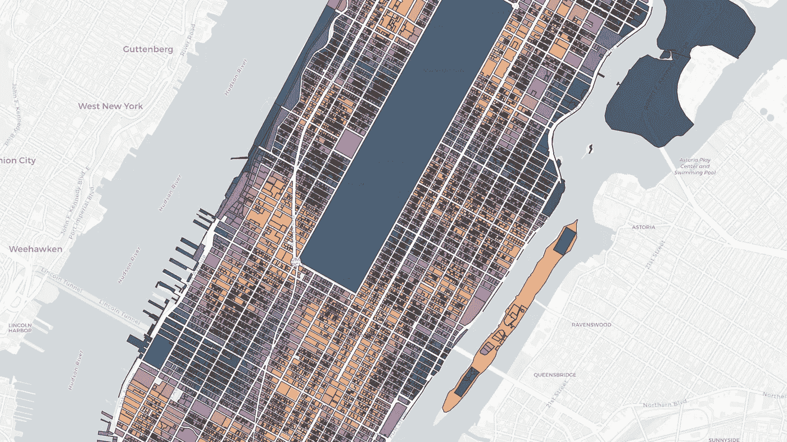
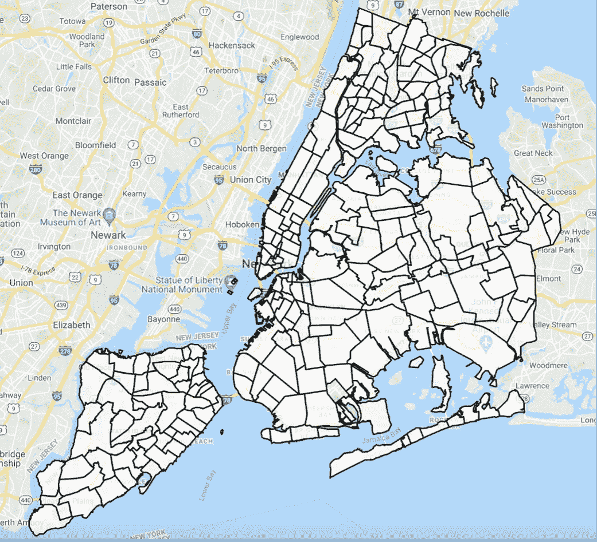
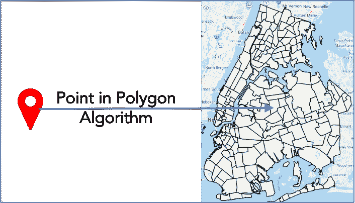
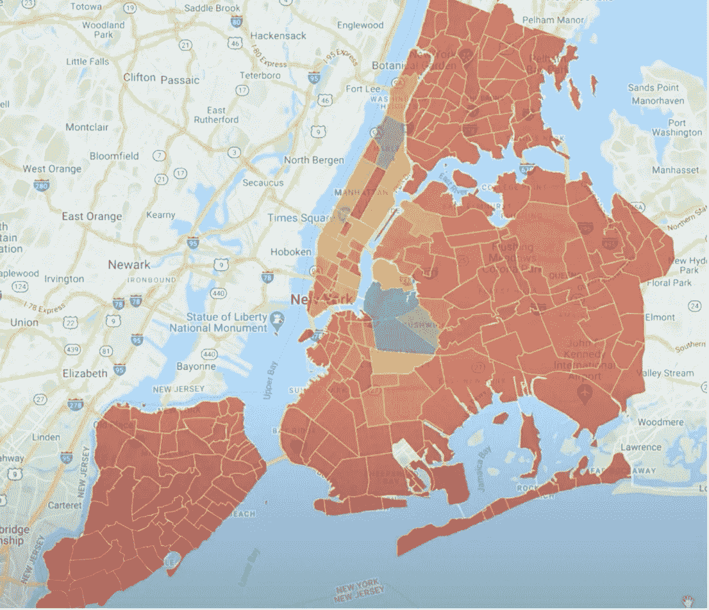
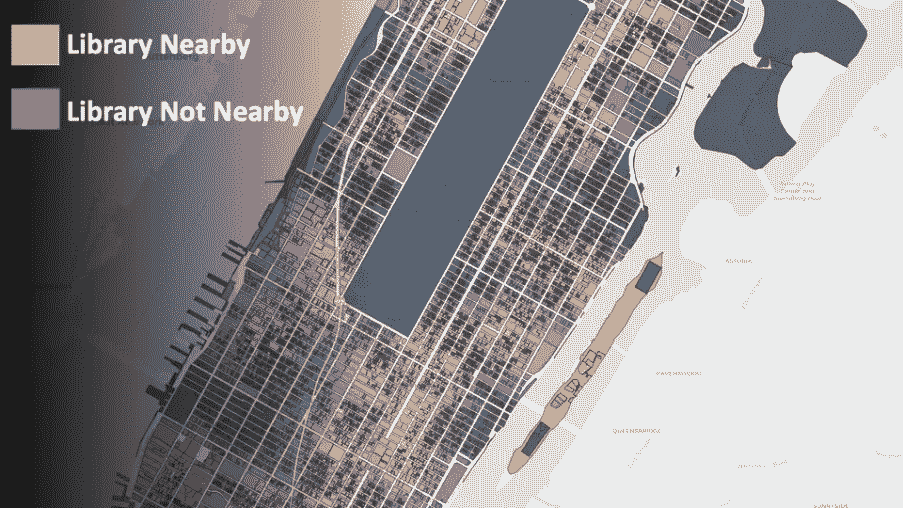
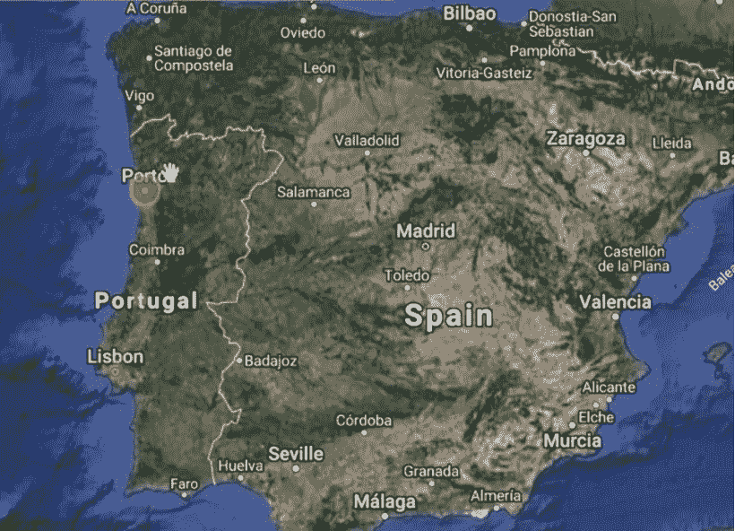
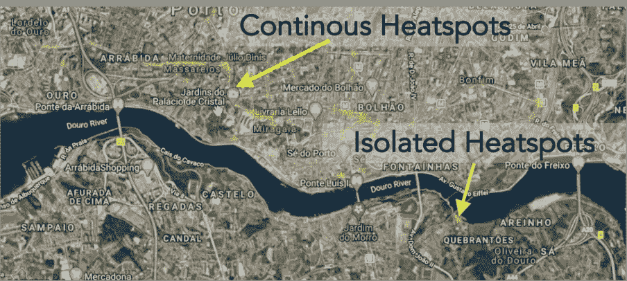
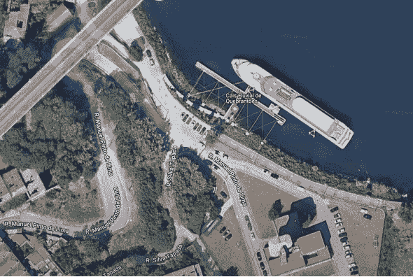
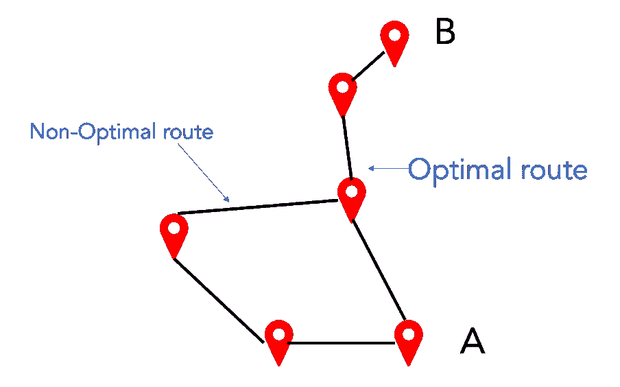
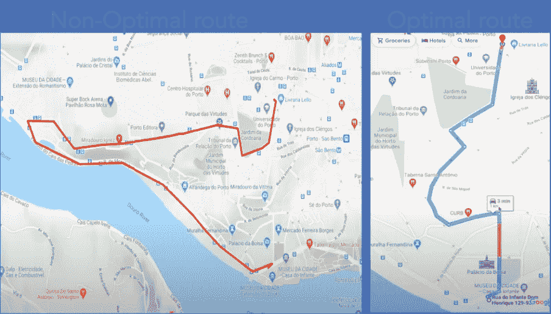

# 每个数据科学家都应该知道的位置分析用例

> 原文：<https://towardsdatascience.com/location-analytics-use-cases-that-every-data-scientist-should-know-740b708a2504>

## 使用位置分析的强大方法

位置分析(图片由作者使用谷歌地图和位置分析)

据估计，当今世界 80%的数据都包含位置信息。我们今天的大多数活动，比如拍照、带着智能手表跑步、乘坐出租车旅行，都会产生位置数据。

在这个故事中，您将看到如何使用位置分析将这些数据转化为非常有趣且有利可图的用例。

# 地理密度分析

位置分析可用于分析特定地理区域的密集程度。让我举例说明密度分析来分析纽约的 Airbnb 地点。

纽约大约有 5 万个 Airbnb 地点。这些数据在 Airbnb 网站上是公开数据。该数据包含主机详细信息以及由纬度和经度定义的位置。可以进行密度分析来找出 Airbnb 位置数量最多的纽约地区。

进行密度分析需要地理区域的多边形定义。纽约地区(也称为邻域)的面定义作为开放数据提供。纽约街区的所有多边形定义都可以如下图所示进行绘制。

纽约街区的多边形定义(图片由作者使用谷歌地图和位置分析)

下一步是使用面中点算法将每个位置分配给面。

多边形中的点算法(图片由作者提供)

多边形中点算法的输出将给出每个多边形中 Airbnb 位置的数量。然后，我们可以利用这些信息，通过地理地图上的热图进行密度分析。

密度分析(图片由作者使用谷歌地图和位置分析)

所用技术概述

*   位置分析:多边形中的点算法
*   Javascript:谷歌地图 API

# 邻近分析

邻近分析对于分析不同位置之间的距离非常有用。这对于设施规划用例非常有用。

假设我们想在曼哈顿建立一个新的图书馆。曼哈顿城被分成许多块。问题是我们应该把图书馆建在哪个地段？这就是邻近分析可以发挥作用的地方。

图书馆的理想位置是附近没有图书馆的地方。邻近分析算法有助于计算任何批次到最近库的距离。这是近似分析的结果。

邻近分析(图片由作者提供)

所有的拍品都有从黄色到紫色的颜色。黄色表示附近有图书馆，紫色表示离任何现有的图书馆都很远。

紫色区域是服务水平较低的区域，可能是建立图书馆的好地方。

邻近分析使用**球树算法**，这对于查找不同位置之间的距离非常有用。该算法本质上将在所有批次和具有库的批次之间进行最近邻搜索。

所用技术概述

*   位置分析:多边形中的点算法，球树算法
*   Javascript:谷歌地图 API

# 路线分析

路径分析是位置分析的另一个重要部分。它有助于分析路线或轨迹。让我用滑行轨迹分析的例子来说明这一点。

本例中的数据来自安装在 Porto taxi 上的 GPS 跟踪设备，该设备每 15 秒记录一次出租车的位置。这是来自出租车的位置数据热图。正如我们所看到的，大部分的滑行轨迹都在波尔图，但你也有一些从波尔图到里斯本的长途滑行轨迹。

路线分析(图片由作者使用谷歌地图和位置分析)

我们还可以分析街道层面的数据。这有助于我们识别连续热点和孤立热点。

连续和孤立的热图分析(图片由作者使用谷歌地图和位置分析)

连续热点是针对出租车通常走的路线。需要通过放大地图来进一步分析孤立的热点。

孤立热点分析(图片由作者使用谷歌地图和位置分析)

我们看到孤立的热点是在一个豪华游艇停泊处附近。这意味着出租车可能在这里等着上下车。因此，正如我们所知，出租车司机花费时间只是等待，这将是一个安装电动汽车充电器的好地方。这将有助于普及电动汽车的意识，并为电动出租车车主提供便利。因此，对于许多用例来说，结合位置数据及其周围环境是一种非常强大的方法。

所用技术概述

*   位置分析:多边形中的点算法
*   Javascript:谷歌地图 API

# 路线优化

位置分析的一个重要用途是路线优化。数据科学算法可以帮助找到两地之间的最佳路线。

寻找两点之间的最佳路线(图片由作者提供)

我们可以将这样的算法应用于滑行轨迹数据。这是路线优化的结果，显示了波尔图的两个地方——Museu de Cidade 和 Livrana Lello 之间的最佳路线和非最佳路线。

路线优化(图片由作者使用谷歌地图和位置分析)

寻找最佳路线是位置分析和图形分析的混合。位置是节点，节点之间的路由是边。有了节点和边，人们可以构建一个图，并使用各种图或网络算法。

用于路径分析的一种有用的图或网络算法是**最短路径算法。**

所用技术概述

*   位置分析:多边形中的点算法
*   图形或网络分析:最短路径算法
*   Javascript:谷歌地图 API

# 结论

位置数据无处不在，使用分析的力量将这一强大的数据资产转化为强大的用例非常重要。

# 媒体订阅和推荐链接

请 [**订阅**](https://pranay-dave9.medium.com/subscribe) 每当我发布一个新的故事时，请保持通知。

您也可以通过我的 [**推荐链接**](https://pranay-dave9.medium.com/membership) 加入 Medium

 [## 加入我的介绍链接-普拉内戴夫媒体

### 作为一个媒体会员，你的会员费的一部分会给你阅读的作家，你可以完全接触到每一个故事…

pranay-dave9.medium.com](https://pranay-dave9.medium.com/membership) 

# 额外资源

# 网站(全球资讯网的主机站)

你可以访问我的网站进行零编码分析。[**https://experiencedatascience.com**](https://experiencedatascience.com/)

# Youtube 频道

这是我的 YouTube 频道
[https://www.youtube.com/c/DataScienceDemonstrated](https://www.youtube.com/c/DataScienceDemonstrated)的链接

# 数据源引用

**Airbnb 数据—开放数据:**

数据集可用于研究目的

 [## 纽约市 Airbnb 开放数据

### 美国纽约州纽约市 Airbnb 房源和指标(2019 年)

www.kaggle.com](https://www.kaggle.com/dgomonov/new-york-city-airbnb-open-data) 

**波尔图出租车数据**

数据集可用于研究目的

[https://archive . ics . UCI . edu/ml/datasets/Taxi+服务+轨迹+-+预测+挑战，+ECML+PKDD+2015](https://archive.ics.uci.edu/ml/datasets/Taxi+Service+Trajectory+-+Prediction+Challenge,+ECML+PKDD+2015)

莫雷拉-马蒂亚斯，l .、伽马，j .、费雷拉，m .、门德斯-莫雷拉，j .、达马斯，“利用流数据预测出租车-乘客需求”。摘自:IEEE 智能交通系统汇刊，第 14 卷，第 3 期，第 1393–1402 页，2013 年 9 月