# 对数正态分布-一个简单的解释

> 原文：<https://towardsdatascience.com/log-normal-distribution-a-simple-explanation-7605864fb67c>

## 如何计算μ & σ、众数、均值、中值和方差

# 关于

我们将简要介绍对数正态分布的定义，然后根据简单数据计算分布的参数μ和σ。然后我们将看看如何从这个概率分布中计算平均值、众数、中位数和方差。

# 非正式定义

对数正态分布是向右倾斜的连续概率分布，这意味着它有一个向右的长尾。它用于模拟各种自然现象，如收入分配、象棋比赛的长度或修复可维护系统的时间等。

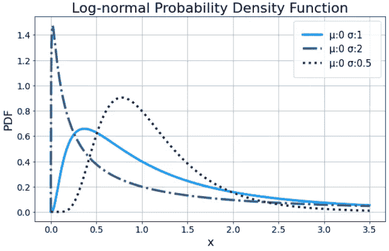

对数正态概率密度函数|作者图片

对数正态的概率密度函数由两个参数 **μ** 和 **σ** 定义，其中 x > 0:

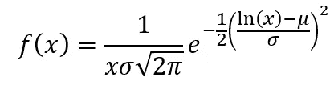

μ是位置参数，σ是分布的[比例参数](https://en.wikipedia.org/wiki/Scale_parameter)。*此处谨慎！*这两个参数不应被误认为更常见的正态分布的平均值或标准差。当对数正态数据使用对数进行转换时，μ可视为平均值*(转换后的数据)*，σ可视为标准差*(转换后的数据)*。但是如果没有这些变换 **μ** 和 **σ** 这里只是定义对数正态的两个参数，而不是均值或标准差！好了，现在我们从“*让我们保持简单”*到“*信息有点多”*。让我们回头再看一下刚才提到的对数正态分布和正态分布之间的关系。

“对数正态”分布的名称表明它与对数以及正态分布有关。怎么会？假设您的数据符合对数正态分布。如果对所有数据点取对数，新转换的点将符合正态分布。这仅仅意味着当你取对数正态数据的对数时，你会得到一个正态分布。见下图。

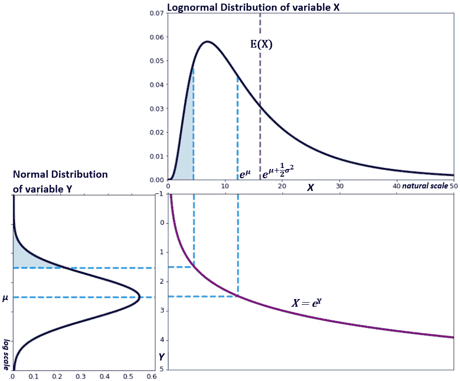

正态函数和对数正态函数之间的关系|图片由作者提供，灵感来自维基百科的[图](https://en.wikipedia.org/wiki/Log-normal_distribution#Generation_and_parameters)

对数正态分布的数据点由 *X* 变量给出。当我们对数变换那个 *X* 变量 *(Y=ln(X))* 时，我们得到一个正态分布的 *Y* 变量。

我们可以颠倒这种思维，转而看 *Y* 。如果 *Y* 具有正态分布，我们取 *Y* *(X=exp(Y))* 的指数，那么我们回到我们的 *X* 变量，它具有对数正态分布。在分析对数正态分布的重要属性时，记住这一形象有所帮助:

> “分析对数正态分布数据的最有效方法是将基于正态分布的众所周知的方法应用于对数转换后的数据，然后在适当的情况下对结果进行反向转换。” [Lognormal wiki](https://en.wikipedia.org/wiki/Log-normal_distribution#Statistics)

# 根据数据估计μ和σ

我们可以使用最大似然估计(MLE)来估计对数正态参数μ和σ。这是一种用于近似分布参数的流行方法，因为它找到了使我们的假设概率分布'*最有可能'*'用于我们的观察数据的参数。

如果你想更详细地了解 MLE 是如何工作的， [StatQuest](https://www.youtube.com/watch?v=Dn6b9fCIUpM&t=1016s) 以一种有趣直观的方式解释了这种方法，并且还导出了 ***正态分布*** 的估计量。

正态分布的最大似然估计量为:

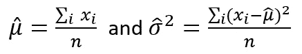

然而，我们需要对数正态分布的最大似然估计μ和σ，它们是:

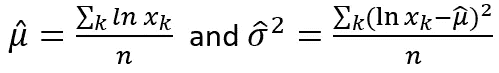

这些公式几乎相同。我们可以看到，我们可以使用与正态分布相同的方法，首先用对数变换我们的数据。如果你对我们如何得到对数正态估计量感到好奇，这里有一个到 [**推导**](https://medium.com/@majapavlo/formulas-proofs-for-the-lognormal-distribution-16bc2698644e) 的链接。

## **简单的例子在哪里？！**

让我们来看看遵循对数正态分布的 5 个收入值。我们的虚拟人物 1 赚 20k，人物 2 赚 22k，以此类推:

我们现在可以用上面的逻辑**估算μ** 。首先，我们取每个收入数据点的对数，然后计算 5 个转换数据点的平均值，如下所示:

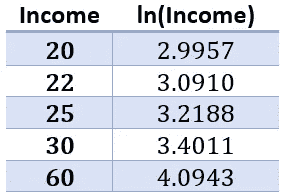

表 1 |作者图片

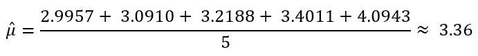

这为我们的位置参数μ给出了值 **3.36** 。

然后，我们可以使用估计的μ to **通过以下公式近似我们的σ** 。

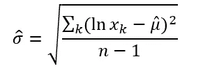

我们不用计算σ，而是用上面公式的平方根来近似σ。该公式还使用 n-1 而不是 n 来得到一个偏差较小的估计量。如果你想更多地了解这一变化，请看一看[校正样本方差](https://www.statlect.com/glossary/adjusted-sample-variance)(或者也可以看一看[贝塞尔校正](https://en.wikipedia.org/wiki/Bessel%27s_correction))。

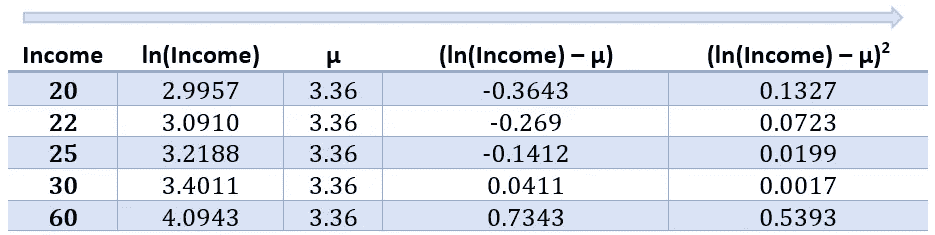

表 2 |作者图片

与上面类似，第一步是取每个个人收入数据点的对数。然后，我们从每个经过对数变换的数据点中减去估计的μ，然后对每个结果求平方。见上表。然后将这些值插入上面的公式中:

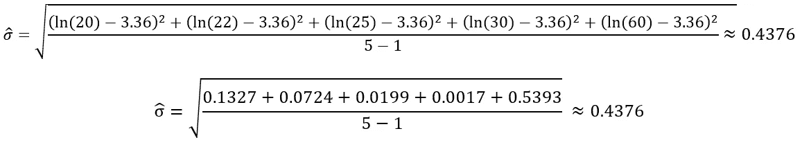

这给了我们**比例参数σ** 的值 **0.4376** 。

*注意:这些计算只是如何获得这些值的一个例子。你需要更多的值才能有统计学意义。*

# 计算中值、平均值、众数和方差

一旦我们有了参数μ和σ，提取对数正态分布的一些重要性质就很简单了。请参见下表和下图中的关键属性、它们的公式以及我们的示例数据的计算。

表 3 |作者图片

我们如何得出上表中的不同公式？

*   **中位数**是通过取[对数正态累积分布函数](https://en.wikipedia.org/wiki/Log-normal_distribution#Cumulative_distribution_function)，将其设置为 0.5，然后求解此方程[(见此处)**得出的。**](https://medium.com/@majapavlo/formulas-proofs-for-the-lognormal-distribution-16bc2698644e)
*   **模式**代表分布的全局最大值，因此可以通过对对数正态概率密度函数求导并求解 0 [(见此处)](https://medium.com/@majapavlo/formulas-proofs-for-the-lognormal-distribution-16bc2698644e)来导出。
*   对数正态分布的**均值**(也称为期望值)是所有可能值[(见此处)](https://www.statlect.com/probability-distributions/log-normal-distribution)的概率加权平均值。
*   对数正态分布的**方差**是平均值[(见此处)](https://www.statlect.com/probability-distributions/log-normal-distribution)的方差平方的概率加权平均值。

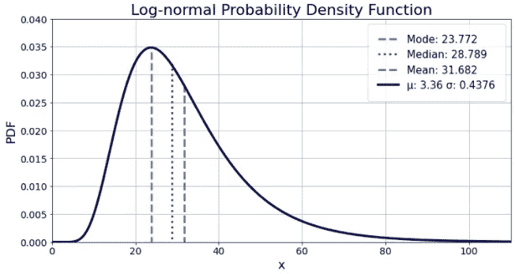

简单数据的对数正态概率密度函数示例|作者图片

参考

[1]维基百科，[对数正态分布](https://en.wikipedia.org/wiki/Log-normal_distribution) (2022)，*2022-02-06 检索*

[2] M .塔博加，[《对数正态分布》，概率论与数理统计讲座](https://www.statlect.com/probability-distributions/log-normal-distribution) (2021)，Kindle 直接出版。在线附录。

[3] A. Katz，C. Williams 和 J. Khim，[精彩:对数正态分布](https://brilliant.org/wiki/log-normal-distribution/) (2022)，*检索于 2022 年 2 月 6 日*

[4] J. Soch，K. Petrykowski，T. Faulkenberry，[统计证明之书](https://statproofbook.github.io/I/ToC) (2021)，github.io

[5]维基百科，[贝塞尔的更正](https://en.wikipedia.org/wiki/Bessel%27s_correction) (2022)，*检索于 2022–02–06*