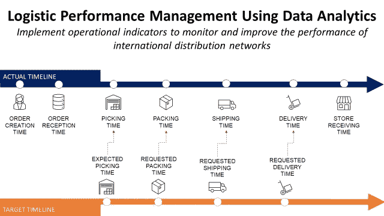
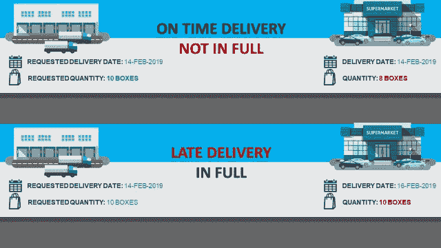
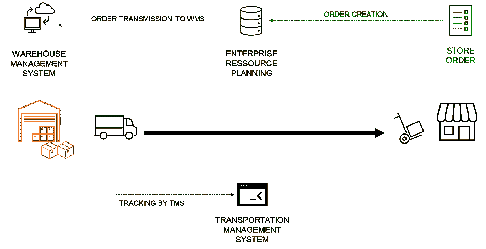
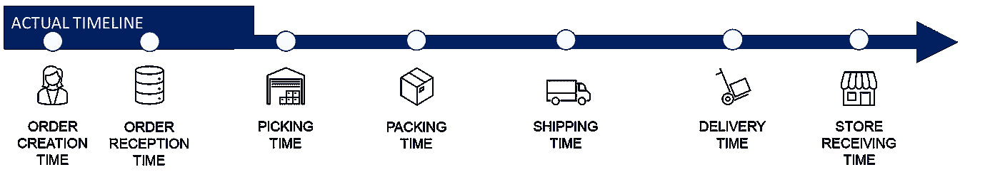
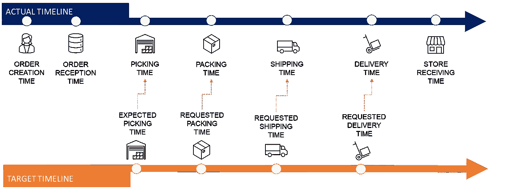
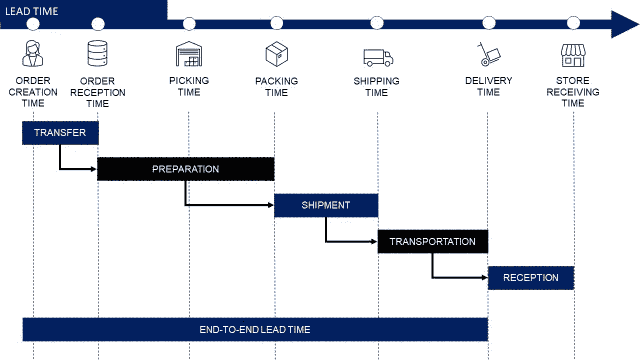
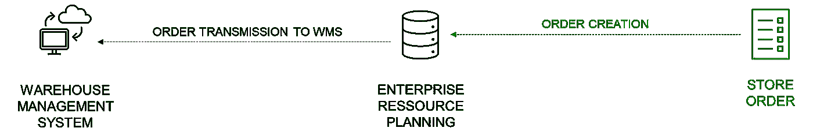
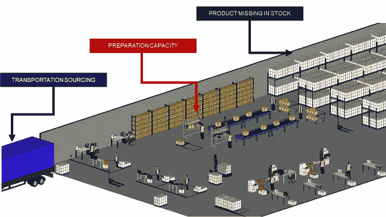
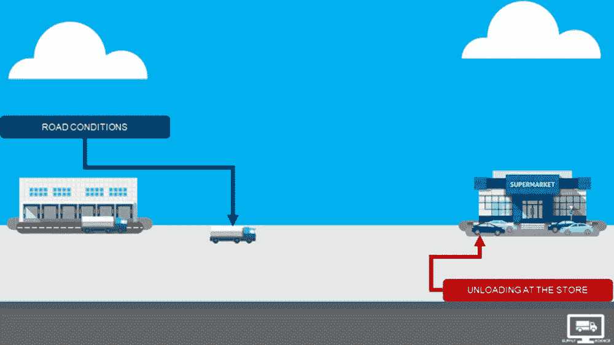

# 使用数据分析的物流绩效管理

> 原文：<https://towardsdatascience.com/logistic-performance-management-using-data-analytics-82b2da978e5f>

## 实施运营指标，以监测和改善国际分销网络的绩效



(图片由作者提供)

**目标**
了解如何使用数据分析来衡量和改善您的物流网络的端到端性能。

**简介** 供应链是一个由**流程**和**库存点**组成的面向目标的网络，用于向客户交付商品和服务**。**

您的网络性能可以用一句话来概括

> 您是否完全按时交付您的最终客户？

在这个简单的问题背后，有一套复杂的 KPI 需要**监控**和**了解**你的**表现**。

在本文中，我们将尝试理解**最低指标集**和**试验**复杂物流作业**所需的方法学**。

💌新文章直接免费放入你的收件箱:[时事通讯](https://www.samirsaci.com/#/portal/signup)

```
**SUMMARY**
**I. Example of a Simple Supply Chain Network** Production and delivery of garments for a fashion retailer
**II. End-to-End Lead Times** Lead time between the order creation and the store delivery
**1\. Information flow** Each step of the process is tracked by different systems
**2\. End-to-End Visibility** Record time stamps from order creation to shipment delivery
**3\. KPIs and Lead times** Actual versustargets lead times **IV. Conclusion
1\. Root Cause Analysis** What can go wrong? **2\. Next steps** Root cause analysis and improve the performance
```

如果你喜欢看，可以看看这篇文章的视频版本

# 一.简单供应链网络的例子

## 方案

你是一家在世界各地都有商店的国际服装集团的后勤经理。

该公司在亚洲的工厂生产服装、包包和配饰。

**门店**从**本地仓库**发货，由**工厂**直接补货。

```
**💡** Our focus here will be on the distribution. The aim is to ensure on time delivery assuming that we have the stock on hand in the warehouses.
```

## 库存补充

配送计划人员正在管理商店的库存，以满足需求。


供应链网络—(图片由作者提供)

特定参考的库存水平达到最低水平时

*   配送计划员在 ERP 中创建一个**补货订单**，其中包含每件商品的**数量**和**要求的交付日期**
*   订单被传送到仓库管理系统
*   仓库运营团队 [**准备订单**](https://www.youtube.com/watch?v=XejgbF2m_8g) 出货
*   运输团队在仓库组织**提货**
*   发货是在门店 [**发货**](https://www.youtube.com/watch?v=PYkN24PMKd8)****收货****

```
**💡** In our example, stores replenishment are managed by a team of distribution planners. But it can be also completely automated using ERP or inventory management systems.
```

**如果你想了解更多的库存管理政策，请看下面的文章**

**[](https://www.samirsaci.com/inventory-management-for-retail-periodic-review-policy/) [## 零售库存管理-定期审查政策

### 供应链优化实施基于定期审查政策的库存管理规则，以减少库存数量

www.samirsaci.com](https://www.samirsaci.com/inventory-management-for-retail-periodic-review-policy/) 

## **仓库补货**

同样的流程由**供应计划**团队在仓库层面完成，以确保订单准备的最低库存水平。

```
**💡** This part of the process **will be excluded** because it involves complex processes linked with the upstream flows from factories**.** We will focus only on the distribution to stores.
```

## 总体业绩:完全准时(OTIF)

整体流程绩效可以通过网络按时交付商店**和**正确数量**的物品(全部**)的能力来衡量。****

****

**完全准时—(图片由作者提供)**

**作为一名物流绩效经理，你的重点将是提高这一推动内部顾客(即商店)满意度的指标。**

```
**💡** For more information about the KPI **On Time In Ful**l have a look at this short explainer video in my youtube channel: [**Link to Youtube**](https://www.youtube.com/watch?v=qhLqu6M7lcA&t=1s)
```

**(作者的 Youtube 视频)—供应科学**

## **端到端分析**

**然而，这个指标本身并不能让你全面了解供应链中发生了什么。**

**因此，我们需要使用数据分析对其进行分解，并了解影响整体性能的因素。**** ****[](http://samirsaci.com) [## 萨米尔·萨奇

### 数据科学博客，专注于仓储，运输，数据可视化和机器人流程自动化…

samirsaci.com](http://samirsaci.com)**** 

# ****二。端到端配送流程****

****让我们来分解订单创建和发货之间的不同步骤。****

## ****1.信息流****

****在[供应链分析](https://www.youtube.com/watch?v=3d7C4pShykI)中，一切都从理解信息流开始。****

****通过连接到正确的系统，你将提取和处理正确的信息。****

********

****信息系统—(图片由作者提供)****

******场景:商店补货** 在几家商店中，一些参考的库存水平低于最低安全水平。****

1.  ****配送计划员正在 ERP 中**创建一个补货订单**，其中包含数量和要求的交付日期****
2.  ****订单在预计提货日期之前被**传送到** WMS****
3.  ****仓库运营团队**准备并包装**订单****
4.  ****仓库分配一辆卡车用于**提货******
5.  ****装运信息被传送到 TMS 进行跟踪****
6.  ****货物被送到商店****
7.  ****商店团队在 ERP 中接收物品****

```
****💡** In a perfect world, we will assume that these systems are perfectly connected using API/EDI to ensure a continuous traceability of the flow.** 
```

## ****2.端到端可见性****

****连接不同的系统后，您可以详细了解补货订单创建和商店交付之间的每个步骤。****

********

****端到端时间戳—(图片由作者提供)****

*   ******订单接收时间**:订单在 WMS**接收**并准备入库时的时间戳****
*   ******仓库操作** : **拣货**，**装箱**和**出货**由 WMS 跟踪****
*   ******运输**:订单从**出货**到**交货**的跟踪****
*   ******门店收货**:ERP 中**门店团队**在**收货**时的时间戳****

****在订单创建过程中，计划员会添加一个**请求交付日期**，该日期可用于计算每个流程的目标时间。****

********

****端到端时间戳与目标-(图片由作者提供)****

****因此，我们可以在每一步了解运营是否落后于计划，并找到潜在的瓶颈。****

```
****💡** Time stamps are estimated considering the requested delivery date. We use the target leadtimes of each step from creation to delivery to estimate the time stamps.**
```

## ****3.交付时间****

****从运营的角度来看，只关注交付时的 OTIF 是没有意义的。****

********

****交付周期定义—(图片由作者提供)****

****通过子流程进行的分段是强制性的，以监控物流网络每个分支的性能:****

*   ****订单转移受到**基础设施&软件**的影响****
*   ****订单准备与仓库操作的 [**能力和**](https://www.youtube.com/watch?v=KR_ziEiPcDk) 生产率相联系****
*   ****包装结束和装运时间之间的提货计划提前期****
*   ****[**运输**](https://www.youtube.com/watch?v=PYkN24PMKd8) 从仓库到商店****

```
****💡** The added value at this stage is to provide detailed visibility of the performance by process. Your role is to support operational teams to improve their performance by implementing a continuous improvement culture backed by data.**
```

****[](http://samirsaci.com) [## 萨米尔·萨奇

### 数据科学博客，专注于仓储，运输，数据可视化和机器人流程自动化…

samirsaci.com](http://samirsaci.com)**** 

# ****四。结论****

*****关注我，了解更多与供应链数据科学相关的见解。*****

****既然我们对流程的每一步都了如指掌，那么我们可以做些什么来提高整体绩效呢？****

## ****1.根本原因分析****

****为了提高整体性能，您需要找出延迟交付的根本原因。****

> ******流程中会出什么问题？******

******IT 基础设施&软件** It 始于系统，您可能会因容量问题或系统故障而面临一些延迟。如果 WMS 没有收到订单，您的仓库团队将无法继续准备和装运。****

********

****IT 基础设施—(图片由作者提供)****

```
****💡** The human factor can also impact the performance with: data entry errors, delays on some key tasks or just misalignements between the teams.**
```

******仓库操作** 在仓库中，提前期会受到****

*   ******缺货**:产品缺失导致延期交货和取消****
*   ****[**能力**](https://www.youtube.com/watch?v=KR_ziEiPcDk) :资源短缺吸收的工作量(人、设备)****
*   ****[**运输来源**](https://www.youtube.com/watch?v=GAvo3BaCvso) :您无法找到卡车来提取打包的订单****

********

****仓库问题—(图片由作者提供)****

******运输** 卡车离开仓库后，提前期会受到以下因素的影响****

*   ****多式联运中转过程中的路况或延误****
*   ****由于可用性限制而推迟交货:例如，接收货物的商店员工短缺，商店关闭，…****

********

****运输根本原因—(图片由作者提供)****

****这些都是一般的例子，必须适应你的具体情况。****

## ****2.后续步骤****

****达到这一步已经具有挑战性。事实上，找到所有的根本原因需要大量的协调、分析和系统映射工作。****

****然后，物流团队需要制定**缓解计划**以确保这些问题不会在未来发生。****

****因此，您可以围绕这一报告工具构建一个**绩效管理循环流程**,包括:****

*   ****每周或每月的数据分析****
*   ****持续改进计划的实施和跟进****

****数据分析工具不会提供解决方案，但它们可以帮助运营团队找到流程中的瓶颈和故障。****

## ******3。设计供应链数字解决方案******

****数字孪生是物理对象或系统的数字复制品。****

****供应链数字模型是一种计算机模型，代表供应链中涉及的各种组件和流程，如仓库、运输网络和生产设施。****

********

****使用 Python 的数字孪生示例—(图片由作者提供)****

****在您找到延迟和事件的根本原因后，持续改进团队可能会设计和实施解决方案或缓解计划。****

****数字孪生可以用来模拟这些解决方案对整体性能的影响****

1.  ****构建一个 M0 模型，用实际的运营问题复制当前的运营****
2.  ****在您的模型中模拟这些缓解计划(增加仓库容量、减少运输提前期等)****
3.  ****估计对延迟交货百分比的影响****

****欲知详情，****

****[](https://www.samirsaci.com/what-is-a-supply-chain-digital-twin/) [## 什么是供应链数字孪生？

### 供应链优化使用 python 创建一个代表供应链网络的模型，以优化您的…

www.samirsaci.com](https://www.samirsaci.com/what-is-a-supply-chain-digital-twin/) 

# 关于我

让我们连接上 [Linkedin](https://www.linkedin.com/in/samir-saci/) 和 [Twitter](https://twitter.com/Samir_Saci_) ，我是一名供应链工程师，正在使用数据分析来改善物流运作和降低成本。

如果你对数据分析和供应链感兴趣，可以看看我的网站

[](https://samirsaci.com) [## Samir Saci |数据科学与生产力

### 专注于数据科学、个人生产力、自动化、运筹学和可持续发展的技术博客

samirsaci.com](https://samirsaci.com)****