# 逻辑回归和特征尺度集成

> 原文：<https://towardsdatascience.com/logistic-regression-and-the-feature-scaling-ensemble-e78a56fc6c1>

## 线性分类的一个新的优化凹槽

乔希·索伦森在 [Unsplash](https://unsplash.com/s/photos/ensemble-music?utm_source=unsplash&utm_medium=referral&utm_content=creditCopyText) 上的照片

***首席研究员:戴夫·古根海姆/撰稿人:乌特萨维·瓦赫哈尼***

**向下跳动**

这项工作是我们对特征缩放的早期研究的延续(见这里:[特征缩放的秘密最终被解开|由 Dave Guggenheim |走向数据科学](/the-mystery-of-feature-scaling-is-finally-solved-29a7bb58efc2))。在这个项目中，我们将使用岭正则化逻辑回归在 60 个数据集上检验 15 种不同缩放方法的效果。

我们将展示正则化的强大功能，许多数据集的准确性不受要素比例选择的影响。但是，与原始工作一样，特征缩放集合提供了显著的改进，在这种情况下，尤其是对于多类目标。

**型号定义**

我们选择 L2(岭或吉洪诺夫-米勒)正则化逻辑回归，以满足规模数据的要求。它增加了一个惩罚，该惩罚是系数的平方值之和。这在处理多重共线性时特别有用，并在惩罚模型中不太重要的变量时考虑变量的重要性。

本研究中的所有模型都是使用 sci-kit 学习库中的 LogisticRegressionCV 算法构建的。所有模型也用分层抽样进行了 10 倍交叉验证。每个二元分类模型使用以下超参数运行:

1)惩罚= 'l2 '

2) cs = 100

3)求解器= 'liblinear '

4) class_weight = 'balanced '

5) cv = 10

6) max_iter = 5000

7)得分=“准确性”

8)随机状态= 1

多类分类模型(在结果表中用星号表示)以这种方式进行调整:

1)惩罚= 'l2 '

2) cs = 100

3)求解器= 'lbfgs '

4) class_weight = 'balanced '

5) cv = 10

6) max_iter = 20000

7)得分=“准确性”

8)随机状态= 1

9)多类= '多项'

这里的 L2 惩罚因子解决了使用训练数据和测试数据时预测模型的低效问题。由于具有较高数量预测值的模型面临过度拟合问题，使用 L2 正则化的岭回归可以利用平方系数惩罚来防止它。

所有其他超参数保留各自的默认值。所有模型都是使用这些缩放算法(sci-kit 学习包在括号中命名)用特征缩放数据构建的:

a.标准化(标准缩放器)

b.L2 归一化(归一化器；norm='l2 ')

c.鲁棒(RobustScalerquantile_range=(25.0，75.0)，with_centering=True，with_scaling=True)

d.规范化(MinMaxScalerfeature_range =多个值(见下文))

d1。特征范围= (-1，1)

d2。特征范围= (0，1)

d3。特征范围= (0，2)

d4。特征范围= (0，3)

d5。feature_range = (0，4)

d6。feature_range = (0，5)

d7。特征范围= (0，6)

d8。feature_range = (0，7)

d9。feature_range = (0，8)

d10。feature_range = (0，9)

e.具有 StackingClassifier 的集成:StandardScaler + Norm(0，9)[有关更多信息，请参见特征缩放集成]

f.具有堆叠分类器的集成:标准缩放器+鲁棒缩放器[参见特征缩放集成了解更多信息]

除了系综之外，使用“fit_transform”将缩放方法应用于训练预测器，然后使用“transform”将缩放方法应用于测试预测器，如许多来源所指定的(例如，Géron，2019，第。66;穆勒和圭多，2016 年，第。139;Shmueli，Bruce 等人，2019 年，第。33;是否应该对机器学习的训练数据和测试数据都进行缩放？— Quora )并由 scikit learn 为所有特征缩放算法提供。然而，由于它们的设计，集成被迫对原始测试数据进行预测，因为顺序链接缩放算法仅导致最终阶段作为结果出现，并且这甚至没有解决通过建模将两个并行缩放路径组合成一个的复制条件。

在每个预测值的样本少于 12 个的情况下，我们将测试分区限制为不少于 10%的总体(Shmueli，Bruce 等人，2019，第。29).如果有足够的样本达到合理的预测精度(由样本复杂性泛化误差确定),我们使用统一的 50%测试分区大小。在这两个界限之间，我们调整了测试规模，以限制泛化测试误差，与训练样本规模进行权衡(Abu-Mostafa，Magdon-Ismail，& Lin，2012，第。57).对于多类数据，如果目标变量中每个分类级别的样本少于 12 个，则在建模前会删除这些级别。

任何缺失值都使用 MissForest 算法进行估算，因为该算法在多重共线性、异常值和噪声面前具有很强的鲁棒性。分类预测因子是使用 pandas get_dummies 函数和丢弃的子类型(drop_first=True)进行一次性编码的。低信息变量(如身份证号码等。)在训练/测试分区之前被丢弃。

构建这些模型的目的是比较特征缩放算法，而不是调整模型以获得最佳结果。出于这个原因，我们在模型中引入了尽可能多的默认值，为上述比较创造了一个平台。**所有的性能指标都是根据测试数据**的预测的总体准确度来计算的，并且该指标通过两个阈值来检验:1)作为概化测量的最佳性能的 3%以内，以及 2)作为预测准确度测量的最佳性能的 0.5%以内。这就是我们使用许多数据集的原因——因为方差及其固有的随机性是我们研究的一切的一部分。

**数据集**

本分析中使用的 60 个数据集如表 1 所示，具有广泛的预测器类型和类(二元和多元类)。大多数数据集可以在 UCI 索引(UCI 机器学习库:数据集)中找到。不在 UCI 索引中的数据集都是开源的，可以在 Kaggle:

波士顿住房:波士顿住房| KaggleHR 员工流失:员工流失| KaggleLending Club:Lending Club | ka ggle；电信客户流失:电信客户流失| Kaggle 丰田卡罗拉:丰田卡罗拉|卡格尔

38 个数据集是二项式的，22 个是多项式分类模型。所有模型都是根据所有数据集创建和检查的。表中列出的预测数是未编码的(分类的)和所有原始变量，包括排除前的非信息变量。

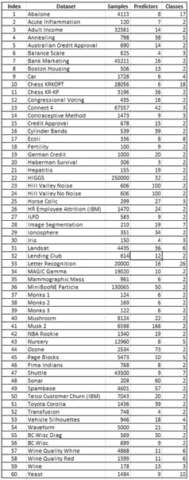

**表 1 数据集(图片由作者提供)**

**特征缩放失配探索**

我们之前的研究表明，对于预测模型，特征缩放算法的正确选择包括找到与学习模型的不匹配，以防止过度匹配。下面是定义对数损失成本函数的等式，其中添加了 L2 惩罚因子:

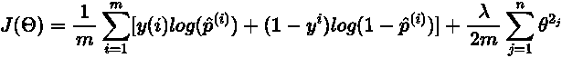

**图 1 对数损失成本函数(图片由作者提供)**

与基于距离的测量方法不同，对于基于距离的测量方法，归一化是合适的(通过保持相对间距)，而标准化是不合适的，正则化测井损失成本函数不容易确定。不管嵌入的 logit 函数和它在不匹配方面可能指示什么，增加的惩罚因子应该最小化关于模型性能的任何差异。

为了测试这种偏差控制条件，我们构建了相同的归一化模型，从 feature_range = (0，1)到 feature_range = (0，9)依次循环。每个阶段的训练和测试集精度被捕获并标绘，训练用蓝色，测试用橙色。

每个比较图的左侧面板显示了使用**非正则化**支持向量分类器将特征范围从零增加一个单位到九的效果。右图显示了相同的数据和模型选择参数，但使用了 **L2 正则化**逻辑回归模型。

当我们在不改变数据或模型的任何其他方面的情况下增加特征范围时，较低的偏差是非正则化学习模型的结果，而对正则化版本几乎没有影响。请注意，y 轴并不相同，应单独参考。请参考图 2–7，了解这种现象的示例。

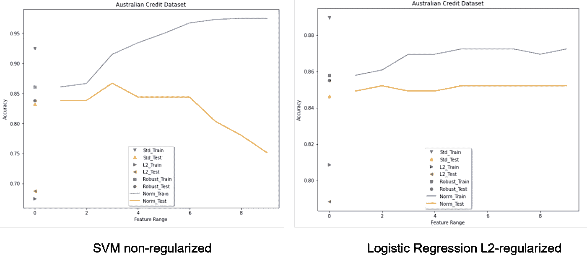

**图 2 澳洲信用二元模型对比(图片由作者提供)**

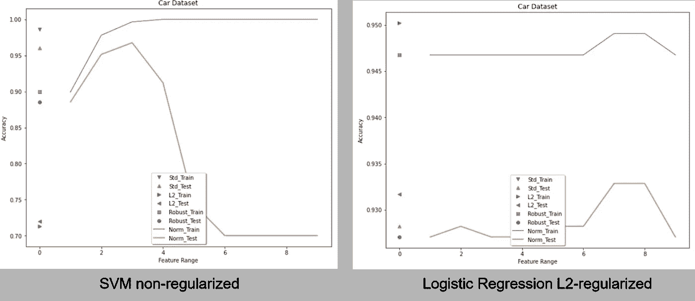

**图 3 汽车多类车型对比(图片由作者提供)**

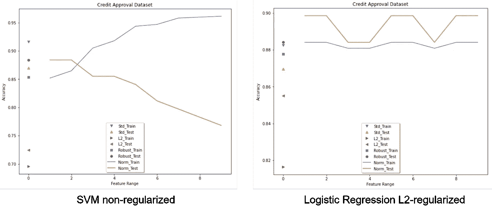

**图 4 信贷审批二元模型对比(图片由作者提供)**

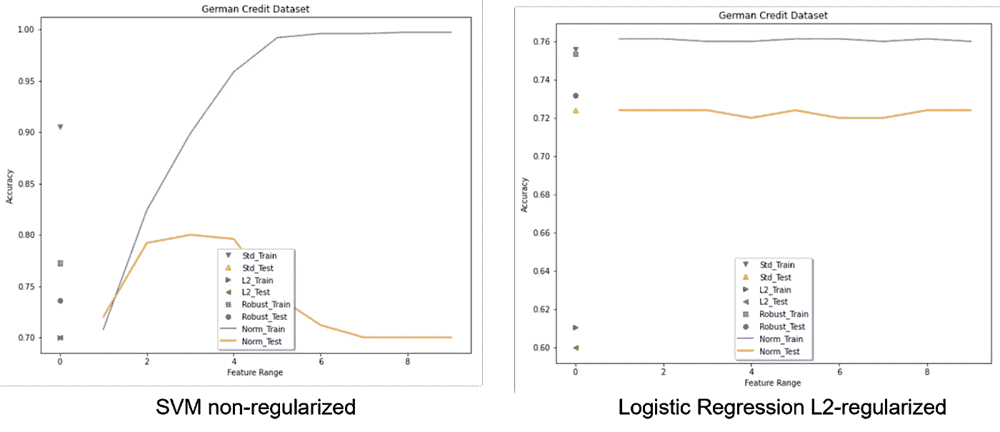

**图 5 德国信用二元模型对比(图片由作者提供)**

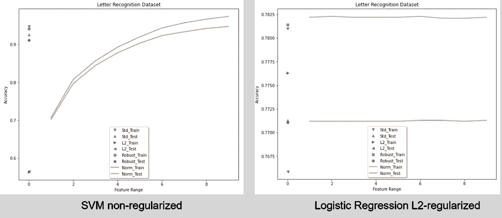

**图 6 字母识别多类模型对比(图片由作者提供)**

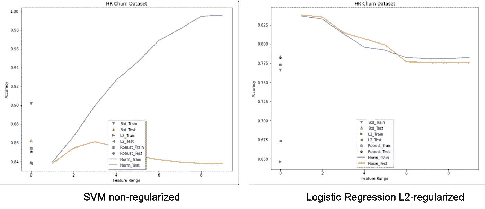

**图 7 人力资源流失(员工流失)二元模型对比(图片由作者提供)**

诚然，这两种不同的学习模型可能不会以相同的方式对归一化范围的扩展做出响应，但是不管怎样，正则化模型确实展示了一种偏差控制机制。

**特征缩放集合**

基于 13 个单一特征缩放模型生成的结果，这两个集合被构建为满足概括和预测性能结果(见图 8)。使用 scikit learn 中的 make_pipeline 函数构建缩放路径，用于创建三个估计量:1)标准化+L2 逻辑回归，2)范数(0，9)+L2 逻辑回归，以及 3)稳健缩放+L2 逻辑回归。投票分类器作为最后一级进行了测试，但由于性能不佳而被拒绝，因此对两个集成使用堆叠分类器作为最终估计器。除了对每个管道进行 10 重交叉验证之外，还对堆叠分类器进行了 10 重交叉验证。所有其他超参数被设置为其先前指定的值或默认值。

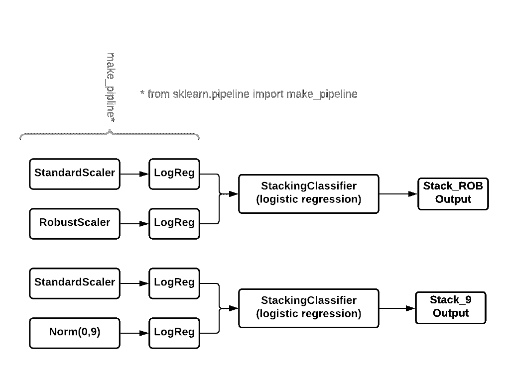

**图 8 特征缩放系综构造**

**初步结果**

有关 15 个特征缩放算法(13 个单独算法和 2 个集合算法)的综合性能的详细信息，请参考图 9。

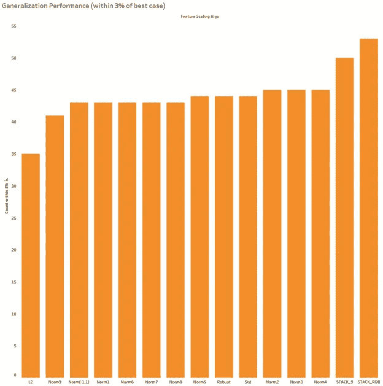

**图 9 概括表现(图片由作者提供)**

正如所料，单个特征缩放算法在**广义性能**方面几乎没有差异。在图 9 中，可以看到通过正则化实现的等式，因此，除了 L2 归一化，性能最低的 solo 算法(Norm(0，9) = 41)和性能最佳的 solo 算法(Norm(0，4) = 45)之间只有四个数据集的差异。STACK_ROB 特征缩放集成将最佳计数提高了另外 8 个数据集，达到 53 个，代表集成推广的 60 个数据集的 88%。

在**预测性能**的情况下，单独特征缩放算法之间存在较大差异。在图 10 中，可以看到跨数据集的更大范围的计数。

**图 10 预测性能(图片由作者提供)**

排除 L2 归一化，最低性能的 solo 算法和最佳 solo 算法之间的最大差异是 11 个数据集((StandardScaler = 21)和(Norm(0，5))= 32)，而不是由泛化度量表示的 4 个。STACK_ROB 特征缩放集成将最佳计数提高了另外 12 个数据集，达到 44 个，或者在所有 60 个数据集上比最佳 solo 算法提高了 20%。

这种不寻常的现象，即预测性能的提高，无法通过检查特征缩放组合的整体性能图来解释(见图 11)。相反，为了更好地理解，我们需要深入研究原始的比较数据。

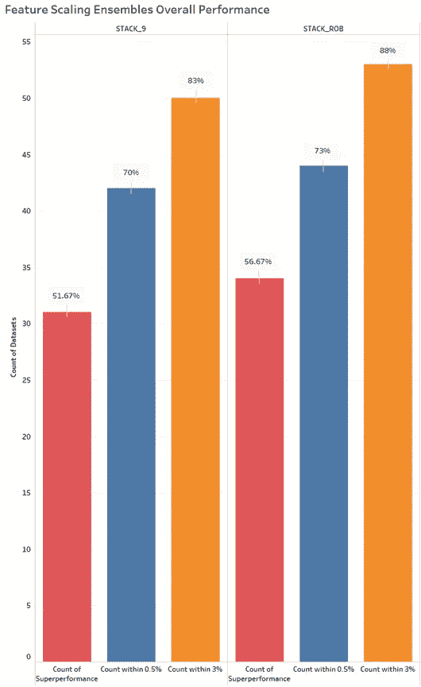

**图 11 特征缩放综合整体性能(图片由作者提供)**

*您所看到的是正确的——在这项研究中，特征缩放集成为超过一半的数据集提供了新的最佳准确性指标！*

**全部结果和新发现**

表 2 以多种方式进行颜色编码。首先，左边的列表示 60 个数据集，多类目标用黄色突出显示并在数据集名称后有一个星号来标识。接下来，彩色编码的单元格表示与最佳独奏方法的百分比差异，该方法是 100%点。为了清楚起见，颜色编码的单元格并不显示绝对差异，而是显示百分比差异。单元格中的绿色表示相对于最佳独奏方法实现了最佳情况下的性能，或者在最佳独奏精度的 0.5%以内。单元格中的黄色表示泛化性能，或在最佳独奏精度的 3%以内。如果数据集一直显示为绿色或黄色，则表明正则化的有效性，因为性能差异极小。单元格中的红色显示超出 3%阈值的性能，单元格中的数字显示它与最佳独奏方法的目标性能的差距，以百分比表示。最后，蓝色，超级性能者，以百分比显示高于和超过最佳 solo 算法的性能。

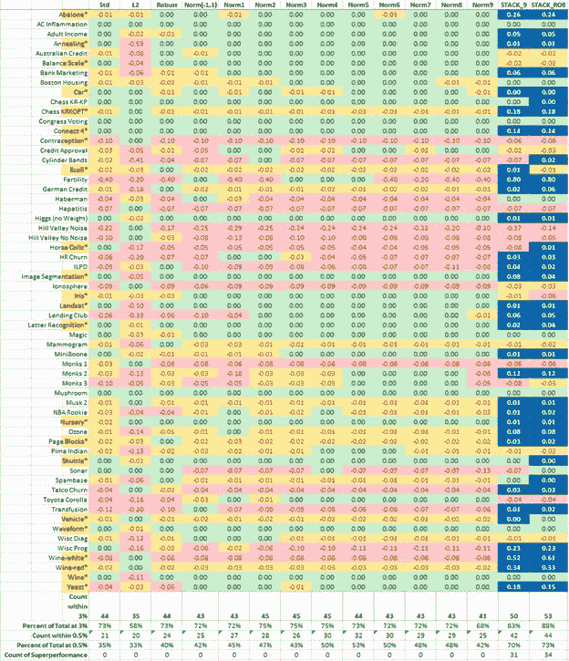

**表 2 完整对比结果(图片由作者提供)**

在回顾对比数据时，我们注意到一些有趣的事情——在多类目标变量上的正微分预测性能。

**二进制对多类性能**

在 38 个二进制分类数据集中，STACK_ROB 特征缩放集成对 33 个数据集的泛化性能和 26 个数据集的预测性能进行了评分(见表 3)。对于二元目标，这些结果代表 87%的概括和 68%的预测性能，或者这两个度量之间的 19 点差异。

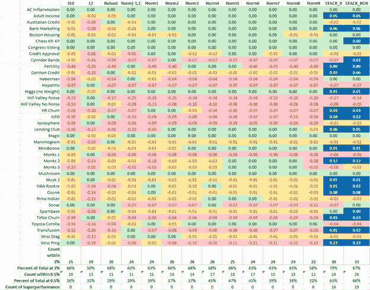

**表 3 二进制分类对比结果(图片由作者提供)**

在 22 个多类数据集中，特征缩放集成对 20 个数据集的泛化性能进行了评分，仅比大多数 solo 算法多一个(见图 12)。然而，这些相同的特征缩放集成对 18 个数据集的预测性能进行了评分(见图 13)，从而缩小了泛化和预测之间的差距。换句话说，特征缩放集成在 22 个多类数据集上实现了 91%的泛化和 82%的预测准确性，这是一个 9 点的差异，而不是二进制目标变量的 19 点差异。

在这 18 个处于最佳性能的数据集当中，有 15 个提供了新的最佳准确性指标(超级性能)。多类比较分析见表 4。

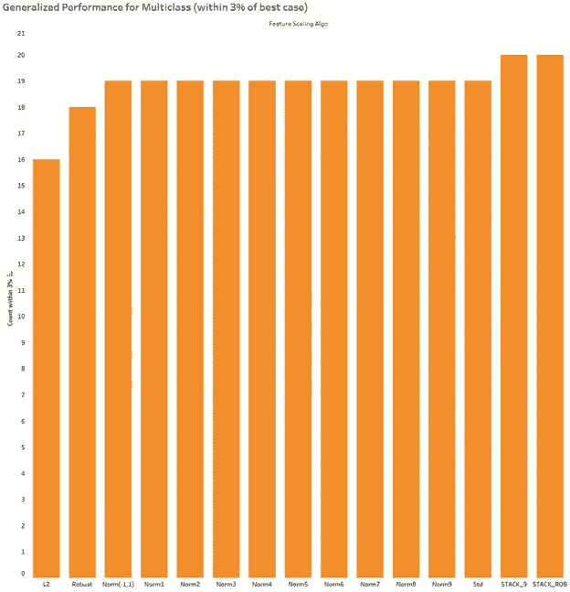

**图 13 多类的泛化性能(按作者分类的图像)**

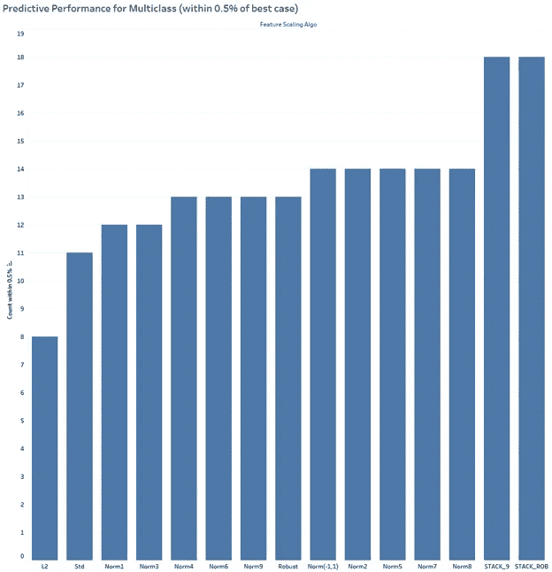

**图 14 多类预测性能(按作者分类的图像)**

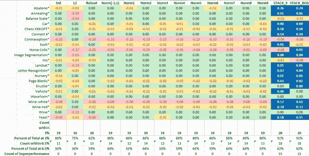

**表 4 多类比较结果(图片由作者提供)**

**STACK _ ROB 特征缩放集合**

图 15 显示了通过在所有 60 个数据集上结合标准化和稳健扩展所提供的性能对比检查。小于零的数字表示 STACK_ROB 无法满足以最佳 solo 算法的百分比表示的缩放精度的数据集。数字为零表示达到 100%的最佳独奏准确度，而数字大于零表示表现优异，y 轴表示相对于最佳独奏方法的改进百分比。

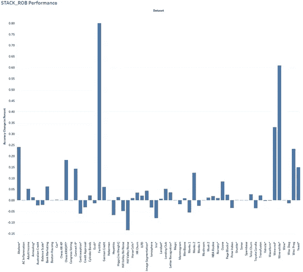

图 15 STACK_ROB 性能(图片由作者提供)

**结论**

我们的工作表明，正则化在最小化特征缩放模式之间的精度差异方面是有效的，因此缩放的选择不像非正则化模型那样重要。尽管正则化有偏差控制效应，但预测性能结果表明，对于逻辑回归，标准化是合适的，而归一化是不合适的。

但是，正如我们在之前的研究中所证实的那样，特性扩展集成，尤其是 STACK_ROB，能够带来显著的性能提升。在这种情况下，多类预测准确性有了决定性的提高，预测性能缩小了与通用指标的差距。如果您尚未考虑使用逻辑回归来解决多项式问题，STACK_ROB 要素缩放集成可能会改变您的想法。

如果您的 L2 正则化逻辑回归模型不支持处理要素缩放集合所需的时间，那么使用 0 到 4 或 5 个要素范围(Norm(0，4)或 Norm(0，5))的归一化对于概化和预测都具有不错的性能。至少，这是你寻找最优的一个好的起点。

**致谢**

我想对 Utsav Vachhani 一年多来为解决特征缩放之谜所付出的不懈努力表示最深切的感谢，这导致了特征缩放合集的创建。很简单，没有他的贡献，这篇论文和所有未来的功能缩放集成工作将不会存在。

**参考文献**

Abu-Mostafa，Y. S .、Magdon-Ismail，m .、和 Lin，H.-T. (2012 年)。*从数据中学习*(第 4 卷)。美国纽约 AMLBook

Géron，A. (2019)。*使用 Scikit-Learn、Keras 和 TensorFlow 进行动手机器学习:构建智能系统的概念、工具和技术*。奥莱利媒体。

米勒和圭多(2016 年)。*Python 机器学习简介:数据科学家指南*。奥赖利媒体公司。

Shmueli，g .，Bruce，P. C .，Gedeck，p .，& Patel，N. R. (2019)。*商业分析的数据挖掘:Python 中的概念、技术和应用*。约翰·威利的儿子们。

Scikit-learn_developers。(未注明)。`[sklearn.linear_model](https://scikit-learn.org/stable/modules/classes.html#module-sklearn.linear_model)`。后勤注册文件。从 [sklearn.linear_model 中检索。LogisticRegressionCV—sci kit-learn 1 . 0 . 2 文档](https://scikit-learn.org/stable/modules/generated/sklearn.linear_model.LogisticRegression.html?highlight=logistic%20regression#sklearn.linear_model.LogisticRegression)

**数据集来源**

**联系方式:**

戴夫·古根汉姆:参见作者简介和简历，[dguggen@gmail.com](mailto:dguggen@gmail.com)

乌特萨维·瓦赫哈尼:[领英简历](https://www.linkedin.com/in/uv29/)，[uk.vachhani@gmail.com](mailto:uk.vachhani@gmail.com)