# 逻辑回归和缺失先验

> 原文：<https://towardsdatascience.com/logistic-regression-and-the-missing-prior-7c36039af851>

## 如何利用 Jeffreys 先验减少 logistic 回归的偏倚

假设 **X** 表示回归量矩阵，而 **y** ，

表示目标值的向量。

如果我们假设数据是从逻辑回归模型生成的，那么我们在看到数据后对权重 **w** 的信任由下式给出

这里，P( **y** | **X** ， **w** )称为可能性，由下式给出

而 P( **w** )称为先验，在看到数据之前量化我们对 **w** 的信念。

通常，逻辑回归适合最大化 P( **y** | **X** ， **w** )，而不考虑先验

而 **w** _ML 就是我们所说的权重的*最大似然*估计。

但是无视先验通常是个坏主意。我们来看看为什么。

## 最大似然模型有什么问题

考虑一个具体的例子。

假设你是一名研究狼的生物学家。作为你工作的一部分，你一直在跟踪狼群，观察它们的捕猎行为。

托马斯·博诺梅蒂在 Unsplash 的照片

你想知道是什么让狩猎成功。为此，您需要建立一个逻辑回归模型来预测搜寻是成功还是失败。考虑像群体大小和猎物类型这样的因素会很有趣，但是为了简单起见，你只从一个偏见术语开始。

让 *n* 表示狩猎的总次数。如果 *b* 表示我们的
偏置项的值，那么观察到 *k* 成功搜索的可能性由下式给出

现在，让我们假设我们观察了 8 次狩猎，没有记录到成功的狩猎。(狼的捕猎成功率实际上相当低，所以这样的结果并不令人惊讶)。对于 *b* 来说，什么是好的工作估算？最大似然估计是-∞，但是我们知道这没有意义…如果没有成功的机会，为什么还要去狩猎呢？

如果我们不选择 *b* 来最大化可能性，而是选择 *b* 来最大化后验分布的概率，我们可以获得更好的工作估计

具有适当选择的先验 P(b)。我们稍后将讨论选择先验的过程，但现在考虑先验

这个先验的后验概率是

放 p = (1 + exp(-b))⁻。我们可以通过对 0 取对数、求导和求解来找到 MAP 估计

求解 0，我们有

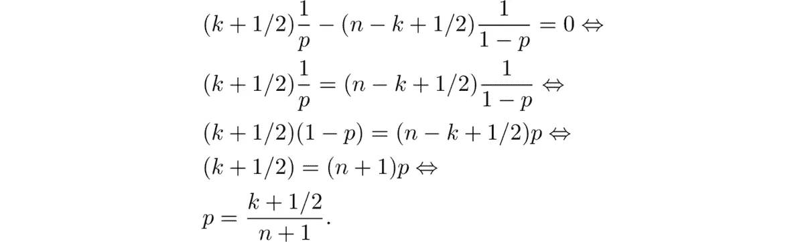

在我们的例子中，这给了我们更合理的估计

我们使用的先验是无信息先验的一个例子。

## 什么是无信息先验，我们如何发现它们

注意:这里对非信息先验的介绍紧跟 Box & Tiao 的书[统计分析中的贝叶斯推断](https://onlinelibrary.wiley.com/doi/book/10.1002/9781118033197)的第 2 章。

假设我们给定一个模型的似然函数 L(θ| **y** ，该模型有参数θ和数据 **y** 。当我们没有关于θ的特定知识时，什么是好的使用前？

我们来看一个具体的例子。假设数据由方差σ已知但均值θ未知的正态分布生成。该模型的似然函数为

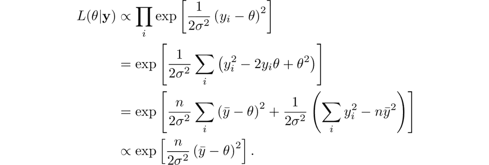

这是 n=5 和不同 y̅:值的概率图

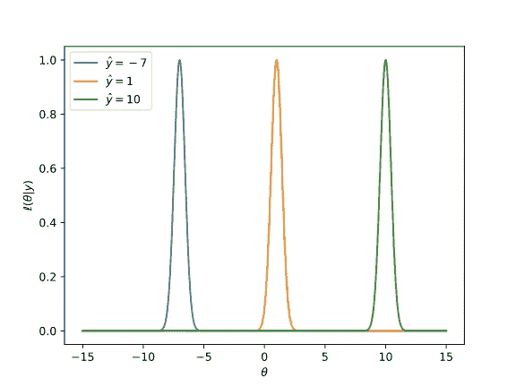

方差为 1，
n=5，y̅.值不同的正态分布数据均值的似然函数图片作者。图片作者。

请注意，对于所有的 y̅值，似然曲线的形状都是相同的，只有平移不同。当似然曲线具有这种性质时，我们说它是经过*转换的*数据。

现在考虑两个大小相同的范围[a，b]和[a + t，b + t]。如果观测数据由 y̅+t 而不是 y̅.转换，则两者相对于似然曲线的位置是相等的因此，我们应该

或者制服先验

假设我们对似然函数 L(θ| **y** )使用另一种参数化:我们通过 *u* = ϕ(θ)进行参数化，并在 *u* 之前应用均匀化，其中ϕ是某种单调内射变换。累积分布函数由下式给出

其中 *Z* 是某个归一化常数。进行替换 *θ = ϕ⁻ (u)* 以回到原始参数化，然后我们得到

所以我们看到在 *u* 上的均匀先验等价于在 *θ* 上的先验 *P(θ) ∝ ϕ'(θ)* 。找到θ的无信息先验等价于找到一个变换 *ϕ* 来转换似然函数数据。

现在让我们回到只有偏差项的逻辑回归模型的似然函数

绘制 *n=8* 和不同的 *k 值*的可能性给出了

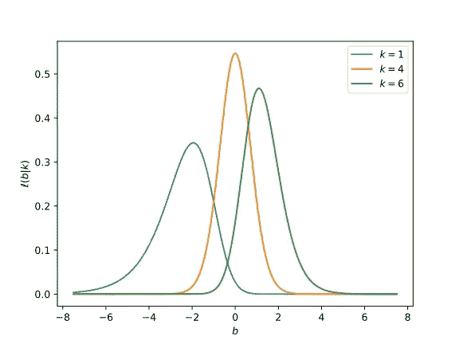

只有一个偏差项的逻辑回归模型的似然函数，
n=8，k 值不同。

从图中可以很清楚地看到，可能性函数没有经过数据转换。对于 *k=4* 的曲线比其他的更为陡峭，对于 *k=1* 和 *k=6* 的曲线是歪斜的。

现在，对于适当表现的似然函数，我们可以使用 log L(θ| **y** )关于
θ_ML 的二阶泰勒级数展开，通过
a 高斯来近似 L(θ| **y**

在哪里

随着 n →∞，近似变得越来越精确。

让我们看看这是如何为我们的简化逻辑回归模型工作的。

对 log L(b|k)求微分得到

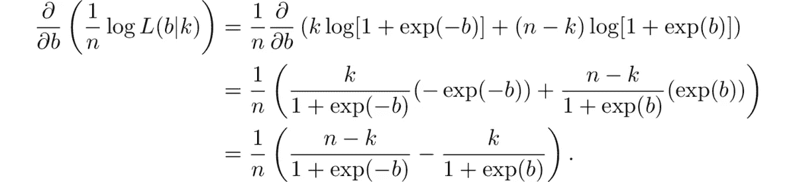

再次微分给了我们

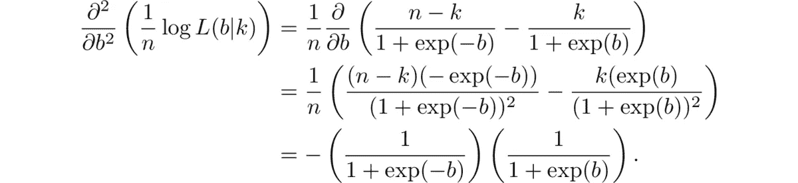

这是高斯近似的样子

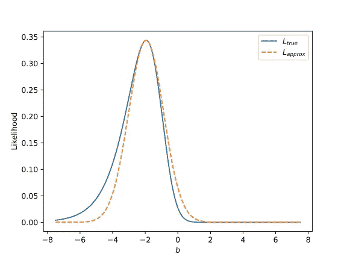

仅含偏倚项的逻辑回归模型的似然函数
及其高斯近似(n=8，k=1)。图片作者。

现在，考虑当我们用θ = ϕ⁻ (u)重新参数化时，L(θ， **y** )的高斯近似会发生什么。

差异化给了我们

再次微分给了我们

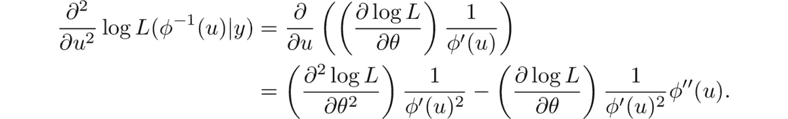

以最大值 u_ML= ϕ(θ_ML 进行评估)，我们有

我们申请的地方

回到逻辑回归，把

那么我们有

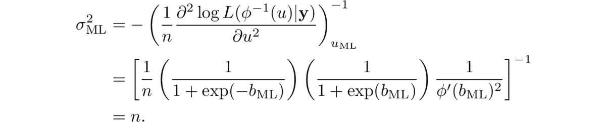

因此，关于 u_ML 的高斯近似变成

因此似然函数现在是近似的数据转换。

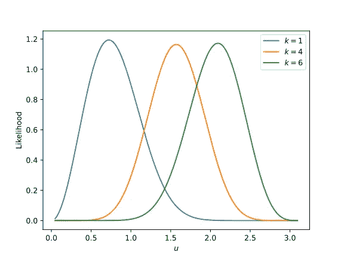

只有一个偏差项的逻辑回归模型的重新参数化似然函数，
n=8，k 值不同。

## 杰弗里斯先验

现在让我们对多参数情况下的 Jeffreys 先验作一个简要的概述。
设 **θ** = (θ₁，…，θ_k)^T 表示参数的向量。

类似于单参数情况，似然函数函数可以由关于最优值的高斯函数来近似

在哪里

现在，假设我们用 **u** = ϕ( **θ** 重新参数化。那么高斯近似的更新的 hessian 变成

在哪里

在一般的多变量情况下，我们可能无法以高斯近似变成数据转换的方式重新参数化，但是假设我们选择ϕ，使得

然后

有一个常数行列式，意味着区域的体积将保持不变。

设 S ∈ ℝᵏ是关于原点的区域，K 是关于 **θ** _ML 的重新参数化高斯近似的协方差矩阵
。如果 L 是 **K** 的乔莱斯基分解

则 s 对应于 L⁻ S+ **θ** _ML 关于 **θ** _ML 的区域，该区域具有固定的概率质量和体积

**u** 上均匀先验的 **θ** 对应的先验为

而这叫做*杰弗里斯在先*。

让我们将此应用于带权重的完全二项逻辑回归模型。负对数似然函数由下式给出

在哪里

差异化给了我们

在哪里

再次微分给了我们

在哪里

我们可以把黑森写成

其中 **A** 是对角矩阵

杰弗里斯副院长是

## 用 Jeffreys 先验拟合逻辑回归

用 Jeffreys 先验找到逻辑回归的映射模型相当于解决优化问题

设π表示杰弗里斯先验的对数

如果我们可以找到π的梯度和 hessian 的方程，那么我们可以应用标准的二阶优化算法来找到 **w** _MAP。

从梯度开始，我们可以应用[雅可比公式](https://en.wikipedia.org/wiki/Jacobi%27s_formula)对行列式进行微分

得到

其中 **A_w** 的导数是对角矩阵

对于 hessian，我们应用微分逆矩阵的公式

得到

在哪里

通过以有效的方式评估梯度和 hessian 计算并应用二阶信赖域优化器，我们可以快速迭代以找到 **w** _MAP。使用这种方法的 Python 包可以在 https://github.com/rnburn/bbai[获得。](https://github.com/rnburn/bbai)

让我们在一些例子中看看这是如何工作的。

## 示例 1:单变量模拟数据

我们将从查看模拟数据集的先验和后验开始，其中
只有一个回归变量，没有偏差。

我们从生成数据集开始。

接下来我们添加一个函数来计算先验

并绘制出一系列的值

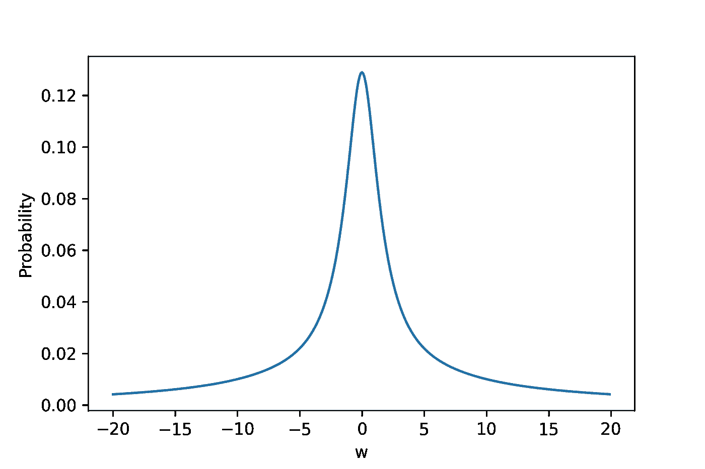

Jeffreys prior 对具有单个回归量的模拟数据集进行逻辑回归。图片作者。

接下来，我们拟合逻辑回归图模型，并将 w_MAP 与
w_true 进行比较。

印刷品

最后，我们画出后验分布。

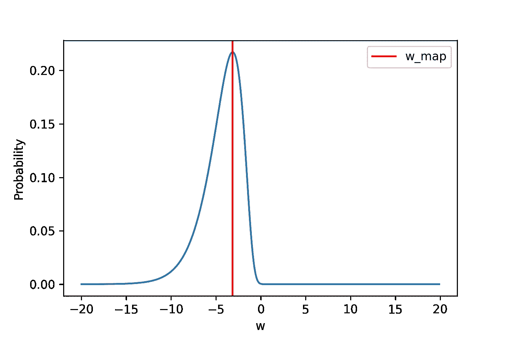

使用单个回归变量和 w_MAP 对模拟数据集进行逻辑回归的后验概率。图片作者。

完整的例子可以在 github.com/rnburn/bbai/example/05-jeffreys1.ipynb 找到。

## 示例 2:具有两个变量的模拟数据

接下来让我们看一个有两个变量的例子。

我们生成一个包含两个变量的数据集

我们计算先验，并在一系列值上绘制出来

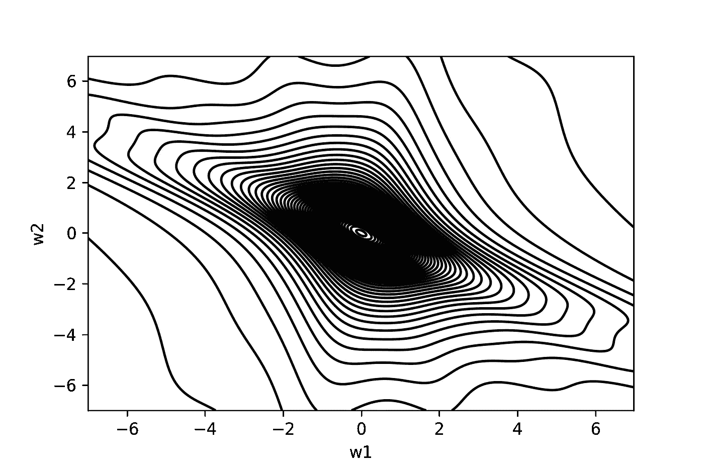

Jeffreys 先验用于具有两个回归量的模拟数据集上的逻辑回归。图片作者。

现在，我们将拟合一个模型来查找 **w** _MAP。

印刷品

最后，我们绘制出以 **w** _MAP 为中心的后验分布。

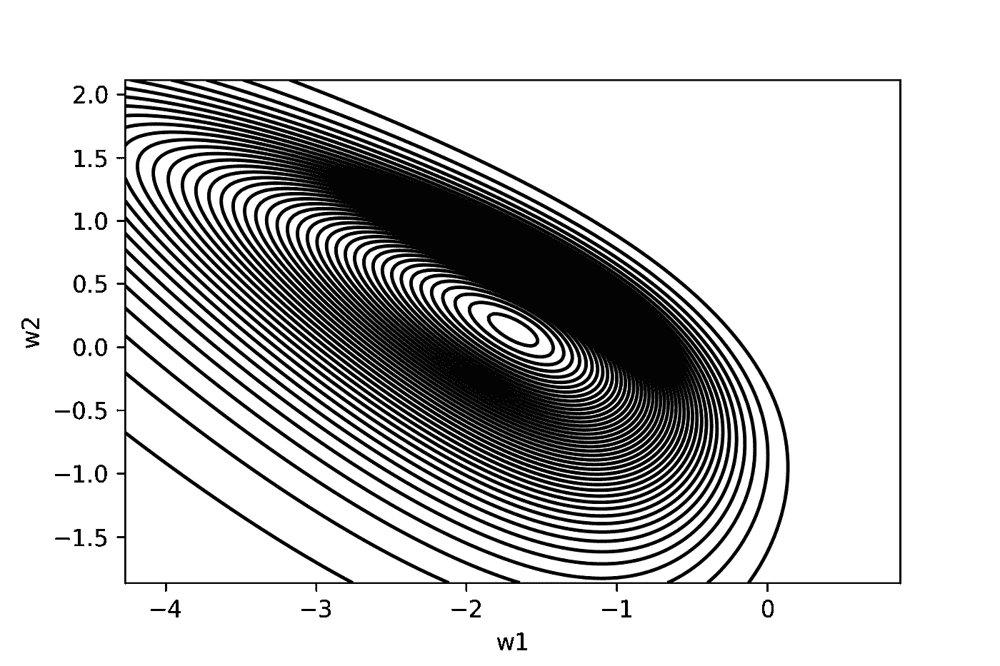

具有 Jeffreys 先验的逻辑回归的后验概率。图片作者。

完整的例子可以在 github.com/rnburn/bbai/example/06-jeffreys2.ipynb 找到。

## 示例 3:乳腺癌数据集

现在，我们将根据现实世界的乳腺癌数据集拟合一个模型。

我们从加载和预处理数据集开始。

然后，我们拟合一个逻辑回归图模型，并使用费雪信息矩阵来估计标准误差。

我们打印出重量和它们的标准误差。

完整的例子可以在 github.com/rnburn/bbai/example/07-jeffreys-breast-cancer.py 找到。

## 结论和进一步阅读

与普通最小二乘法不同，逻辑回归的似然函数不需要数据转换。搜索数据转换转换会将我们带到 Jeffreys 先验，一种自然收缩先验。

Firth 1993 [1]和 Kosmidis & Firth 2021 [2]分析了 Jeffreys 先验惩罚最大化似然估计量的统计性质，发现它比标准的最大似然估计量具有更小的渐近偏差阶。Jeffreys prior 降低偏差的特性结合其处理分离问题的能力[3]，使其成为拟合逻辑回归模型的标准方法的绝佳替代品。

*博文原载于*[*【https://buildingblock.ai/logistic-regression-jeffreys】*](https://buildingblock.ai/logistic-regression-jeffreys)*。*

## 参考

[1]弗思，D. (1993 年)。[最大似然估计值的偏差减少](https://www2.stat.duke.edu/~scs/Courses/Stat376/Papers/GibbsFieldEst/BiasReductionMLE.pdf)。 *Biometrika* 80，27–38。

[2]科斯米迪斯本人和弗斯博士(2021 年)。[Jeffreys-二项响应广义线性模型中的先验惩罚、有限性和收缩](https://academic.oup.com/biomet/article/108/1/71/5880219)。 *Biometrika* ，第 108 卷，第 1 期，2021 年 3 月，第 71–82 页。

[3]:海因策，g .和谢姆佩尔，M. (2002 年)。逻辑回归中分离问题的一种解决方法。*统计学家。医学。*212409–19。