# 在 7 分钟内解释逻辑回归

> 原文：<https://towardsdatascience.com/logistic-regression-explained-in-7-minutes-f648bf44d53e>

## 完全初学者的逻辑回归详细指南


在 [Unsplash](https://unsplash.com/s/photos/analysis?utm_source=unsplash&utm_medium=referral&utm_content=creditCopyText) 上由 [Austin Distel](https://unsplash.com/@austindistel?utm_source=unsplash&utm_medium=referral&utm_content=creditCopyText) 拍摄的照片

逻辑回归是数据科学家最常用的预测模型之一。在本文中，我将解释逻辑回归背后的一些理论，以便您对它的工作原理有一个直观的理解。

然后，我将深入研究用于评估逻辑回归模型的指标，以及何时应该使用它们。

最后，我将向您展示如何使用 Scikit-Learn 在 Python 中构建逻辑回归模型。

# 什么是逻辑回归？

简而言之，逻辑回归是一种预测事件发生的**概率**的模型。它用于解决分类问题，这意味着因变量始终是一个类或类别。

以下是一些可以借助逻辑回归解决的分类问题示例:

*   预测电子邮件是垃圾邮件还是垃圾邮件
*   根据动物的图像识别其种类
*   将网站流量分类为良性或恶意

分类问题可以分为两类:二元分类和多类分类。

**二元分类**涉及预测两个类中的一个(如猫 vs 狗)**多类分类**指预测多个类中的一个(如猫 vs 狗 vs 熊)。

# 逻辑回归是如何工作的？

逻辑回归可以用 S 形曲线建模，如下例所示:

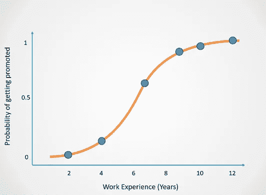

作者图片

这个图的 X 轴显示在公司的年数，这是因变量。Y 轴告诉我们一个人获得晋升的概率，这些值的范围从 0 到 1。

概率为 0 表示这个人不会得到提升，概率为 1 表示他们会得到提升。

对于小于 0.5 的概率，逻辑回归返回结果 0(提升=否)。对于大于或等于 0.5 的概率，将返回预测值 1(提升=是):

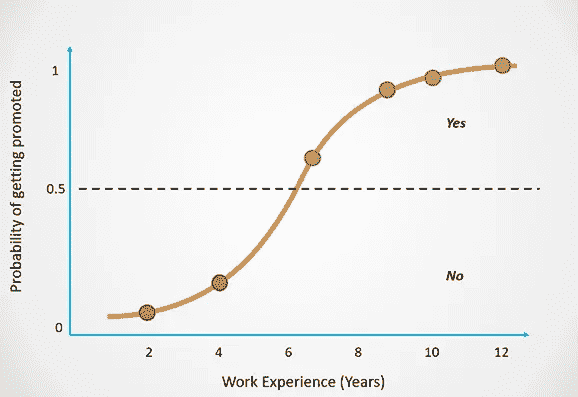

作者图片

你可以看到，随着员工在公司工作的时间越来越长，他们获得晋升的机会也越来越大。

根据上面解释的概念，您可能会有以下问题:

## 我们为什么需要逻辑回归——为什么不能简单地用一条直线来预测一个人会不会升职？

线性回归是一种常用于模拟具有连续输出的问题的技术。下面是一个线性回归拟合直线来模拟观察数据的示例:

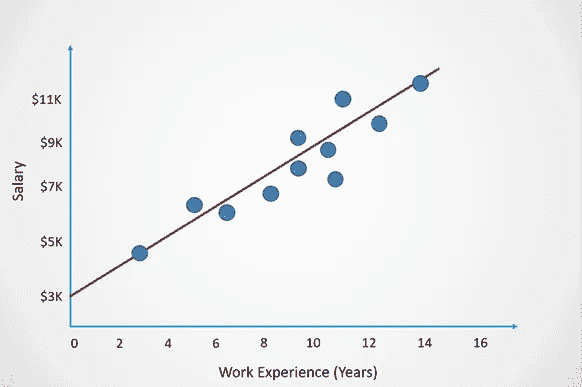

作者图片

然而，对于分类问题，我们不能将这样的直线拟合到手头的数据点上。

这是因为线性回归中的最佳拟合线没有上限和下限，预测可能会变成负值或超过 1。

下面是一个例子，说明如果我们使用线性回归来模拟一个人是否会得到晋升:

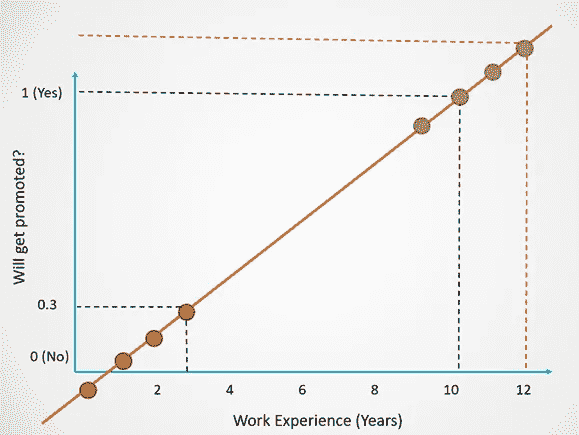

作者图片

注意，在这个例子中，线性回归仍然适用于某些值。

对于有 10 年工作经验的人，我们得到的预测是 1。

对于 3 年的工作经验，模型预测的概率为 0.3，这将返回 0 的结果。

但是，由于没有上限，观察一下对于有 12 年工作经验的员工的预测**如何超过 1** 。同样，对于工作经验不足 1 年的员工，预测**变成了负面**。

因为我们想要预测二元结果(是/否)，所以预测的范围需要从 0 到 1。不可能有负面预测或超过 1 的预测。

为了确保结果始终是一个概率，逻辑回归使用 sigmoid 函数将线性回归的输出压缩在 0 和 1 之间:

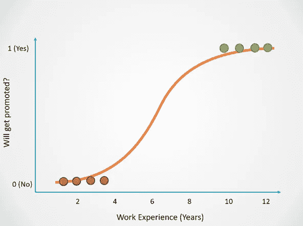

作者图片

这是线性回归方程，也是直线方程:

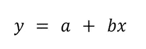

作者图片

这是逻辑回归方程，它简单地将线性回归的输出压缩在 0 和 1 之间:

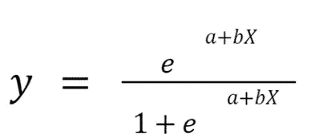

作者图片

既然您已经了解了逻辑回归是如何工作的，那么让我们来看看用于评估这种模型的不同度量标准。

# 如何评价 Logistic 回归模型？

用于评估分类模型性能的最流行的度量是准确性。然而，准确性并不总是一个好模型最可靠的指标，这就是为什么数据科学家经常使用精确度、召回率和 F1 分数等指标。

这里有一个示例可以帮助您理解不同的分类指标以及何时使用它们:

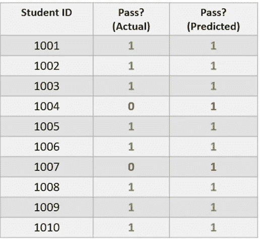

作者图片

上面的数据集包括学生是否通过考试的信息。值 1 表示他们通过了，值 0 表示他们没有通过。

“实际”列包含真实数据，而“预测”列包含逻辑回归模型的预测。

真实的数据是**不平衡**，因为 80%的学生通过，20%的学生不及格。这意味着数据集偏向于表示一个类而不是另一个类。

现在，看一下“预测”栏。请注意，模型预测 100%的学生都通过了考试。这个模型只是预测多数阶级，所以它是一个很差的模型。

现在，让我们计算该数据集的一些分类指标:

## 准确(性)

使用以下公式计算精度:

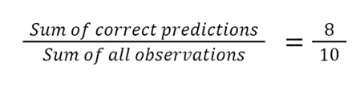

作者图片

这个模型有 80%的准确率。然而，正如我们前面提到的，该模型只预测了一个类别，甚至没有做出一个准确的正面预测。

虽然它的准确性很高，但该模型表现不佳。在这种情况下，准确性可能是一个误导性的指标，因为它会让数据科学家认为他们的模型是好的，即使事实并非如此。

现在，让我们看看其他几个可以帮助我们克服准确性缺点的指标。

## 精确度和召回率

精确度和召回率是用于评估模型做出的正面预测的质量的两个指标。

现在，让我们进一步了解精确度和召回率，以及如何计算它们:

**1。精度**

精确度是一种可以告诉我们的度量:在所有积极的预测中，有多少学生真正通过了？

它使用以下公式计算:

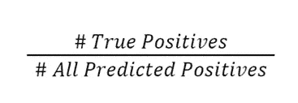

作者图片

在这种情况下，分类器的精度是 ***0/0 = 0*** 。

**2。召回**

一个模型的回忆可以告诉我们:在所有通过的人中，有多少是被正确识别的？

计算召回率的公式是:

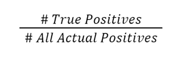

作者图片

在这种情况下，分类器的召回是 ***0/2 = 0*** 。

## f1-分数

F1 分数结合了精确度和召回值，给出了一个单一的结果。

简而言之，这一指标通过计算精确度和召回率的平均值来告诉我们一个模型的表现有多好。

计算 F1 分数的公式为:

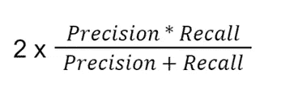

作者图片

在这种情况下，分类器的 F1 值为 ***2 X 0= 0*** 。

## 摘要

总之，该模型的准确性很高，但其精确度、召回率和 F1 值都为 0，因为它没有做出任何正面预测。

本节的主要内容是，虽然准确性通常用于评估逻辑回归模型的性能，但计算其他度量也很重要，以确保您的模型确实表现良好。

我没有深入研究这些指标，因为本文的重点是逻辑回归。如果你想更深入地了解精确和回忆是如何工作的，以及如何回答关于它们的面试问题，请阅读我关于这个主题的教程。

# 如何在 Python 中进行逻辑回归？

您可以使用 Scikit-Learn 运行以下代码行来构建逻辑回归模型:

```
from sklearn.linear_model import LogisticRegression
lr = LogisticRegression() 
lr.fit(X_train,y_train) # train the model
preds = lr.predict(X_test) # make predictions
```

感谢阅读！本帖原载[此处](https://www.natasshaselvaraj.com/logistic-regression-explained-in-7-minutes/)。