# 从零开始的逻辑回归

> 原文：<https://towardsdatascience.com/logistic-regression-from-scratch-870f0163bfc9>

逻辑模型是机器学习和许多社会科学领域的基础。在这篇文章中，我解释了如何从基本原理中推导出**逻辑模型。**因为我喜欢边做边学，所以我展示了如何使用**梯度下降**或**牛顿-拉夫森**算法来估计它的参数。在现实生活的应用方面，我们将使用关于 NBA 球员的数据来看看是什么因素影响了投篮的成功。

**TL；博士:从基本原则推导+如何训练+ NBA 应用**

这篇文章的 GitHub 库可以在[这里](https://github.com/JulienPascal/LogisticRegression)找到。如果你喜欢这篇文章，请不要犹豫，关注我。


照片由 [**塞尔吉奥·索萨**](https://www.pexels.com/@serjosoza?utm_content=attributionCopyText&utm_medium=referral&utm_source=pexels) 拍摄自 [**佩克斯**](https://www.pexels.com/photo/top-view-photo-of-basketball-court-2291004/?utm_content=attributionCopyText&utm_medium=referral&utm_source=pexels)

—

# 一.理论

## 逻辑模型

结果变量 yi 要么是 1(“赢”)，要么是 0(“输”)。逻辑模型假设获胜的概率由逻辑函数给出(因此得名):

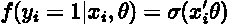

随着

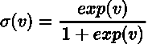

输的概率是 1 减去赢的概率:

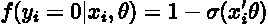

## 潜在变量公式

解释逻辑模型的一个强有力的方法是将其视为潜在变量模型的结果。不可观察的潜在变量 zi 线性依赖于 xi 加上噪声项εi:

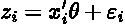

我们只观察 yi，当 zi 严格正时等于 1，否则等于 0。如果误差项按照[逻辑分布](https://en.wikipedia.org/wiki/Logistic_distribution)分布，我们最终得到上述逻辑模型。如果误差项呈正态分布，则该模型为[概率单位模型](https://en.wikipedia.org/wiki/Probit_model)。要了解这一点，只需将潜在变量的概率表示为大于 0:

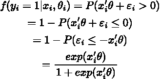

其中最后一行来自使用对数分布的 [cdf 表达式，平均值为零，标度参数等于 1。](https://en.wikipedia.org/wiki/Logistic_distribution)

## 系数怎么读？

我们如何从逻辑模型中读取系数？xij(Xi 的第 j 个分量)的变化对 yi=1 的概率的边际影响由下式给出:

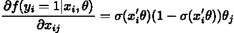

第一个观察是边际效应取决于 xi，不像线性回归模型。第二个观察结果是，前两项总是正的，所以我们有这样的解释，如果θj 是正的，xi 的第 j 个分量的增加导致获得成功的更大概率(保持其他一切不变)。

从逻辑模型中读取结果的另一种方式是认识到它意味着奇数比的对数是线性的:

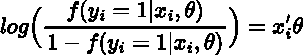

实际上，如果系数θj 等于 0.1，这意味着 xij 增加一个单位，则“获胜”(输出为 1)的**相对**概率增加约 10%。

—

# 二。寻找系数

## 对数似然函数

到目前为止，一切顺利。但是我们如何找到θ呢？一个“自然”的标准是找到θ的值，使得**最大化观察样本**的概率。在商业中，这个过程被称为[最大似然估计](https://en.wikipedia.org/wiki/Maximum_likelihood_estimation)。让我们假设样本是[I . I . d .](https://en.wikipedia.org/wiki/Independent_and_identically_distributed_random_variables)。如果 i.i.d .假设成立，观察到样本的概率(易，)是每次观察到的概率的乘积。**最大化对数似然比最大化似然更方便，对数似然将概率的乘积转换为总和:**

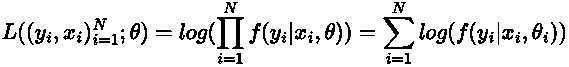

观察到 yi(yi = 1 或 0)的概率可以简洁地写成

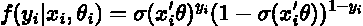

因此，对数似然函数写道:

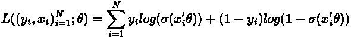

## 最大似然估计

对 f(yi|xi，θ)对参数θ求导得到

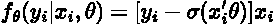

对数似然函数相对于θ 的**导数为**


## 梯度下降

既然知道了对数似然函数关于θ的导数，我们可以使用**古老的梯度下降**算法:

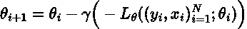

[梯度下降](https://en.wikipedia.org/wiki/Gradient_descent)算法是一种寻找函数极小值的迭代程序。在每一步，**该算法朝着最陡下降方向**前进一步，步长为γ。

## 牛顿-拉夫森方法

我们能做得比梯度下降更好吗？用这个简单的模型，是的。使用牛顿-拉夫森方法可以大幅提高速度。粗略地说，**牛顿-拉夫逊法是一种“智能”梯度下降法，它利用了对数似然 HL((易，)的 Hessian** 中包含的信息；θi)向右移向极小值。该迭代算法如下进行:

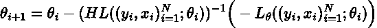

下一张图显示了牛顿-拉夫森方法如何解决一维求根问题:

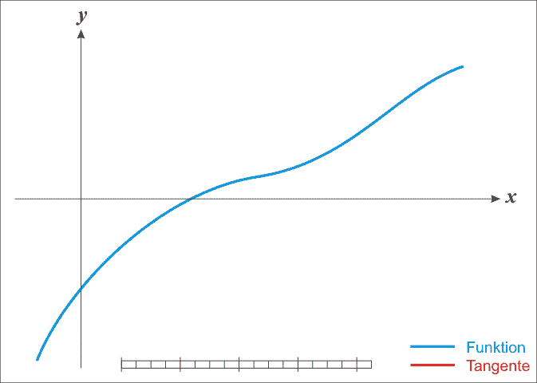

来源:https://en.wikipedia.org/wiki/Newton%27s_method

应该用梯度下降法还是牛顿-拉夫逊法？当计算 Hessian 简单快速时，你应该选择 Newton-Raphson，因为它收敛得更快。见下面引用自[维基百科关于牛顿-拉夫森的文章](https://en.wikipedia.org/wiki/Newton%27s_method_in_optimization)

> ***在适用的地方*** *，牛顿法* ***比梯度下降法*** *向局部最大值或最小值收敛快得多。事实上，每个局部最小值都有一个邻域 N，这样，如果我们从 x0 ∈ N 开始，步长γ = 1* ***的牛顿法二次收敛*** *(如果 Hessian 是可逆的，并且 x 的一个 Lipschitz 连续函数在那个邻域中)。*

对于逻辑斯谛模型，牛顿-拉夫森算法很容易应用，因为存在一个闭合形式的 Hessian 公式:

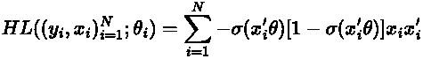

—

# 三。应用:NBA 球员


照片由 [**Chbani Med**](https://www.pexels.com/@chbani-med-3235139?utm_content=attributionCopyText&utm_medium=referral&utm_source=pexels) 发自 [**Pexels**](https://www.pexels.com/photo/silhouette-of-people-playing-basketball-during-sunset-4863981/?utm_content=attributionCopyText&utm_medium=referral&utm_source=pexels)

是什么让一个 NBA 球员成功？为了回答这个问题，我使用了 2014-2015 赛季期间拍摄的 NBA 照片的数据集。例如，它包含以下信息:

*   谁开的枪
*   这一枪是从地板上的什么地方拍的
*   谁是最近的防守队员，
*   最近的防守队员有多远
*   拍摄时间

此处的**Kaggle**上有数据。在接下来的内容中，我使用了 Julia 并附上了代码，这样您就可以理解了。需要几个包:

```
using Distributions
using Plots
pyplot()
using DataFrames
using GLM
using Optim
using CSV
using GLM
```

数据集非常广泛。让我们选择射门是否成功，**射门时间，射门距离，以及与最近的防守队员**的距离:

## 使用包装

获得结果的最快方法是使用包 GLM:

```
fittedmodel = glm(@formula(SHOT_RESULT ~ SHOT_CLOCK + SHOT_DIST + CLOSE_DEF_DIST), df_nba, Binomial(), LogitLink(), verbose=true)SHOT_RESULT ~ 1 + SHOT_CLOCK + SHOT_DIST + CLOSE_DEF_DIST 
```


GLM 的估计结果

我们如何解释这些结果？

*   **时间压力让 NBA 球员更成功:投篮时间越高，得分的可能性越大**
*   **距离较远的镜头更容易被错过**
*   **离最近的防守队员越远，射门成功的可能性越大**

## 编写自己的代码

能不能“手动”找到类似的结果？答案是**是的**。为了看到这一点，让我们首先创建二元变量`y`并将解释变量放入`X.`中，然后我定义几个函数来计算损失函数的梯度和 hessian:

这个逻辑模型的实现给我们的参数值几乎与我们使用`GLM.`软件包得到的参数值相同。

```
Estimate for theta is [-0.0575129, 0.0185199, -0.0597451, 0.108392]
```

# 结论

这篇博文展示了如何从基本原则(潜在变量解释)中推导出逻辑模型，以及如何用几行代码实现它。