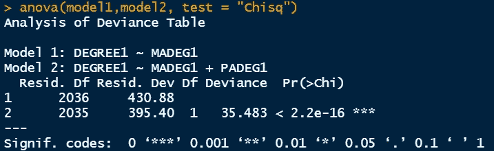
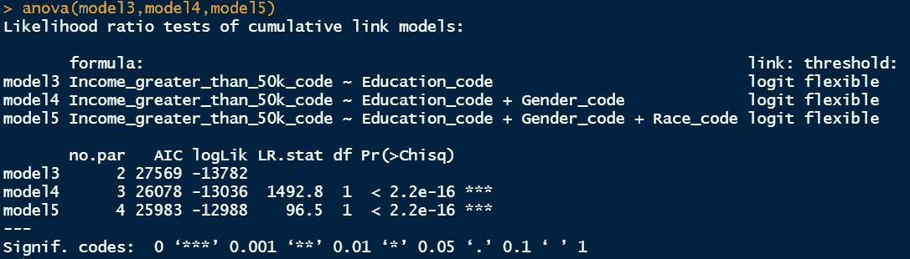

# 逻辑回归模型比较

> 原文：<https://towardsdatascience.com/logistic-regression-models-comparison-2a88a9da4eb6>

## R 系列中的统计

诺德伍德主题公司在 [Unsplash](https://unsplash.com/s/photos/comparison?utm_source=unsplash&utm_medium=referral&utm_content=creditCopyText) 上拍摄的照片

> **简介**

在简单逻辑回归中，我们只有一个预测变量，而在多元逻辑回归中，有多个预测变量。响应变量可以是二进制的，也可以是有序的。例如，响应变量可以只是两个类别之间的选择，如城市或农村，健康或疾病，就业或失业，受过教育或不识字。响应变量也可以是有序的，其中响应变量中可以有从低到高的特定级别，反之亦然。例如，工资水平可分为低工资、低于平均工资、平均工资、高于平均工资和良好工资。这是五个分类但有序的级别，响应变量可以是任何类别。

我们已经在以前的文章中讨论了这些二元和有序逻辑回归，链接如下

> [R 中二分变量的简单逻辑回归](/simple-logistic-regression-for-dichotomous-variables-in-r-8befbe3e95b4)
> 
> [R 中二分变量的多元 Logistic 回归](/multiple-logistic-regression-in-r-aa65c2a91e22)
> 
> [R 中序数变量的简单逻辑回归](/simple-logistic-regression-for-ordinal-variables-in-r-1d95fa278c5e)
> 
> [R 中序数变量和预测概率的多元逻辑回归](https://medium.com/towards-data-science/multiple-logistic-regression-for-ordinal-variable-and-predicted-probabilities-in-r-3e3ef3ba6ca2)

在本文中，我将向您介绍不同模型之间的比较，以及如何解读 R 输出。

> **数据集**

本案例研究将基于来自 [UCI 机器学习知识库的数据集，该数据集被称为成人数据集](https://archive.ics.uci.edu/ml/datasets/adult)，将被用作数据源。据估计，在该数据集中，超过 30000 个人通过他们的人口统计信息被识别，这些信息包括但不限于他们的种族、教育、职业、性别、工资、每周工作时间、就业水平以及收入水平。

[来自 UCI 机器学习知识库的成人数据集](https://archive.ics.uci.edu/ml/datasets/adult)

为了进行有序逻辑回归分析，有必要对给定数据进行一些修改。

这里，我将有两个数据集:一个用于二进制模型，其中响应变量是二进制的，另一个用于序数模型，其中响应变量是有序的。原始数据被修改以执行简单有序的逻辑回归，这些数据保存在下面的 github 中。

链接 excel 文件简单逻辑回归: [GSS — glm2.xlsx](https://github.com/mdsohelmahmood/Statistics-in-R-Series/tree/main/Simple%20Logistic%20Regression)

链接 excel 文件多元 logistic 回归:[成人-v3.xlsx](https://github.com/mdsohelmahmood/Statistics-in-R-Series/tree/main/Multiple%20Logistic%20Regression)

母亲和父亲的学士教育教育在第一个文件中是二进制的，表示为 MADEG 和 PADEG，输出也是二进制的，表示为 DEGREE1，表示每个人的学士教育。

在第二个文件中，教育水平被转换成如下排序。

数据集中的教育水平

性别和种族的其他变量在这里是二元的。

> **R 中的实现**

下面是我用来比较不同型号的 github 要点。为此，我使用了 anova 函数。首先加载必要的库。

> **模型对比和结果解释**

在模型 1 中，研究问题是:

> 母亲的教育水平会影响孩子的教育水平吗？

在模型 2 中，我加入了父亲的教育，问题变成了:

> 父亲的受教育程度与孩子的受教育程度有关系还是不相关？

模型 1 和模型 2 比较

主要观察结果如下:

*   模型 1 的剩余偏差为 430.88，而模型 2 的值为 395.40，较小。偏差差为 35.48，这表明模型 2 比模型 1 更稳健。与模型 1 相比，模型 2 为我们带来了更多关于每个人学士学位的信息。该残差偏差是该特定模型相对于饱和模型的偏差，在饱和模型中，每次观测都会带来一个额外的预测参数，因此该模型对于该数据集来说是完美的。我们可以看到模型 2 并不完美。
*   liklihood 比率卡方检验在这里很重要。因此，我们拒绝零假设，可以得出结论，双预测变量模型更好地拟合数据。

在随后的模型中，我使用教育、性别和种族数据作为预测因素，收入水平作为响应变量，开发了有序逻辑回归。

模型 3 包括教育数据作为预测因子。

模型 4 包括教育和性别数据作为预测因素。

模型 5 包括教育、性别和种族数据作为预测因素。

模型 3、模型 4 和模型 5 比较

因为这是有序回归，所以输出窗口是不同的。有时，空模型被用来比较完整的或嵌套的模型。如果我们将零模型视为模型 0，我们可以将其定义如下:

> 模型 0

Key observations are below:

*   The AIC statistics can be compared among all the models. Model5 has the smaller AIC value indicating more robustness for that model. Smaller the AIC value, better fit the model.
*   The log-likelihood values for each model are shown in the next column. The likelihood ratio chi-square test statistics for moel4 is 1492.8 which is twice the difference between the log-likelihood values of these two models. Also p<0.001 which implies that model5 with two predictor variable fits better than model3 with one predictor variable. Therefore, when we incorporate gender into the model along with education, it has better predictability of each individual’s income level. Similarly when model4 and model5 are compared, the chi-square test statistics becomes 96.5 and p <0.001\. Therefore model5, which includes race data, has better capability to describe income than model4.

> **结论**

二元逻辑回归模型之间的比较以及有序逻辑回归模型之间的比较已经在本文中通过 r 中的代码实现进行了演示。可能有几个模型被开发来解决相同的问题，但是这些模型之间的比较为我们提供了检查模型稳健性的选项。我们可以检查包含一个预测器实际上是否有助于稳健性。也可以获得贡献的程度。这有助于确定最终模型的部署。

> **数据集确认**

[杜瓦博士和格拉夫博士(2019 年)。UCI 机器学习知识库[http://archive . ics . UCI . edu/ml]。加州欧文:加州大学信息与计算机科学学院](https://archive.ics.uci.edu/ml/datasets/adult) (CC BY 4.0)

感谢阅读。

   