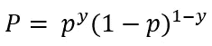
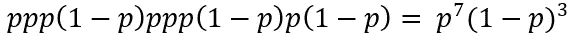
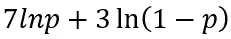
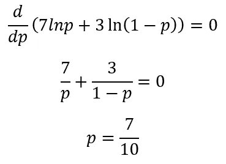
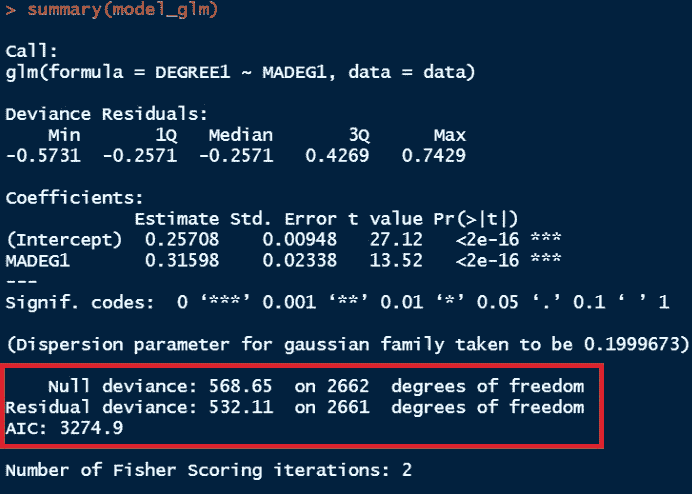
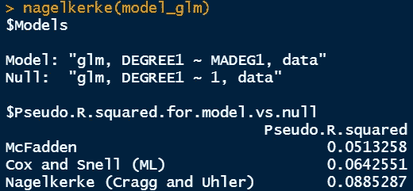
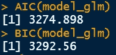

# 逻辑回归:拟合优度的统计

> 原文：<https://towardsdatascience.com/logistic-regression-statistics-for-goodness-of-fit-e2e8c7aab95>

## R 系列中的统计学:偏差、对数似然比、伪 R 和 AIC/BIC

克里斯·利维拉尼在 [Unsplash](https://unsplash.com/s/photos/math?utm_source=unsplash&utm_medium=referral&utm_content=creditCopyText) 上的照片

> **简介**

在简单的逻辑回归中，我们试图将响应变量的成功概率与预测变量进行拟合。该预测变量可以是分类变量，也可以是连续变量。我们需要量化这个模型有多好。有几种拟合优度测量值可以表示拟合优度。

离散随机变量通常只能取两个值:1 代表成功，0 代表失败。这类随机变量的分布一般定义为伯努利分布。伯努利分布的概率函数或概率数学函数可以表示为。

这里，y 可以是 1 或 0。

使用这个函数，我们可以计算每个观察值的概率。有时离散随机变量可以取两个以上的值。使用同样的分布函数，我们可以计算随机变量在每一层的概率。例如，离散随机变量可以具有除 0 和 1 之外的值。联合概率函数可以通过将所有观测值在每个离散水平上的概率值相乘来获得。

联合概率的上述定义留给我们一个新的实体，称为似然函数。公式与联合概率相同，但对似然函数的解释略有不同。在概率函数的情况下，参数是已知的，我们感兴趣的是确定已知参数在不同水平上的概率。另一方面，当我们考虑似然函数时，我们需要估计未知参数。

> **例题**

让我们假设一个事件发生的概率或成功的概率是 0.7，不发生同样事件的概率所有失败的概率是 0.3。这导致了下面的伯努利分布。

有了这个公式，我们想确定事件发生的概率。我们把这些值代入上面的等式。

对于 y = 1，我们得到 p =(0.7)(1–0.7)⁰= 0.7

答对了。我们利用仅涉及一次试验的伯努利分布获得了成功的概率。

让我们转到可能性的概念。让我们假设 10 次试验的结果如下。

[1,1,1,0,1,1,1,0,1,0]

似然函数变成:

似然函数通常被转换成对数标度。一旦完成，似然函数变成:

这里 p 是未知的，我们需要估计。如果我们想测量 p 的最大似然，我们可以将对数似然函数的导数设置为 0。

因此，成功的最大可能性是 7/10，这使得上述试验结果最有可能。

> **拟合优度统计**

这里，我们将讨论以下四个拟合优度的统计数据。

1.  异常
2.  对数似然比
3.  伪 R
4.  AIC 和 BIC 统计

让我们过一遍细节。

> **越轨行为**

使用偏差，我们可以比较当前模型和饱和模型。饱和模型是能够为数据提供完美拟合的模型。异常被定义为

> 偏差= -2*(当前模型的对数似然性-饱和模型的对数似然性)

在饱和模型中，参数的数量等于样本大小，因为它包含每个观察值的一个参数。饱和模型的可能性为 1，这意味着饱和模型可以根据预测变量提供完美的预测。因此，饱和模型的对数似然性为 0，因此偏差变为-2*(当前模型的对数似然性)。

在线性回归中，最佳模型试图减少所有数据点的误差。这里，在逻辑回归中，减少误差方差的可比统计量是偏差。换句话说，在逻辑回归中，最佳模型试图减少偏差(即研究中的模型和饱和模型之间的对数似然性)。

> **对数似然比**

理想情况下，偏差是当前模型和饱和模型之间的比较，但我们也可以将当前模型与具有更多参数的模型进行比较。后一个模型可以称为全模型，当前模型可以称为简化模型。计算简化模型和完整模型之间的偏差可以提供一些洞察力，以确定添加更多的参数实际上是否会提高模型的性能。

> 对数似然比
> 
> =简化模型的偏差-完整模型的偏差
> 
> = — 2*(简化模型的对数似然性—饱和模型的对数似然性)— — 2*(完整模型的对数似然性—饱和模型的对数似然性)
> 
> = — 2*(简化模型的对数似然性—饱和模型的对数似然性)+ 2*(完整模型的对数似然性—饱和模型的对数似然性)
> 
> = — 2*(简化模型的对数似然性—完整模型的对数似然性)
> 
> =-2 * ln(简化模型的可能性/完整模型的可能性)

为了确定对数似然比的显著性，进行卡方检验，如果零假设被拒绝，我们得出结论，完整模型比简化模型更好地拟合数据。这反过来意味着增加的变量确实对模型有贡献。对数似然比测试模型相对于仅截距模型的改进水平。

> **伪 R**

或多或少，我们都熟悉线性回归中的 R 解释，但在逻辑回归中，它的解释是不同的。麦克法登的伪 R 定义为

> 麦克法登河
> 
> = 1 —(拟合模型的偏差/零模型的偏差)
> 
> = 1 +(拟合模型的对数似然/零模型的对数似然)

当模型的似然值较小时，对数似然值会变大。如果零模型可能性较小，而拟合模型可能性较大，则上述等式的第二部分变小。在理想情况下，第二部分变成 0，伪 R 值变成 1。伪 R 的值为 1 表示我们可以完美地预测成功或失败的概率。

> **AIC 和 BIC 统计**

似然比检验和伪 R 用于比较嵌套模型。这意味着一个模型的参数比另一个少。在两个模型具有不同参数集的情况下，我们不能使用似然比检验和伪 R 来比较模型。这就是 AIC(阿凯克信息标准)和 BIC(贝叶斯信息标准)统计进入画面的时候。AIC 和 BIC 被定义为:

> AIC = -2*(当前模型的对数似然性— k)
> 
> BIC = -2*(当前模型的对数似然)+ ln(n)*k

这里，k =模型中参数的总数，包括截距，n =样本大小

可能性介于 0 和 1 之间，所以它们的对数小于或等于零。如果一个模型更有可能，它的对数似然性在负侧变得更小，并且“-2 *对数似然性”值变得正但值更小。AIC 和 BIC 可以用来比较嵌套和非嵌套模型。具有较低 AIC/BIC 值的模型提供了最佳拟合。

> R 中的实现

在下面的文章中，我已经讲述了简单逻辑回归的基础知识。我已经讨论了语法和解释是如何完成的。

  

这里，我将使用相同的数据集并比较上面描述的统计数据。

> **数据集**

为了进行演示，我将使用 2016 年收集的综合社会调查(GSS)数据。这些数据是从宗教数据档案协会下载的，由汤姆·w·史密斯收集。该数据集收集了近 3，000 名受访者的回答，并包含与若干社会经济特征相关的数据。例如，它有与婚姻状况、教育背景、工作时间、就业状况等相关的数据。让我们深入这个数据集，以便更好地理解它。

学位列提供每个人的教育水平值，MADEG 提供每个母亲的教育程度。我们的目标是找出母亲的本科教育水平是否是孩子本科教育水平的良好预测指标。数据集中的分类数据按顺序编码。

学位数据[图片由作者提供]

MADEG 数据[图片由作者提供]

当前模型和空模型的偏差显示在汇总统计中。当前模型的较小偏差表明，与零截距唯一模型相比，它是更好的拟合。

R 中的输出窗口[图片由作者提供]

为了获得似然比，我们需要推出另一个嵌套模型并比较似然性。

要获得 Pseudo R，我们需要安装“rcompanion”包并使用“nagelkerke”命令。对于 AIC/BIC，命令是简单的 AIC(型号名称)和 BIC(型号名称)。

nagelkerke 的输出提供了三种不同的伪 R，但我们可以使用麦克法登的伪 R，因为许多统计学家最推荐它。与另一个模型相比，具有更大可能性的模型将具有更高的麦克法登 R。

> **结论**

在本文中，我们已经通过逻辑回归拟合优度的基本统计。我们已经讨论了偏差，对数似然比，伪 R 和 AIC/BIC 统计，并在 R 中实现。为了更好地理解，读者应该找到任何统计教科书或参考书更翔实。

感谢阅读。

   