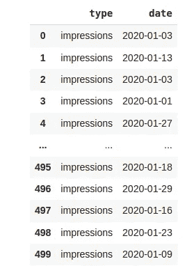
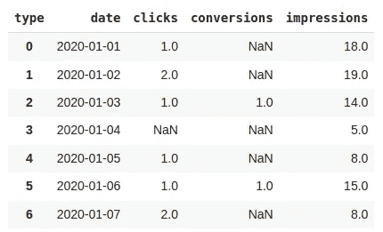
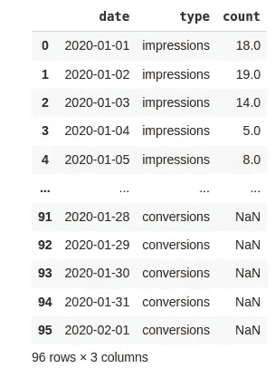
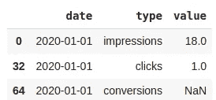
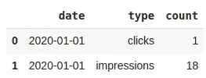

# 数据中的长和宽格式，已解释

> 原文：<https://towardsdatascience.com/long-and-wide-formats-in-data-explained-e48d7c9a06cb>


来自[佩克斯](https://www.pexels.com/photo/panda-bear-on-green-grass-3608263/?utm_content=attributionCopyText&utm_medium=referral&utm_source=pexels)的[劳拉拍摄的爆炸](https://www.pexels.com/@laurathexplaura?utm_content=attributionCopyText&utm_medium=referral&utm_source=pexels)

## 如何以熊猫的方式对待他们

表格是一种二维的、非常常用的存储和准备数据的形式，这可以通过两种方式实现:宽格式和长格式。每一个都有一些优点和缺点，我会尽我所能在这篇文章中用一些例子来描述。所以让我们开始吧。

**TL/DR** 。最好使用长格式来存储数据，并在数据分析过程的最后使用宽格式来降低数据维度。使用 Pandas 从一种格式转换到另一种格式就像编写一行代码一样简单。

## 宽幅

你可以把宽幅想象成“Excel”的样子。想想这个。你有销售人员和去年每笔销售的数据，按月分组，你如何用表格的方式表示呢？好吧，你在行中写下销售人员的名字，在列中写下年月的名字，然后在每个行/列的交叉点上写下每个销售人员的销售额($)。

```
name    jan    feb    mar    apr  ... dec
jim     $100   $200   $200   $300     $300
mike    $200   $250   $50    $100     $170
```

因为太宽了，所以我用了三个点(…)来不写四月和十二月之间的月份。您可能会说:“假设您有一个数据，按销售人员和月份分组的销售额，一个宽格式的表格可以轻松处理所有事情”。你是对的，到目前为止没问题。让我们把这个变得更难一点。假设您现在不仅有销售额($)，还有每个销售人员售出的商品数量。你再做一张像这样的桌子。

```
name    jan    feb    mar    apr  ... dec
jim     10     10     10     30       30
mike    5      20     7      25       5
```

现在您有两个宽格式的表格。如果您现在要收集每个销售人员每月工作的小时数，您现在会有 3 张表。我开始觉得这越来越重复了，你不觉得吗？

我很难想出一种方法来让我放心地将这些数据存储在数据库中。三个表存储相同月份的相同人员的数据，唯一的区别是存储的数据类型？如果我们现在想为每个销售人员存储 20 个点的数据(特征)该怎么办？我想你已经明白这个问题了。让我们试着解决它。

这些数据可以存储在一个可以生成所有这些表的表中吗？输入长格式。

但是首先，只是为了继续扩大(再次双关)这种混乱的丑陋…让我们假设您尝试使用一种广泛的方法来解决这个问题，如*“我为名称添加一列，为月份添加另一列，然后为每个功能添加一列”*；像这样的解决方案。

```
name    month    sales   items_count   hours_worked
jim     jan      bla     bla           bla
mike    feb      bla     bla           bla
...
```

嗯……这可能行得通，你不觉得吗？至少你只有一张桌子。是的，但是如果由于某种原因你的需求改变了，你需要添加(或删除)特性，你将不得不*物理地*修改这个表。另一个问题可能是，如果一个销售人员可能没有所有的功能，但只有一个子集(或一个):你会有许多空单元格。如果你用的是一个只有几行几列的 Excel 笔记本，这不成问题，但是，如果这些数据存储在一个比如说 Postgres 数据库中，每次你的数据结构改变时，你都必须运行一些 [*alter* 命令](https://www.postgresql.org/docs/9.1/sql-altertable.html)，而且还会因为空单元格而浪费空间。我不太喜欢这个想法。你呢？

现在真的，进入长格式。

## 长格式

没有太多的序言，让我向您展示上述相同的数据，但使用长格式。

```
name    month    kpi     valuejim     jan      amount  100
jim     feb      amount  120
...
jim     jan      items   10
jim     feb      items   10
...
mike    dec      amount  170
...
mike    dec      items   5
```

因为它太长了(又是双关语),我再次用了三点来说明表中没有显示所有的信息。现在我们不是每月一个专栏，而是每个特性一个专栏，再加上一个月和名字专栏。这种方法的优点如下。

*   如果丢失了一些数据，也不会浪费空间。如果发生这种情况，那么行将不存在，如此而已。
*   如果由于某种原因添加了新功能，您不必修改表结构，只需根据需要通过添加具有新功能的行来修改数据。

## 另一个长格式示例

想想这个问题。你正在记录网站上的互动，有三种类型:查看、点击和转换。当前的任务是生成一个表格，显示每天有多少浏览、点击和转换。

让我们假设当一个交互发生时，你接收到两条信息:交互的日期和时间及其类型。了解了这一点，长格式表将如下所示。

```
type    date
view    2021-12-12 23:00
click   2021-12-12 23:30
```

对于每次交互，数据都存储在一个新行中，每一行都记录了事件的类型和记录时间。现在，让我们处理报告部分。要做到这一点，一些 Python 和熊猫的魔法会很方便。

## 代码

假设创建了这个表，并且每天都记录数据，我们可以使用一个函数来获取它。在这种情况下，该函数伪造数据，在现实世界中，该函数将从数据库或其他数据源中检索数据。

首先要导入 Numpy 和 Pandas，并创建一个函数来伪造数据。

```
def build_dataframe(periods=100):
    """
    Creates columns with random data.
    """import randomrandom.seed(10)data = {
        'type': random.choices(population=['impressions', 'clicks', 'conversions'], weights=[100, 10, 1], k=periods)
    }from datetime import date, timedelta
    from random import choices

    # create some random dates in a test period 
    test_date1, test_date2 = date(2020, 1, 1), date(2020, 2, 1)

    res_dates = [test_date1]

    # loop to get each date till end date
    while test_date1 != test_date2:
        test_date1 += timedelta(days=1)
        res_dates.append(test_date1)

    # random dates
    res = choices(res_dates, k=periods)

    df = pd.DataFrame(data)
    df['date'] = res

    return df# retrieve the datalong_df = build_dataframe(periods=500)
```

我不会详细谈论这里发生的事情，因为这不太相关。检索到的数据如下所示。



build_dataframe 函数检索由两列描述的 500 行数据。图片由作者提供。

每个数据点都包含预期的事件类型和日期。我们有数据要处理。在继续之前，让我们考虑一下我们要实现的宽表格格式应该是什么样子。

我们希望每个日期有一行，三列:印象，点击和转换。每行/列的交叉点将包含每个日期的每个事件的计数。表格输出应该如下所示。

```
date         impressions     clicks     conversions
2020-01-01   1000            20         1
...
2020-01-15   500             2          n/a
...
```

注意转换列中的 *n/a* 值，这意味着在长格式源中没有该类型/日期组合的数据。

今后的任务概述如下。

1.  创建一个列来保存事件计数
2.  对长格式表进行分组，以便每个可能的日期/类型组合都有一行
3.  使用 Pandas pivot 函数构建宽格式表格输出
4.  使用 Pandas melt 函数重建长格式表格输入

完成所有后者的代码如下。

```
# Step 1: add a count column to able to summarize when grouping
long_df['count'] = 1# Step 2: group by date and type and sum
grouped_long_df = long_df.groupby(['date', 'type']).sum().reset_index()# Step 3: build wide format from long format
wide_df = grouped_long_df.pivot(index='date', columns='type', values='count').reset_index()# Step 4: build long format from wide format
new_long_df = new_long_df = pd.melt(wide_df, id_vars=['date'], var_name='type', value_vars=['impressions', 'clicks', 'conversions'], value_name='count')
```

哇！只需四行代码就可以完成所需的转换。如果你熟悉熊猫，步骤 1 和 2 是不言自明的，所以让我们解释一下步骤 3 和 4 中发生了什么。

**第三步**

熊猫 *pivot* 函数需要一个长格式输入，其中作为索引参数传递的所需列的值对于每个索引/列(日期/类型)组合都是唯一的。这就是为什么需要对原始的长格式表进行分组，以便每个日期/类型组合有一行。Pandas 将为 type 列中的每个值创建一个列，并将 count 列中的值放在 date/type 交集中，如 values 参数所述。让我们看看 wide_df 变量中包含的表。



wide_df 的内容。图片由作者提供。

请注意，每个日期有一行，有 3 个数据列:印象、点击和转换。当 Pandas 在任何给定日期找不到某个类型的相应值时，就会插入一个 NaN 值。这太棒了！

> 随着第三步的完成，我们可以说我们的工作已经完成了。我们生成了一个表，其中包含检索到的每个日期的事件计数。**干得好！**

你可以把这个放在一个 [Streamlit 仪表盘](https://jonathanserrano.medium.com/a-streamlit-dashboard-5-steps-from-zero-to-docker-deployed-b06b9df940c8)里？

现在让我们集中精力完成最后一步。

**第四步**

Pandas *melt* 函数从宽格式数据帧构建一个长格式数据帧。该函数希望您告诉它 1)哪一列将用作新行引用(id_vars)，在我们的示例中是日期列，2)哪些列将被堆叠到新列中(value_vars)，3)它的名称是什么(var_name)，最后 4)包含堆叠列值的列的名称是什么(value_name)。

结果存储在 new_long_df 变量中，如下所示。



new_long_df 数据帧内容。图片由作者提供。

看起来和 build_dataframe 函数创建的 dataframe 非常相似！然而*非常相似*是不够的，我们应该通过比较 new_long_df 和 grouped_long_df 中包含的一个日期的数据来进一步挖掘。

日期 2020 年 1 月 1 日怎么样？让我们通过查询两个数据框来尝试一下。

第一个 new_long_df。

```
new_long_df[new_long_df['date'] == datetime.date(2020, 1, 1)]
```



new_long_df 中包含的日期为 2020 年 1 月 1 日的数据。图片由作者提供。

现在原 grouped_long_df。

```
grouped_long_df[grouped_long_df['date'] == datetime.date(2020, 1, 1)]
```



grouped_long_df 日期为 2020 年 1 月 1 日的内容。图片由作者提供。

这对于我来说已经足够了:两个数据框都同意当天有 1 次点击，18 次展示，零转化！

## 结论

这篇文章试图通过一些例子来描述什么是长表格和宽表格，以及如何使用 Python 和 Pandas 来处理它们。每种格式最适合某些任务:长格式允许更密集地存储数据，而宽格式在报表中需要表格格式时具有更强的解释力。根据您期望完成的任务，选择哪种格式效果最好由您决定。

你可以在这里找到一个谷歌 Colab 笔记本[。](https://colab.research.google.com/gist/jonaths/c81432384c2e9aa8b246c79e3f17a173/long_short_format.ipynb)

*如果你喜欢这些内容，请关注我并分享！*