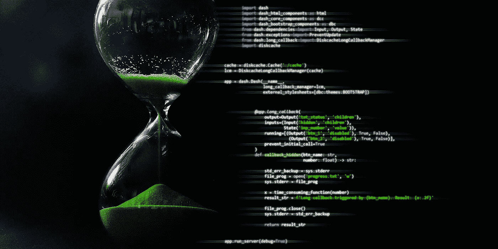
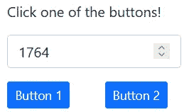
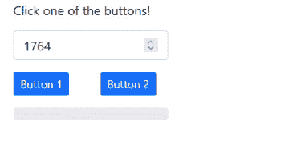

# Dash Web 应用程序中的长时间回调

> 原文：<https://towardsdatascience.com/long-callbacks-in-dash-web-apps-72fd8de25937>

## *如何处理 Python Dash web 应用回调函数中耗时的代码*

图片由作者提供，基于 [moritz320](https://pixabay.com/de/users/moritz320-1260270/) (Pixabay)的[股票图片](https://pixabay.com/de/photos/zeitlicher-abstand-chronometer-dauer-1990035/)。

你用 Python 开发 web 应用，有耗时的代码要运行？要从数据库中查询大量记录，要执行复杂的评估，要创建复杂的可视化？那么 Dash 2.0 引入的长时间回调可能正是你所需要的。

对于长回调，web 服务器的超时设置(在许多情况下为 30 秒)在执行耗时的代码时不会给你带来任何问题。长回调在一个单独的进程中运行，并带有额外的选项，允许您提高应用程序的响应能力，例如，通过阻止触发它的按钮或通过可视化回调的进度。

# 长时间回调与正常回调

在 Dash 中，回调是通过将回调装饰器`@app.callback(...)`放在相应的函数之上来声明的。对于长回调，也是一样的，只是使用了稍微不同的装饰器，提供了额外的功能。以下是长时间回调和普通回调之间的区别:

*   长回调在单独的进程中运行，不会导致超时错误。
*   为了让长回调生效，您必须安装一些您可能不需要的包(见下一节)。
*   `@app.long_callback(...)`是声明长回调时必须使用的装饰器。
*   `running`、`cancel`、`progress`:除了`Input`、`Output`和`State`参数之外，这些可选参数在长回调装饰器的括号内。我稍后将讨论这些新特性。
*   在有多个输入的情况下，用于标识触发回调的组件的`dash.callback_context`在长回调中不受支持。如果您需要这个功能，我将向您展示一个变通方法。
*   `raise PreventUpdate`(从`dash.exceptions`导入)不应该和`running`参数一起使用，因为它会让你的应用无限期地保持在`running`选项定义的状态(直到页面重新加载)。

# 准备好

如果你是 Dash 新手，我强烈建议你看一下[文档](https://dash.plotly.com/introduction)。在开始玩长时间回调之前，你至少应该熟悉[回调基础](https://dash.plotly.com/basic-callbacks)。本文中的代码需要以下 Python 包:

*   `dash`(2 . 0 . 0 版本；早期版本不支持长回调)
*   `dash_bootstrap_components`(版本 1.0.0)
*   `diskcache`
*   `multiprocess`
*   `psutil`

都安装好了吗？很好，现在让我们看看如何使用长回调。

# 开始编码

我们将从一些进口开始。我们可以不用 [Dash Bootstrap 组件](https://dash-bootstrap-components.opensource.faculty.ai/docs/quickstart/)来构建应用程序，但我喜欢它们，因为它们可以轻松创建整洁且响应迅速的布局。`time`包只需要模拟耗时代码的执行。

我在`main()`函数中设置了应用程序的布局及其回调，该函数在脚本的最后一行被调用。我们做的第一件事是创建一个回调管理器对象和 Dash 应用程序对象，它将回调管理器作为一个参数。

请注意，我们使用的是一个 [DiskCache](http://www.grantjenks.com/docs/diskcache/tutorial.html) 回调管理器，这对于开发来说非常好，而 Dash 的开发者推荐[芹菜](https://docs.celeryproject.org/en/stable/getting-started/introduction.html) / [Redis](https://redis.io/documentation) 用于生产。在这个例子中，回调管理器将在包含 Python 脚本的目录中创建一个名为`cache`的文件夹。

接下来，我们添加所有的 GUI 组件，即一行文本(`html.Div`)、一个数字输入字段(`dbc.Input`)、两个按钮(`dbc.Button`)和另一个名为`hidden`的`html.Div`元素，它是不可见的(我一会儿会解释)。

使用`dash_bootstrap_components`，布局被构建为行的集合(`dbc.Row`)，每一行可以包含几列(`dbc.Col`)。最后，所有行都放在一个`dbc.Container`对象中，该对象被插入到 Dash 应用程序对象的`layout`属性中。生成的 web 应用程序 GUI 如下面的屏幕截图所示。

现在是时候将按钮链接到回调了。我们在这个例子中使用两个按钮的原因是我想告诉你如何找出哪个组件触发了长回调，尽管我们不能在长回调中使用`dash.callback_context`。我使用的解决方法是编写一个普通的回调函数，将两个按钮作为输入，不可见的`html.Div`元素`hidden`作为输出。

在这个普通的回调函数中，我们可以获得触发回调函数的组件的 ID，如上面的代码所示。基于这个 ID，我们设置了`hidden`组件的`children`属性。我还在这里演示了`PreventUpdate`的使用，这在回调应该保持输出属性不变的情况下很有用。

区分这两个按钮的诀窍在于，`hidden`组件的更新(其`children`属性现在包含被单击按钮的名称)触发长回调。

除了提供按钮名称的`hidden`组件，长回调使用数字输入字段作为输入。然而，为此我们使用了`State`而不是`Input`，这样可以防止输入字段值的改变触发回调。`running`参数需要一个元组列表，每个元组控制一个组件属性的行为。该组件属性是元组的第一个元素，回调运行时它的值是第二个元素，结束时它的值是第三个元素。`prevent_initial_call=True`参数确保在加载应用程序的布局时(在用户做任何事情之前)不会执行长回调。

装饰器的可选参数`cancel`在示例中没有使用，但是当您希望能够中断长时间回调的执行时，它可能会派上用场。语法是`cancel=[Input('component', 'property')]`，对指定组件属性的任何更改都将取消回调的执行。

在长回调函数中，你可以执行耗时的代码。在这个例子中，我们调用`time_consuming_function(number)`，它接收数字输入字段的值作为参数。

这个函数使用`time.sleep(seconds)`来模拟耗时代码的执行，然后返回传递给它的数的平方根。

当您单击两个按钮中的一个时，会有一个延迟(在代码示例中为 2 秒)，之后,`html.Div`元素`txt_status`将用结果(数字输入字段的平方根)和您单击的按钮的名称进行更新。执行回调时，两个按钮都被禁用。恭喜你，你刚刚成功使用了 Dash 的长回调逻辑！

# 显示进度

当您的 web 应用程序执行耗时的代码时，让用户了解进度是有意义的。方便的是，长回调带有一个`progress`参数，该参数接受一个`html.Progress`组件，从而允许您从长回调中更新进度条的值。你可以在 Dash 的[长回调文档](https://dash.plotly.com/long-callbacks)中找到解释这个功能的教程(例 4)。

在这里，我将向您展示一种不同的方法。假设您的长回调调用了另一个模块中的一个函数，该函数最初是在不同的上下文中编写的，例如，您在控制台环境中用于数据操作的脚本。这个脚本很可能已经使用了`tqdm`或者可以很容易地修改成这样(并且很可能从这样的修改中受益)。如果你不熟悉`tqdm`包，我强烈建议你看一下[文档](https://tqdm.github.io/)。简而言之，它允许你通过显示一个可以在各种环境下工作的进度条来度量任何类型迭代的进度。

以下是如何在不编辑现有代码的情况下，将现有代码中的`tqdm`进度跟踪链接到 web 应用程序中的长回调:

*   将`tqdm`输出重定向到一个文件。
*   编写一个定时器触发的回调函数，定期读取这个文件。
*   从文件中提取最近的百分比值，并相应地更新进度条。

要设置这个功能，我们需要三个额外的导入:

我们修改`row_3 = ...`行下面的`main()`函数的代码如下:

这段代码向我们的布局添加了第四行，其中包含一个进度条和一个计时器(不可见)，它每秒“滴答”一次。当它这样做时，它触发下面的回调函数，您可以将它添加到其他两个回调函数的下面。

`try-except-finally`语句用于确保即使文件`progress.txt`不存在或者其内容不符合预期，代码也能工作。如果文件包含正确的`tqdm`输出，代码将找到最后一个非空行，并提取该行开头的百分比值。然后，该函数将该值返回给`dbc.Progress`组件的`value`属性，并将相应的文本返回给其`label`属性。

为了将`tqdm`的输出重定向到文件`progress.txt`，我们需要修改长回调中的代码，如下所示:

默认情况下，`tqdm`将其输出写入`sys.stderr`。上面显示的代码保存当前的`sys.stderr`设置，然后将其更改为文件`progress.txt`，执行耗时函数，最后恢复`sys.stderr`的原始设置。

为了测试这个功能，我们修改了这个耗时的函数，这样它就包含了一个由`tqdm`跟踪的迭代:

这就是你将`tqdm`链接到你的网络应用的进度条所需要做的一切！当您完成代码修改后，在运行脚本并单击按钮时，您应该会看到类似这样的内容:

我想用一个简短的回顾来结束我的发言。你刚刚才知道

*   多头回调在哪些方面不同于标准回调。
*   使用长回调的先决条件是什么。
*   如何实现一个长回调的基本结构，这个回调知道它是由哪个组件触发的。
*   如何访问`tqdm`的输出来跟踪可能属于另一个模块的代码的执行进度。

感谢您的阅读。如果你觉得这篇文章很有趣，请考虑[订阅](https://thomas-baumgartner.medium.com/subscribe)以在未来获得更多这样的内容。如果你还没有中级会员，你可以在这里得到一个。