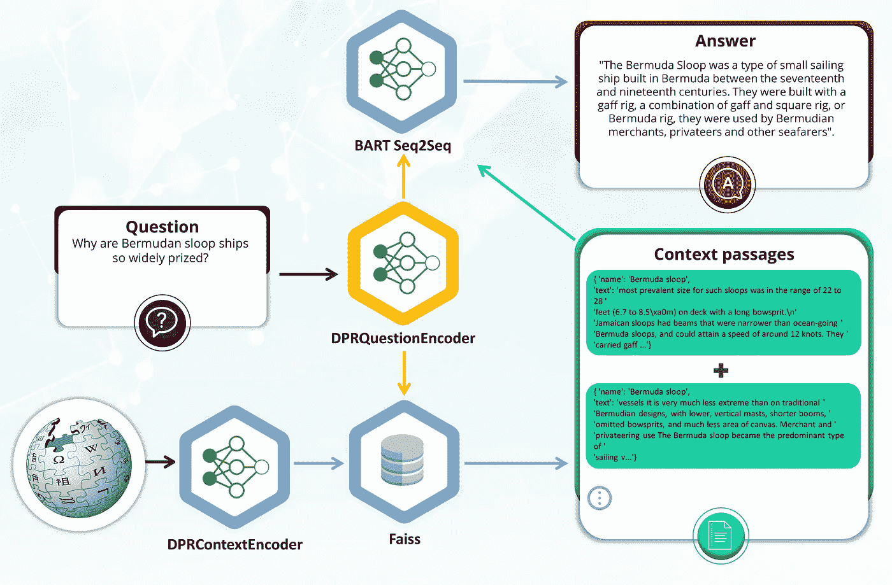
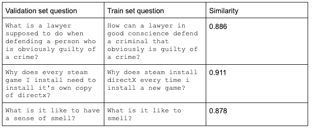
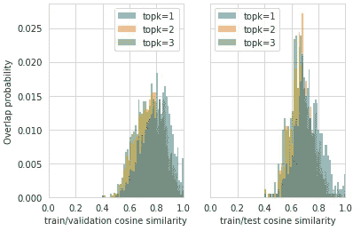
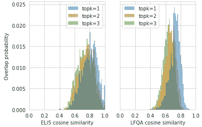
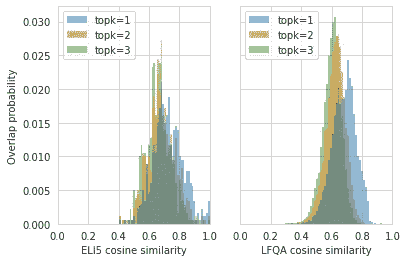
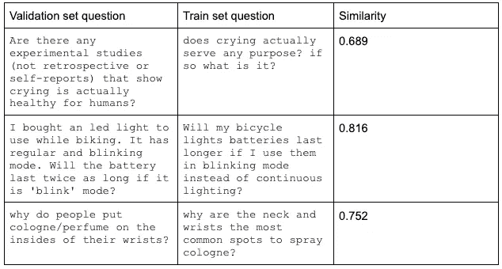

# 超越 ELI5 的长篇问答:一个更新的数据集和方法

> 原文：<https://towardsdatascience.com/long-form-qa-beyond-eli5-an-updated-dataset-and-approach-319cb841aabb>

## 我们介绍了 ELI5 数据集的后继者，这是一个构建长格式问题回答(LFQA)的基础，这是一个为开放式问题生成详细答案的任务

每天我们打开笔记本电脑和智能手机，打开网络浏览器，导航到我们最喜欢的搜索引擎，搜索我们问题的答案。这种惯例框定了我们的个人和职业生活。现代搜索引擎提供网站推荐，而不是简单的答案。但这种情况即将改变。

下一代搜索引擎的原型已经在这里，它们只是对公众隐藏起来，目前仅限于 OpenAI 和 DeepMind 等公司的研究实验室。仅仅相隔几天，2021 年 12 月，OpenAI 和 DeepMind 都发布了这些系统的预览。OpenAI 展示了一个系统，它可以综合我们网络搜索类问题的原始答案，同时引用网络参考来支持这些答案。DeepMind 发布了一个检索增强的 Transformer (RETRO)，专门从事知识密集型开放式问题回答。

虽然这些都是令人兴奋的发展，但基于所谓的长格式问答(LFQA)的系统仍未准备好被广泛采用。我们希望今天发布的 LFQA 数据集是朝着正确方向迈出的又一步。除了 LFQA 数据集，我们还发布了基于 BART 的 Seq2Seq 模型的新版本，用于抽象答案生成和匹配基于 DPR 的问题和上下文段落编码器。

让我们深入研究数据集，这是 LFQA 系统背后的一个重要难题，以及我们改进它的工作。我们将涵盖最初的绊脚石和我们前进的尝试，并解决阻碍这一激动人心的领域进展的一些障碍。

**背景**

在过去的几年里，我们见证了自然语言处理(NLP)的惊人进步。基于最新语言模型(BERT、Roberta 等)的问答系统。)可以相对轻松且精确地回答基于仿真陈述的问题。这些问答系统提出一个问题，找到相关的文档段落，并通过扫描正确的单词标记范围来提取最可能的答案。

最近，研究人员开发了更复杂的问答系统，可以回答需要大段答案的开放式问题。这些系统通常被归类为长格式问题回答(LFQA)系统。它们通过在大型文档库中查询相关信息，然后使用检索到的文档来生成精确的多句子答案。与给定查询相关的文档，通俗地称为上下文段落，不仅仅用作提取的答案的源标记，而是为原始的、抽象的长形式答案的合成提供更大的上下文。LFQA 系统通常由三部分组成:

*   包含各种主题的内容段落的文档存储
*   检索器模型对文档/问题进行编码，以便可以查询文档存储
*   Seq2Seq 语言模型能够在给出问题和从文档存储中检索的上下文段落时生成整段的答案



LFQA 架构—作者图片

**动机**

这些组成部分提出了一些挑战，但最近取得了进展。2019 年，Angel Fan 等人在他们的开创性研究论文[“Eli 5:长格式问答”](https://arxiv.org/abs/1907.09190)中正式介绍了长格式问答的任务。它包含了来自 Reddit 论坛的 27 万个问题/答案对的数据集，“像我五岁一样解释”(ELI5)，这是一个在线社区，致力于使用五岁儿童可以理解的语言回答复杂的问题。ELI5 数据集由不同的问题组成，这些问题需要大段的答案。尽管生成 ELI5 答案的 Seq2Seq 模型产生了相对可理解的答案，但人类评估者在超过 86%的情况下更喜欢黄金答案，这表明了未来改进的潜力。

最近，Krishna 等人在他们的论文[“长格式问题回答进展的障碍”](https://arxiv.org/abs/2103.06332)中描述了他们如何使用 REALM 初始化的、基于 BERT 的检索器和基于路由转换器的 Seq2Seq 答案生成模型来改进原始 LFQA 任务。除了在 LFQA 任务 KILT 基准上达到“最先进”水平，Krishna 等人还发现了 LFQA 的四个悬而未决的问题:

*   ELI5 数据集具有显著的训练/验证/测试数据集重叠
*   答案生成不以检索(上下文段落)为基础
*   LFQA 任务指标需要改进
*   人工评估具有挑战性，但对于评估 LFQA 是必要的

这些问题中的每一个对于整体上改进 LFQA 任务都是非常重要的。

**LFQA 数据集—减少 ELI5 训练/验证/测试重叠**

着眼于推进和改进 LFQA，我们创建了一个训练/验证/测试数据集，与 ELI5 数据集相比，该数据集减少了重叠。我们怀疑减少重叠可能会改善答案在各自检索中的基础。

我们使用[句子-BERT](https://www.sbert.net/) (SBERT)、语义搜索工具和 HuggingFace (HF) ELI5 数据集来比较训练、测试和验证集中的问题，以衡量语义相似性。更准确地说，我们比较了数据集问题的前 K 个相似性得分(K = 1，2，3 ),并证实了 Krishna 等人报告的重叠结果。

使用人类的判断，我们已经发现高于余弦相似度阈值 0.8 的问题非常相似，而高于 0.84 的问题几乎是相互转述。以下是从 KILT ELI5 验证集中选择的几个示例问题，训练集中最相似的“兄弟”问题，以及它们各自的余弦相似性。



ELI5 问题示例—作者图片

Krishna 等人进行了一项人类研究，发现“81%的验证集问题在训练集中至少有一个释义，而所有带注释的问题在训练集中至少有一个主题相似的问题，这表明大量的训练/验证重叠。”

使用 SBert，我们为验证和测试集中的每个问题在训练集中搜索语义最相似的问题。然后，我们绘制了数据集中训练/验证和训练/测试问题之间语义相似性的概率。如下面的重叠概率图所示，在训练集中，验证问题具有非常相似的问题“兄弟”的概率确实很大。然而，我们的估计比 Krishna 等人报告的 81%要小一些，更接近 60-65%。



ELI5 训练/验证和训练/测试重叠(0–1 相似性范围的 50 个箱)-按作者分类的图像

虽然比训练/验证重叠稍小，但是测试和训练集问题之间显著语义相似的概率也很高。

新的 LFQA 数据集包含来自三个 Reddit 论坛的问题/答案对:r/explainelikeimfive、r/ask histories 和 r/askscience。我们的目标是创建一个新的 LFQA 数据集，包含训练/验证/测试分割，以便:

*   所有三个子网格在所有分割中被同等地表示
*   与旧的 ELI5 数据集相比，训练/验证/测试重叠被最小化，同时保持数据集的大小
*   验证/测试分割包含来自数据集的 KILT 版本的所有 ELI5 测试/验证示例
*   验证和测试分割包括具有高 Reddit 分数(投票)的问题

由于问题嵌入在空间上不是均匀分布的，我们求助于层次聚类。在问题空间的密集部分中具有 0.9 点积的两个问题可能需要不同的答案，而相反，在空间的稀疏部分中具有 0.8 点积的问题可能是同一问题。

在分层问题聚类之后，我们尝试了一种只选择叶节点的启发式方法，但是这种方法导致数据集的数据点太少。由于一些非叶节点彼此非常接近，我们添加了一个自适应停止标准，该标准只到达某个深度、连接相似性阈值或子树中的一些项目。正如我们将在下面看到的，0.83 的点积相似性阈值产生了适当大小的数据集，但训练/验证/测试重叠更小。正如您在下面的相似性概率图中看到的，与 ELI5 数据集(左)相比，新的 LFQA 数据集(右)的训练/验证重叠显著减少，相似性更高。只有一小部分问题的最大相似度为 0.83——大多数重叠问题的相似度为 0.75 及以下。



ELI5 与 LFQA 训练/验证重叠(0–1 相似性范围的 50 个箱)-按作者分类的图像

同样，训练/测试重叠也减少了。



ELI5 与 LFQA 训练/测试重叠(0–1 相似性范围的 50 个箱)—作者图片

以下是从 LFQA 验证集中选择的几个示例问题，它们在训练集中最相似的“兄弟”问题，以及它们各自的余弦相似性。在训练/验证和训练/测试集中没有相似性超过 0.83 的问题。



LFQA 问题示例—作者图片

LFQA DPR 寻回犬

为了生成所提问题的答案，抽象答案生成模型依赖于检索器来找到相关的上下文段落。LFQA 检索器由基于 DPR 的问题和上下文编码器组成。

我们分两个阶段使用 [FAIR 的 dpr-scale](https://github.com/facebookresearch/dpr-scale/) 训练我们的 DPR 寻回犬。在第一阶段，我们使用基于 PAQ 的预训练检查点，并在 LFQA 数据集的问答对上微调检索器。由于 dpr-scale 需要具有阳性、阴性和硬阴性样本的 dpr 格式的训练集输入，我们创建了一个训练文件，其中阳性对应于一个答案，阴性是与问题无关的答案，而硬阴性样本选自余弦相似度在 0.55 和 0.65 之间的问题的答案。在第二阶段，我们使用来自第一阶段创建的维基百科/Faiss 索引而不是来自 LFQA 数据集答案的正面、负面和硬负面来创建新的 DPR 训练集。更准确地说，对于每个数据集问题，我们查询第一阶段维基百科/Faiss 索引，随后使用 SBert 交叉编码器对 topk=50 的问题/答案(段落)对进行评分。交叉编码器选择正样本以对应于具有最高分数的段落，底部的七个答案被选择用于硬负样本，而负样本再次是与给定数据集问题无关的答案。在用维基百科来源的正面、负面和硬负面段落创建了 DPR 格式的训练文件后，我们使用 dpr-scale 训练了 DPR 的问题/段落编码器。新的 LFQA DPR 检索器的性能略低于 Krishna 等人使用的 REALM 检索器，R-precision 的 KILT 基准性能为 11.2，Recall@5 的 KILT 基准性能为 19.5。

**演示**

为了纪念新的 LFQA 数据集、基于 LFQA BART 的 Seq2Seq 模型和基于 DPR 的 retriever 模型的发布，我们还在 https://huggingface.co/spaces/lfqa/lfqa[发布了维基百科助手的 HuggingFace Spaces 演示](https://huggingface.co/spaces/lfqa/lfqa)

为了找到与问题相关的维基百科上下文段落，我们使用 cortex.dev ML 部署平台在 AWS 云上部署了一个上下文服务器。上下文服务器包含加载到 FAISS 索引中的维基百科快照的编码版本。用户可以问与科学、历史和维基百科上的其他不同主题相关的长格式开放式问题。给定一个任意的用户问题，DPR 检索器将从上下文服务器中检索相关的文档，并将它们传递给 BART LFQA 模型，该模型将生成一个抽象的答案，并且传递给文本到语音模型，该模型将生成一个音频响应。在前面提到的 HuggingFace Spaces 位置可以获得演示以及模型训练代码和实用程序。

我们今天发布的 LFQA 数据集有 226147 个训练，3020 个验证和 10000 个测试样本。LFQA 数据集具有显著减少的训练/验证/测试重叠，可以成为解决长格式问题回答中剩余障碍的垫脚石。

LFQA 数据集、基于 DPR 的检索器和新的基于 LFQA BART 的抽象答案生成模型都可以在 https://huggingface.co/vblagoje[的 HuggingFace hub 上获得](https://huggingface.co/vblagoje)

我们要感谢 Yacine Jernite 在整个项目中提供的宝贵反馈。布兰登·陈、巴勃罗·罗德里格斯·贝托雷罗、苏奇米特·马哈帕特拉和克里斯蒂娜·克雷斯勒对本文的初稿提供了反馈。

**BibTeX 引文**

```
@article{blagojevic2022lfqa,
  author={Vladimir Blagojevic},
  title={Long-Form QA beyond ELI5: an updated dataset and approach},
  year={2022},
  url={towardsdatascience.com/long-form-qa-beyond-eli5-an-updated-dataset-and-approach-319cb841aabb},
}
```

**附录**

**来自验证集的示例问题及其生成的答案**

是什么造成了高空喷气式飞机后面的尾迹？

它被称为轨迹，是由喷气发动机排气中的水蒸气凝结造成的。水蒸气凝结在喷流的排气羽流上，当它凝结时，会在喷流后面留下一条尾迹。

为什么我可以在嘈杂的环境中入睡(学校讲座、公共交通、电影院等)，但当我在床上时，更小的噪音也会打扰我的睡眠？

我认为这与你大脑的工作方式有关。当你处于安静的环境中时，你的大脑不需要像醒着时那样处理大量的信息，所以你不需要那么多的处理能力来入睡。这就是为什么你会在嘈杂的环境中睡着(学校讲座、公共交通、电影院等)。)但是更小的噪音也会打扰你的睡眠。

马里正在发生什么，德国和法国与此有什么关系？

马里是非洲萨赫勒地区的一个国家。它有大量的穆斯林人口。过去几年，马里发生了多起恐怖袭击事件。马里政府无力阻止这些袭击，被迫诉诸军事行动来阻止这些袭击。德国和法国决定向马里派兵，帮助马里政府打击恐怖分子。这是欧盟军队首次在非洲部署。

教皇实际上是做什么的？

教皇是罗马天主教会的领袖。他也是整个天主教会的领袖。教皇是由枢机主教团选出的，枢机主教团是由教会的主教们选出的一群枢机主教。该学院由来自世界各地的主教组成，教皇由他们推选为罗马主教。