# 纵向自我监督学习

> 原文：<https://towardsdatascience.com/longitudinal-self-supervised-learning-29d205129f97>

## 利用纵向测量来学习更好的表达

纵向自我监督学习是一种令人兴奋的新方法，用于在重复测量的大型数据集上进行学习。这尤其适用于医学领域(成像、表格健康记录数据等。)，其中患者可能有几个月或几年的数据点，但并非所有数据点都有确切的标签(例如，特定疾病的存在)。

在 [Unsplash](https://unsplash.com?utm_source=medium&utm_medium=referral) 上由 [Aron 视觉](https://unsplash.com/es/@aronvisuals?utm_source=medium&utm_medium=referral)拍摄的照片

# 背景

自我监督学习(SSL)是近年来深度学习领域的热点之一。在自我监督学习中，我们训练一个模型在不使用标签的情况下对我们的数据执行任务。这有助于我们了解数据的有意义的表示，然后可以用于下游任务(如对感兴趣的下游标签的预测)。换句话说，我们可以在大型未标记数据集上进行自我监督学习，然后在较小的标记数据集上进行“微调”或继续训练，以从标记和未标记数据的组合中提取最大性能。这种方法与当今大量未标记数据(视频、自由文本、医疗记录等)的可用性相一致。).

我们为 SSL 选择的任务很重要。它应该允许我们学习一些语义表示。一个简单的例子是轮换任务。我们可以手动将图像旋转一个随机角度，并训练一个模型来预测旋转量。如果我们的数据集主要是人或脸，模型应该能够学习有意义的特征，如眼睛，头发等。以便预测正确的旋转(例如，它应该学习 1)识别眼睛和头发，以及 2)头发在眼睛上方/旁边)。

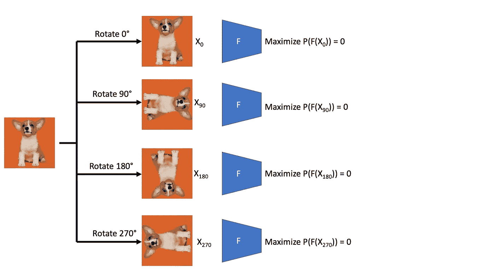

轮换任务。图片由作者提供，灵感来自 [Gidaris 等人，2018](https://arxiv.org/abs/1803.07728) 。照片由 [Alvan Nee](https://unsplash.com/@alvannee?utm_source=medium&utm_medium=referral) 在 [Unsplash](https://unsplash.com?utm_source=medium&utm_medium=referral) 上拍摄

在**对比学习**中，一种流行的 SSL 方法，我们收集正面和负面样本。我们训练模型以最小化阳性样本(锚和阳性)之间的嵌入距离，同时最大化阴性样本(锚和阴性)之间的距离。在图像域中，负样本可以是不同的图像，而正样本可以是原始图像的增强版本，使得图像的语义保持不变(例如，裁剪、旋转、颜色失真)。

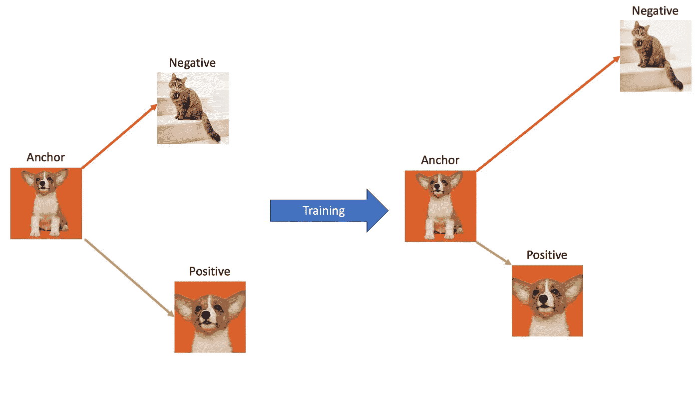

对比学习的例子。正对的潜在表示(具有缩放+裁剪放大的相同图像)被拉近，而负对被推得更远。注意:我们没有使用标签知识进行自我监督学习，所以负面图像可能是另一只狗。图片由作者提供，照片由 [Alvan Nee](https://unsplash.com/@alvannee?utm_source=medium&utm_medium=referral) 和 [Alexander London](https://unsplash.com/@alxndr_london) 在 [Unsplash](https://unsplash.com/) 上拍摄。

# 纵向自我监督学习

医学领域的数据为自我监督的学习任务提供了新的机会，而不仅仅是增加单个数据点。我们有复杂的数据，如健康记录或 3D 医学图像，并且我们经常有来自一个主题的许多数据点。这使我们能够学习捕捉与疾病进展、衰老或发育相关的时间相关信息的表征。我将讨论一些自我监督学习的方法，首先是一些对比方法，然后是一些非对比方法。

## 排列对比学习

纵向 SSL 的早期方法是排列对比学习(PCL) [4]。在 PCL 中，我们通过从同一受试者中以正确的顺序**获取两个**连续的**窗口或时间数据点来创建正对。对于负配对，我们从同一受试者身上随机选取两个窗口。然后，我们可以训练一个二元分类器来预测图像对是正面的还是负面的。正面和负面配对的直观示例如下所示:**

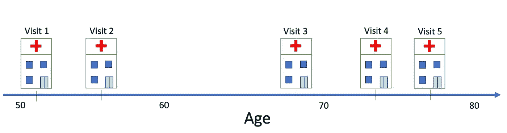

5 次就诊的单患者轨迹示例。图片作者。

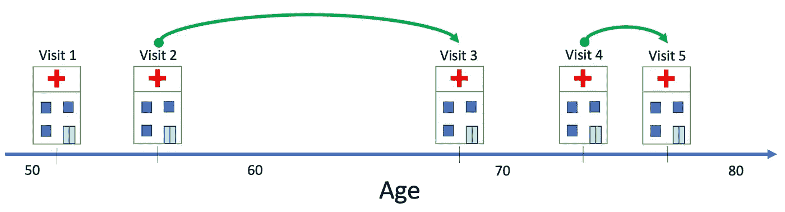

两个可能的 PCL 阳性样本。阳性样本必须连续且顺序正确。图片作者。

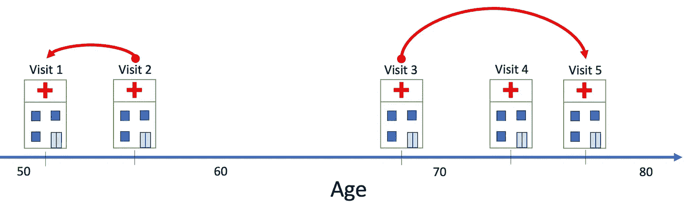

两个可能的 PCL 阴性样本。阴性是随机选择的配对。图片作者。

请注意，这项任务不一定要学习跨主题的差异，因为配对总是来自同一主题。这使得我们的模型能够关注重要的纵向过程。

## 订单对比预培训

PCL 的一个问题是阴性样本是完全随机选择的。它们实际上可能处于正确的顺序，但仍然被标记为阳性。最近的一种方法，称为顺序对比预训练(OCP) [1]，通过将正样本约束为**连续、正确排序的**窗口，将负样本对约束为**连续、错误排序的**窗口，来改进 PCL。

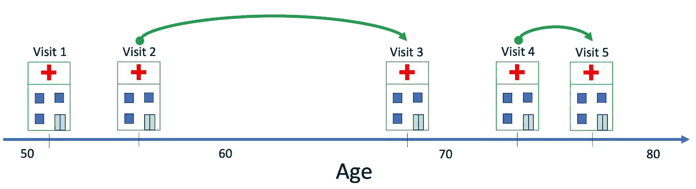

两个可能是 OCP 的阳性样本。阳性样本必须连续且顺序正确。图片作者。

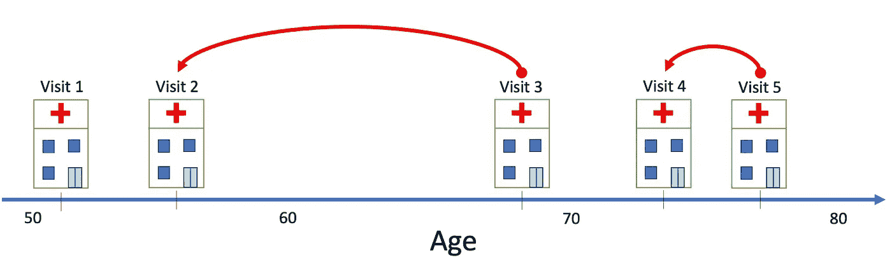

两个可能的 PCL 阴性样本。阴性样本必须连续且顺序错误。图片作者。

OCP 的作者表明，在纵向表征学习方面，它在经验上和理论上都优于 PCL。他们通过 1)电子健康记录的特征选择(即 L1 回归)和 2)临床放射学笔记的 NLP，使用了表征学习的例子。

## 潜在空间排列

另一类纵向 SSL 方法采用了与对比 OCP 和 PCL 方法完全不同的方法，主要应用于医学成像。在这种方法[7]中，我们学习了一个标准的自动编码器，它将图像编码为潜在的表示，并将其解码为重建的图像。

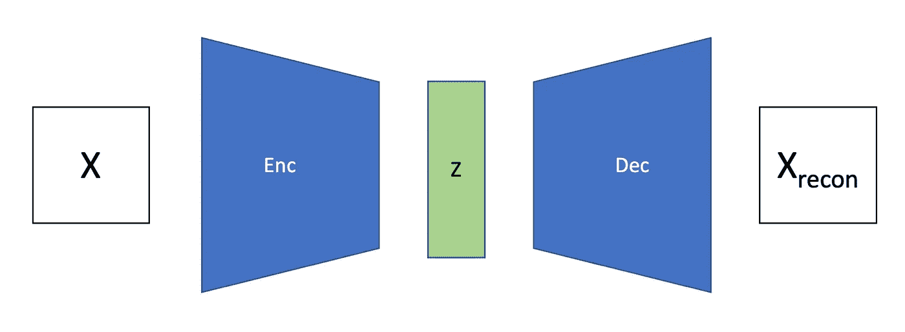

标准自动编码器。图像 X 被编码成潜在表示 Z，然后由作者重新构造回图像 X。

除了标准重建损失(即均方误差)，还有对准损失。我们在潜在空间中学习一些单位向量τ，并强制相同主题的图像对仅在τ方向上变化，如下所示。

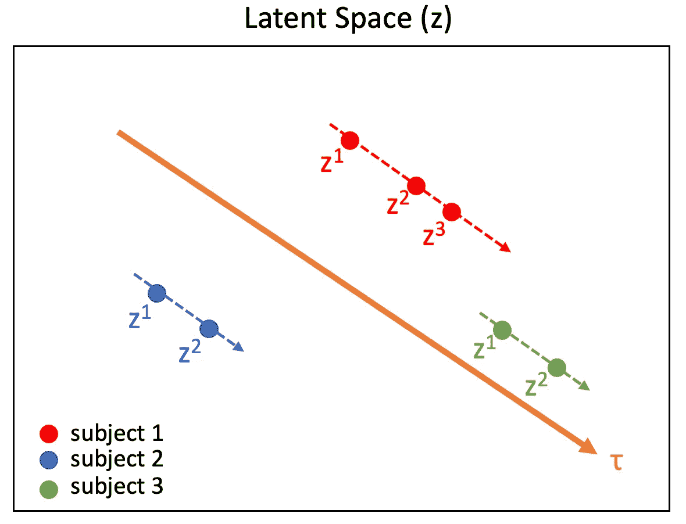

纵向 SSL 的潜在对齐方法。每个对象的表示被迫与轨迹向量τ对齐。图片由作者提供，灵感来自[7]。

这可以通过余弦损失项来实现:

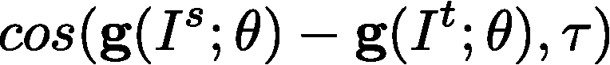

图片由作者提供；

其中 g 是编码器函数，I^s 和 I^t 是来自两个独立时间点和同一对象的图像对，并且 *θ* 是模型参数。我们试图最大化这一项。直觉是这样的:使相同主题图像表示中的差异平行于τ，这意味着该差异向量和τ之间的角度应该为 0。这使余弦函数最大化。

这种比对允许我们在潜在空间中学习有意义和可解释的纵向年龄因素(在人类受试者的情况下), 1)不需要年龄或疾病标签，2)优于简单地训练模型来预测年龄以获得年龄相关的表征。与其他流行的 SSL 方法相比，自我监督训练在利用大脑图像进行下游疾病预测任务时表现更好。

对原始纵向比对方法的后续研究[5]提出了一种更灵活的扩展，称为纵向邻域嵌入(LNE)。这种方法的总体思路是，我们可以强制相似的对象(基于潜在空间中的距离)具有相似的纵向轨迹，而不是强制全局轨迹方向τ。LNE 的损失函数几乎与全局对准的损失函数相同，但是代替最大化图像对潜在差异和τ之间的余弦，我们用δh 代替τ，δh 是 N 个最近嵌入的距离加权平均轨迹。

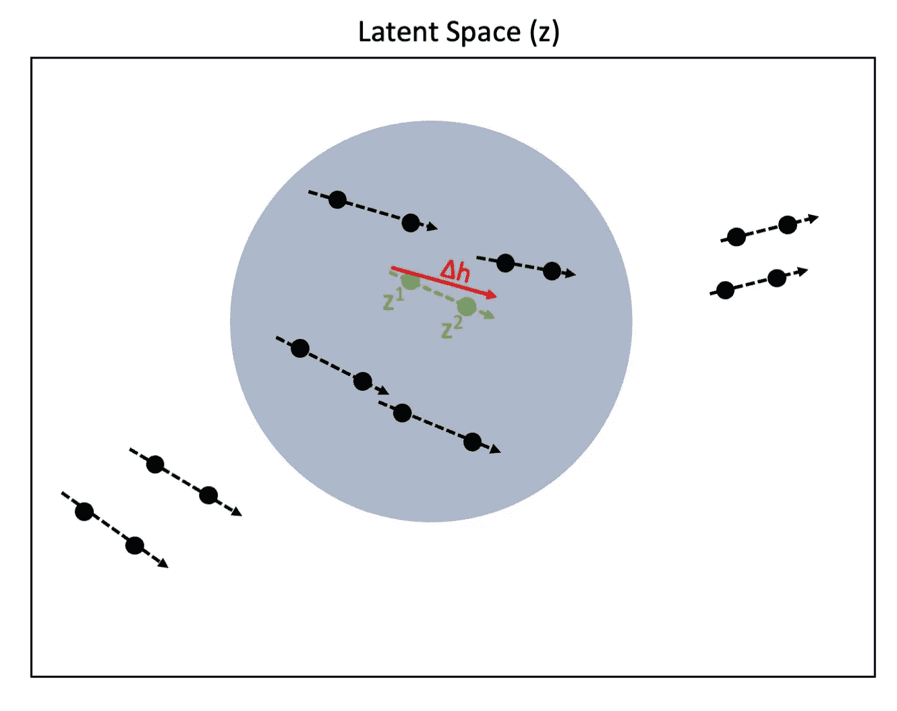

*纵向邻域嵌入。对于图像对(标记为 z1，z2)，我们鼓励它们的轨迹与它们的邻域(阴影圆)的平均轨迹**δh 相匹配。图片由作者提供，灵感来自[5]。*

这种方法同样适用于脑成像。大脑年龄，或大脑解剖结构随时间的变化，即使在像阿尔茨海默氏病这样的单一疾病中也是高度异质性的。然而，这些路径可能属于定义相对明确的簇[6]，使得轨迹邻域模型非常适合于模拟大脑老化过程。

## 图像校正

纵向自我监督学习的最后一种方法包括随着时间的推移从同一对象获取一对图像，对第二图像的部分进行修补或涂黑，并使用这两幅图像(完整的第一图像，受损的第二图像)来预测校正后的图像[2]。提出这种方法的论文将其用于肺部 CT 扫描。两个图像都用于形成这种表示；enocder 可用于下游任务，如分割或病理分类。(注意:图像对必须可用于该方法中的下游任务，因为预训练的编码器需要两幅图像作为输入)。

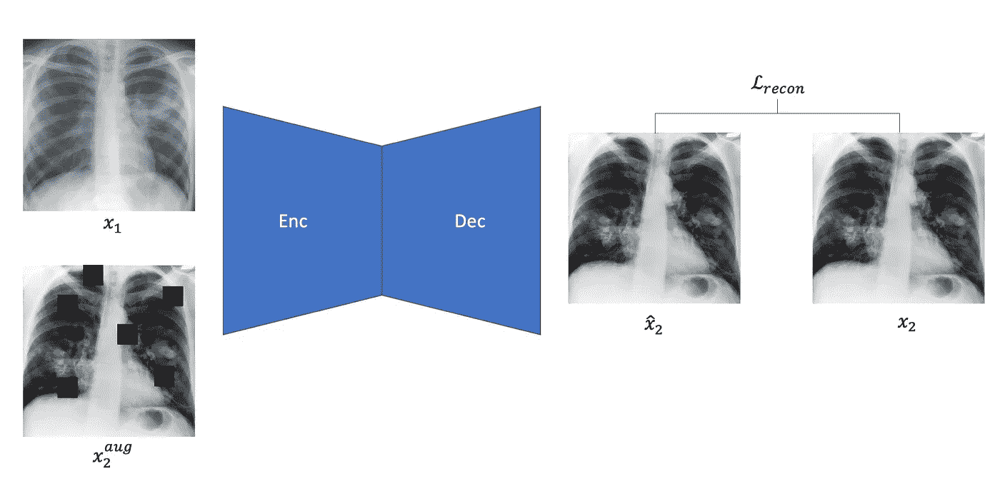

基于图像校正的纵向 SSL 方法。图片由作者提供， [NCI](https://unsplash.com/@nci) 和 [CDC](https://unsplash.com/@cdc) 在 [Unsplash](https://unsplash.com/) 上的照片，灵感来自【2】。

## 摘要

纵向自我监督学习是一种新的和令人兴奋的方法，用于从未标记的纵向数据中学习表示。当 1)随着时间的推移，您有许多来自相同对象的图像(或记录)对，以及 2)感兴趣的下游任务(例如预测慢性疾病)随着时间的推移可能会有很大变化时，此功能特别有用。大型纵向公开数据集变得越来越普遍。看到纵向 SSL 对这些领域中的 ML 研究的影响将是有趣的。

## 参考资料:

1.  阿格拉瓦尔，男，郎，h，奥芬，男，加齐特，l，桑塔格，d，2021。利用顺序的时间不可逆性-对比预训练 151。
2.  茨万皮尔、罗杰斯、基歇、帕斯卡利、布拉伦、布里安、马考斯基、纳瓦布、温德勒、金、苏特，2022。新冠肺炎病理学量化纵向自我监督 1-10。
3.  吉达里什，s .，辛格，p .，科莫达基斯，n .，2018。通过预测图像旋转的无监督表示学习。第六国际。糖膏剂学习。代表。ICLR 2018 年奥运会。跟踪进程。1–16.
4.  Hyvä rinen，a .，h .盛冈，2017。时间相关平稳源的非线性 ICA。继续。第 20 国际。糖膏剂阿提夫。智能。统计。AISTATS 2017。
5.  欧阳，j .，赵，q .，Adeli，e .，Sullivan，E. V .，Pfefferbaum，a .，Zaharchuk，g .，Pohl，K.M .，2021。自我监督纵向邻域嵌入，计算机科学讲义(包括人工智能子系列讲义和生物信息学讲义)。斯普林格国际出版公司。[https://doi.org/10.1007/978-3-030-87196-3_8](https://doi.org/10.1007/978-3-030-87196-3_8)
6.  沃格尔，J.W 等人，2021 年。阿尔茨海默病中 tau 沉积的四种不同轨迹。纳特。医学。27, 871–881.https://doi.org/10.1038/s41591-021-01309-6
7.  赵，刘，郑，阿德利，波尔，K.M .，2021。纵向自我监督学习。医学。形象分析。71, 102051.【https://doi.org/10.1016/j.media.2021.102051 