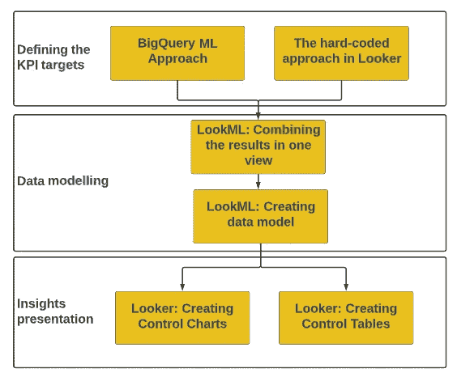
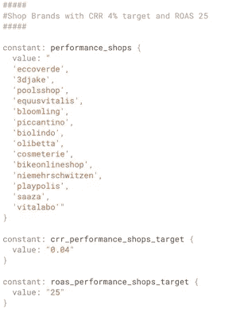
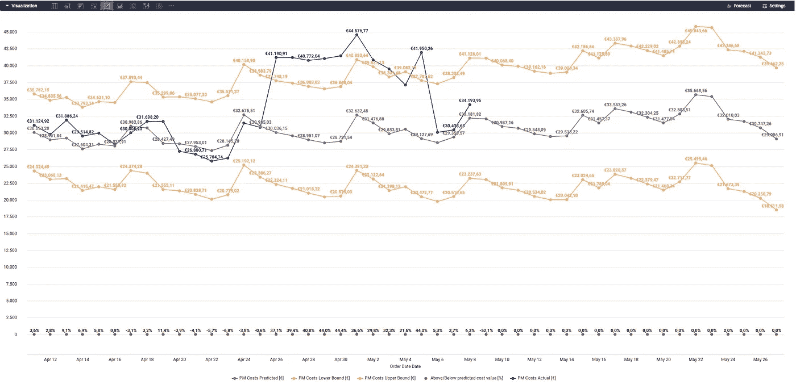
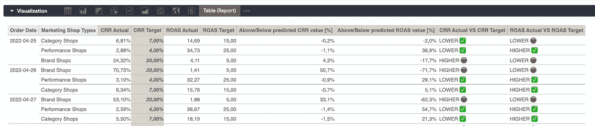

# Looker 和 big query ML:KPI 监控的两种方法

> 原文：<https://towardsdatascience.com/looker-and-bigquery-ml-create-control-charts-for-your-kpis-3d9ad6ee99f7>

## 如何跟踪和报告多系列数据集中的 KPI 目标

Miguel A. Amutio 在 [Unsplash](https://unsplash.com?utm_source=medium&utm_medium=referral) 上拍摄的照片

# **简介**

在与跨组织的业务团队合作开发战略措施时，我们注意到所有领域都有一个共同的分析需求。这就是:**监控和报告 KPI 目标**。

如果我们把重点放在监测上，主要任务是对照实际值跟踪目标。也就是说，应首先定义**目标**。

然而，对于业务用户来说，在多系列数据集上定义目标并不总是容易的。换句话说，**数据集**中的每一个新系列的复杂度都会增加。

我们将分享一个例子。

假设我们想要跟踪 40+家商店的`revenue` KPI。为此，我们需要定义每个商店级别的预期`revenue`的上限和下限，即 80+目标。如果我们想要跟踪每个商店和国家级别的`revenue`，我们可以使用公式`number_of_shops x number_of_countries x 2 (upper and lower target)`计算所需目标的数量。

为了克服在业务方面定义 KPI 目标的复杂性，我们的数据和分析团队开发了两种分析方法:

1.  [**big query ML**](https://cloud.google.com/bigquery-ml/docs)**车间级方法:**用于设置`revenue`或`marketing costs`等连续措施的目标。
2.  **车间级** [**查看器**](https://www.looker.com/) **中的硬编码方式:**用于设置比率措施的目标，如`[cost revenue ratio](https://www.indeed.com/career-advice/career-development/cost-revenue-ratio#:~:text=What%20is%20a%20cost%20revenue,including%20marketing%20and%20shipping%20costs.)`或`[return on ad spend](https://www.klipfolio.com/metrics/marketing/return-on-ad-spend-roas)`。

让我们从发展阶段的解释开始。:)

# 方法论体系

三个主要阶段定义了开发框架:

*   **第一阶段:定义 KPI 目标**
*   **第二阶段:数据建模**
*   **第三阶段:见解陈述**

此外，每个阶段分为两个步骤，如下图所示。

开发方法的分解[图片由作者提供]

在开发部分，我们将使用两个不同的数据集来展示上述步骤的实施:

*   **(1)成本营销数据集，**与
*   **(2)车间订单数据集**。

根据这两个数据集，我们将计算以下 KPI:

*   `**marketing costs**` —所有流量渠道的费用(如谷歌、脸书等。)每家店，
*   `**cost revenue ratio (CRR)**` —每家店铺的营销成本与收入的比率，
*   `**return on ad spend (ROAS)**` —逆 CRR，即每家店铺的收入与营销成本之比。

如导言中所述，目的是展示如何使用两种不同的方法来监控和报告战略性 KPI。

所以，先从 Looker 里的动手部分说起。:)

# 阶段 1/3:使用 BigQuery ML 方法和 Looker 中的硬编码方法定义 KPI 目标

**步骤 1/2: BigQuery ML 方法:为**设置目标`**marketing costs**`

我们将使用 [BigQuery ML (BQML)时间序列模型](https://cloud.google.com/bigquery-ml/docs/reference/standard-sql/bigqueryml-syntax-create-time-series) `ARIMA_PLUS`来寻找`marketing costs`目标。

一般来说，为了训练 BQML 多时间序列模型，我们需要定义以下内容[1]:

1.  `model_type` =时间序列模型的类型，即`ARIMA_PLUS`
2.  `time_series_data_col` =目标变量= `marketing costs`
3.  `time_series_timestamp_col` =时间戳变量=费用的日志日期
4.  `time_series_id_col` =系列变量= `shop`
5.  `horizon` =预测范围，即我们希望预测未来多远
6.  `data_frequency` =时间段频率，即每天、每月、每周等。

在解释了模型架构之后，我们可以将 BQML 模型放在一个 [LookML 视图](https://docs.looker.com/reference/view-params/view)中:

模型的结果保存到 Looker 项目的预定义数据库中(检查管理部分→数据库→连接)。

— — — — — — — — — — — — — — — — — — — — — — — — — — — —

**步骤 2/2:Looker 中的硬编码方法:设置** `**cost revenue ratio (CRR)**` **和** `**return on ad spend (ROAS)**`的目标

这一步很简单，因为任务是:

*   将店铺分成**店铺群**，即品类/品牌/性能店铺群。
*   **为`CRR`和`ROAS`KPI 设定硬编码目标**按**各车间组**。

为此，我们将使用 LookML 层中的`[manifest](https://docs.looker.com/fr/reference/manifest-reference)`文件，为每个车间组创建常数，并为每个车间组的`CRR`和`ROAS`目标值创建[常数](https://docs.looker.com/reference/manifest-params/constant#:~:text=Constants%20can%20be%20referenced%20anywhere,in%20the%20project%20manifest%20file.)。

下图显示了一个创建常量的例子，完整的清单代码可以在[这里](https://gist.github.com/CassandraOfTroy/f63157ac62705ce910e44d86d593d1c8)找到。

太神奇了。现在我们可以切换到**阶段 2** 并创建一个数据模型来合并此阶段开发的步骤的结果。

# 阶段 2/3:数据建模:汇集实际和目标 KPI 值

现在是简洁的部分，即数据建模部分。

**步骤 1/2: LookML 建模:在一个视图中组合结果**

这一步包括开发一个[派生表](https://docs.looker.com/reference/view-params/derived_table)，它是三个查询`UNION`的产物:

*   查询，检索每个商店`marketing costs`的**目标值**(BQML 模型结果)，
*   检索每个商店`marketing costs`的**实际值**的查询(根据成本营销数据集计算)，以及
*   检索每个商店的实际值`revenue`的查询(根据商店订单数据集计算)。

从上面的视图中可以看出，通过计算每个商店的`marketing costs`和`revenue`，我们也能够得到实际的`CRR`和`ROAS`值。

此外，我们将这两个 KPI 的实际值与目标值进行了比较。

这个阶段剩下的最后一部分是在这个视图之上创建一个数据模型。

— — — — — — — — — — — — — — — — — — — — — — — — — — — —

**第 2/2 步:LookML 建模:在第 1 步中创建的视图之上创建一个数据模型**

**瞧啊。我们成功地完成了数据建模部分，现在可以进入最后一个阶段。**

# **阶段 3/3:洞察力演示:创建控制图和控制表**

**我们最终可以以可视化的形式呈现数据洞察，即我们的三个 KPI。**

****第 1/2 步:观察者:创建控制图跟踪** `**marketing costs**`**

**教程:**

*   **选择滤镜:`Marketing Shop Types`、`Order Date`、`Shop Brand`。**
*   **选择维度和度量:`Order date`、`PM Costs Predicted [€]`、`PM Costs Lower Bound[€]`、`PM Costs Upper Bound [€]`、`Above/Below Predicted cost value [%]`。**
*   **选择`Line`图表类型以可视化结果。**

****

**旁观者:跟踪营销成本目标的控制图[图片由作者提供]**

***功能:***

*   **通过上述设置，我们可以每天跟踪数据集中每个商店的**的`marketing costs`。****

**— — — — — — — — — — — — — — — — — — — — — — — — — — — —**

****步骤 2/2: Looker:创建一个控制表来跟踪** `**CRR**` **和**`**ROAS**`**KPI****

**教程:**

*   **选择过滤器:`Marketing Shop Types`、`Order Date`、`Shop Brand`。**
*   **选择尺寸和度量:`Order date`、`Marketing Shop Types`或`Shop Brand`、`CRR Actual [%]`、`CRR Target [%]`、`ROAS Actual`、`ROAS Target`、`Above/Below predicted CRR value [%]`、`Above/Below predicted ROAS value [%]`。**
*   **选择`Table (Report)`可视化类型来呈现结果。**

****

**Looker:跟踪 CRR 和 ROAS 目标的控制表**

***功能:***

*   **通过控制表，我们可以按照**定义的车间组每天跟踪`CRR`和`ROAS`KPI。****

# **摘要**

**本文中呈现的实现阶段的简要概述如下:**

*   **首先，我们提出了**两种不同的方法来定义多系列数据集的 KPI 目标**；BigQuery ML 和 Looker 中的硬编码方法。**
*   **其次，我们展示了如何在数据建模阶段**将实际和目标 KPI 值**结合起来。**
*   **最后，我们创建了一个 Looker 教程，用于将**制作成控制图/控制表**，并可视化地呈现**数据洞察。****

**有了这些摘要，我们就完成了监控和报告 KPI 目标的实施之旅。编码快乐！:)**

****参考文献:****

**[1] BigQuery ML ARIMA 加文档，访问日期:2022 年 5 月 1 日，[https://cloud . Google . com/big query-ML/docs/reference/standard-SQL/bigqueryml-syntax-create-time-series](https://cloud.google.com/bigquery-ml/docs/reference/standard-sql/bigqueryml-syntax-create-time-series)**