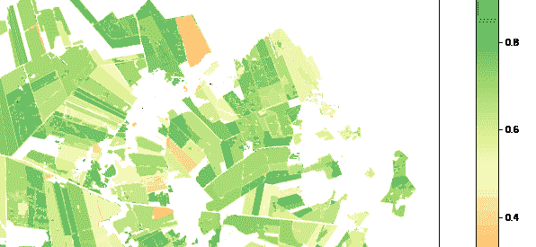
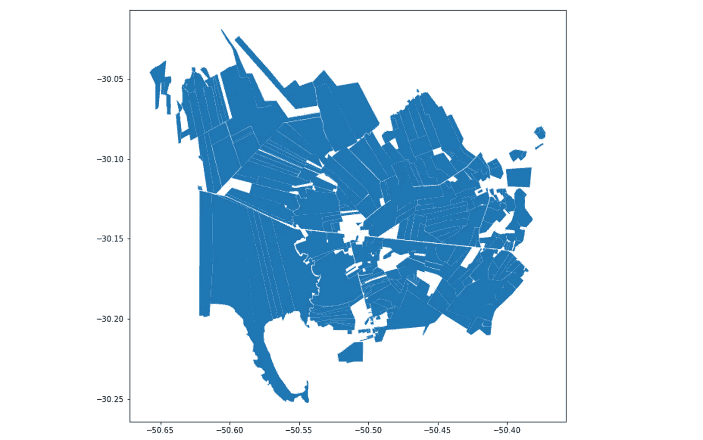
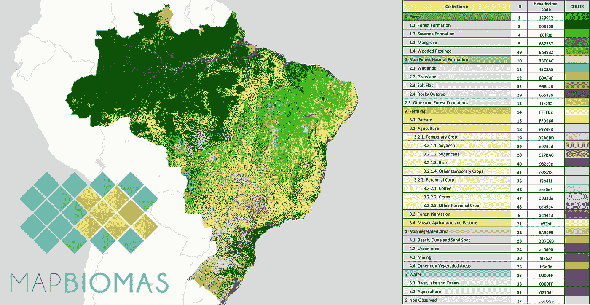
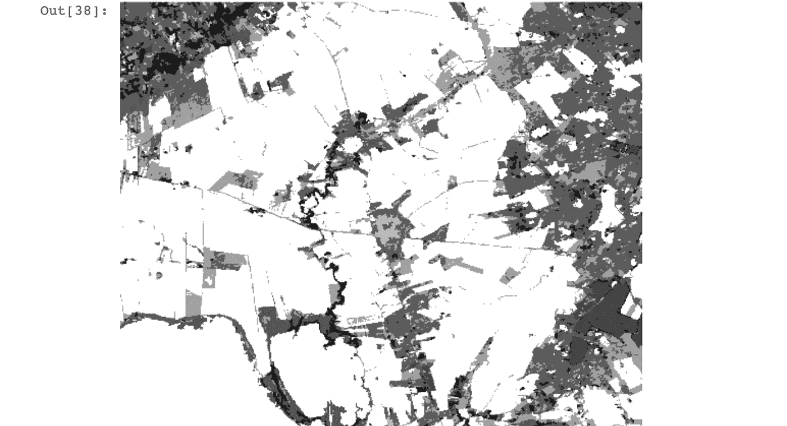
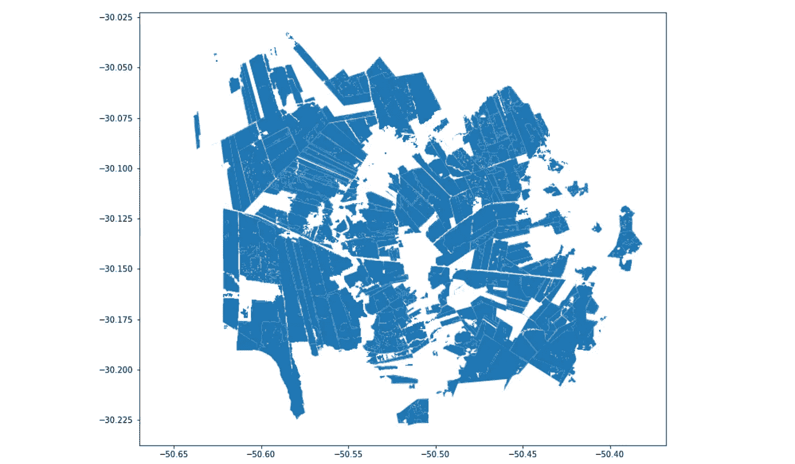
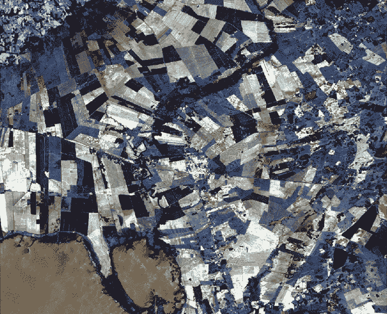
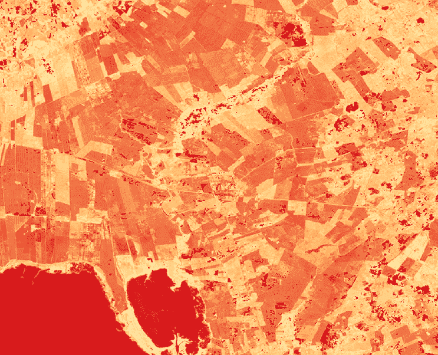
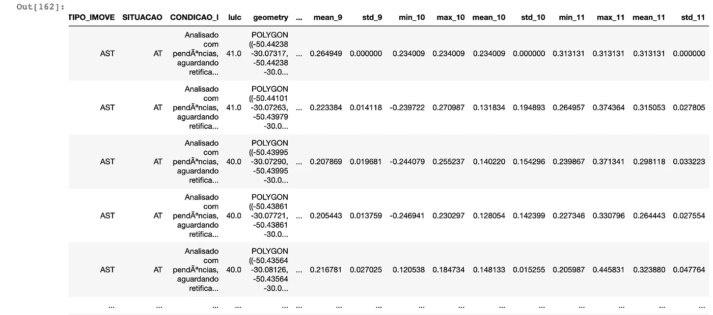
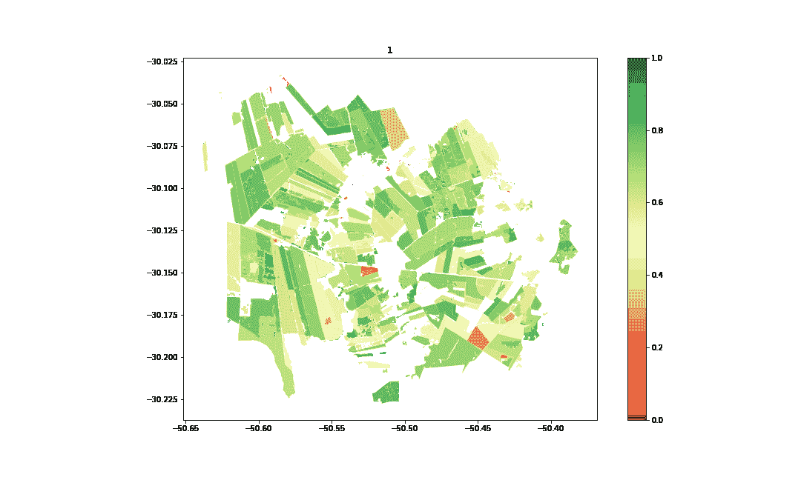
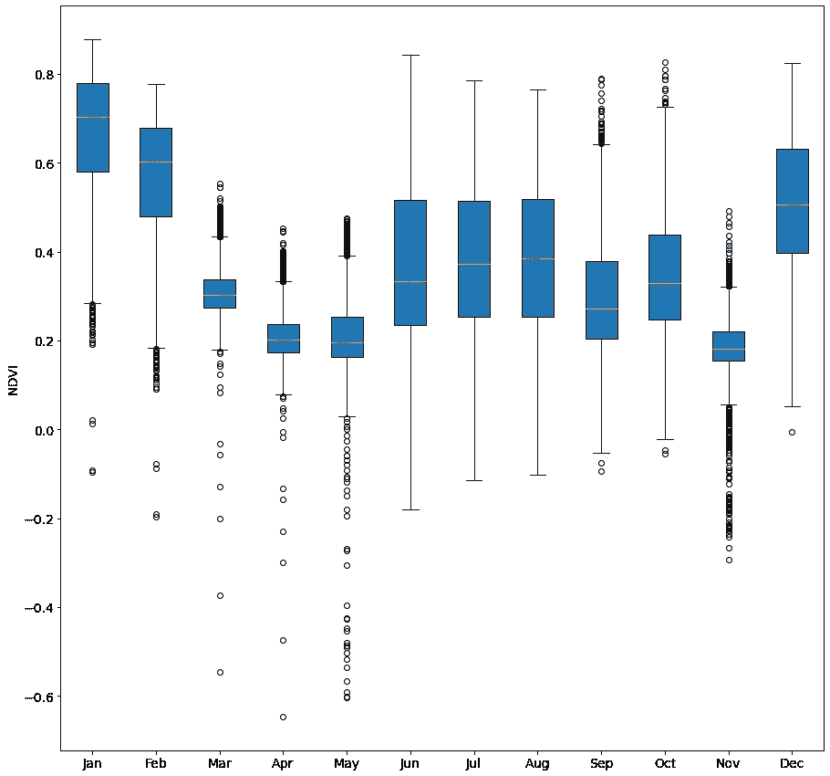

# 用 python 在卫星影像时间序列中寻找模式

> 原文：<https://towardsdatascience.com/looking-for-patterns-in-satellite-image-time-series-with-python-de097f4065d7>

## 使用开放 python 库处理时变影像的快速指南

作者图片

不久前，我在这里写了一篇文章，讲述了使用 python 进行遥感的一些基础知识。上次我们介绍了 geopandas、rasterio 和 google earth engine 的基础知识，以处理卫星图像和地理空间数据。

这一次，我们将扩展计算植被指数(NDVI)的概念，看看这些指数如何随时间变化，以及我们可以用它来做什么可视化。我们将以类似的方式开始，使用包含我们感兴趣的地块的矢量图层。

# 首先是几块农村土地

我们现在看到的是位于巴西最南端的卡皮瓦里多苏尔，一个以出口水稻闻名的城市。我们从巴西的 CAR 获得了一个包含所有地块的 shapefile，这是一个国家环境和农业注册表，我们将依次通过 geopandas 读取它。

中间的空白点是城市居民区。其他的基本都是稻作文化。(图片由作者提供)

在我们实际获取卫星图像之前，我们需要细化这个矢量数据集。其原因是，虽然这些地块仅反映了该市的农村景观，但每个农村地块实际上不仅仅有农作物:每个地块内都有保护区(由于环境立法的存在)和人们居住的房屋，因此我们不想计算这些的 NDVI。

# 从云中访问土地覆盖数据

为了过滤掉所有不是农作物的东西，我们将使用令人惊奇的[map biomass](https://mapbiomas.org/en)项目。MapBiomas 是一个基于谷歌地球引擎的项目，除其他外，该项目为整个巴西提供来自大地卫星图像的土地覆盖分类。这意味着我们可以只使用地球引擎的 python API 来访问文件！

Mapbiomas 很神奇，说实话。(图片由作者提供)

这里棘手的部分是[找到文档](https://mapbiomas.org/en/colecoes-mapbiomas-1)并意识到 MapBiomas 项目在他们存储图像的方式上做了一些改动。每次项目团队修改土地覆盖分类算法，都会有一个新的集合可用(我们目前在集合 6)。反过来，该系列只有**一个**单幅图像，有几个带，一个代表一年。因此，我们需要使用一个带通滤波器来获取 2020 年的图像(最新的可用图像)。

值的范围从 0 到 33，因为这是由 MapBiomas 指定的土地覆盖类的数量。(图片由作者提供)

# 使用 rasterio 从栅格到矢量

一旦我们将图像导出到我们的本地环境中(代码片段见[上一篇文章](/automating-gis-and-remote-sensing-workflows-with-open-python-libraries-e71dd6b049ee)，我们需要通过使用 [rasterio 特性](https://rasterio.readthedocs.io/en/latest/topics/features.html)将它们转换成矢量，并隔离所有属于**农业类别** 的[类，如多年生作物和一年生作物。接下来，我们希望通过使用 geopanda 的叠加功能找到这些新获得的形状和地块之间的交点。](https://mapbiomas-br-site.s3.amazonaws.com/downloads/Colecction%206/Cod_Class_legenda_Col6_MapBiomas_BR.pdf)

结果是宗地的形状减去 Mapbiomas 未分类为农业的所有内容。(图片由作者提供)

# 访问多个时间戳的原始影像

太好了。现在我们已经筛选出了仅用于农田的地块，我们可以开始实际的遥感工作了。我们将首先编写一个基于日历范围的元数据过滤影像的函数，该函数将用于 Landsat 8 集合。有趣的是，该功能可以用于任何其他传感器，例如 Sentinel 2。该函数基本上按年过滤，然后按月过滤，最后计算每个时间戳中每个像素的中值。一旦我们获得了图像集合，我们就可以获取图像列表并将它们导出到我们的驱动器。这样我们可以在本地继续工作。

我们刚刚下载的所有图像，一年中的每个月一张。(图片由作者提供)

# 栅格到数组，然后再返回

手头有了所有的图像，我们终于可以计算植被指数，或 NDVI。上一次我们使用 Earth Engine 这样做，这肯定更简单，但这里我们将使用 rasterio 和 numpy。

我们将使用一个使用 rasterio 的函数来隔离我们需要的波段——4 个红光波段和 5 个 NIR 波段——然后将整个东西转换成一个 numpy 数组。归一化差值(NIR-Red/NIR+Red)的计算使用 numpy 内置函数执行，结果被写回到新的 geoTiff 中。

然后，该功能可以应用于地球引擎通过使用一个超级简单的循环将它们导出到的文件夹中的所有图像。

所有生成的植被指数图像均以单波段伪彩色呈现。(图片由作者提供)

# 全年的区域统计

太美了。接下来，我们将使用 rasterstats 非常类似于上次的-来计算每个宗地的区域统计数据。我们最感兴趣的是不同地块上植被指数的平均值，所以我们可以分别从统计角度来看它们。

带有新列的数据框架。(图片由作者提供)

这些新列现在可以像以前一样用于绘制地理数据框，但是色带范围为 0 到 1。让我们更进一步，使用 imageio 将所有的图放在一个 gif 中。

有点像跳动的心脏，但这是米饭。(图片由作者提供)

这些情节当然很有趣，但可能不是理解这些农田动态的最佳方式。因此，让我们利用将数据存储在数据框架中的优势，为每个月绘制一个箱线图。

这讲述了一个更完整的故事。(图片由作者提供)

现在我们可以更清楚地看到发生了什么。由于水稻作物每隔 150 天就可以收割一次，所以我们在一年中会看到两个“山谷”是有道理的，那时大部分生机勃勃的绿色植被都从地里移走，以便与谷物分离。

# 那是一个包裹

就是这个！我们设法从一堆包裹到一些非常整洁的时间图表。

这里当然可以包括一些东西，但不是为了简单起见，比如遮蔽云层或选择多个传感器，但这是一个干净的版本。目前为止！

如果你有问题或建议，不要犹豫，随时给我写信。如果你喜欢这篇文章，考虑[给我买杯咖啡](https://www.buymeacoffee.com/guilhermeiablo)，这样我就能继续写更多这样的文章了！

***如果你还不是一个媒介会员，想要支持像我这样的作家，可以通过我的推荐链接随意报名:***

<https://guilhermeiablonovski.medium.com/membership> 