# 损失函数及其在神经网络中的应用

> 原文：<https://towardsdatascience.com/loss-functions-and-their-use-in-neural-networks-a470e703f1e9>

## 损失函数及其实现概述


克里斯里德在 [Unsplash](https://unsplash.com?utm_source=medium&utm_medium=referral) 上的照片

损失函数是神经网络最重要的方面之一，因为它们(以及优化函数)直接负责将模型拟合到给定的训练数据。

本文将深入探讨如何在神经网络中使用损失函数，不同类型的损失函数，在 TensorFlow 中编写自定义损失函数，以及处理图像和视频训练数据的损失函数的实际实现——计算机视觉中使用的主要数据类型，这是我感兴趣和关注的主题。

# 背景资料

首先，快速回顾神经网络的基本原理及其工作原理。

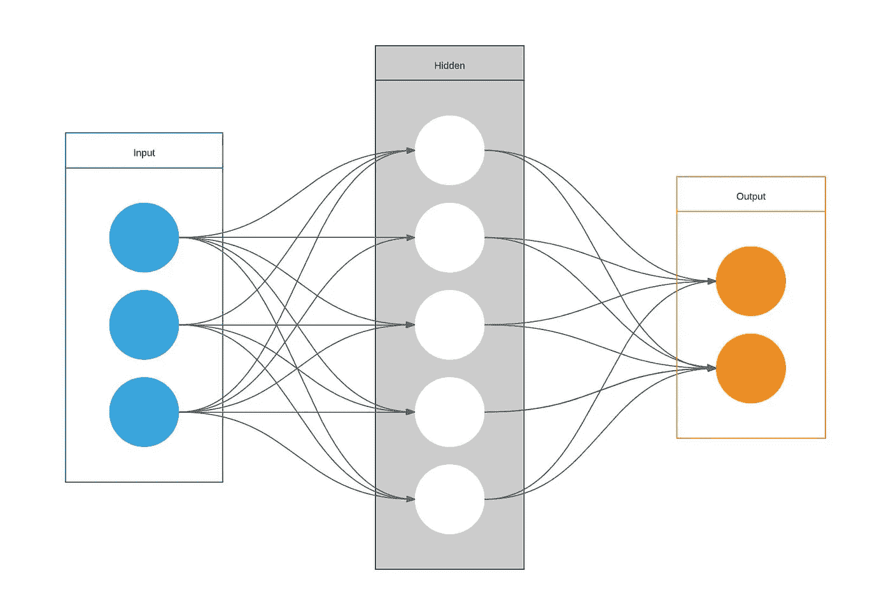

图片来源:维基共享资源

**神经网络**是一套算法，旨在识别一组给定训练数据中的趋势/关系。这些算法基于人类神经元处理信息的方式。

该等式表示神经网络如何处理每一层的输入数据，并最终产生预测的输出值。

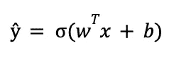

图片来源:作者

为了**训练**——模型映射训练数据和输出之间的关系的过程——神经网络更新其超参数、权重、 *wT* 和偏差、 *b、*以满足上面的等式。

每个训练输入在一个称为**正向传播**的过程中被加载到神经网络中。一旦模型产生了一个输出，这个预测输出在一个称为**反向传播**的过程中与给定的目标输出进行比较——然后调整模型的超参数，使其现在输出一个更接近目标输出的结果。

这就是损失函数出现的地方。

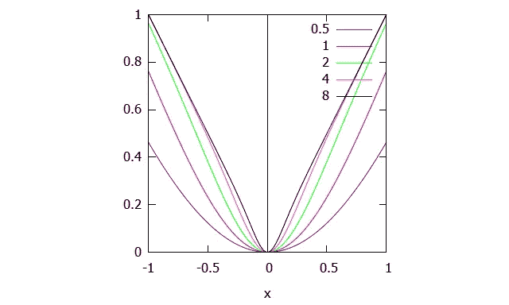

图片来源:维基共享资源

# 损失函数概述

**损失函数**是**比较**目标和预测输出值的函数；衡量神经网络对训练数据的建模程度。训练时，我们的目标是尽量减少预测输出和目标输出之间的这种损失。

调整**超参数**以最小化平均损失——我们找到最小化 *J* 值(平均损失)的权重 *wT* 和偏差 *b* 。

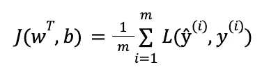

图片来源:作者

我们可以认为这类似于统计学中的残差，它测量实际的 *y* 值与回归线(预测值)的距离，目标是最小化净距离。

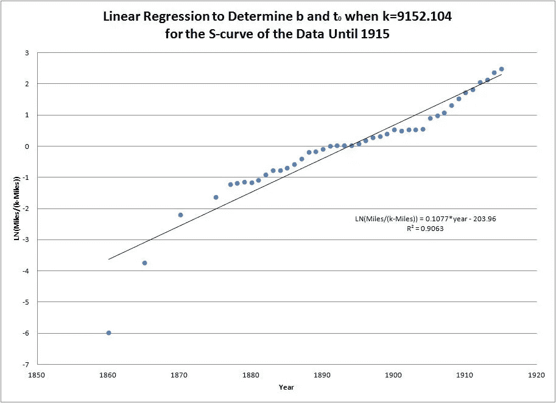

图片来源:维基共享资源

# 如何在 TensorFlow 中实现损失函数

对于本文，我们将使用谷歌的 **TensorFlow** 库来实现不同的损失函数——很容易演示损失函数是如何在模型中使用的。

在 TensorFlow 中，神经网络使用的损失函数被指定为 model.compile()中的参数，model . compile()是训练神经网络的最终方法。

```
model.compile(loss='mse', optimizer='sgd')
```

损失函数可以作为字符串(如上所示)或函数对象(从 TensorFlow 导入或编写为自定义损失函数)输入，我们将在后面讨论。

```
from tensorflow.keras.losses import mean_squared_error
model.compiile(loss=mean_squared_error, optimizer='sgd')
```

张量流中的所有损失函数具有相似的结构:

```
def loss_function (y_true, y_pred): 
    return losses
```

它必须以这种方式格式化，因为 model.compile()方法只需要 loss 属性的两个输入参数。

# 损失函数的类型

在监督学习中，有两种主要类型的损失函数，它们与两种主要类型的神经网络相关:回归和分类损失函数

1.  回归损失函数——用于回归神经网络；给定一个输入值，模型预测相应的输出值(而不是预先选择的标签)；《出埃及记》均方误差，平均绝对误差
2.  分类损失函数——用于分类神经网络；给定一个输入，神经网络产生一个属于各种预设类别的输入概率向量，然后可以选择具有最高归属概率的类别；《出埃及记》二元交叉熵，分类交叉熵

## 均方误差

MSE 是最受欢迎的损失函数之一，它可以找到目标输出和预测输出之间的平均方差

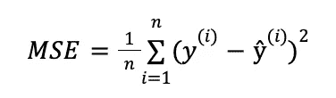

图片来源:作者

这个函数有许多特性，使它特别适合于计算损失。差值是平方的，这意味着预测值是高于还是低于目标值并不重要；但是，误差较大的值会受到惩罚。MSE 也是一个凸函数(如上图所示),具有明确定义的全局最小值——这允许我们更容易地利用**梯度下降优化**来设置权重值。

下面是 TensorFlow 中的一个标准实现——也内置在 TensorFlow 库中。

```
def mse (y_true, y_pred): 
    return tf.square (y_true - y_pred)
```

然而，这种损失函数的一个缺点是它对异常值非常敏感；如果预测值明显大于或小于其目标值，这将大大增加损失。

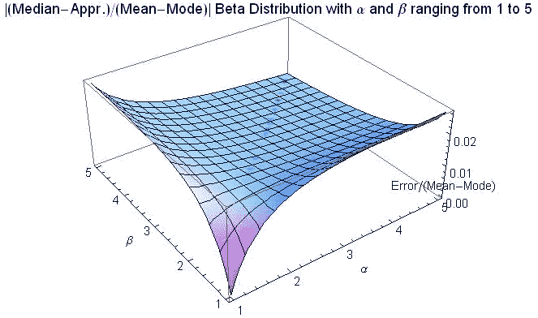

图片来源:维基共享资源

## 平均绝对误差

MAE 找出目标和预测输出之间的绝对差值的平均值。

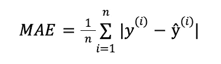

图片来源:作者

在某些情况下，这个损失函数被用作 MSE 的替代函数。如前所述，MSE 对异常值非常敏感，这会显著影响损失，因为距离是平方的。MAE 用于训练数据有大量异常值的情况，以减轻这种情况。

下面是 TensorFlow 中的一个标准实现——也内置在 TensorFlow 库中。

```
def mae (y_true, y_pred): 
    return tf.abs(y_true - y_pred)
```

它也有一些缺点；当平均距离接近 0 时，梯度下降优化将不起作用，因为函数在 0 处的导数是未定义的(这将导致错误，因为不可能除以 0)。

因此，开发了一种称为 **Huber 损失**的损失函数，它具有 MSE 和 MAE 的优点。

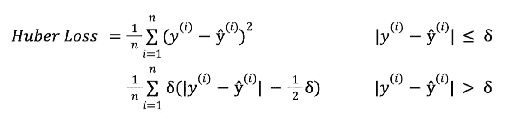

图片来源:作者

如果实际值和预测值之间的绝对差值小于或等于阈值𝛿，则应用 MSE。否则，如果误差足够大，则应用 MAE。

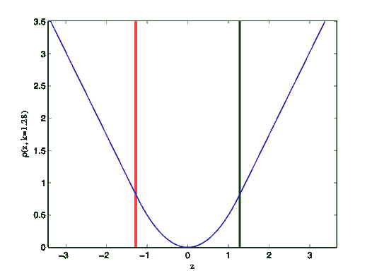

图片来源:维基共享资源

这是 TensorFlow 的实现——这涉及到使用一个包装器函数来利用阈值变量，我们稍后会对此进行讨论。

```
def huber_loss_with_threshold (t = 𝛿): 
    def huber_loss (y_true, y_pred): 
        error = y_true - y_pred 
        within_threshold = tf.abs(error) <= t
        small_error = tf.square(error)
        large_error = t * (tf.abs(error) - (0.5*t))
        if within_threshold: 
                return small_error
        else: 
                return large_error
    return huber_loss
```

## 二元交叉熵/对数损失

这是二元分类模型中使用的损失函数，其中模型接受一个输入，并将其分类到两个预设类别中的一个。

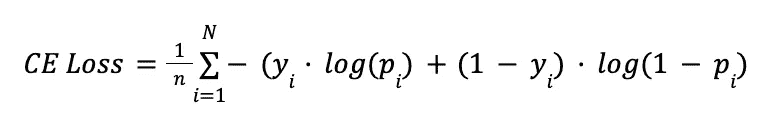

图片来源:作者

分类神经网络的工作原理是输出一个概率向量——给定输入符合每个预设类别的概率；然后选择概率最高的类别作为最终输出。

在二进制分类中，y 只有两个可能的实际值— 0 或 1。因此，为了准确地确定实际值和预测值之间的损失，需要将实际值(0 或 1)与输入符合该类别的概率进行比较( *p(i)* =该类别为 1 的概率；1 — *p(i)* =类别为 0 的概率)

这是 TensorFlow 实现。

```
def **log_loss** (y_true, y_pred): 
    y_pred = tf.clip_by_value(y_pred, le-7, 1 - le-7)
    error = y_true * tf.log(y_pred + 1e-7) (1-y_true) * tf.log(1-y_pred + 1e-7)
    return -error
```

## 分类交叉熵损失

在类的数量大于两个的情况下，我们利用分类交叉熵——这遵循与二进制交叉熵非常相似的过程。

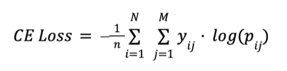

图片来源:作者

二元交叉熵是分类交叉熵的一个特例，其中*M*= 2——类别的数量是 2。

# 自定义损失函数

如前所述，在编写神经网络时，可以从 the tf.keras.losses 模块中导入损失函数作为函数对象。该模块包含以下内置损失函数:

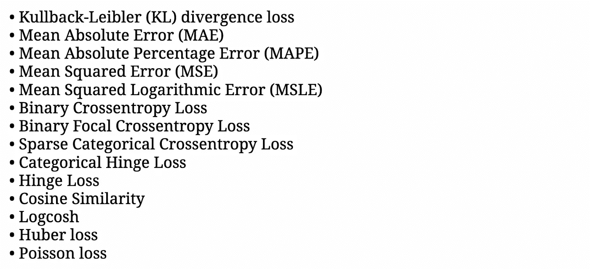

图片来源:作者

然而，可能存在这些传统/主要损失函数可能不足够的情况。例如，如果您的训练数据中有太多噪音(异常值、错误的属性值等)。)——这不能用数据预处理来补偿——或者在无监督学习中使用(我们将在后面讨论)。在这些情况下，您可以编写自定义损失函数来满足您的特定条件。

```
def **custom_loss_function** (y_true, y_pred): 
    return losses
```

编写自定义损失函数非常简单；唯一的要求是损失函数必须只接受两个参数:y_pred(预测输出)和 y_true(实际输出)。

这些的一些例子是 3 个定制损失函数，在变分自动编码器(VAE)模型的情况下，来自 Soon Yau Cheong 的 TensorFlow 的*手动图像生成。*

```
def vae_kl_loss(y_true, y_pred):
    kl_loss =  - 0.5 * tf.reduce_mean(1 + vae.logvar -    tf.square(vae.mean) - tf.exp(vae.logvar))
    return kl_lossdef vae_rc_loss(y_true, y_pred):
    #rc_loss = tf.keras.losses.binary_crossentropy(y_true, y_pred)
    rc_loss = tf.keras.losses.MSE(y_true, y_pred)
    return rc_lossdef vae_loss(y_true, y_pred):
    kl_loss = vae_kl_loss(y_true, y_pred)
    rc_loss = vae_rc_loss(y_true, y_pred)
    kl_weight_const = 0.01
    return kl_weight_const*kl_loss + rc_loss
```

根据损失函数的数学计算，您可能需要添加额外的参数，例如休伯损失中的阈值𝛿(如上)；为此，您必须包含一个包装函数，因为 TF 不允许在您的损失函数中有超过 2 个参数。

```
def custom_loss_with_threshold (threshold = 1): 
    def custom_loss (y_true, y_pred): 
        pass #Implement loss function - can call the threshold variable
    return custom_loss
```

# 图像处理中的实现


由[克里斯多夫·高尔](https://unsplash.com/@cgower?utm_source=medium&utm_medium=referral)在 [Unsplash](https://unsplash.com?utm_source=medium&utm_medium=referral) 上拍摄的照片

让我们看看损失函数的一些实际实现。具体来说，我们将研究在各种用例中如何使用损失函数来处理图像数据。

## 图像分类

计算机视觉最基本的方面之一是图像分类——能够将图像分配到两个或更多预选标签中的一个；这允许用户识别物体、书写、人等。在图像内(在图像分类中，图像通常只有一个主题)。

图像分类中最常用的损失函数是交叉熵损失/对数损失(二进制用于 2 个类别之间的分类，稀疏分类用于 3 个或更多类别)，其中模型输出输入图像属于每个预设类别的概率向量。然后将该输出与实际输出进行比较，实际输出由大小相等的向量表示，其中正确类别的概率为 1，所有其他类别的概率为 0。

它的基本实现可以直接从 TensorFlow 库中导入，不需要任何进一步的定制或修改。下面是 IBM 的一个开源深度卷积神经网络(CNN)的摘录，它对文档图像(身份证、申请表等)进行分类。).

```
model**.**add(Dense(5, activation**=**'sigmoid'))
model**.**summary()model**.**compile(optimizer='adam', loss**=**'categorical_crossentropy',
    metrics**=**['accuracy'])
```

目前正在研究开发新的(自定义)损失函数来优化多类分类。下面是杜克大学研究人员提出的损失函数的摘录，该函数通过查看错误结果中的模式来扩展分类交叉熵损失，以加快学习过程。

```
def matrix_based_crossentropy (output, target, matrixA, from_logits = False):
    Loss = 0
    ColumnVector = np.matul(matrixA, target)
    for i, y in enumerate (output):
        Loss -= (target[i]*math.log(output[i],2))
        Loss += ColumnVector[i]*exponential(output[i])
        Loss -= (target[i]*exponential(output[i]))
    newMatrix = updateMatrix(matrixA, target, output, 4)
    return [Loss, newMatrix]
```

## 图象生成

图像生成是一个过程，通过该过程，神经网络根据用户的指定创建图像(从现有库中)。

在整篇文章中，我们主要讨论了监督学习中损失函数的使用——我们已经清楚地标记了输入、 *x* 和输出、 *y* ，并且该模型应该确定这两个变量之间的关系。

图像生成是无监督学习的一种应用，其中需要模型来分析和查找未标记输入数据集中的模式。损失函数的基本原理仍然成立；无监督学习中损失函数的目标是确定输入示例和假设(输入示例本身的模型近似值)之间的差异。

例如，这个方程模拟 MSE 将如何被实现用于无监督学习，其中 *h(x)* 是假设函数。

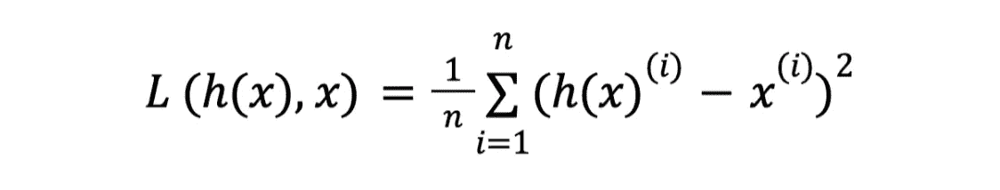

图片来源:作者

下面是一个对比语言-图像预训练(CLIP)扩散模型的摘录——它通过文本描述生成艺术(图像)——以及一些图像样本。

```
if args.init_weight:
    result.append(F.mse_loss(z, z_orig) * args.init_weight / 2)lossAll,img = ascend_txt()if i % args.display_freq == 0:
    checkin(i, lossAll)loss = sum(lossAll)
loss.backward()
```


图片来源:作者

在变分自动编码器(VAE)模型的情况下，在我们的**自定义损失函数**部分中显示了在图像生成中使用损失函数的另一个例子。

# 包扎

在本文中，我们讨论了 1)损失函数如何工作，2)它们如何在神经网络中使用，3)适合特定神经网络的不同类型的损失函数，4) 2 个特定的损失函数及其使用案例，5)编写自定义损失函数，以及 6)图像处理损失函数的实际实现。

谢谢你看我的文章！你可以通过我的 LinkedIn 联系我，或者给我发邮件到 vishal.yathish@gmail.com