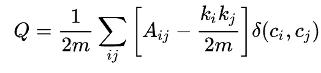
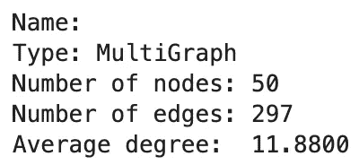
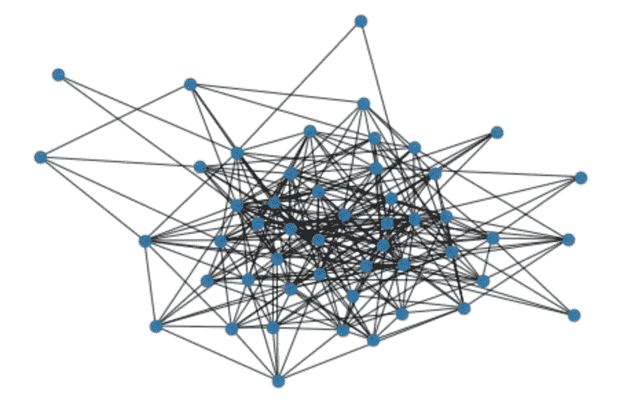
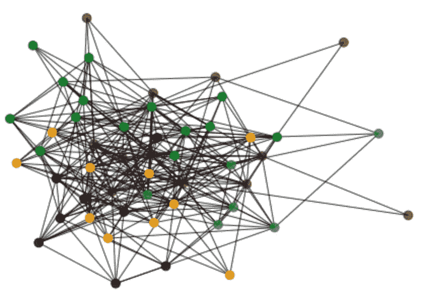

# Python 中社区发现的 Louvain 算法

> 原文：<https://towardsdatascience.com/louvains-algorithm-for-community-detection-in-python-95ff7f675306>

## 在 Python 中应用 Louvain 算法进行社区发现


图片由 [Unsplash](https://unsplash.com/photos/yp6LjT-28GU) 的 [Ethan Unzicker](https://unsplash.com/@ethanunzicker) 拍摄

本文将涵盖社区检测和 Louvain 算法背后的基本直觉。它还将展示如何使用 NetworkX 和 Python-Louvaine 模块在您选择的网络中实现 Louvain 算法。以下是文章的结构:

## **目录**

*   什么是社区检测？
*   社区检测与聚类
*   什么是鲁汶算法？
    -模块化
    -卢万算法
*   问题陈述
    -要求
*   生成网络
*   应用卢万算法
*   可视化社区
*   结束语
*   资源

# 什么是社区检测？

在图论中，如果您能够根据节点的边密度对节点(可能有重叠的节点)进行分组，则网络具有社区结构。这将意味着原始网络 G1 可以被自然地分成多个子图/社区，其中社区内的边连通性将非常密集。重叠社区也是允许的，因此在形成的社区中可以有重叠节点。这意味着独立社区中的节点具有稀疏数量的边。

> 更一般的定义是基于这样的原则，即如果节点对都是相同社区的成员，则它们更有可能被连接，而如果它们不共享社区，则它们不太可能被连接。
> 【1】——[https://en.wikipedia.org/wiki/Community_structure](https://en.wikipedia.org/wiki/Community_structure)

直观地想到这一点，就有道理了。想想你自己在 Instagram 这样的社交网络中。你可能和许多与你感兴趣的事物相关的不同社区有着密切的联系。你可以关注与朋友、迷因、体育、动漫等相关的账户。这些分类中的每一个都可以被解释为社区，其中你作为一个用户是一个节点，边是通过将你连接到与你有相似兴趣的其他用户而生成的。因此，在你自己的社交网络中，你会有一个非常密集的社区，而与你社区之外的其他人联系很少。

有许多数学公式用于识别给定网络中的社区。这篇文章的重点是特别针对卢万算法，然而还有许多其他算法，如[格文-纽曼算法](https://en.wikipedia.org/wiki/Girvan%E2%80%93Newman_algorithm)、[雅克卡指数](https://en.wikipedia.org/wiki/Jaccard_index)等。可用于解决社区检测中的问题。

# 社区检测与聚类

类似于聚类，传统的社区检测方法可以被标记为无监督学习。可以认为社区检测和聚类是同一个东西。在文献中有许多情况下，这些术语可以互换使用。

我发现两者之间的区别非常微妙，社区检测侧重于根据网络结构生成节点组，而聚类侧重于根据与输入数据相关的许多属性生成组。社区检测特别保留在图论和网络分析的领域中，而聚类传统上用于非基于图的应用中。也就是说，在网络上使用 kMeans 等传统的集群技术并不是不可能的(首先需要生成与网络中的节点相关联的嵌入，然后将集群模型应用于这些嵌入)。

# 什么是鲁汶算法

卢万算法，2008 年由 Vincent Blondel 等人以卢万[大学](https://en.wikipedia.org/wiki/Universit%C3%A9_catholique_de_Louvain)命名。该算法源于他们的论文[“*大型网络中社区的快速展开*”](https://arxiv.org/abs/0803.0476)[3]，其中他们引入了一种贪婪方法，该方法将在 O(n*log(n))时间内生成社区，其中 n 是原始网络中的节点数[2]。

## 模块性

Louvain 的算法旨在优化模块化。模块性是一个介于-0.5 和 1 之间的分数，它表示社区内的边相对于社区外的边的密度[2]。模块化越接近-0.5 表示非模块化集群，越接近 1 表示完全模块化集群。在给定网络的情况下，优化该分数会产生最佳的可能节点组。直观上，你可以把它解释为最大化实际边数和期望边数之差。模块化可由以下公式定义:



计算加权网络模块度的公式。图片取自[维基百科](https://en.wikipedia.org/wiki/Louvain_method) [2]

*   `Ai,j`表示节点 I 和 j 之间的边
*   `m`是网络中所有边权重的总和
*   delta 是[克罗内克 delta 函数](https://en.wikipedia.org/wiki/Kronecker_delta)
    -如果 I = j
    delta = 1-否则 delta = 0
*   `Ci`和`Cj`是节点的社区
*   `Ki`和`Kj`是连接节点 I 和 j 的权重之和

## 卢万算法

为了最大化模块性，Louvain 的算法有两个迭代阶段。第一阶段将网络中的每个节点分配给自己的社区。然后，它试图通过合并社区来最大化模块化收益。节点 I 可能会与节点 j(I 的邻居)合并，以确定模块性是否会有积极的增加。如果没有模块增加，则节点保持在其当前社区中，否则社区被合并。社区的这种合并可以由以下公式表示:


图片取自[维基百科](https://en.wikipedia.org/wiki/Louvain_method) [2]

> 其中`Sigma_in`是`i`正在移入的社区内所有链接的权重之和，`Sigma_tot`是`i`正在移入的社区中所有节点的权重之和，`k_i`是`i`的加权度，`k_i,in`是`i`与`i`正在移入的社区中其他节点之间的链接的权重之和，`m`是网络中所有链接的权重之和。
> 【3】[https://en.wikipedia.org/wiki/Louvain_method](https://en.wikipedia.org/wiki/Louvain_method)

这两个阶段都被执行，直到没有可能通过将社区合并在一起而获得模块化收益。

# 问题陈述

我们要尝试解决的问题非常简单，给定一个网络，我们想要识别该网络中的社区。

## 要求

```
Python=3.8.8
numpy=1.20.1
python-louvain=0.16
networkx=2.5
matplotlib=3.3.4
```

如果你没有安装 networkX 包，这里的[是通过命令行安装的库文档。同样，如果你没有 louvain 包，你可以按照安装指南](https://networkx.org/documentation/stable/install.html)[这里](https://pypi.org/project/python-louvain/)【5】。

# 生成网络

上面的以下函数生成与随机生成的度分布相关联的网络。用户可以指定他们希望关联网络中的节点数量，出于本教程的目的，我选择了 50。以下是我创建的示例网络的网络统计数据。



网络统计。图片由作者提供。

以下是网络外观的直观表示。



随机生成的网络是什么样子的。图片由作者提供。

# 应用卢万算法

我们可以简单地通过 Python-Louvain 模块应用 Louvain 的算法。你可以在这里【4】找到与我们将要引用的[功能相关的更多文档。](https://github.com/taynaud/python-louvain)

这应该以字典的形式返回从 G 中检测到的关联社区。字典的键是节点，值对应于该节点所属的社区。

# 可视化社区

请注意，这种可视化是可能的，因为我选择了少量的节点(这反过来生成了少量的边)。渲染与大型网络相关的图像对于任何计算机来说都是一项繁重的任务。在网络上运行下一个代码组件之前，请注意。



节点用相应的社区着色的网络。图片由作者提供。

请注意，这里介绍的与管道相关的结果是没有意义的，因为该算法是在随机生成的网络上运行的。

# 结束语

本文只介绍了与社区检测相关的许多潜在算法中的一种。数学中引入了许多不同的算法来解决与社区检测相关的问题。在各种数据集上学习、实现和测试每个算法的性能将对您自己的开发非常有益。

您可以在下面我创建的 [Jupyter 笔记本](https://github.com/vatsal220/medium_articles/blob/main/louvaine_algo/louvaine.ipynb)中，在我的 GitHub 上跟踪与本文相关的代码。

# 资源

*   [1][https://en.wikipedia.org/wiki/Community_structure](https://en.wikipedia.org/wiki/Community_structure)
*   [2][https://en.wikipedia.org/wiki/Louvain_method](https://en.wikipedia.org/wiki/Louvain_method)
*   [3]https://arxiv.org/abs/0803.0476
*   [4]https://github.com/taynaud/python-louvain
*   [5][https://pypi.org/project/python-louvain/](https://pypi.org/project/python-louvain/)

如果你喜欢这篇文章，还有很多关于网络分析、nlp、推荐系统等的文章。我也写过这方面的文章。下面来看看吧。

[](/text-similarity-w-levenshtein-distance-in-python-2f7478986e75)  [](/node-classification-with-node2vec-58892845697b)  [](/text-summarization-in-python-with-jaro-winkler-and-pagerank-72d693da94e8)  [](/link-prediction-recommendation-engines-with-node2vec-c97c429351a8)  [](/mining-modelling-character-networks-part-ii-a3d77de89638)  [](/word2vec-explained-49c52b4ccb71)  [](/recommendation-systems-explained-a42fc60591ed)  [](/node2vec-explained-db86a319e9ab)  [](/bayesian-a-b-testing-explained-344a6df88c1a) [## 贝叶斯 A/B 测试解释

towardsdatascience.com](/bayesian-a-b-testing-explained-344a6df88c1a)