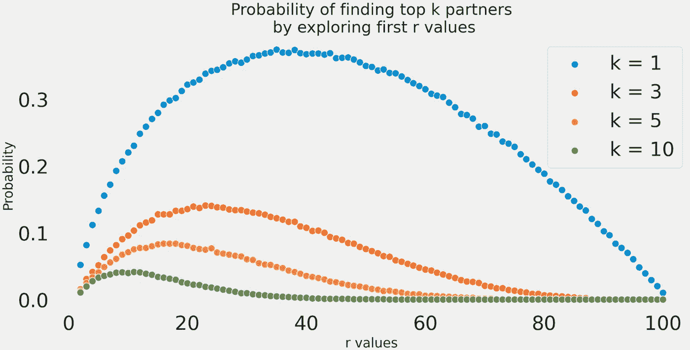
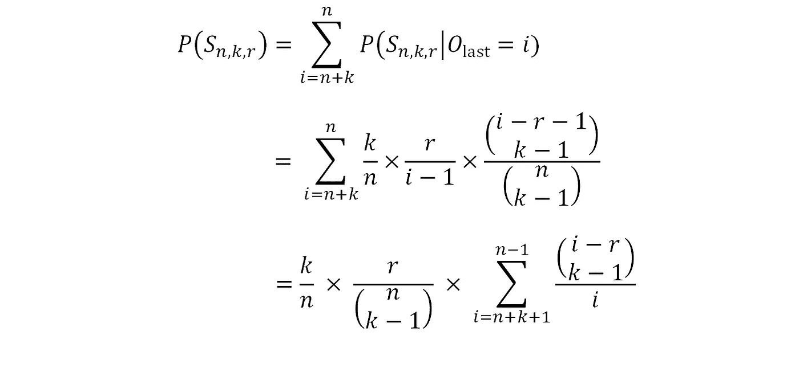
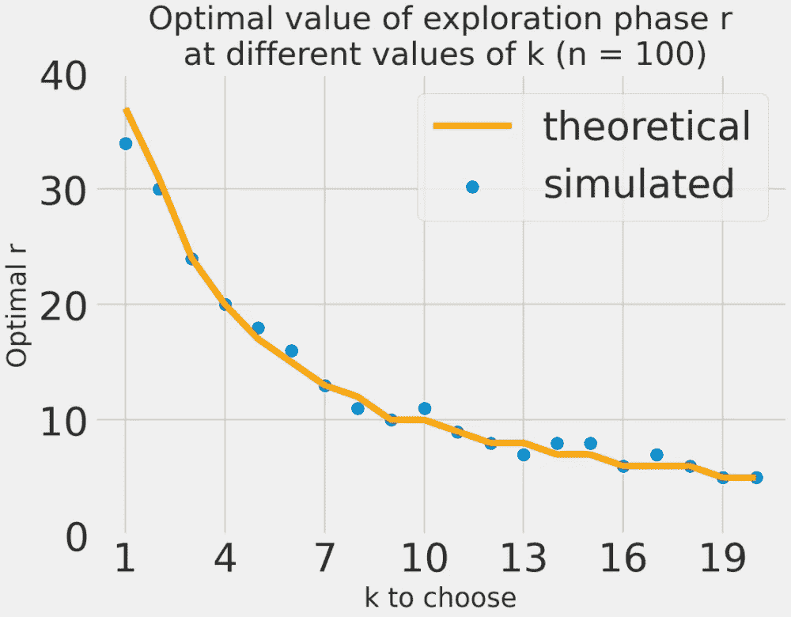
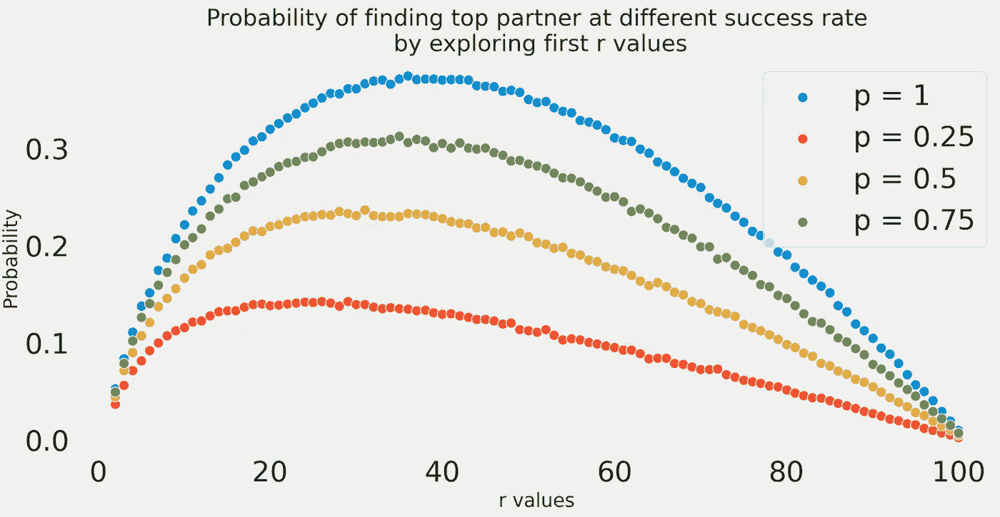

# 疫情时代的爱情:约会的概率方法

> 原文：<https://towardsdatascience.com/love-in-the-time-of-pandemic-a-probabilistic-approach-to-dating-ba888880cd12>

## 约会是很难的——但是也许概率论可以在这个季节让约会变得稍微容易些

图片来自 pix abay(dimitrisvesika 1969)

回到 2019 年，我写了一篇关于最优停止理论及其在约会中的应用的文章。

</probability-theory-and-the-optimal-dating-strategy-for-2018-2b75b26fb0b>  

对于充满希望的浪漫主义者来说，这个教训很简单:为了最大化你找到最佳伴侣的机会，你应该*去了解但不要把自己托付给你将遇到的第一批* 37%的人(你认为)中的任何一个，然后立即满足于第一个比你之前见过的人更好的**人。这样做将保证你有 37%的机会找到数学上命中注定的那一个。**

从那以后已经过了 3 年，这段时间足够让我明白现实和这些数学公式完全不同。

> 然而，现实是严酷的。

我大学毕业，为了工作搬到了一个新的城市。让我告诉你，即使在一切似乎都值得抱怨的年龄，从在蓝瓶餐厅的漫长等待到旧金山湾区没有公共交通，以及我为我的小一居室支付的高昂价格，*缺乏约会的时间和机会*仍然是我最大的抱怨。

然后，疫情热播，突然改变了浪漫的定义，从晚餐的亲密体验，在拥挤的酒吧喝几杯或一个晚安之吻，到尴尬的变焦电话，戴口罩和感染致命疾病的威胁。几乎不可能和一个人约会，更别说 10 个或 37 个了。

图片来自 Pixabay (StockSnap)

更别提旧金山或纽约的约会市场竞争有多激烈了。即使(你认为)你已经找到了那个重要的人，很有可能那个人不在你身边或者没有回报你的感情。

> 因此，数学似乎与现实脱节，现在怎么办？

我们遵循优秀科学家会做的事情:我们承认我们模型的缺点，放松一些假设，并提出新的算法来更好地反映这一现实。

# 1.寻找多种方法——最佳 k 方法

让约会变得稍微容易一点的一个方法是问我们自己:最佳匹配真的与“第二好”或“第三好”有那么大的不同吗？毕竟，我们可能如此迷恋爱情，以至于与排名前三或前五的候选人中的任何一个人建立认真的关系，都可能对我们的一生效用产生很小的影响。

所以，让我们说，我们不是在 100 个人中寻找最佳匹配，而是开始寻找前 **k** 个爱情候选人。我们使用相同的方法:首先，我们探索我们与第一个 ***r*** 候选人的兼容性，并在脑海中记下他们中观察到的最高分数。我们姑且称这个阈值为 ***t*** 。然后，我们从得分高于 ***t*** 的区间 *{r + 1，…，n}* 中选择每个候选人，直到我们选择了 ***k*** 个人或者我们用完了所有候选人。

## **一个模拟:**

让我们也从运行模拟开始，围绕*r 的最佳值建立一些直觉。设置相当简单，使用以下 Python 代码:*

*让我们想象一下当 n = 100 时的结果:*

**

*作者创建的图表*

*我们可以看到 ***k = 1*** 把这个变成了我们只挑选最佳人选的经典问题。因此，理想的*探索阶段*将持续大约 36-37 人。有趣的是，当我们想要选择前 3 名候选人时，我们必须更快地结束我们的探索阶段，只有大约 23 或 24 人，当我们想要广撒网寻找前 10 名候选人时，只有 9 人。*

*你可能会问，随着我们希望挑选的顶级合作伙伴数量的增加，成功的概率实际上是下降的(当 k= 3 时约为 15%，当 k = 10 时约为 4%)，所以这实际上比我们最初的策略更糟糕吗？在最初的策略中，我们保证有 37%的成功率。*

*   *这是真的，但问题是，最初的神奇数字 **37** 只保证你会找到最好的一个，但它没有说他们的可用性。诚然，随着 *k* 的增加，成功选择顶级 *k* 伙伴的概率降低，但*至少其中一个*接受的几率明显更高。毕竟在爱情里，只有一个才算数。*

## **数学实际上是如何工作的？**

*我们也可以运行一些数学来找到 ***r*** 。*

*设 **S(n，k，r)** 为我们成功的事件，即我们在第一个***【r***观测值上使用我们的算法找到前**k***n***候选。我们希望最大化成功的概率，即 **P(S(n，k，r))** 。***

***要做到这一点，我们要用一个小技巧:我们把 **P(S(n，k，r))** 分解成小分量的和 **P(S(n，k，r，i))** ，其中 **S(n，k，r，i)** 是我们成功的事件，其中 ***i*** 是最后选中的候选。***

******

***为了进一步分解 **P(S(n，k，r，i))** ，请注意，对于作为最后选择的候选项的 ***i*** :***

*   ***它必须是前 ***k*** 候选之一，概率为 ***k/n******
*   ***我们能够在 ***i-r-1*** 候选中挑选出 ***k-1*** 候选:***

******

*   ***前 ***r*** 人之一是前 ***i-1*** 人中的佼佼者，以概率 ***r/(i-1)******

***我们的等式变成:***

******

***解析地找到 ***r*** 来最大化这个等式是极其复杂的，超出了本文的范围。但是，如果你信任我，那么随着 ***n → ∞*** ，最优 ***r*** 的逼近:***

******

***如果你需要一些说服力，这是我们的模拟和理论结果之间的 r_best 的样子:***

******

***作者创建的图表***

# ***2.处理拒绝——当你不是对方的另一半时***

***比方说，我们仍然致力于寻找最好的人，而且只找那个人，但是我们意识到这个人有(相当高的)可能性是不可得的，例如，他们可能对你不感兴趣，他们已经有了一段感情，或者……你恰好处于他们的探索阶段。***

***所以让我们稍微调整一下问题，让候选人有权拒绝我们的示爱。我们假设，如果给出我们的建议，任何候选人都会以相同的概率回报我们的感受，而与他们的排名和我们交往的其他人的倾向无关。这显然是天真的，但这个假设现在就可以了。***

***数学是非常混乱的，所以我会救你出来。基本上在这种情况下，策略也是先发掘 ***r*** 候选人，其中***r = p^(1/(1-p)***。例如，如果我们认为录取率是 0.5，那么我们应该探索 r = 0.5^(1/0.5) = 25%的候选人，并从第一个比他们更好的候选人开始。***

***您可以在下面的模拟中看到:***

******

***作者创建的图表***

***根据你的成功预测，你可以发掘更多或更少的候选人。在 25%的成功率下，你只能发掘 15 个左右的候选人。如果你住在我认为(我没有数据支持我的说法)可用率远低于 10%的海湾地区，那么你只能负担得起探索 7 个候选人。也就是说，前景相当严峻。***

# ***超越爱情和约会:***

***在这一点上，你可能会说，即使有这些修正的假设，我们也不可能捕捉到恋爱和约会中人类互动的复杂性。***

***然而，这并不意味着到目前为止你所读到的一切都只是有趣和游戏。到目前为止，你所介绍的是**最优停止理论的支柱，**我们需要根据连续观察到的随机变量来选择采取给定行动的时间，以便最大化预期收益。事实上，你基本上可以把“寻找合作伙伴”换成“雇佣一名数据科学家”、“寻找一个人来出售我的房子”或“期权交易”，数学原理是一样的。特别是你见过的 ***top k*** 问题，是一个众所周知的 ML-system 问题，叫做 ***在线数据采样*** ，你需要从一个数据流中进行在线数据选择和采样，而不需要修改。***

***不过话说回来，都没有约会好玩，不是吗？***

***如果你喜欢这篇文章，你可能也会喜欢我的另一篇关于有趣的统计事实和经验法则的文章***

*   ***[迪士尼电影是对的——我们都是特殊的，从统计数据来看也是如此](/disney-movies-were-right-we-are-all-special-and-statistically-so-3bb56e79ab71)***
*   ***[优化生活的统计法则:呼唤效应](/a-statistical-rule-to-optimize-your-life-the-lindys-effect-96d2c75b080d)***

***对于其他深潜分析:***

*   ***[贝叶斯统计如何说服我去健身房？](/how-bayesian-statistics-convinced-me-to-hit-the-gym-fa737b0a7ac)***
*   ***[利用数据驱动的体育博彩策略赚大钱](/making-big-bucks-with-a-data-driven-sports-betting-strategy-6c21a6869171)***

***你可以在我的 Github [链接](https://github.com/tuangauss/DataScienceProjects/blob/master/Python/optimal_dating.py)找到我的文章的所有代码。***