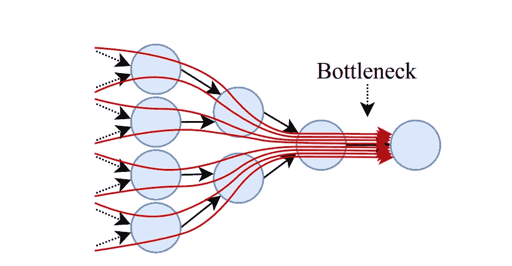
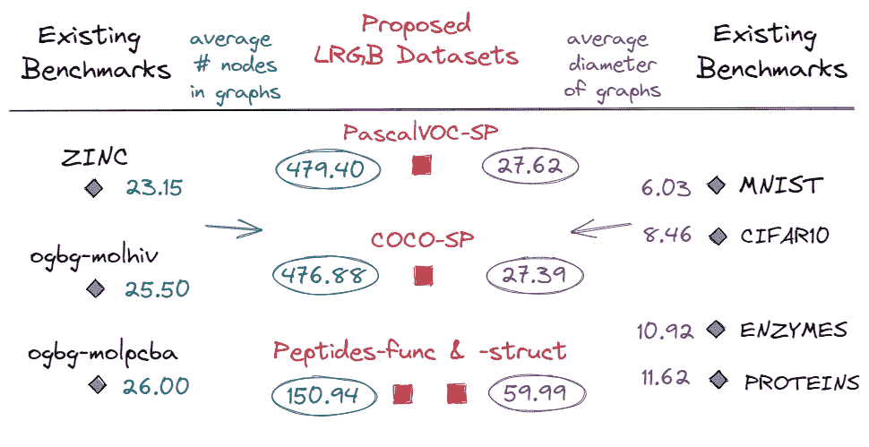
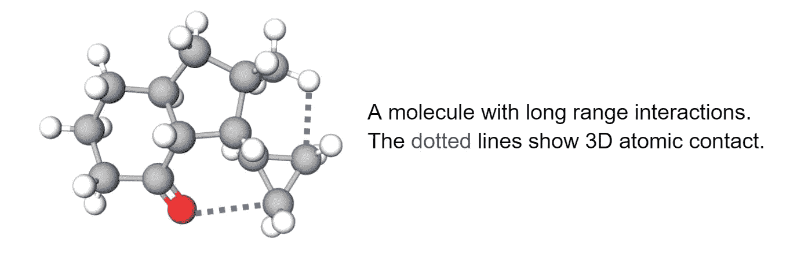
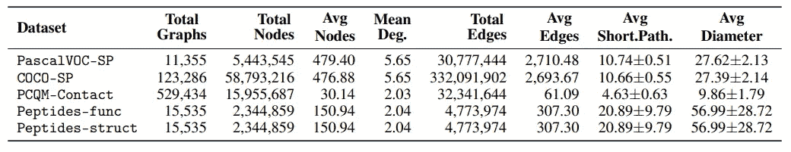
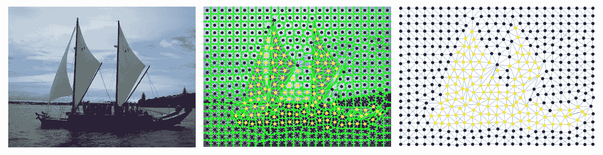
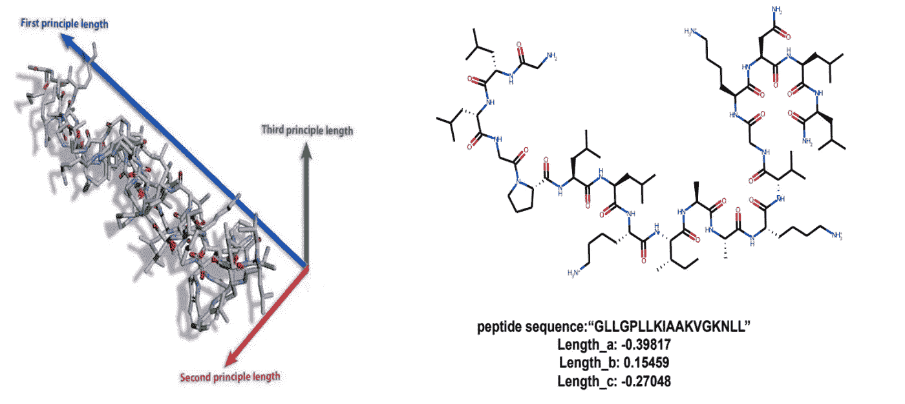
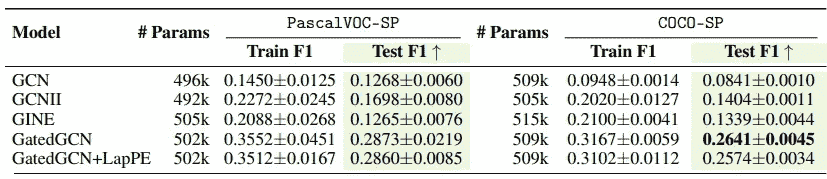
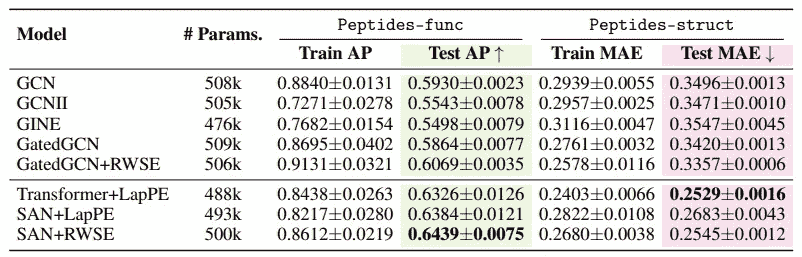
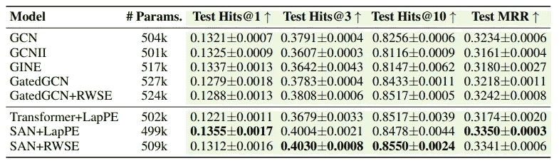

# LRGB:长期图表基准

> 原文：<https://towardsdatascience.com/lrgb-long-range-graph-benchmark-909a6818f02c>

## 用远程建模评估图网络的基准

为了解决在*中基于消息传递的图形神经网络(MP-GNN)不能在远处的节点*之间实现信息交换*的局限性，最近出现了几个图形转换器(GTs ),它们固有地*模型长程依赖性*。然而，对现有基准的评估通常显示 MP-GNNs *的性能与* GTs 相当或更好* *，这使得*缺少合适的基准来测试模型传播远程信息的能力。 **LRGB** 介绍了一组数据集，这些数据集可能*需要远程建模*才能让网络很好地完成任务，因此可以用于*一个试验台*来构建未来 GTs 的原型。**

照片由[阿丽娜·格鲁布尼亚克](https://unsplash.com/@alinnnaaaa?utm_source=medium&utm_medium=referral)在 [Unsplash](https://unsplash.com?utm_source=medium&utm_medium=referral) 上拍摄

*这篇文章，名正言顺地简要介绍了基准，是与* [*拉迪斯拉夫·拉帕切克*](https://rampasek.github.io/)*[*米哈伊尔·高尔金*](https://migalkin.github.io/)*[*多米尼克·贝艾尼*](https://twitter.com/dom_beaini?lang=en)*共同撰写的，是基于论文* [*的长程图基准(2022)*](https://arxiv.org/abs/2206.08164)**

****

**带有数据集概述的长期图表基准。**

## **概述**

1.  **远程信息瓶颈**
2.  **现有图形基准**
3.  **表征远程图表数据集**
4.  **提议的 LRGB 数据集和任务**
5.  **实验和经验教训**

## ****1。远程**信息瓶颈**

**基于[消息传递](https://arxiv.org/abs/1704.01212)的图形神经网络(MP-GNN)层聚集来自其 1 跳邻居的信息，以更新节点的特征表示。虽然 MP-gnn 有一些局限性，但我们将关注所谓的信息瓶颈，它特别影响远程交互。**

****

**长距离信息传播造成的瓶颈。图片来源:Alon 和 Yahav，2021**

**如果任务需要来自一个 *L* 跳邻居的远程信息，理想情况下需要堆叠 *L* 个层。随着 *L* 的增加， *L* 跳邻域呈指数增长，需要编码到一个向量中的信息量也呈指数增长，参见 [Alon 和 Yahav，2021](https://arxiv.org/abs/2006.05205) 中披露的相邻图示。在处理*需要*长距离信息传播的任务时，这给 MP-GNNs 带来了严重的**瓶颈**。**

> **Alon 和 Yahav，2021 采用的直观补救方法是使用完全相邻的层，以允许原本距离较远的节点之间的直接(1 跳)信息流。可以看出，这个简单的解决方案在一定程度上影响了最近在全连通图上运行的图转换器的工作。查看本次调查。**

## **2.现有图形基准**

**许多现有的[图](https://chrsmrrs.github.io/datasets/) [学习](https://ogb.stanford.edu/) [基准](https://github.com/graphdeeplearning/benchmarking-gnns)由预测任务组成，这些预测任务主要依赖于本地结构信息而不是远程信息传播来计算目标标签或度量。这可以在数据集如[锌](https://paperswithcode.com/sota/graph-regression-on-zinc-500k)、 [ogbg-molhiv](https://ogb.stanford.edu/docs/leader_graphprop/#ogbg-molhiv) 和 [ogbg-molpcba](https://ogb.stanford.edu/docs/leader_graphprop/#ogbg-molpcba) 中观察到，其中主要依赖于编码局部(或近局部)结构信息的模型继续在排行榜上名列前茅。**

****

**与 LRGB 现有相关基准的图形大小统计比较图。作者图片。**

**同时，这种现有基准中的图是小尺寸的，*即*，节点数。上图显示了图形大小统计的对比。**

**由于这些原因，我们认为当前的基准可能不足以原型化具有远程建模能力的 GNNs。**

## **3.表征远程图表数据集**

**我们现在继续讨论几个主要特征，这些特征有助于衡量数据集是否适合测试长期建模 GNN 架构。**

> *****图形大小:*****

**图中节点的数量是确定长范围图数据集的重要特征。 [Alon 和 Yahav，2021](https://arxiv.org/abs/2006.05205) 定义了一个术语叫做 ***问题半径*** 它指的是对于一个特定的*问题*来说**节点*之间所需的交互范围。如果一个图表数据集作为一个长期基准，那么它的问题半径必须足够大。***

**尽管对于真实世界的图数据集，问题半径可能无法精确量化，但是如果图具有较少数量的节点，这个*假设的*度量实际上会更小。**因此**，数据集的(平均)图形大小是确定它是否可能是潜在的远程图形数据集的关键属性。**

> *****任务性质:*****

**任务的性质可以理解为与问题半径直接相关。从广义上讲，任务既可以是**短程**、*即*，需要在本地或近本地邻域内的节点之间进行信息交换，也可以是**远程**，需要远离近本地邻域进行交互。**

**例如，在 ZINC 分子回归数据集中，任务与使用基于子结构计数的模型对局部结构和实验发现进行计数相关联 [Bouritsas 等人，2020](https://arxiv.org/pdf/2006.09252v1.pdf) 已经表明 ZINC 的任务最好需要对 7 长度的子结构进行计数。锌的回归任务可能因此被解释为一个短程任务。**

> *****全局图结构对任务的贡献:*****

**学习任务受益于全局结构信息的数据集可以是潜在的长程图数据集。**

**由于 MP-gnn 依赖于局部特征聚合，因此*容易丢失*全局结构信息，[通常使用全局位置编码(PEs)](https://arxiv.org/abs/2205.12454) 来注入。如果图形尺寸很大，MP-GNNs 可能会由于[过度挤压](https://arxiv.org/abs/2006.05205)而丢失来自远处节点的信号。这种信号可以方便地在全连接的类似变压器的网络中传播。因此，全局结构对任务的贡献变成了一个*在一个远程图数据集中所期望的独特的*属性，因为它*根据它们的远程建模能力*来区分两个架构类。**

****

**远程节点之间的 3D 原子接触的示例表示。作者图片。**

**类似地，如果学习任务依赖于某种形式的距离信息，再加上图形特征，如上面的分子示例所示，数据集可以是长期基准的潜在候选对象。**

## **4.提议的 LRGB 数据集和任务**

**我们考虑上述特征以提出 5 个图形学习数据集的集合，这些数据集可用于原型 gnn 或具有远程建模能力的变压器。有关数据集统计数据的概述，请参见下表:**

****

**提议的 LRGB 数据集的统计数据。作者列表。**

**虽然我们建议读者参考[论文](https://arxiv.org/abs/2206.08164)以了解数据集的完整细节，但是**我们在此简要介绍了它们的亮点**以及显著的长程特征。**

****PascalVOC-SP 和 COCO-SP:** 这是分别基于 [Pascal VOC 2011](http://host.robots.ox.ac.uk/pascal/VOC/voc2011/index.html) 和 [MS COCO](https://cocodataset.org/#home) 图像数据集的超像素图。两个数据集中的学习任务是节点分类，其中相对于相应图像数据集中的原始语义分割标签，每个节点对应于属于特定类别的图像区域。**

****

**样本 Pascal VOC 2011 图像(左)、图形-图像叠加和 PascalVOC-SP 图形(右)。作者图片。**

**与现有的超像素图形数据集(如 MNIST 的[、CIFAR10 的](https://arxiv.org/abs/2003.00982))相比，PascalVOC-SP 和 COCO-SP 包含的图形节点数量要多得多(多达 500 个)。类似地，基于节点区域边界的图的构造(*即*，如果两个节点在原始图像中共享公共边界，则它们是连接的)导致具有增加的平均直径的更稀疏的图。**

****PCQM-Contact:** 该数据集基于来自 OGB-LSC 的 [PCQM4M 数据集的子集，其中每个图对应于一个具有显式氢的分子图，并且任务，链接预测，是预测将在具有预定义阈值的 3D 空间中彼此接触的远距离节点对。](https://ogb.stanford.edu/docs/lsc/pcqm4mv2/)**

**尽管 PCQM-Contact 中的图表大小并没有明显变大，但其设计的接触图预测任务使其成为一个合适的远程图表数据集，因为它满足了任务的*性质以及*全局信息贡献*特征。***

***Peptides-func 和 Peptides-struct:** 这些是从 [SATPdb Peptides 数据库](http://webs.iiitd.edu.in/raghava/satpdb/index.html)中获得的分子图，其中 Peptides-func 是用于预测肽功能的多标签图分类数据集，而 Peptides-struct 是用于预测 3D 结构特性的多标签图回归数据集，其中一些是长程距离计算。*

**

*肽的样品可视化(左)及其分子图(右)。作者图片。*

*肽分子图的平均直径比 PCQM-Contact 以及现有的酶和蛋白质基准图的平均直径大大约 6 倍，使其适用于远程测试。*

## *5.实验和经验教训*

*我们使用图学习文献中的**两个主要架构类**进行基线实验:(i) **本地 MP-GNNs** 和(ii) **全连接图转换器**，以建立基准趋势并了解更多关于数据集的信息，同时还绘制出一些需要进一步研究的可能挑战。*

> **实验设置、使用的模型和基线结果都包含在* [*论文*](https://arxiv.org/abs/2206.08164) *中。我们在这里讨论* ***学到的关键经验*** *，同时解决以下主要问题:**

***Q1:** 是一个局部特征集合，使用较少层数的 MP-GNNs 建模，足以完成在 LRGB 提出的任务？
**答:**我们对*浅层* MP-GNNs ( *L=2* )与*深层*(*L = 5，8* )的比较显示，信息聚合仅限于几跳的模型明显不足，并且在所有 5 个 LRGB 数据集上提供较差的泛化能力。因此，建议的基准适用于评估具有更深架构的 gnn，以及我们在下面的分析中了解到的长期建模。*

> *S 由于过度挤压的影响增加，简单的本地 MP-GNN 实例性能很差。在 [Alon 和 Yahav，2021](https://arxiv.org/abs/2006.05205) 中观察到类似的经验发现。*

***Q2:** 在建议的基准测试中，与本地 MP-gnn 相比，我们是否观察到捕获长程相互作用能力增强的模型的性能有明显的差异？
**答:**我们观察到，除了节点数量最多的数据集 COCO-SP 数据集[#]之外，配备了远程功能的变压器模型在所有基线实验中都是性能最好的基线。在所有数据集中，Peptides-func 和 Peptides-struct 的性能差距最明显，这可归因于这两个数据集满足上述所有特征因素。*

> *[#]基线变压器似乎较慢，不适合 COCO-SP，在 COCO-SP 上，最近的 [GraphGPS](https://arxiv.org/abs/2205.12454) 架构可以模拟远程依赖性，明显优于 MP-GNNs。*

***Q3:** 新的性能指标评测会带来哪些挑战和未来发现？
**答:**我们的基准测试实验揭示了不同的挑战，在使用建议的数据集时，可以进行进一步的研究。*

***首先，**当与本地 MP-gnn 一起使用时，位置编码(PE)的使用对性能贡献很小或没有贡献。请参见下表进行演示。一个有趣的探索途径是开发强大的机制来最大限度地利用非局部结构信息，正如 PEs 通常所设想的那样。*

**

*PascalVOC-SP 和 COCO-SP 的节点分类任务的基线结果。绩效指标是宏 F1。**加粗**:最好成绩。作者列表。*

***其次，**下表中所示的针对建议任务观察到的当前得分表明，*仍有很大的空间需要通过更好地设计能够利用不规则稀疏结构信息以及传播远程交互的图形网络架构来填充*。*

**

*肽-功能(图形分类)和肽-结构(图形回归)的基线结果。性能度量是分类的平均精度(AP)和回归的平均精度(MAE)。**加粗**:最佳配乐。作者列表。*

**

*PCQM-Contact(链接预测)的基线结果。性能指标是点击率@K 和平均倒数排名(MRR)。**加粗**:最好成绩。作者列表。*

***最后，**我们希望 LRGB 能够促进[可扩展的远程建模架构](/graphgps-navigating-graph-transformers-c2cc223a051c)的开发，因为许多琐碎的二次变换器[*o(n^2】*]在 LRGB 上扩展可能计算效率低下，lrgb 的平均容量高达 479.40。数据集中的节点、5879 万个节点和总共 3.3209 亿条边。*

* [## GraphGPS:导航图形转换器

### 烹饪最佳图形转换器的食谱

towardsdatascience.com](/graphgps-navigating-graph-transformers-c2cc223a051c) 

我们[**开源**](https://github.com/vijaydwivedi75/lrgb)****远程图形基准**与数据集加载器，准备以及基线实验的代码，这些都是基于用 [PyG](https://www.pyg.org/) 和 [GraphGym](https://pytorch-geometric.readthedocs.io/en/2.0.0/notes/graphgym.html) 构建的 [GraphGPS](https://github.com/rampasek/GraphGPS) 包。**

**为你的下一个项目尝试 LRGB，设计长期可行的架构！**

> ***📜* [*arxiv 预印本*](https://arxiv.org/abs/2205.12454) *🔧* [*Github 回购*](https://github.com/vijaydwivedi75/lrgb) *🏆* [*排行榜*](https://paperswithcode.com/dataset/pascalvoc-sp)***