# go _ backward()—揭开它“隐藏”的秘密

> 原文：<https://towardsdatascience.com/lstm-go-backwards-unravelling-its-hidden-secrets-ed094952b5cc>

## 了解其隐藏的细微差别&探索其泄漏的性质！

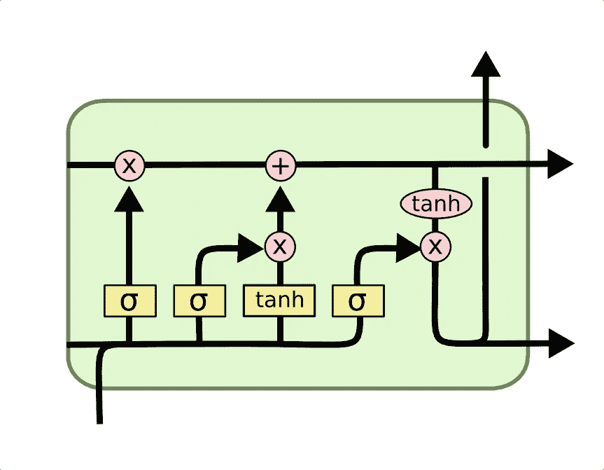

LSTM 细胞的表现|图片作者:Christopher Olah

# **简介**

长短期记忆(LSTM)是递归神经网络(RNN)的高级版本，顾名思义，能够在相对较长的序列上存储“上下文”。这使得它们成为 NLP 任务的完美工具，如文档分类、语音识别、命名实体识别(NER)等。

在许多应用中，如机器翻译、语音识别等。，**来自两边的上下文**提高了基于语言的模型的性能。为了在实践中实现这一点，我们使用双向 LSTMs。然而，如果您需要分别提取向前和向后运行的嵌入，您将需要实现两个独立的 lstm，其中第一个接收向前的输入，另一个以向后的方式处理输入。

为了节省您的大量精力，Tensorflow 的 LSTM 让您可以灵活地正常使用 give 输入，同时在内部以相反的方式处理它，从右到左学习上下文！这是通过将***go _ backward()= True****放入 LSTM 层来实现的。简而言之，如果您的输入是['I '，' am '，' the '，' author']，那么 LSTM 将从右向左读取，这要感谢 go_backwards()，并将输入视为['author '，' the '，' am '，' I']。这允许模型学习双向上下文！*

*到目前为止一切顺利。然而，这里有一个警告！当您在管道中添加正向和反向上下文时，您往往会在这个过程中泄漏大量信息，这可能会导致模型在评估期间给出大约 100%的准确性！！这是因为我们没有理解 go _ backwards()的真正、微妙的实现。*

*在这篇博客中，我使用一个真实的 NLP 示例来揭示 go _ backward()的真正实现，并探索 go _ backward()的预期行为的微小变化如何会导致模型评估期间的大量泄漏！*

# *任务:下一个单词预测*

*考虑下一个单词预测任务，其中基于当前输入，模型需要预测下一个单词。向后的方向接收，比方说，原始句子索引 2 处的单词，所以它需要预测索引 1 处的单词！*

*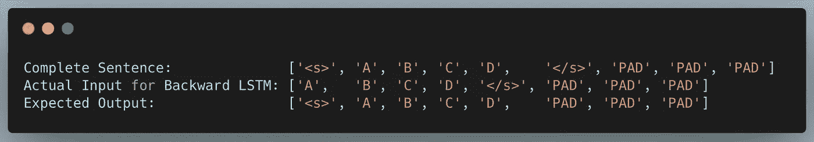*

*作者对 LSTM |图像反向的输入输出表示*

# *模型架构*

*让我们考虑下面的架构。我们有两个独立的输入，一个用于 LSTMs 的正向，另一个用于反向。*

*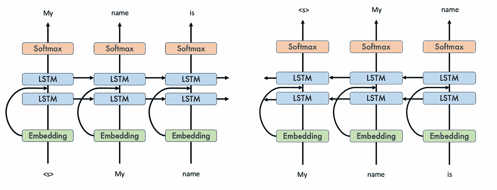*

*手头任务的双向 LSTMs 表示:下一个单词预测|作者图片*

*我们创建或利用预先训练的嵌入，如 Word2Vec、Glove 等。对于每个单词，通过 LSTMs 传递它们，通过密集层传递嵌入并将其与 LSTM1 输出相加来使用跳过连接，通过另一组 LSTM 层传递总和，最后通过一个公共的 Softmax 层来获得整个词汇中最可能的预测！*

*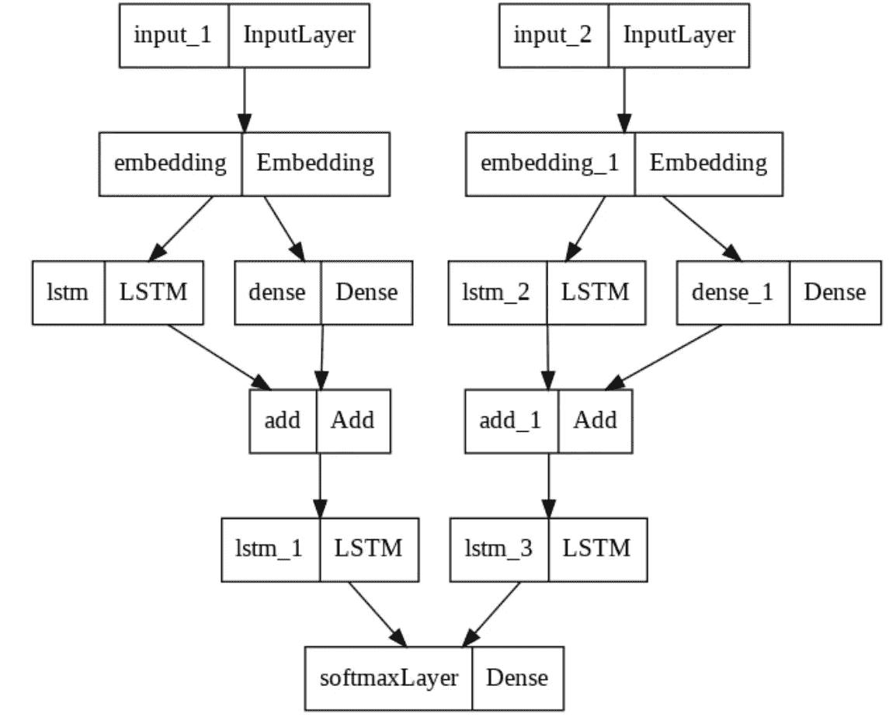*

*作者为任务选择的模型架构|图片*

# *观察*

*上述模型在 IMDB 训练数据集上训练超过 75 个时期，具有适当的批量大小、学习速率和实现的早期停止。由于后者，模型训练停止了大约 35 个时期。你应该注意到从向后的 LSTM 层输出的惊人结果！*

*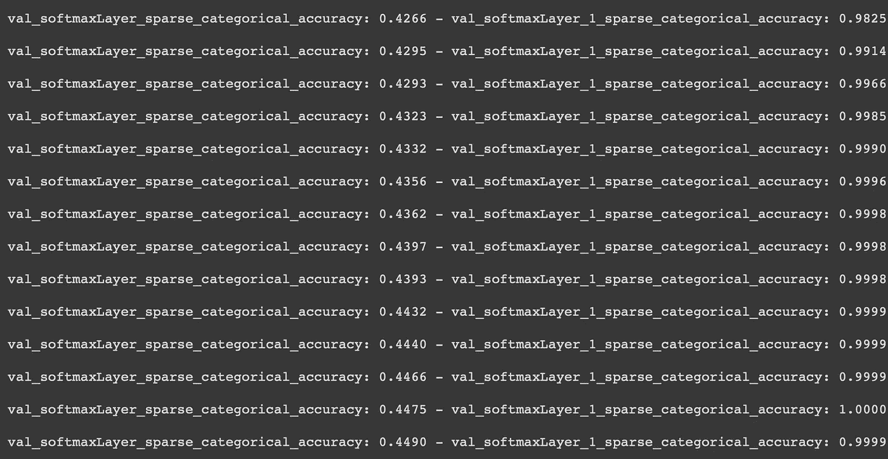*

*前向和后向 LSTM 图层的验证精度|图片由作者提供*

*你注意到倒数第二排的 100%准确率了吗！！！很疯狂，对吧？这意味着模型已经“完美地学习”了正确的模式，根据输入给出输出。但是下一个单词预测并不是一个可以完美学习的任务。这就像说对未来的预测有可能 100%准确。😮*

*但是我们知道，在模型中的某个地方，一定会发生一些泄漏，而之前已经暗示了输出。这是我在 AI 大学 AI-3 课程(NLP)中做项目时意识到的。这个发现是这篇文章的主要目的——找出这种奇怪行为背后的原因！*

# *关于 go _ backwards()的一些隐秘的事情？：*

*LSTM 的前进方向通过文件大部分是清楚的。但是，go _ backwards()函数似乎有点棘手。如果你看一下它的文档，你会注意到它正向获取输入序列，在内部反转，然后处理它，最后给出**反转**序列。*

*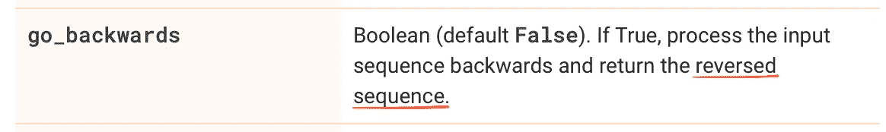*

*根据 Tensorflow 中的 [LSTM 文档使用 go _ backward()|来源:](https://www.tensorflow.org/api_docs/python/tf/keras/layers/LSTM) [Tensorflow LSTM](https://www.tensorflow.org/api_docs/python/tf/keras/layers/LSTM)*

*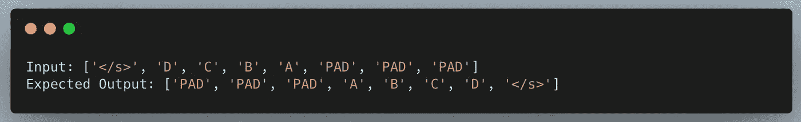*

*作者对后退图片的直观应用*

*然而，与我们的预期不同，在 LSTMs 中颠倒顺序并不那么简单。根据 go _ backwards()的[官方文档](https://github.com/keras-team/keras/blob/v2.9.0/keras/layers/rnn/lstm.py#L346-L813)， [tf.reverse_sequence(](https://www.tensorflow.org/api_docs/python/tf/reverse_sequence) )是用于反转输入的函数，这不是简单的反转。该函数不是从右到左排列，而是只反转由“序列长度”决定的记号的数量，并保持句子的其余部分不变，因为其他记号是填充记号，不需要反转！*

**

*来自 LSTM 的输出，带有 go_backward()=True |作者图片*

*参数 go _ backward()= True 意味着 LSTM 层将接受输入，使用 tf.reverse_sequence 策略对其进行反转，通过 LSTM 层找到输出，最后将填充的标记放在前面！！这个最终的反转是使用 [tf.reverse()](https://www.tensorflow.org/api_docs/python/tf/reverse) 完成的。*

# *引擎盖下:第一 LSTM*

*所以这就是当你在第一个 LSTM 层**中把 go _ backwards()参数设为真时的情况。请注意，我们假设 LSTM 是一个身份映射器，即输出作为输入。这样做是为了便于表示和理解。***

*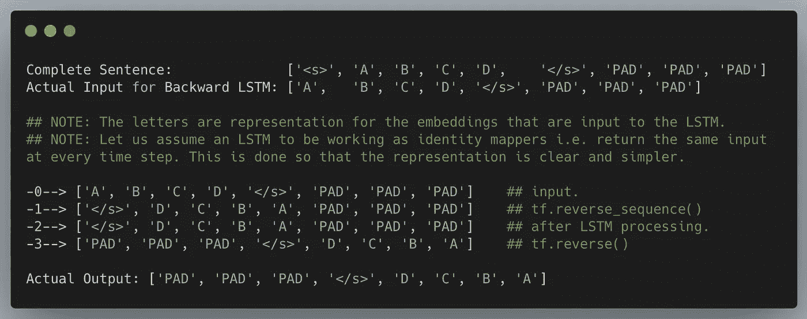*

*第一个反向 LSTM 层的工作|由作者制作的图像*

*如果您仔细观察，就会发现 go _ backward()= True 的 LSTM 图层的输出正在执行文档中提到的任务。最终的输出实际上是我们期望的(假设为真)输出的真实反转(字面意义)*

*但是，我们没有反转这个输出，而是直接将其用于跳过连接，并在管道中使用 is！这就是事情变糟的地方！*

# *集中精力解决问题！*

*在我们的模型中，我们将输出(实际上是 xD 以上的反向输出)添加到密集输入，然后将其传递到下一个反向 LSTM。让我们用上面的例子做一次预演，看看第二个 LSTM 层**和你从 LSTM 1:***

**

*添加了带有密集图层输出的输入|作者提供的图像*

*您是否注意到输出是如何对称的！！即使我们对加法进行加权，去掉对称性，你也逃不出 LSTM2！*

*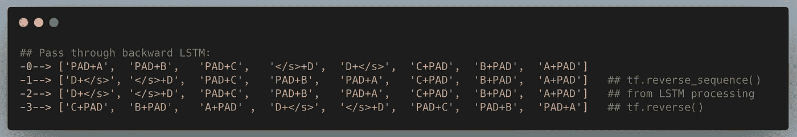*

*第二层反向 LSTM 层|图片由作者制作*

*现在假设 PAD=0， ~~=1，A=2，B=3，C=4，D=5，~~ =6(为简单起见，用数字表示)，则输入为:*

*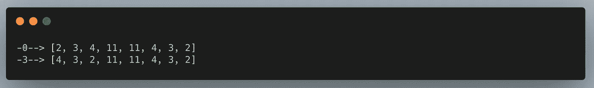*

*按作者呈现输出|图像*

*给定第 0 行的输入，对于 LSTM 这样的神经网络来说，找到输出中的模式有多难？😌这就是第二个 LSTM 层非常快赶上并达到接近 100%验证准确性的原因！！*

*问题的根源是 go _ backward()= True 的 LSTM 的输出实际上是**反转**，如文档中所述。在通过之前你需要翻转它！*

# *实验*

*我手动翻转了两个 LSTM 图层的输出，在轴=1 上使用 go _ backward()= True，并在 75 个时期内获得了两个图层约 44%的准确性，并提前停止。后来，我在用于情感分类的 IMDB 数据集上观察了三种不同的迁移学习实现的以下结果:*

*1.基线:85.75%
2。Word2Vec: 84.38%
3。ELMo:80.17%[使用来自嵌入层的嵌入、第一 LSTM 正向和反向运行的级联输出以及第二 LSTM 的级联输出。*

*(大约 50 个时期，提前停止)*

*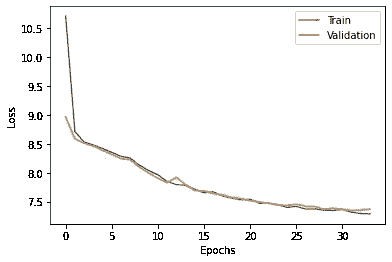**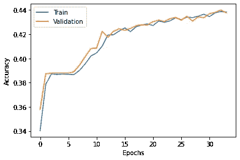

训练时模型的丢失和验证准确性|图片由作者提供* 

*如果你有兴趣详细了解 LSTM 的内幕，请点击以下链接:*

 *[## 了解 LSTM 网络

### 2015 年 8 月 27 日发布人类不是每秒钟都从零开始思考。当你读这篇文章时，你…

colah.github.io](https://colah.github.io/posts/2015-08-Understanding-LSTMs/)* 

# *这个故事的寓意！*

> *在实施之前，请务必仔细阅读文档！🤓
> 在使用工具之前，先了解它们！:)*