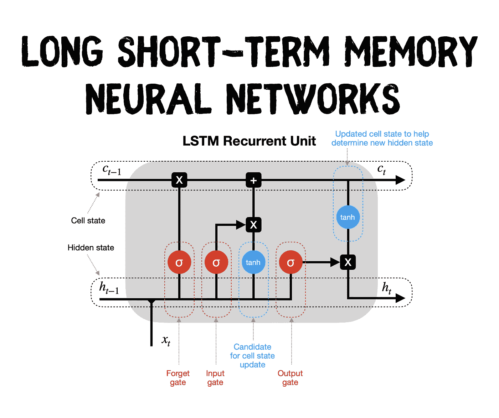
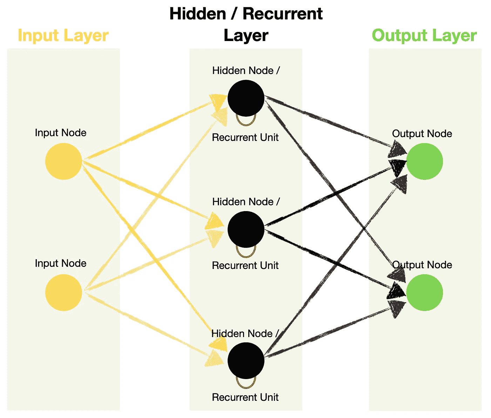
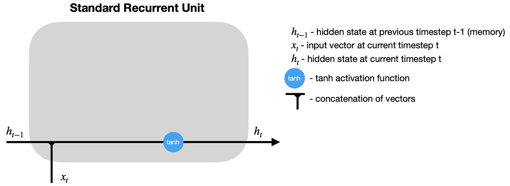
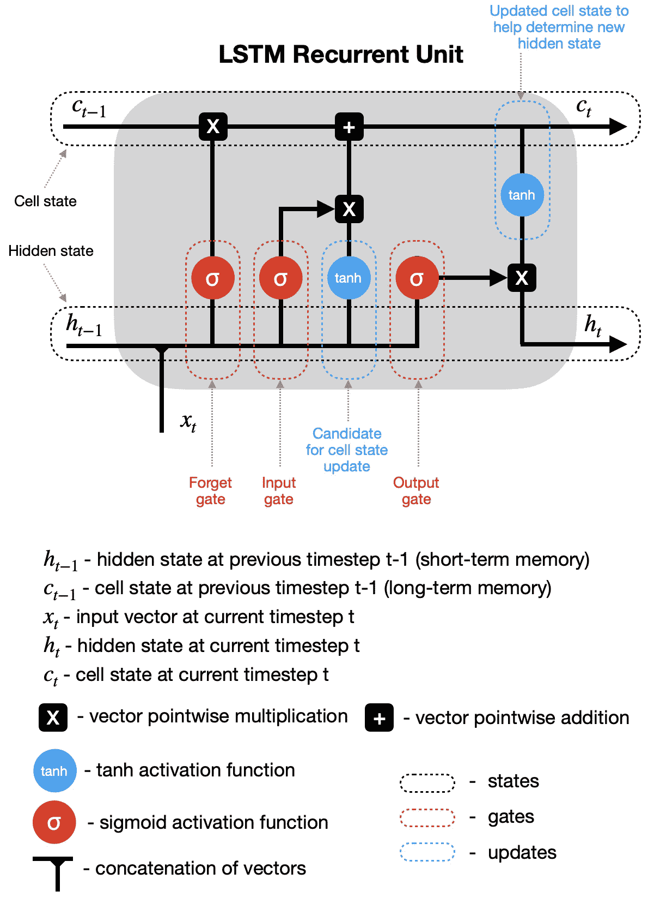
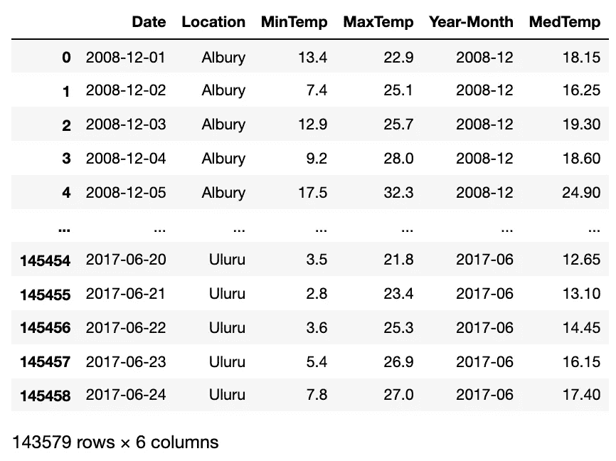
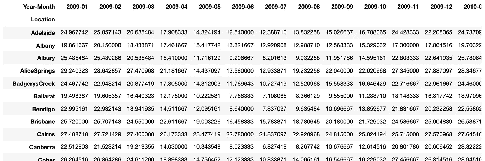
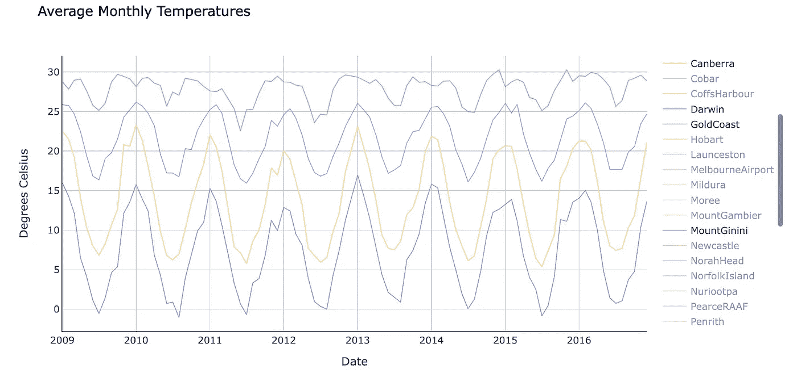
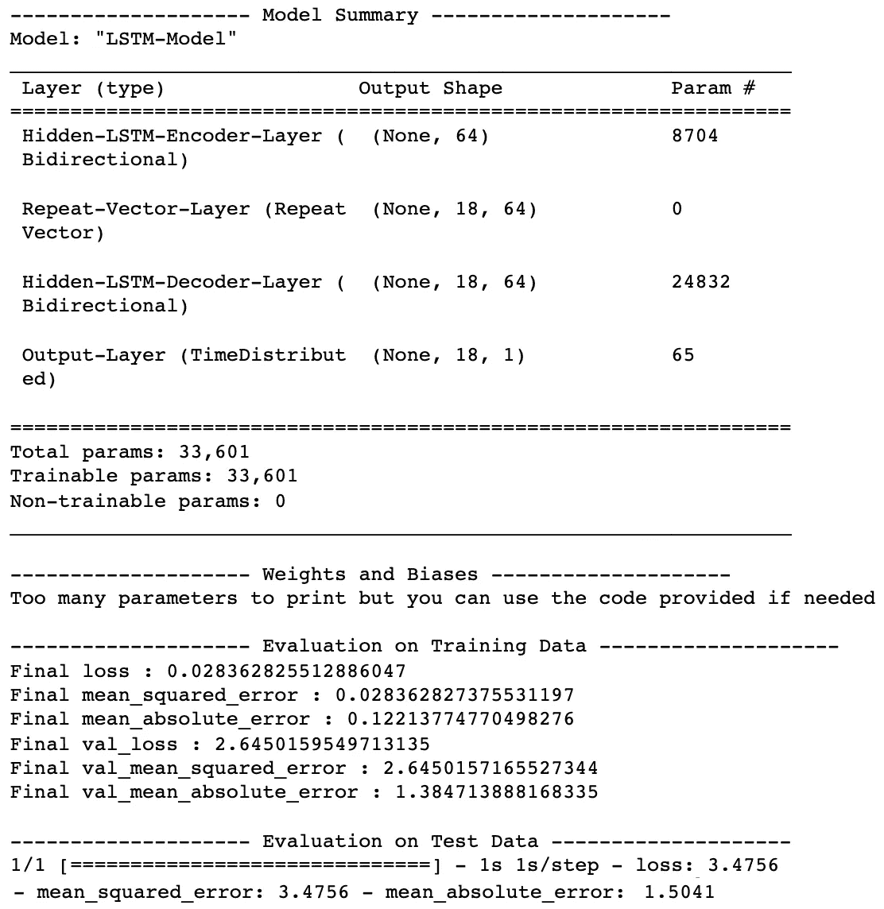
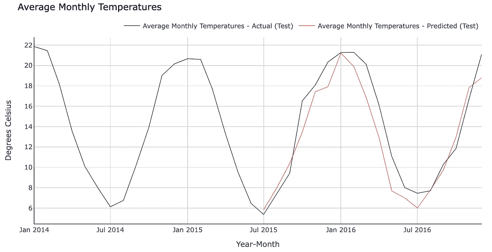

# LSTM 递归神经网络——如何教网络记住过去

> 原文：<https://towardsdatascience.com/lstm-recurrent-neural-networks-how-to-teach-a-network-to-remember-the-past-55e54c2ff22e>

## 神经网络

## 以双向 LSTM 解决“多对多”序列问题为例直观解释长时短时记忆



长短期记忆(LSTM)神经网络。图片作者。

# 介绍

标准递归神经网络(RNNs)由于在处理较长的数据序列时出现的消失梯度问题而遭受短期记忆。

幸运的是，我们有更先进的 RNNs 版本，可以保存序列早期的重要信息，并将其发扬光大。两个最著名的版本是**长短期记忆(LSTM)** 和 [**门控循环单位(GRU)**](/gru-recurrent-neural-networks-a-smart-way-to-predict-sequences-in-python-80864e4fe9f6) 。

在本文中，我将重点关注 **LSTM** 的结构，并为您提供一个详细的 Python 示例供您使用。

# 内容

*   LSTM 在机器学习领域处于什么位置？
*   LSTM 与标准 RNNs 有何不同，LSTM 是如何工作的？
*   一个完整的 Python 示例，向您展示了如何构建和训练您自己的 LSTM 模型

# LSTM 在机器学习领域处于什么位置？

下面的图表是我对最常见的机器学习算法进行分类的尝试。

虽然我们经常以监督的方式使用带有标签的训练数据的神经网络，但我觉得它们独特的机器学习方法值得单独归类。

因此，我的图表显示了从机器学习宇宙的核心分支出来的神经网络。递归神经网络占据 NNs 的一个子分支，并且包含诸如标准 RNNs、LSTMs 和 GRUs 的算法。

下图是**交互式的，**所以请点击不同的类别来**放大并展示更多的**👇。

机器学习算法分类。由[作者](https://solclover.com/)创建的互动图表。

***如果你喜欢数据科学和机器学习*** *，请* [*订阅*](https://solclover.com/subscribe) *获取我的新文章的电子邮件。*

# LSTM 与标准 RNNs 有何不同，LSTM 是如何工作的？

让我们先快速回顾一下简单的 RNN 结构。RNN 由类似于前馈神经网络的多层组成:输入层、隐藏层和输出层。



标准递归神经网络结构。图片由[作者](https://solclover.com/)提供。

然而，RNN 在其隐藏层中包含了**个递归单元**，这允许算法处理**个序列数据**。它通过循环传递来自前一个**时间步长**的隐藏状态并将其与当前时间步长的输入相结合来实现。

> 时间步长—通过递归单元对输入进行的单一处理。时间步长的数量等于序列的长度。

如果需要，你可以在我的[前一篇文章](/rnn-recurrent-neural-networks-how-to-successfully-model-sequential-data-in-python-5a0b9e494f92)中找到标准 rnn 的详细解释。

## LSTM 和标准的 RNN 有什么不同？

我们知道 RNNs 利用**循环单元**从序列数据中学习。LSTMs 也是。然而，在这两者之间，循环单元内部发生的事情是非常不同的。

查看标准 RNN 的简化递归单位图(未显示权重和偏差)，我们注意到只有两个主要操作:将先前的隐藏状态与新的输入相结合，并将其传递给激活函数:



标准 RNN 循环单位。图片由[作者](https://solclover.com/)提供。

在时间步长 t 计算隐藏状态后，它被**传回递归单元**并与时间步长 t+1 的输入组合，以计算时间步长 t+1 的新隐藏状态。对 t+2、t+3、…、t+n 重复该过程，直到达到预定数量(n)的时间步长。

与此同时，LSTM 利用各种关口来决定保留或丢弃哪些信息。还有，它增加了一个**细胞状态**，就像是 LSTM 的长期记忆。所以让我们仔细看看。

## LSTM 是如何工作的？

LSTM 递归单元比 RNN 复杂得多，提高了学习，但需要更多的计算资源。



LSTM 循环股。图片由[作者](https://solclover.com/)提供。

让我们通过简图(未显示权重和偏差)来了解 LSTM 循环单位是如何处理信息的。

1.  **隐藏状态&新输入** —来自前一时间步(h_t-1)的隐藏状态和当前时间步(x_t)的输入在通过各种门传递其副本之前被组合。
2.  **遗忘之门** —这个门控制着什么信息应该被遗忘。因为 sigmoid 函数的范围在 0 和 1 之间，所以它设置单元状态中的哪些值应该被丢弃(乘以 0)、记住(乘以 1)或部分记住(乘以 0 和 1 之间的某个值)。
3.  **输入门**有助于识别需要添加到单元状态的重要元素。注意，输入门的结果乘以单元状态候选，只有输入门认为重要的信息被添加到单元状态。
4.  **更新单元状态**—首先，前一个单元状态(c_t-1)乘以遗忘门的结果。然后我们从[输入门×单元状态候选]中加入新的信息，得到最新的单元状态(c_t)。
5.  **更新隐藏状态** —最后一部分是更新隐藏状态。最新的单元状态(c_t)通过 tanh 激活函数，并乘以输出门的结果。

最后，最新的单元状态(c_t)和隐藏状态(h_t)回到递归单元，并且在时间步长 t+1 重复**过程。循环继续，直到我们到达序列的末尾。**

[](https://solclover.com/membership)[](https://www.linkedin.com/in/saulius-dobilas/)

# **一个完整的 Python 例子，展示了如何构建和训练你自己的 LSTM 模型**

我们可以以四种不同的方式使用 LSTMs:

*   **一对一** —理论上是可能的，但是如果一个项目不是一个序列，你就不会得到 LSTMs 提供的任何好处。因此，在这种情况下，最好使用[前馈神经网络](/feed-forward-neural-networks-how-to-successfully-build-them-in-python-74503409d99a)。
*   **多对一** —使用一系列值来预测下一个值。你可以在我的 [RNN 文章](/rnn-recurrent-neural-networks-how-to-successfully-model-sequential-data-in-python-5a0b9e494f92)中找到这种设置的 Python 例子。
*   **一对多** —使用一个值预测一系列值。
*   **多对多** —使用一个值序列来预测下一个值序列。我们现在将构建一个多对多的 LSTM。

## 设置

获取以下数据和库:

*   [澳大利亚天气数据来自 Kaggle](https://www.kaggle.com/jsphyg/weather-dataset-rattle-package) (许可: [Creative Commons](http://www.bom.gov.au/other/copyright.shtml?ref=ftr) ，数据原始来源:[澳大利亚联邦，气象局](http://www.bom.gov.au/climate/data/))。
*   [熊猫](https://pandas.pydata.org/docs/)和 [Numpy](https://numpy.org/) 用于数据操作
*   [Plotly](https://plotly.com/python/) 用于数据可视化
*   [用于 LSTM 神经网络的 Tensorflow/Keras](https://www.tensorflow.org/api_docs/python/tf)
*   [Scikit-学习库](https://scikit-learn.org/stable/index.html)用于数据缩放( [MinMaxScaler](https://scikit-learn.org/stable/modules/generated/sklearn.preprocessing.MinMaxScaler.html) ) — *可选*

让我们导入所有库:

上面的代码打印了我在这个例子中使用的包版本:

```
Tensorflow/Keras: 2.7.0
pandas: 1.3.4
numpy: 1.21.4
sklearn: 1.0.1
plotly: 5.4.0
```

接下来，下载并摄取澳大利亚的天气数据(来源: [Kaggle](https://www.kaggle.com/jsphyg/weather-dataset-rattle-package) )。我们只接收列的子集，因为我们的模型不需要整个数据集。

此外，我们执行一些简单的数据操作，并得出几个新的变量:年月和中值温度。



一小段 [Kaggle 的澳大利亚天气数据](https://www.kaggle.com/jsphyg/weather-dataset-rattle-package)做了一些修改。图片由[作者](https://solclover.com/)提供。

目前，我们对每个地点和日期都有一个中值温度记录。然而，每天的温度波动很大，使得预测更加困难。因此，让我们计算月平均值，并将数据转置为以地点为行，以年月为列。



按地点和月份划分的月平均温度。图片由[作者](https://solclover.com/)提供。

由于我们使用的是现实生活中的数据，我们注意到三个月(2011 年 4 月、2012 年 12 月和 2013 年 2 月)完全从数据框架中消失了。因此，我们通过取前一个月和后一个月的平均值来估算缺失月份的值。

最后，我们可以在图表上绘制数据。



月平均气温。图片由[作者](https://solclover.com/)提供。

该图最初显示了所有地点，但我选择了其中的四个(堪培拉、达尔文、黄金海岸和吉尼火山)显示在上图中。

请注意不同地点的平均温度以及温度变化是如何不同的。我们可以训练一个特定位置的模型以获得更高的精度，也可以训练一个通用模型来预测每个地区的温度。

在这个例子中，我将在一个地点(坎培拉)训练我们的 LSTM 模型。如果你对一个通用模型感兴趣，你可以看看我关于[门控循环单元(GRU)](/gru-recurrent-neural-networks-a-smart-way-to-predict-sequences-in-python-80864e4fe9f6) 的后续文章。

## 训练和评估 LSTM 模型

在我们开始之前，这里有一些需要强调的事情。

*   我们将使用 18 个月的序列来预测未来 18 个月的平均气温。您可以根据自己的喜好进行调整，但要注意，对于长度超过 23 个月的序列，将没有足够的数据。
*   我们将把数据分成两个独立的数据帧——一个用于训练，另一个用于验证(**超时**验证)。
*   由于我们正在创建一个**多对多**预测模型，我们需要使用一个稍微复杂一点的**编码器-解码器**配置。编码器和解码器都是隐藏的 LSTM 层，信息通过**重复向量**层从一个层传递到另一个层。
*   当我们想要有不同长度的序列时，例如，一个 18 个月的序列来预测接下来的 12 个月，一个**重复向量**是必要的。它确保我们为解码器层提供正确的形状。然而，如果您的输入和输出序列的长度与我的示例中的长度相同，那么您也可以选择在编码器层中设置 *return_sequences=True* 并移除重复向量。
*   注意，我们给 LSTM 层添加了一个双向**包装器。它允许我们在两个方向上训练模型，这有时会产生更好的结果。但是，它的用途是**可选的*。*****
*   此外，我们需要在输出层使用一个**时间分布**包装器来单独预测每个时间步长的输出。
*   最后，请注意，我在这个示例中使用了未缩放的数据，因为它比使用缩放数据(MinMaxScaler)训练的模型产生了更好的结果。你可以在我的 GitHub 库*(文章末尾有链接)*的 Jupyter 笔记本中找到缩放和未缩放的版本。

首先，让我们定义一个 helper 函数，将数据整形为 LSTMs 所需的 3D 数组。

接下来，我们训练 LSTM 神经网络超过 1，000 个时期，并显示带有评估指标的模型摘要。您可以按照我在代码中的注释来理解每一步。

上述代码为我们的 LSTM 神经网络打印了以下摘要和评估指标(注意，由于神经网络训练的随机性，您的结果可能会有所不同):



LSTM 神经网络性能。图片由[作者](https://solclover.com/)提供。

现在让我们将结果绘制在图表上，以比较实际值和预测值。



LSTM 神经网络预测与实际。图片由[作者](https://solclover.com/)提供。

看起来我们在预测堪培拉月平均气温的探索中已经相对成功了。看看你是否能为一个不同的澳大利亚城市得到更好的结果！

# 结束语

我真诚地希望你喜欢阅读这篇文章，并获得一些新的知识。

你可以在我的 [GitHub 库](https://github.com/SolClover/Art044_NN_LSTM)中找到完整的 Jupyter 笔记本代码。请随意使用它来构建您自己的 LSTM 神经网络，如果您有任何问题或建议，请不要犹豫与我们联系。

干杯！👏
T5【索尔多比拉斯】

***如果你已经花光了这个月的学习预算，下次请记得我。*** *我的个性化链接加入媒介:*

[](https://solclover.com/membership) [## 通过我的推荐链接加入 Medium 索尔·多比拉斯

### 作为一个媒体会员，你的会员费的一部分会给你阅读的作家，你可以完全接触到每一个故事…

solclover.com](https://solclover.com/membership) 

您可能感兴趣的其他文章:

[](/rnn-recurrent-neural-networks-how-to-successfully-model-sequential-data-in-python-5a0b9e494f92) [## RNN:递归神经网络——如何在 Python 中成功地对序列数据建模

### rnn 的可视化解释和使用 Keras 和 Tensorflow Python 库构建它们的逐步指南

towardsdatascience.com](/rnn-recurrent-neural-networks-how-to-successfully-model-sequential-data-in-python-5a0b9e494f92) [](/feed-forward-neural-networks-how-to-successfully-build-them-in-python-74503409d99a) [## 前馈神经网络——如何在 Python 中成功构建它们

### 使用真实数据的 Python 示例对神经网络进行了详细的图形说明

towardsdatascience.com](/feed-forward-neural-networks-how-to-successfully-build-them-in-python-74503409d99a) [](/deep-feed-forward-neural-networks-and-the-advantage-of-relu-activation-function-ff881e58a635) [## 深度前馈神经网络及其再激活函数的优势

### 如何使用 Tensorflow Keras API 在 Python 中构建深度前馈(DFF)神经网络，以及如何在…

towardsdatascience.com](/deep-feed-forward-neural-networks-and-the-advantage-of-relu-activation-function-ff881e58a635)