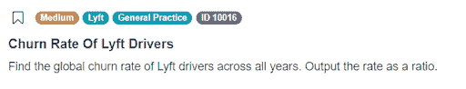
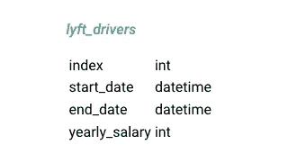
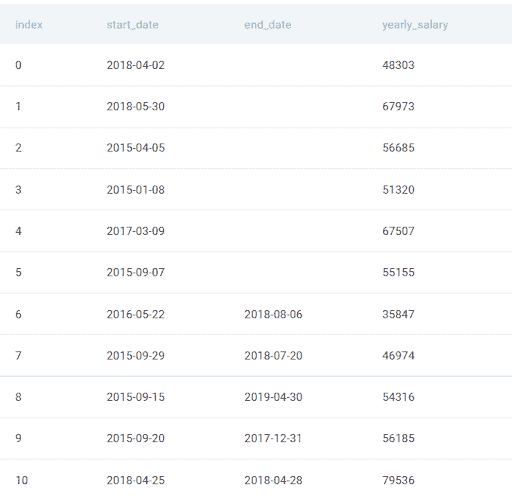
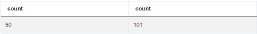
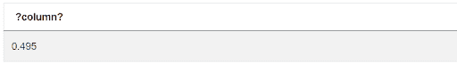
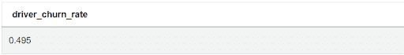

# Lyft 数据科学家面试问题演练

> 原文：<https://towardsdatascience.com/lyft-data-scientist-interview-question-walkthrough-810efc216a3a>

## *打车公司面试时被问到的 SQL 问题的三步解决方案*


作者在 [Canva](https://canva.com/) 上创建的图片

近 2000 万人使用 Lyft 在他们的城市中移动。该公司的主要产品是一个用户友好的移动应用程序，允许用户无缝地从 A 点移动到 b 点。

在智能手机应用程序的用户友好性背后，Lyft 投入了大量精力来收集和分析有关其用户和司机的数据。这有助于他们计划和优化他们的资源，提供最有效的市内交通，考虑价格、时间和舒适度。

Lyft 的面试官试图提出正确的问题，以聘用有能力的数据科学家。在本文中，我们将带您完成一个常见的 Lyft 数据科学家面试问题，其中候选人必须根据可用数据计算司机流失率。

# Lyft 数据科学家访谈中测试的基础到中级概念

Lyft 正在寻找数据科学家，他们可以通过[编写高效可读的 SQL 查询](https://www.stratascratch.com/blog/best-practices-to-write-sql-queries-how-to-structure-your-code/?utm_source=blog&utm_medium=click&utm_campaign=medium)来帮助公司。要做到这一点，候选人需要彻底理解 SQL 概念。

让我们来看看一些基本的 SQL 概念，它们可以帮助你在 Lyft 获得数据科学家的工作。

## 计数()

当参加[数据科学面试](https://www.stratascratch.com/blog/data-science-interview-guide-questions-from-80-different-companies/?utm_source=blog&utm_medium=click&utm_campaign=medium)时，知道如何使用所有聚合函数很重要。这包括它们的语法、可能的参数和输出值。阅读《[*SQL 聚合函数终极指南*](https://www.stratascratch.com/blog/the-ultimate-guide-to-sql-aggregate-functions/?utm_source=blog&utm_medium=click&utm_campaign=medium) 》可以帮助你更好的理解这个 SQL 特性。

要回答这个问题，候选人需要理解 COUNT()聚合函数。您应该知道 COUNT()函数返回在指定列中有值的行数。如果有空值，COUNT()函数不会将该行添加到总计中。

候选人可能需要执行的其他有用操作包括:获取特定列中具有唯一值的行数、获取总记录数、获取特定列中具有空值的记录数、为结果指定别名，等等。

了解如何使用 GROUP BY 语句来汇总 COUNT()等聚合函数的结果也很有用。

在最好的情况下，您应该熟悉一些如何在实践中使用 COUNT()的例子。为了得到这个问题的最终答案，我们将使用 COUNT()来查找指定列中具有 NULL 值的行数。然后，我们可以找到这个数字与表中的总行数之间的比率。

另一个重要的细节是 COUNT()聚合函数返回一个整数值。在我们的解决方案中，我们将 COUNT()函数的一个输出除以另一个输出，得到一个小数比率。为了得到想要的结果，我们需要将其中一个值转换成浮点数。

## 转换值类型

当解决一个问题时，知道你在处理什么类型的价值观是很重要的。如果需要，您应该能够将一种类型的值转换成另一种类型的值，以执行算术运算并获得准确的结果。

候选人应该知道如何将日期值转换为字符串，将整数转换为浮点数，将字符串转换为整数，或者任何其他组合。需要了解的最重要的函数之一是 CAST()，但是还有一个更改值类型的简写语法。

在这个特别的问题中，我们正在处理整数除法和浮点数除法之间的区别。寻找答案需要彻底理解两种算术运算的区别。你也应该知道它们何时发生，以及为什么分裂是这样或那样的。

例如，我们可能需要将一个 COUNT()函数的结果除以另一个函数的结果。这两个都是整数值。如果我们想得到一个浮点值作为答案，我们必须执行浮点除法。为此，我们必须将其中一个转换为浮点值。

## 作为给定别名的关键字

了解 AS 命令的语法和实际应用可以帮助您编写容易理解的代码。描述性的列名也可以帮助其他人理解可用的数据。

一个好的候选人应该知道如何给表引用、子查询甚至 cte 起别名。

AS 命令通常与其他 SQL 语句一起使用，例如 with 和 SELECT。了解如何将这些语句与 AS 命令结合起来，对于编写高效的查询来说至关重要。

理想情况下，您应该知道 AS 关键字如何工作的其他重要细节，例如，别名只在查询期间存在。

# Lyft 数据科学家面试问题演练


作者在 [Canva](https://canva.com/) 上创建的图像

**寻找用户购买**

在这个问题中，候选人必须计算司机流失率。这对 Lyft 很重要，因为它有助于该公司确保在任何地方都有稳定的司机供应。

在这个问题中，我们被要求找出所有地区的司机流失率。我们不必按地区或时间过滤。



截图来自 [StrataScratch](https://platform.stratascratch.com/coding/10016-churn-rate-of-lyft-drivers?code_type=1&utm_source=blog&utm_medium=click&utm_campaign=medium)

理解了流失率的概念，就有必要想出一个公式来计算它。

问题链接:[https://platform . stratascratch . com/coding/10016-churn-rate-of-lyft-drivers](https://platform.stratascratch.com/coding/10016-churn-rate-of-lyft-drivers?code_type=1&utm_source=blog&utm_medium=click&utm_campaign=medium)

# 可用数据集



截图来自 [StrataScratch](https://platform.stratascratch.com/coding/10016-churn-rate-of-lyft-drivers?code_type=1&utm_source=blog&utm_medium=click&utm_campaign=medium)

在提出一种方法之前，请注意每一列中值的类型。

# 数据假设

这个问题的所有可用数据都包含在 lyft_drivers 表的四列中，所以没有太多要分析的。



截图来自 [StrataScratch](https://platform.stratascratch.com/coding/10016-churn-rate-of-lyft-drivers?code_type=1&utm_source=blog&utm_medium=click&utm_campaign=medium)

让我们来看看该表中的四列:

**索引** —该列中的值是分配给每个驾驶员记录的连续数字。假设所有的行在这个列中都有一个值是安全的。

**start_date** —该值表示驾驶员第一次注册 Lyft 的日期。假设所有的行在这个列中都有一个值是安全的。

**end_date** —我们需要检查该列中的值，以找到活动驱动程序的数量。我们需要这个数字来计算这些年来司机的流失率。

**yearly_salary** —问题没有提到司机收入，可以忽略这一栏。

没有 **driver_id** 列的事实告诉我们，我们可以假设每条记录都是唯一的。

仔细阅读问题是解决任何 SQL 问题所必需的。一旦你理解了手头的任务，查看可用的数据就可以得到答案。

这个问题是一个很好的例子，说明预览数据可以帮助你找到答案。如果你查看数据，你会看到每一行代表一个司机。

所有记录在**开始日期**列中都包含一个值，但是有些记录的**结束日期**列为空。这可以代表当驾驶员注册了 Lyft 并且从未停止(主动驾驶员)时的情况。

另一方面，既有开始值又有结束值的行清楚地表示司机停止为 Lyft 工作的情况。我们需要找到活跃和不活跃司机的数量来计算流失率。

一旦逻辑上连接了所有的点，就可以开始编写查询了。

# 解决方案逻辑

计算司机流失率意味着获得曾经为 Lyft 开车，但由于这样或那样的原因而停止的司机的份额。

为了找到任何 SQL 挑战的解决方案，您需要注意问题的措辞。

这个特定的问题指定输出应该是一个比率，它总是涉及一个值(部分)除以另一个值(总数)。看完数据后，你会意识到我们必须将退出的司机除以所有司机的数量。

该问题没有具体说明计算司机的时间段。因此，没有必要通过注册日期或结束日期来筛选驱动程序。

解决这个 Lyft 数据科学家面试问题的一个重要步骤是将流失率这样的抽象概念转化为公式。然后你可以简单地把这些值代入公式得到答案。

在编写任何 SQL 代码之前，最好描述一下解决问题的大致步骤:

*   获取驱动程序和非活动驱动程序的总数
*   将其中一个整数转换为浮点数以获得十进制值
*   将非活动驱动因素的数量除以所有驱动因素的数量

预览表格可以帮助我们识别不再为 Lyft 开车的司机。如果司机记录的 **end_date** 列为空，则意味着该司机仍然有效。如果司机在**结束日期**栏中有一个具体的日期，这意味着司机不再活跃。

了解 COUNT()聚合函数的工作原理可以帮助您用几行代码解决这个问题。我们可以使用 COUNT(*)来获取所有驱动程序的数量，并使用 COUNT(end_date)来获取非活动驱动程序的数量(那些在 **end_date** 列中包含值的驱动程序)。

唯一的问题是 COUNT()聚合函数返回一个整数值，所以我们将整数除以整数。结果将是 0，而不是代表比率的小数值。这是因为我们做的是整数除法，结果总是返回整数。

我们可以通过将其中一个值转换成浮点数来进行浮点数除法。然后我们可以计算一个司机流失率，这个流失率是一个小数值。

您可以使用 CAST()函数将其中一个整数转换成浮点数，或者使用简写的双冒号语法来实现。

运行查询将显示我们最终输出的列名不是描述性的。最后一步，我们必须使用 As 命令为该列指定一个描述性名称，例如“driver_churn_rate”。

# 解决方法

## 步骤 1:获取非活动驱动因素和总驱动因素的数量

我们将使用 COUNT(end_date)聚合函数来获取非活动驱动因素的数量(在 **end_date** 列中有值的行)。

我们还可以使用 COUNT(*)来获得驱动程序的总数。使用星号来获取表中所有记录的数量是安全的。

显然，我们必须指定从中提取值的表。

```
SELECT COUNT(end_date),
       COUNT(*)
FROM lyft_drivers
```

如果我们运行这段代码，我们将看到非活动驱动程序的数量与所有驱动程序的数量之比:



截图来自 [StrataScratch](https://platform.stratascratch.com/coding/10016-churn-rate-of-lyft-drivers?code_type=1&utm_source=blog&utm_medium=click&utm_campaign=medium)

## 第二步:找到比例

为了得到这个比率，我们需要用所有记录的数量除以非活动驾驶员的数量。考虑到两个值都是整数，首先，我们需要将其中一个转换为浮点数，这样除法的结果将是一个十进制值。

我们可以使用简写语法(::)将整数值转换为浮点数:

```
SELECT COUNT(end_date)::float/ COUNT(INDEX)
FROM lyft_drivers
```

如果我们运行该查询，它将返回一个答案:



截图来自 [StrataScratch](https://platform.stratascratch.com/coding/10016-churn-rate-of-lyft-drivers?code_type=1&utm_source=blog&utm_medium=click&utm_campaign=medium)

剩下的唯一问题是列名。

## 步骤 3:命名列

现在，我们只需要命名列来描述该值所代表的内容。为此，我们将在 SQL 中使用 AS 命令。

```
SELECT COUNT(end_date)::float/ COUNT(INDEX) AS driver_churn_rate
FROM lyft_drivers
```

现在，当我们运行这段代码时，这个列有了一个更容易理解的名字 **driver_churn_rate**



截图来自 [StrataScratch](https://platform.stratascratch.com/coding/10016-churn-rate-of-lyft-drivers?code_type=1&utm_source=blog&utm_medium=click&utm_campaign=medium)

如果我们检查我们的最终解决方案，它被接受。

# 最后的话

流失率是许多公司的一个重要指标。解决这个 Lyft 数据科学家面试问题将教会你这个概念代表了什么，以及如何基于可用数据进行计算。

StrataScratch 为你参加数据科学家面试做好了一切准备。你可以检查你的解决方案是否正确，并看看其他人的解决方案，以了解解决问题的不同方法。

我们的平台允许你为每个[数据科学公司](https://www.stratascratch.com/blog/11-best-companies-to-work-for-as-a-data-scientist/?utm_source=blog&utm_medium=click&utm_campaign=medium)整理[数据科学面试问题](https://www.stratascratch.com/blog/40-data-science-interview-questions-from-top-companies/?utm_source=blog&utm_medium=click&utm_campaign=medium)，这样你就可以为你想要的雇主的面试做准备。它还包括非技术性问题和你找工作所需的一切。