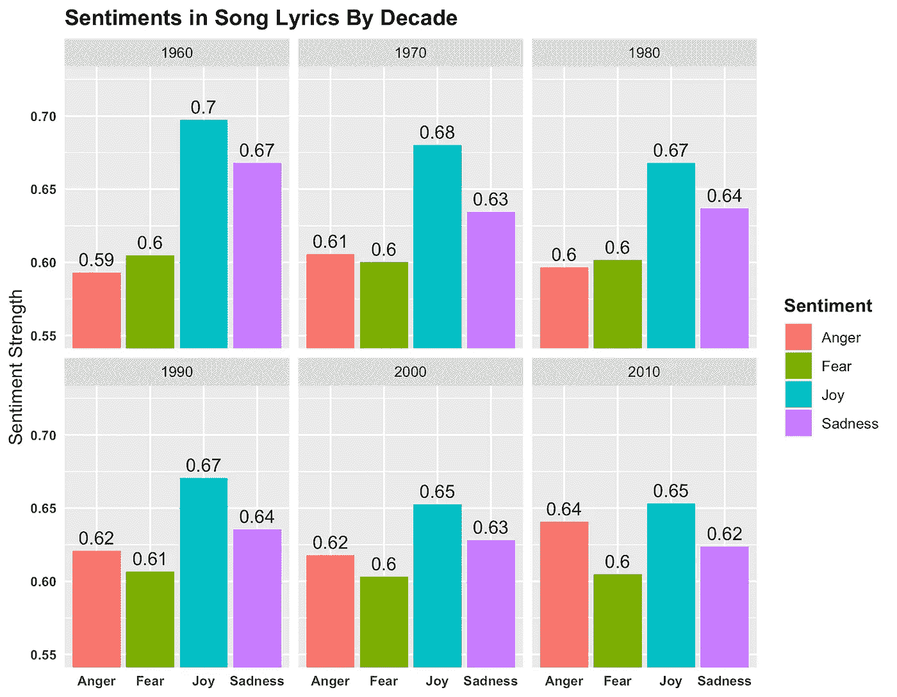
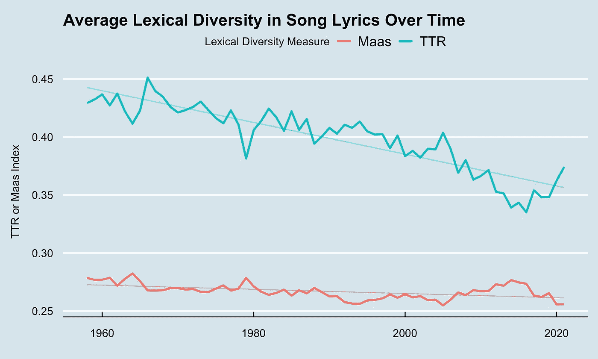

# 随着时间的推移，歌词的情感和词汇多样性分析

> 原文：<https://towardsdatascience.com/lyrics-analysis-5e1990070a4b>

## 使用 Quanteda 和 IBM 的音调分析仪对 1958 年以来公告牌百强歌曲进行分析


照片由来自[佩克斯](https://www.pexels.com/photo/photo-of-person-playing-acoustic-guitar-1751731/)的[布伦特·基恩](https://www.pexels.com/@brent-keane-181485)拍摄

毫无疑问，这些年来音乐已经发生了变化。但是如果我们看看美国排名前 100 的歌曲的歌词，有什么可观察到的趋势吗？

当我想到近几十年来的一些歌词时，我当然可以同情婴儿潮一代的观点，即音乐已经变得愚蠢。

想想《爱你的方式》中的阿姆:

> 现在你可以看着她离开窗户
> 我猜这就是为什么他们称之为窗玻璃

还是坎耶在抬高自己

> 噗噗声
> 噗噗声
> 噗噗声
> 等等。

暂且把这些不太光彩的当代音乐例子放在一边，歌词真的变得不那么复杂了吗？或者，就此而言，他们身上的主导情绪发生了变化吗？

如果你 ***CBA 阅读*** 的文章，或者对编码不感兴趣——请随意通过在 [***仪表盘***](https://datastudio.google.com/reporting/428bdb5c-8375-4566-a013-e8f7a3821256) 中播放我整理的结果来回答这些问题。如果你想比较几个著名说唱歌手的歌词复杂度或每首歌的平均字数，艺术家过滤器是预设的。

按作者分类的仪表板

# 获得公告牌百强歌词

首先，获得美国公告牌前 100 首歌曲的歌曲和艺术家名单。Billboard API 和 RSS feed 已经被弃用，但幸运的是，这方面的数据可以追溯到 1958 年，可以在 [Kaggle](https://www.kaggle.com/dhruvildave/billboard-the-hot-100-songs) 上找到。

我们将使用一个[免费歌词 API](https://lyricsovh.docs.apiary.io/#reference/0/lyrics-of-a-song/search) 来获取所有这些歌曲的歌词，因此艺术家姓名和歌曲名称需要被 URL 编码成适合请求的格式。

```
# Get list of top 100 US songs since 1958 and process for lyrics API
# Read in Billboard hot 100 songs
billboard <- read.csv("billboard_hot_100.csv")# Select needed cols
billboard <- billboard %>% select(date, artist, song)# Drop all the repeated data
billboard <- billboard %>% distinct(artist, song, .keep_all = TRUE)# Process the columns into URL encoding format
billboard$artist_url <- billboard$artist %>%
  str_replace_all(" ", "%20") %>%
  paste0("/")
billboard$song_url <- billboard$song %>%
  str_replace_all(" ", "%20") %>%
  paste0("/")
# Merge the two url encoded cols
billboard$url <- paste0(billboard$artist_url, billboard$song_url)# Create column to add lyrics to
billboard$lyrics <- 0
```

接下来我们要歌词。出于礼貌，您可能希望在 for 循环中添加一些结果的中间保存，以及一些`Sys.sleep()`延迟。对我来说，最初的过程需要大约 8 个小时(带睡眠)才能运行，所以可以随意使用包含 [GitHub repo](https://github.com/louismagowan/lyrics_analysis) 中抓取的数据的 lyrics_raw.csv 文件。

并非所有的歌曲都可以请求歌词(API 的数据库中没有歌词，歌曲/标题拼写不一致等。)-但我们仍然获得了足够大的样本用于我们的分析(约 16K 首歌曲，所有前 100 首歌曲的 45%)。

```
# Make requests to lyrics API
base_url <- "[https://api.lyrics.ovh/v1/](https://api.lyrics.ovh/v1/)"# Add counter to check calls are working with
counter = 0
for (i in 1:length(billboard$url)){# Get the url string to add to the base
  song_url <- billboard$url[i]
  # Construct the full request URL for that song
  full_url <- paste0(base_url, song_url)
  # Make request
  r <- GET(full_url)
  # Increment counter
  counter <- counter + 1
  # If the request was okay, add lyrics
  if (r$status_code == 200){
    # Remove source line
    lyrics <- content(r)$lyrics %>%
      str_replace("Paroles de la chanson.*\r\n", "")
    # Add song's lyrics
    billboard$lyrics[i] <- lyrics
  }
}
# Save to a csv
write.csv(billboard, "lyrics_raw.csv", row.names = FALSE)
```

# 情感分析

现在我们有了我们需要的歌词，我们可以使用 [IBM 的音调分析器](https://www.ibm.com/uk-en/cloud/watson-tone-analyzer)来分析每首歌词中的主要情绪/情感。IBM Cloud 给新用户 200 美元的免费积分，这对于我的样本量来说已经足够了。

> IBM Cloud 为新用户提供 200 美元的免费积分

```
# Enter params for the request
ibm_key <- "mind_your_own_beeswax"
ibm_url <- "[y](https://api.eu-gb.tone-analyzer.watson.cloud.ibm.com/instances/mind_your_own_beeswax_again/v3/tone)our_ibm_url"
ibm_version = "your_ibm_version"# Construct df to append IBM data to
tone_df <- data.frame()
# Add counter to check calls are working with
counter = 0# Iterate through each song's lyrics, analysing sentiment
for (i in 1:length(billboard$lyrics)){
  # Get lyrics of current song
  current_song <-  billboard$lyrics[i]
  # Add lyrics to params for URL / request
  params = list(version = ibm_version, text = current_song)
  # Increment counter
  counter <- counter + 1# Make the request
  r <- GET(url = ibm_url,
           query = params,
           authenticate('apikey', ibm_key))# If the request was okay, add lyrics
  if (r$status_code == 200){
    # Parse the data
    parsed_r <- fromJSON(rawToChar(r$content))
    # Merge tone data with billboard data into new df
    tone_df <- parsed_r$document_tone$tones %>%
      bind_cols(billboard[i, ]) %>%
      bind_rows(tone_df)
  }
}
# Save the data in a csv
write.csv(tone_df, "tone_raw.csv", row.names = FALSE)
```

## 让我们来看看这些结果

使用一个标准的线性回归，随着时间的推移，歌词似乎变得越来越愤怒，越来越不快乐。(完整的带注释的可视化代码可以在 [GitHub repo](https://github.com/louismagowan/lyrics_analysis) 中找到)。

> 随着时间的推移，歌词变得越来越愤怒，越来越不快乐

作者图片

十年的感悟呢？



作者图片

# 词汇多样性分析

我们已经看了情绪，但是抒情的复杂性呢？我们可以从词汇多样性的角度来分析这一点。我使用了[类型-标记比率](https://rdrr.io/cran/koRpus/man/TTR.html)和 [Maas](https://rdrr.io/cran/koRpus/man/maas.html) 来度量词汇多样性，因为它们计算量不大，而且很常用。

> 词汇多样性是文本中独特的单词/词干的比例

其工作流程如下:

1.  用 Quanteda 构建一个语料库并进行处理
2.  用`quanteda.textstats::textstat_lexdiv()`分析词汇多样性
3.  绘图结果

```
# Make lyrics into a corpus
lyric_corpus <- corpus(billboard, text_field = "lyrics")# Get number of tokens in each song
docvars(lyric_corpus)$ntoken <- lyric_corpus %>% ntoken()
# Filter out the songs with barely any lyrics
lyric_corpus <- corpus_subset(lyric_corpus, ntoken > 50)# Tokenize lyrics and calculate lexical diversity
lexdiv <- lyric_corpus %>%
  # Remove numbers and punctuation
  tokens(remove_punct = TRUE,
         remove_numbers = TRUE,
         remove_symbols = TRUE) %>%
  # Make all lowercase
  tokens_tolower() %>% 
  # Calculate lexical diversity using quanteda
  textstat_lexdiv(measure = c("TTR", "Maas"))# Merge lexical diversity measures into docvars
lexdiv <- bind_cols(docvars(lyric_corpus), lexdiv[, 2:3])
# Make year into date
lexdiv$year <- lexdiv$year %>% paste0("-01-01") %>% as.Date()# Make into long format for plotting
lexdiv <- lexdiv %>% pivot_longer(c(TTR, Maas),
                                names_to = "lexdiv_measure",
                                values_to = "lexdiv_value"
                                )
# Group by year
lexdiv_grouped <- lexdiv %>% group_by(year, lexdiv_measure) %>%
  summarise(lexdiv_value = mean(lexdiv_value, 
                       na.rm = TRUE))
```

这两项指标都显示词汇多样性随着时间的推移而下降。



作者图片

**我们走吧！r 中快速简单的情感/词汇多样性分析**

**在 Maas 和 TTR 中，歌曲的词汇多样性已经随着时间的推移而略有下降(尽管这可能部分是由于歌曲中的单词数量增加，请参见**[**GitHub repo**](https://github.com/louismagowan/lyrics_analysis)**了解详细信息)。**

**情感分析显示，随着时间的推移，歌词变得越来越愤怒，越来越不快乐。**

然而，我们应该警惕从这个分析中得出太多的结论。如果说任何类型的数据会受到更广泛的社会条件和/或潜在变量的影响，那么音乐数据就是。我不认为歌词中日益增长的愤怒是因为我们作为一个社会变得更加愤怒——这可能与歌曲中日益增长的亵渎或说唱的出现有关。至于更少的快乐…你的猜测和我的一样好。

# 链接

*   LinkedIn : [路易斯·马戈万](https://www.linkedin.com/in/louismagowan/)
*   GitHub: [歌词 _ 分析](https://github.com/louismagowan/lyrics_analysis)

# 来源

*   [歌词 API](https://api.lyrics.ovh/v1/)
*   [IBM 音调分析器](https://www.ibm.com/uk-en/cloud/watson-tone-analyzer)
*   [Quanteda](https://quanteda.io/index.html)
*   [公告牌百强](https://www.kaggle.com/dhruvildave/billboard-the-hot-100-songs)