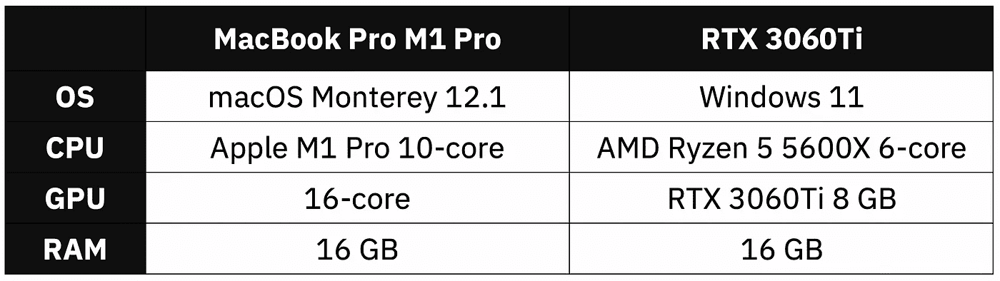
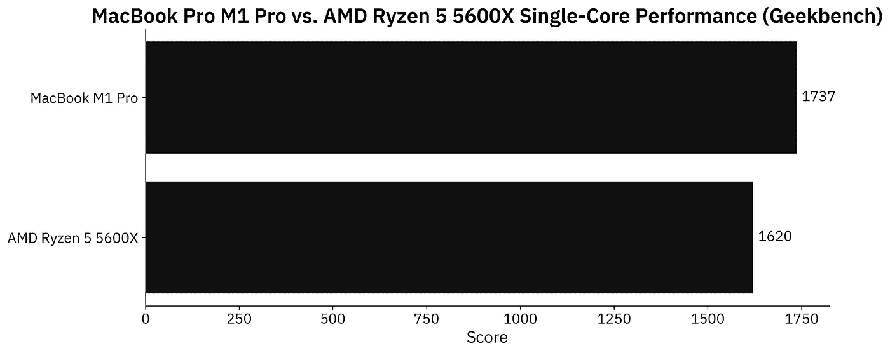
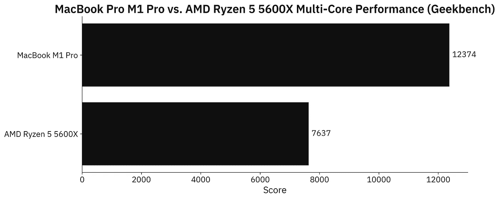
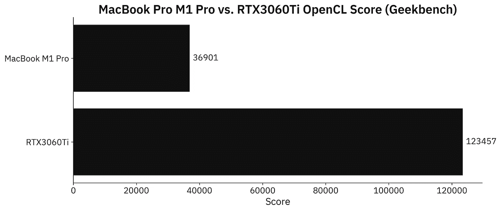
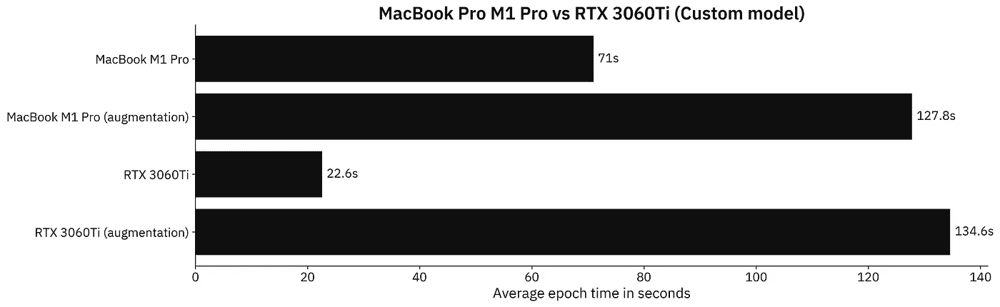
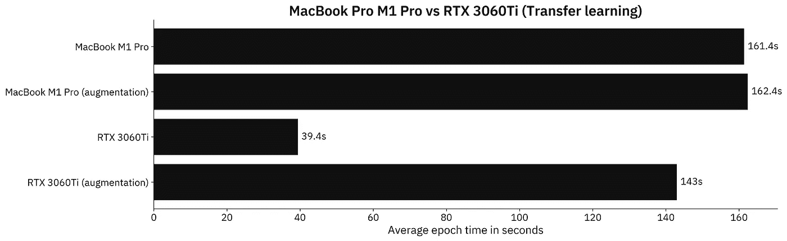

# 16 英寸 MacBook M1 Pro 与采用 RTX3060Ti 的定制电脑—千钧一发

> 原文：<https://towardsdatascience.com/macbook-m1-pro-16-vs-custom-pc-with-rtx3060ti-close-call-16b15f085fb7>

# 16 英寸 MacBook M1 Pro 与采用 RTX3060Ti 的定制电脑—千钧一发

## **【2499 美元的苹果 beast 与 1300 美元的配备专用 GPU 的 PC——了解哪种更适合 TensorFlow**


在 [Unsplash](https://unsplash.com?utm_source=medium&utm_medium=referral) 上[注册](https://unsplash.com/@theregisti?utm_source=medium&utm_medium=referral)的照片

M1 Pro MacBook Pro 16”可能是你现在能买到的最好的笔记本电脑。它在超级优质的表面下封装了一些真正的动力——所有这些都是在一次充电后让你度过一天的繁重使用。

*但是数据科学呢？它能接近配备专用 GPU 的 PC 吗？这就是我们今天要回答的问题。*

在今天的文章中，我们将只比较数据科学使用案例，忽略笔记本电脑与 PC 的其他差异。在测试中，我们有一台“基础型号”MacBook Pro M1 Pro 16”和一台由 AMD 锐龙 5 和 Nvidia RTX 显卡驱动的定制 PC。以下是规格:



图 1 —硬件规格对比(图片由作者提供)

M1 Pro 16”起价 2499 美元，价格不菲。我在定制电脑上花了大约 1300 美元。差不多便宜 50%，有专用 GPU。理论上听起来更好，但我们必须做试验才能确定。

不想看书？请观看我的视频:

# MacBook Pro M1 Pro 与定制 PC — Geekbench

综合基准只能让我们到此为止，但它们是一个很好的起点。我们先来看看苹果 Pro M1 Pro 和 AMD 锐龙 5 5600X 在单核部门对比如何:



图 2 — Geekbench 单核性能(图片由作者提供)

M1 Pro 快了大约 7%，如果你考虑两者之间的大小，功率和散热差异，这是惊人的。

接下来我们来对比一下多核的性能。M1 Pro 有 10 个 CPU 内核(8 个性能和 2 个效率)，而锐龙有 6 个内核和 12 个线程:



图 3 — Geekbench 多核性能测试(图片由作者提供)

M1 专业版明显快了 62%。在日常工作中，你肯定会注意到这种差异，尤其是如果你考虑到 macOS 比 Windows 优化得多。

这是他们渐行渐远的地方。定制 PC 有一个专用的 RTX3060Ti GPU，内存为 8 GB。M1 专业版有 16 个 GPU 核心，但它远没有这么强大:



图 4 — Geekbench OpenCL 性能(图片由作者提供)

根据 OpenGL 基准测试，RTX3060Ti 比 M1 Pro GPU 快 3.3 倍左右。这些结果是意料之中的，但它们不一定会转化为现实世界中 TensorFlow 的使用。

在我向您展示结果之前，我们必须设置数据科学基准。

# MacBook Pro M1 Pro 与 RTX3060Ti —数据科学基准测试设置

如果您继续学习，您将需要安装 TensorFlow。这里有一整篇文章致力于为苹果 M1 和 Windows 安装 TensorFlow:

此外，您还需要一个影像数据集。我使用了来自 Kaggle 的[狗和猫的数据集](https://www.kaggle.com/pybear/cats-vs-dogs?select=PetImages)，它是在知识共享许可下授权的。长话短说，你可以免费使用。

有关如何组织和预处理它的详细说明，请参考以下文章:

[](https://betterdatascience.com/top-3-prerequisites-for-deep-learning-projects/) [## 用于图像分类的 TensorFlow 深度学习项目的三大先决条件|更好的数据…

### 想训练一个用于图像分类的神经网络？确保做到这一点首先识别图像中的对象是一个…

betterdatascience.com](https://betterdatascience.com/top-3-prerequisites-for-deep-learning-projects/) 

我们今天会做两个测试:

1.  **具有定制模型架构**的 TensorFlow 使用我在 [CNN 文章](https://betterdatascience.com/train-image-classifier-with-convolutional-neural-networks/)中描述的两个卷积块。
2.  **带迁移学习的 tensor flow**—使用 [VGG-16 预训练网络](https://betterdatascience.com/tensorflow-transfer-learning/)对图像进行分类。

让我们检查一下测试中使用的代码。

## 自定义张量流模型—代码

我将这个测试分为两部分——一个有数据增强和没有数据增强的模型。一次仅使用一对`train_datagen`和`valid_datagen`:

```
import os
import warnings
from datetime import datetime
os.environ['TF_CPP_MIN_LOG_LEVEL'] = '2'
warnings.filterwarnings('ignore')

import numpy as np
import tensorflow as tf
tf.random.set_seed(42)

####################
# 1\. Data loading
####################
# USED ON A TEST WITHOUT DATA AUGMENTATION
train_datagen = tf.keras.preprocessing.image.ImageDataGenerator(
    rescale=1/255.0
)
valid_datagen = tf.keras.preprocessing.image.ImageDataGenerator(
    rescale=1/255.0
)

# USED ON A TEST WITH DATA AUGMENTATION
train_datagen = tf.keras.preprocessing.image.ImageDataGenerator(
    rescale=1/255.0,
    rotation_range=20,
    width_shift_range=0.2,
    height_shift_range=0.2,
    shear_range=0.2,
    zoom_range=0.2,
    horizontal_flip=True,
    fill_mode='nearest'
)
valid_datagen = tf.keras.preprocessing.image.ImageDataGenerator(
    rescale=1/255.0
)

train_data = train_datagen.flow_from_directory(
    directory='data/train/',
    target_size=(224, 224),
    class_mode='categorical',
    batch_size=64,
    seed=42
)
valid_data = valid_datagen.flow_from_directory(
    directory='data/validation/',
    target_size=(224, 224),
    class_mode='categorical',
    batch_size=64,
    seed=42
)

####################
# 2\. Model
####################
model = tf.keras.Sequential([
    tf.keras.layers.Conv2D(filters=32, kernel_size=(3, 3), input_shape=(224, 224, 3), activation='relu'),
    tf.keras.layers.MaxPool2D(pool_size=(2, 2), padding='same'),
    tf.keras.layers.Conv2D(filters=32, kernel_size=(3, 3), activation='relu'),
    tf.keras.layers.MaxPool2D(pool_size=(2, 2), padding='same'),
    tf.keras.layers.Flatten(),
    tf.keras.layers.Dense(128, activation='relu'),
    tf.keras.layers.Dense(2, activation='softmax')
])
model.compile(
    loss=tf.keras.losses.categorical_crossentropy,
    optimizer=tf.keras.optimizers.Adam(),
    metrics=[tf.keras.metrics.BinaryAccuracy(name='accuracy')]
)

####################
# 3\. Training
####################
time_start = datetime.now()
model.fit(
    train_data,
    validation_data=valid_data,
    epochs=5
)
time_end = datetime.now()
print(f'Duration: {time_end - time_start}')
```

接下来我们来看一下转移学习代码。

## 迁移学习张量流模型——代码

大部分导入和数据加载代码是相同的。同样，一次只使用一对`train_datagen`和`valid_datagen`:

```
import os
import warnings
from datetime import datetime
os.environ['TF_CPP_MIN_LOG_LEVEL'] = '2'
warnings.filterwarnings('ignore')

import numpy as np
import tensorflow as tf
tf.random.set_seed(42)

####################
# 1\. Data loading
####################
# USED ON A TEST WITHOUT DATA AUGMENTATION
train_datagen = tf.keras.preprocessing.image.ImageDataGenerator(
    rescale=1/255.0
)
valid_datagen = tf.keras.preprocessing.image.ImageDataGenerator(
    rescale=1/255.0
)

# USED ON A TEST WITH DATA AUGMENTATION
train_datagen = tf.keras.preprocessing.image.ImageDataGenerator(
    rescale=1/255.0,
    rotation_range=20,
    width_shift_range=0.2,
    height_shift_range=0.2,
    shear_range=0.2,
    zoom_range=0.2,
    horizontal_flip=True,
    fill_mode='nearest'
)
valid_datagen = tf.keras.preprocessing.image.ImageDataGenerator(
    rescale=1/255.0
)

train_data = train_datagen.flow_from_directory(
    directory='data/train/',
    target_size=(224, 224),
    class_mode='categorical',
    batch_size=64,
    seed=42
)
valid_data = valid_datagen.flow_from_directory(
    directory='data/validation/',
    target_size=(224, 224),
    class_mode='categorical',
    batch_size=64,
    seed=42
)

####################
# 2\. Base model
####################
vgg_base_model = tf.keras.applications.vgg16.VGG16(
    include_top=False, 
    input_shape=(224, 224, 3), 
    weights='imagenet'
)
for layer in vgg_base_model.layers:
    layer.trainable = False

####################
# 3\. Custom layers
####################
x = tf.keras.layers.Flatten()(vgg_base_model.layers[-1].output)
x = tf.keras.layers.Dense(128, activation='relu')(x)
out = tf.keras.layers.Dense(2, activation='softmax')(x)

vgg_model = tf.keras.models.Model(
    inputs=vgg_base_model.inputs,
    outputs=out
)
vgg_model.compile(
    loss=tf.keras.losses.categorical_crossentropy,
    optimizer=tf.keras.optimizers.Adam(),
    metrics=[tf.keras.metrics.BinaryAccuracy(name='accuracy')]
)

####################
# 4\. Training
####################
time_start = datetime.now()
vgg_model.fit(
    train_data,
    validation_data=valid_data,
    epochs=5
)
time_end = datetime.now()
print(f'Duration: {time_end - time_start}')
```

最后，让我们看看基准测试的结果。

# MacBook Pro M1 Pro 与 RTX3060Ti —数据科学基准测试结果

现在，我们将比较 M1 专业版和个人电脑在定制模型架构上每个时期的平均训练时间。请记住，训练了两个模型，一个有数据增强，一个没有数据增强:



图 5 —定制模型在几秒钟内得出结果(M1 专业版:71；M1 Pro 增广:127.8；RTX 3060 ti:22.6；RTX3060Ti 增强版:134.6)(图片由作者提供)

在非增强图像数据集上，RTX3060Ti 比 M1 Pro 快 3.14 倍。出于某种原因，增强对定制 PC 产生了巨大的影响，因此 M1 专业版最终在增强数据集上每个时期的运行速度快了 7 秒。

但是现在谁会从头开始写 CNN 的模型呢？如果您的数据有限，并且您的图像不是高度专业化的，则始终建议使用迁移学习:



图 6 —几秒钟内迁移学习模型结果(M1 专业版:161.4；M1 Pro 增广:162.4；RTX 3060 ti:39.4；RTX306Ti 增强版:143)(图片由作者提供)

讨论在非增强数据集上训练的模型之间的差异是没有意义的——这是巨大的。

但如果我们考虑到数据增强，那么 M1 Pro 只比 RTX3060Ti 慢 13%。令人印象深刻的结果！请记住，RTX 是一个消耗大量电力的专用 GPU，而 M1 Pro 是一个微型笔记本电脑芯片。

我们从一开始就知道 M1 职业没有机会，但这是一个侥幸的机会。也许在拥有 32 个 GPU 核心的 M1 Max 上，情况会有所不同，但我不能说。

# 离别赠言

你无法真正比较笔记本电脑和台式电脑，至少不能比较它们在相同价格范围内的原始性能。MAC 和 PC 是根本不同的。作为开发人员，有很多理由喜欢 macOS。对我来说，它感觉像是一个已经完成并经过适当测试的 Linux 版本。

配备 RTX3060Ti 的台式电脑提供了与 M1 Pro MacBook Pro 截然不同的体验。两者都可以处理数据科学工作流，但 PC 提供了最大的性价比。如果你需要便携性，你甚至不会考虑 PC。两者都很棒，归结为个人喜好。

如果你有更强大的 M1 芯片，比如 24/32 核 GPU 的 M1 Max，请分享你在我的 TensorFlow 测试中得到的结果。

## 更多基准

*   [MacBook M1 vs M1 Pro](https://betterdatascience.com/macbook-m1-vs-m1-pro-for-data-science/)
*   [M1 MacBook vs 谷歌 Colab](https://betterdatascience.com/macbook-m1-vs-google-colab/)
*   [MacBook M1 Pro vs 谷歌 Colab](https://betterdatascience.com/macbook-m1-pro-vs-google-colab/)
*   [MacBook M1 vs RTX 3060 ti](https://betterdatascience.com/macbook-m1-vs-rtx3060ti/)

## 保持联系

*   雇用我作为一名技术作家
*   在 YouTube[上订阅](https://www.youtube.com/c/BetterDataScience)
*   在 [LinkedIn](https://www.linkedin.com/in/darioradecic/) 上连接

*喜欢这篇文章吗？成为* [*中等会员*](https://medium.com/@radecicdario/membership) *继续无限制学习。如果你使用下面的链接，我会收到你的一部分会员费，不需要你额外付费。*

[](https://medium.com/@radecicdario/membership) [## 通过我的推荐链接加入 Medium-Dario rade ci

### 作为一个媒体会员，你的会员费的一部分会给你阅读的作家，你可以完全接触到每一个故事…

medium.com](https://medium.com/@radecicdario/membership) 

*原载于 2022 年 1 月 31 日*[*https://betterdatascience.com*](https://betterdatascience.com/macbook-m1-pro-vs-rtx3060ti/)*。*