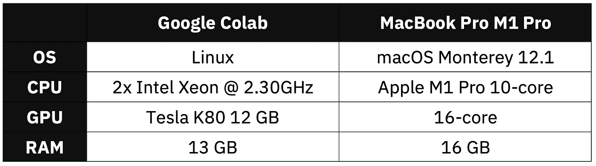
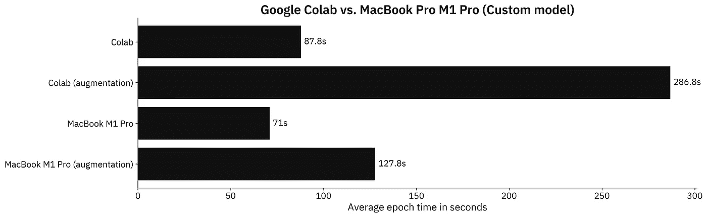
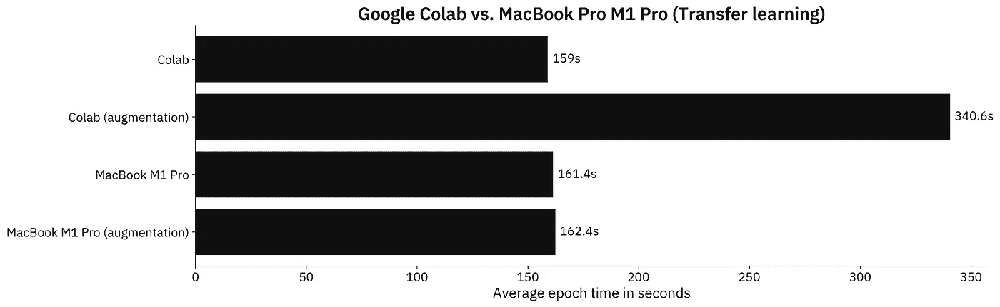

# MacBook M1 Pro 与谷歌 Colab 在数据科学方面的对比——你应该从苹果公司购买最新产品吗？

> 原文：<https://towardsdatascience.com/macbook-m1-pro-vs-google-colab-for-data-science-should-you-buy-the-latest-from-apple-f6da806b1eb0>

# MacBook M1 Pro 与谷歌 Colab 在数据科学方面的对比——你应该从苹果公司购买最新产品吗？

## **苹果 2499 美元的 16 英寸 beast 与完全免费的环境——哪个对 TensorFlow 更好？**


杰里米·贝赞格在 [Unsplash](https://unsplash.com/s/photos/m1-macbook?utm_source=unsplash&utm_medium=referral&utm_content=creditCopyText) 上的照片

苹果连续第二年彻底改变了笔记本电脑行业。自 2020 年 M1 发布以来，专业用户一直在等待新的 14 英寸和 16 英寸。*送货吗？当然，但是一个完全免费的 Google Colab 能胜过它吗？这就是我们今天要回答的。*

想看看 2020 年的 M1 基地在数据科学方面与谷歌实验室相比如何吗？我掩护你:

[](https://betterdatascience.com/macbook-m1-vs-google-colab/) [## MacBook M1 vs. Google Colab 的数据科学-意想不到的结果|更好的数据科学

### 早在 2020 年，苹果的 M1 芯片就是一项惊人的技术突破。它不支持许多工具数据科学家…

betterdatascience.com](https://betterdatascience.com/macbook-m1-vs-google-colab/) 

今天，我们将使用 TensorFlow 制作两个数据科学基准，并比较 MacBook Pro M1 Pro 和 Google Colab。我们将忽略拥有闪电般速度的笔记本电脑的明显优势，而只关注模型训练速度。

下表总结了两者之间的硬件规格:



图 1 —硬件规格对比(图片由作者提供)

M1 Pro 有更多的内存和更新的 CPU，但我们关心的是 GPU。我测试的苹果的那个是 16 核，但是你可以配置 24 或者 32 核。分配给我的 Colab 环境是完全随机的。您可能会得到不同的结果，因此基准测试结果可能会有所不同。

不想看书？请观看我的视频:

# MacBook M1 Pro 与 Google Colab —数据科学基准测试设置

如果您继续学习，您将需要安装 TensorFlow。这里有一整篇文章致力于在苹果 M1 上安装 TensorFlow:

[](https://betterdatascience.com/install-tensorflow-2-7-on-macbook-pro-m1-pro/) [## 如何在 MacBook Pro M1 Pro 上轻松安装 tensor flow 2.7 |更好的数据科学

### 早在 2020 年，苹果的 M1 芯片就彻底改变了这个行业。新的 M1 专业和 M1 马克斯是什么…

betterdatascience.com](https://betterdatascience.com/install-tensorflow-2-7-on-macbook-pro-m1-pro/) 

此外，您还需要一个影像数据集。我使用了来自 Kaggle 的[狗和猫的数据集](https://www.kaggle.com/pybear/cats-vs-dogs?select=PetImages)，它是在知识共享许可下授权的。长话短说，你可以免费使用。

有关如何组织和预处理它的详细说明，请参考以下文章:

[](https://betterdatascience.com/top-3-prerequisites-for-deep-learning-projects/) [## 用于图像分类的 TensorFlow 深度学习项目的三大先决条件|更好的数据…

### 想训练一个用于图像分类的神经网络？确保做到这一点首先识别图像中的对象是一个…

betterdatascience.com](https://betterdatascience.com/top-3-prerequisites-for-deep-learning-projects/) 

我们今天会做两个测试:

1.  **具有定制模型架构的 tensor flow**—使用我在 [CNN 文章](https://betterdatascience.com/train-image-classifier-with-convolutional-neural-networks/)中描述的两个卷积块。
2.  **带迁移学习的 tensor flow**—使用 [VGG-16 预训练网络](https://betterdatascience.com/tensorflow-transfer-learning/)对图像进行分类。

让我们检查一下测试中使用的代码。

## 自定义张量流模型—代码

我将这个测试分为两部分——一个有数据增强和没有数据增强的模型。一次仅使用一对`train_datagen`和`valid_datagen`:

```
import os
import warnings
from datetime import datetime
os.environ['TF_CPP_MIN_LOG_LEVEL'] = '2'
warnings.filterwarnings('ignore')

import numpy as np
import tensorflow as tf
tf.random.set_seed(42)

# COLAB ONLY
from google.colab import drive
drive.mount('/content/drive')

####################
# 1\. Data loading
####################
# USED ON A TEST WITHOUT DATA AUGMENTATION
train_datagen = tf.keras.preprocessing.image.ImageDataGenerator(
    rescale=1/255.0
)
valid_datagen = tf.keras.preprocessing.image.ImageDataGenerator(
    rescale=1/255.0
)

# USED ON A TEST WITH DATA AUGMENTATION
train_datagen = tf.keras.preprocessing.image.ImageDataGenerator(
    rescale=1/255.0,
    rotation_range=20,
    width_shift_range=0.2,
    height_shift_range=0.2,
    shear_range=0.2,
    zoom_range=0.2,
    horizontal_flip=True,
    fill_mode='nearest'
)
valid_datagen = tf.keras.preprocessing.image.ImageDataGenerator(
    rescale=1/255.0
)

train_data = train_datagen.flow_from_directory(
    directory='data/train/',
    target_size=(224, 224),
    class_mode='categorical',
    batch_size=64,
    seed=42
)
valid_data = valid_datagen.flow_from_directory(
    directory='data/validation/',
    target_size=(224, 224),
    class_mode='categorical',
    batch_size=64,
    seed=42
)

####################
# 2\. Model
####################
model = tf.keras.Sequential([
    tf.keras.layers.Conv2D(filters=32, kernel_size=(3, 3), input_shape=(224, 224, 3), activation='relu'),
    tf.keras.layers.MaxPool2D(pool_size=(2, 2), padding='same'),
    tf.keras.layers.Conv2D(filters=32, kernel_size=(3, 3), activation='relu'),
    tf.keras.layers.MaxPool2D(pool_size=(2, 2), padding='same'),
    tf.keras.layers.Flatten(),
    tf.keras.layers.Dense(128, activation='relu'),
    tf.keras.layers.Dense(2, activation='softmax')
])
model.compile(
    loss=tf.keras.losses.categorical_crossentropy,
    optimizer=tf.keras.optimizers.Adam(),
    metrics=[tf.keras.metrics.BinaryAccuracy(name='accuracy')]
)

####################
# 3\. Training
####################
time_start = datetime.now()
model.fit(
    train_data,
    validation_data=valid_data,
    epochs=5
)
time_end = datetime.now()
print(f'Duration: {time_end - time_start}')
```

接下来我们来看一下转移学习代码。

## 迁移学习张量流模型——代码

大部分导入和数据加载代码是相同的。同样，一次只使用一对`train_datagen`和`valid_datagen`:

```
import os
import warnings
from datetime import datetime
os.environ['TF_CPP_MIN_LOG_LEVEL'] = '2'
warnings.filterwarnings('ignore')

import numpy as np
import tensorflow as tf
tf.random.set_seed(42)

# COLAB ONLY
from google.colab import drive
drive.mount('/content/drive')

####################
# 1\. Data loading
####################
# USED ON A TEST WITHOUT DATA AUGMENTATION
train_datagen = tf.keras.preprocessing.image.ImageDataGenerator(
    rescale=1/255.0
)
valid_datagen = tf.keras.preprocessing.image.ImageDataGenerator(
    rescale=1/255.0
)

# USED ON A TEST WITH DATA AUGMENTATION
train_datagen = tf.keras.preprocessing.image.ImageDataGenerator(
    rescale=1/255.0,
    rotation_range=20,
    width_shift_range=0.2,
    height_shift_range=0.2,
    shear_range=0.2,
    zoom_range=0.2,
    horizontal_flip=True,
    fill_mode='nearest'
)
valid_datagen = tf.keras.preprocessing.image.ImageDataGenerator(
    rescale=1/255.0
)

train_data = train_datagen.flow_from_directory(
    directory='data/train/',
    target_size=(224, 224),
    class_mode='categorical',
    batch_size=64,
    seed=42
)
valid_data = valid_datagen.flow_from_directory(
    directory='data/validation/',
    target_size=(224, 224),
    class_mode='categorical',
    batch_size=64,
    seed=42
)

####################
# 2\. Base model
####################
vgg_base_model = tf.keras.applications.vgg16.VGG16(
    include_top=False, 
    input_shape=(224, 224, 3), 
    weights='imagenet'
)
for layer in vgg_base_model.layers:
    layer.trainable = False

####################
# 3\. Custom layers
####################
x = tf.keras.layers.Flatten()(vgg_base_model.layers[-1].output)
x = tf.keras.layers.Dense(128, activation='relu')(x)
out = tf.keras.layers.Dense(2, activation='softmax')(x)

vgg_model = tf.keras.models.Model(
    inputs=vgg_base_model.inputs,
    outputs=out
)
vgg_model.compile(
    loss=tf.keras.losses.categorical_crossentropy,
    optimizer=tf.keras.optimizers.Adam(),
    metrics=[tf.keras.metrics.BinaryAccuracy(name='accuracy')]
)

####################
# 4\. Training
####################
time_start = datetime.now()
vgg_model.fit(
    train_data,
    validation_data=valid_data,
    epochs=5
)
time_end = datetime.now()
print(f'Duration: {time_end - time_start}')
```

最后，让我们看看基准测试的结果。

# MacBook M1 Pro 与 Google Colab —数据科学基准测试结果

我们现在将比较 M1 专业版和谷歌 Colab 在定制模型架构上每个时期的平均训练时间。请记住，训练了两个模型，一个有数据增强，一个没有数据增强:



图 2 —定制模型的基准测试结果(Colab:87.8 秒；Colab(增强):286.8sM1 Pro:71s；M1 专业版(增强版):127.8 秒)(图片由作者提供)

M1 专业版在 TensorFlow 测试中无疑更快。在没有增强的情况下，M1 Pro 比谷歌 Colab 快 23%左右。如果我们谈论的是使用增强图像数据集的模型，差异会飙升至 124%。

但是现在谁会从头开始写 CNN 的模型呢？如果您的数据有限，并且您的图像不是高度专业化的，则始终推荐迁移学习。以下是迁移学习模型的结果:



图 3 —迁移学习模型的基准结果(Colab:159s；Colab(增强):340.6sM1 Pro:161.4s；M1 专业版(增强版):162.4 秒)(图片由作者提供)

结果令人惊讶。在没有增强的模型上，谷歌 Colab 和 M1 Pro MacBook 几乎相同——只有 2.4 秒的差异有利于 Colab)，这可以忽略不计。当比较使用增强图像数据集的模型时，我们看到略高于 100%的训练时间差。

您现在知道了这些数字，但是您是否应该仅仅根据这些数字来做出购买决定呢？大家讨论一下。

# 离别赠言

我在 16 英寸的 M1 Pro MacBook Pro 上花了很多钱，事实是，你可以在价格减半甚至免费的笔记本电脑上获得相同的性能。我没有遭受买家后悔，因为 M1 专业版有很多其他的东西。它速度快，反应灵敏，重量轻，屏幕精美，电池续航时间长达一整天。见鬼，它在比大多数 15 英寸笔记本电脑更小的机箱中装了一个 16.2 英寸的屏幕！

M1 Pro 或苹果的任何东西都不是为数据科学家和机器学习工程师设计的，但他们从 2021 年开始的 Pro 阵容绝对可以处理繁重的工作负载。

*您对最佳便携式数据科学环境有什么想法？是全押 M1 Pro / M1 Max，还是买一台更便宜的笔记本电脑，把剩下的钱花在云积分上？或者介于两者之间？请在下面的评论区告诉我。*

**了解更多信息**

*   [Python If-Else 语句一行—三元运算符讲解](https://betterdatascience.com/python-if-else-one-line/)
*   [Python 结构模式匹配—入门的三大用例](https://betterdatascience.com/python-structural-pattern-matching/)
*   [Dask 延迟—如何轻松并行化您的 Python 代码](https://betterdatascience.com/parallelism-with-dask-delayed/)

**保持连接**

*   注册我的[简讯](https://mailchi.mp/46a3d2989d9b/bdssubscribe)
*   在 YouTube[上订阅](https://www.youtube.com/c/BetterDataScience)
*   在 [LinkedIn](https://www.linkedin.com/in/darioradecic/) 上连接

*原载于 2022 年 1 月 20 日 https://betterdatascience.com*[](https://betterdatascience.com/macbook-m1-pro-vs-google-colab/)**。**