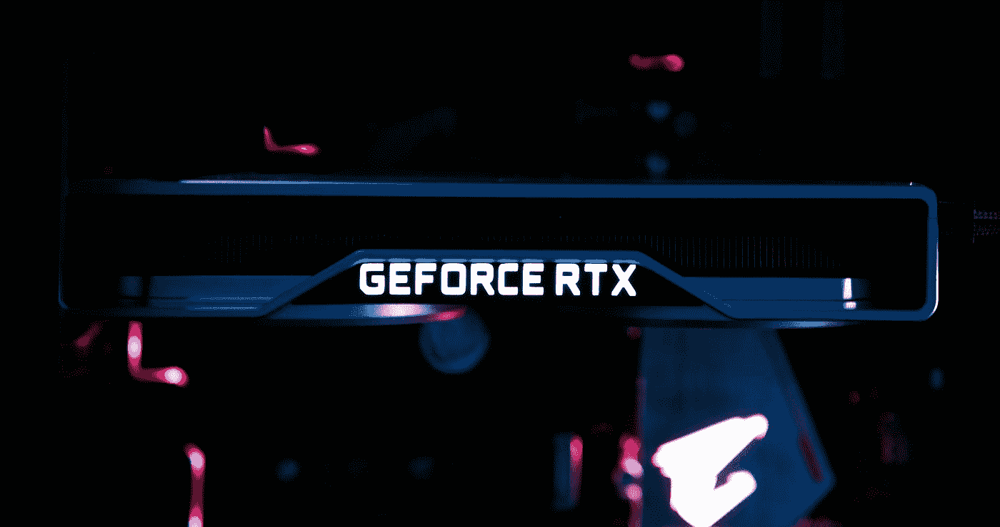
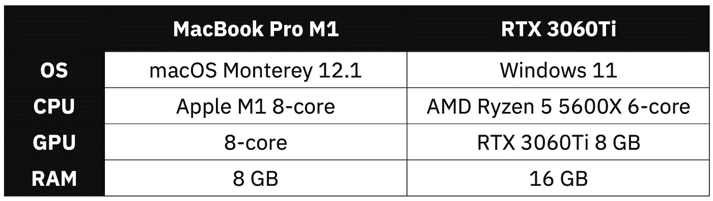
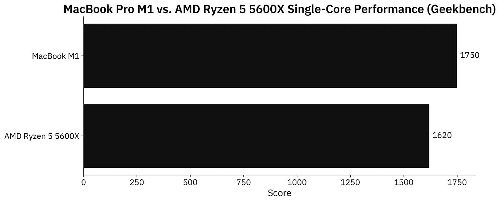
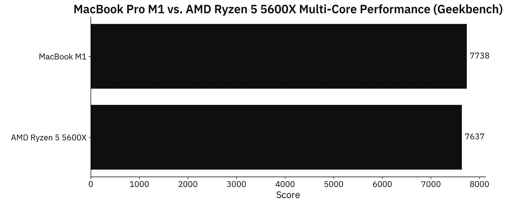
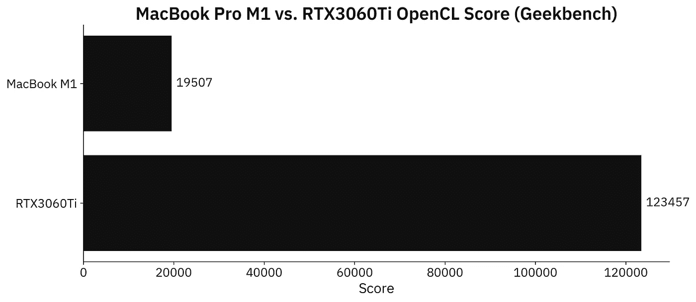
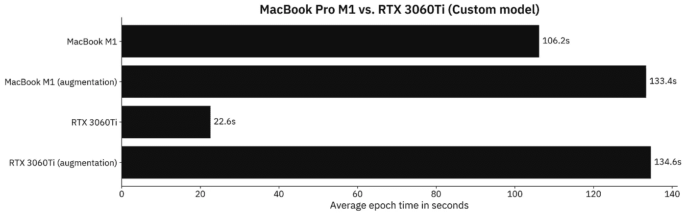
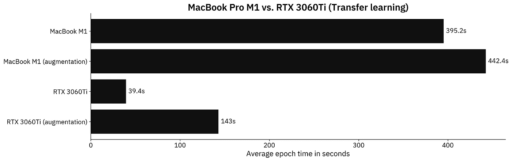

# MacBook M1 与采用 RTX3060Ti 的定制 PC——哪个对数据科学更有利？

> 原文：<https://towardsdatascience.com/macbook-m1-vs-custom-pc-with-rtx3060ti-which-is-better-for-data-science-1a10cdb05558>

## **苹果 2020 年售价 1299 美元的 beast 与同等价格的 PC 配置相比，TensorFlow 的速度更快？**



卢卡斯·凯普纳在 [Unsplash](https://unsplash.com?utm_source=medium&utm_medium=referral) 上的照片

早在 2020 年，苹果的 M1 芯片就是一项惊人的技术突破。它没有支持科学家们在发布时日常需要的许多工具数据，但自那以后发生了很多变化。我们甚至为专业用户定制了新的 [M1 Pro 和 M1 Max 芯片](https://betterdatascience.com/macbook-m1-vs-m1-pro-for-data-science/)。

*但它真的能和一台配备专用 GPU 的定制电脑相比吗？这就是我们今天要回答的问题。*

在今天的文章中，我们将只比较数据科学使用案例，忽略笔记本电脑与 PC 的其他差异。在测试中，我们有一台 2020 年的基本型号 MacBook M1 Pro 和一台由 AMD 锐龙 5 和 Nvidia RTX 显卡驱动的定制 PC。以下是规格:



图 1 —硬件规格对比(图片由作者提供)

两台机器的价格几乎相同——我只多花了 50 美元买了这台定制电脑。就预算而言，我们可以认为这种比较是公平的。

不想看书？请观看我的视频:

# MacBook M1 与定制 PC——geek bench

综合基准不一定描绘真实世界的使用情况，但它们是一个很好的起点。先来看看苹果 M1 和 AMD 锐龙 5 5600X 在单核部门的对比:



图 2 — Geekbench 单核性能(图片由作者提供)

苹果 M1 在综合单核测试中快了大约 8%，这是一个令人印象深刻的结果。请记住，我们是在比较内置于超薄笔记本电脑中的移动芯片和台式机 CPU。

接下来我们来对比一下多核的性能。M1 有 8 个内核(4 个性能和 4 个效率)，而锐龙有 6 个内核:



图 3 — Geekbench 多核性能(图片由作者提供)

M1 快得可以忽略不计——大约 1.3%。我们可以得出结论，两者的表现应该差不多。

这是他们渐行渐远的地方。定制 PC 有一个专用的 RTX3060Ti GPU，内存为 8 GB。轻薄的笔记本电脑毫无胜算:



图 4 — Geekbench OpenCL 性能(图片由作者提供)

RTX3060Ti 在 OpenCL 基准测试中的得分比苹果 M1 芯片高出约 6.3 倍。这些结果是意料之中的。见鬼，光是 GPU 就比 MacBook pro 大。

总体而言，M1 在 CPU 方面与 AMD 锐龙 5 5600X 相当，但在 GPU 基准测试方面有所欠缺。我们将会看到这些结果如何转化为 TensorFlow 性能。

# MacBook M1 与 RTX3060Ti —数据科学基准测试设置

如果您继续学习，您将需要安装 TensorFlow。这里有一整篇文章致力于为苹果 M1 和 Windows 安装 TensorFlow:

*   [在 MacBook M1 上安装 tensor flow 2.7](https://betterdatascience.com/install-tensorflow-2-7-on-macbook-pro-m1-pro/)
*   [在 Windows 上安装支持 GPU 的 TensorFLow】](https://www.tensorflow.org/install/gpu)

此外，您还需要一个影像数据集。我使用了来自 Kaggle 的[狗和猫的数据集](https://www.kaggle.com/pybear/cats-vs-dogs?select=PetImages)，它是在知识共享许可下授权的。长话短说，你可以免费使用。

有关如何组织和预处理它的详细说明，请参考以下文章:

[](https://betterdatascience.com/top-3-prerequisites-for-deep-learning-projects/) [## 用于图像分类的 TensorFlow 深度学习项目的三大先决条件|更好的数据…

### 想训练一个用于图像分类的神经网络？确保做到这一点首先识别图像中的对象是一个…

betterdatascience.com](https://betterdatascience.com/top-3-prerequisites-for-deep-learning-projects/) 

我们今天会做两个测试:

1.  **具有定制模型架构的 tensor flow**—使用我在 [CNN 文章](https://betterdatascience.com/train-image-classifier-with-convolutional-neural-networks/)中描述的两个卷积块。
2.  **带迁移学习的 tensor flow**—使用 [VGG-16 预训练网络](https://betterdatascience.com/tensorflow-transfer-learning/)对图像进行分类。

让我们检查一下测试中使用的代码。

## 自定义张量流模型—代码

我将这个测试分为两部分——一个有数据增强和没有数据增强的模型。一次仅使用一对`train_datagen`和`valid_datagen`:

```
import os
import warnings
from datetime import datetime
os.environ['TF_CPP_MIN_LOG_LEVEL'] = '2'
warnings.filterwarnings('ignore')

import numpy as np
import tensorflow as tf
tf.random.set_seed(42)

####################
# 1\. Data loading
####################
# USED ON A TEST WITHOUT DATA AUGMENTATION
train_datagen = tf.keras.preprocessing.image.ImageDataGenerator(
    rescale=1/255.0
)
valid_datagen = tf.keras.preprocessing.image.ImageDataGenerator(
    rescale=1/255.0
)

# USED ON A TEST WITH DATA AUGMENTATION
train_datagen = tf.keras.preprocessing.image.ImageDataGenerator(
    rescale=1/255.0,
    rotation_range=20,
    width_shift_range=0.2,
    height_shift_range=0.2,
    shear_range=0.2,
    zoom_range=0.2,
    horizontal_flip=True,
    fill_mode='nearest'
)
valid_datagen = tf.keras.preprocessing.image.ImageDataGenerator(
    rescale=1/255.0
)

train_data = train_datagen.flow_from_directory(
    directory='data/train/',
    target_size=(224, 224),
    class_mode='categorical',
    batch_size=64,
    seed=42
)
valid_data = valid_datagen.flow_from_directory(
    directory='data/validation/',
    target_size=(224, 224),
    class_mode='categorical',
    batch_size=64,
    seed=42
)

####################
# 2\. Model
####################
model = tf.keras.Sequential([
    tf.keras.layers.Conv2D(filters=32, kernel_size=(3, 3), input_shape=(224, 224, 3), activation='relu'),
    tf.keras.layers.MaxPool2D(pool_size=(2, 2), padding='same'),
    tf.keras.layers.Conv2D(filters=32, kernel_size=(3, 3), activation='relu'),
    tf.keras.layers.MaxPool2D(pool_size=(2, 2), padding='same'),
    tf.keras.layers.Flatten(),
    tf.keras.layers.Dense(128, activation='relu'),
    tf.keras.layers.Dense(2, activation='softmax')
])
model.compile(
    loss=tf.keras.losses.categorical_crossentropy,
    optimizer=tf.keras.optimizers.Adam(),
    metrics=[tf.keras.metrics.BinaryAccuracy(name='accuracy')]
)

####################
# 3\. Training
####################
time_start = datetime.now()
model.fit(
    train_data,
    validation_data=valid_data,
    epochs=5
)
time_end = datetime.now()
print(f'Duration: {time_end - time_start}')
```

接下来我们来看一下转移学习代码。

## 迁移学习张量流模型——代码

大部分导入和数据加载代码是相同的。同样，一次只使用一对`train_datagen`和`valid_datagen`:

```
import os
import warnings
from datetime import datetime
os.environ['TF_CPP_MIN_LOG_LEVEL'] = '2'
warnings.filterwarnings('ignore')

import numpy as np
import tensorflow as tf
tf.random.set_seed(42)

####################
# 1\. Data loading
####################
# USED ON A TEST WITHOUT DATA AUGMENTATION
train_datagen = tf.keras.preprocessing.image.ImageDataGenerator(
    rescale=1/255.0
)
valid_datagen = tf.keras.preprocessing.image.ImageDataGenerator(
    rescale=1/255.0
)

# USED ON A TEST WITH DATA AUGMENTATION
train_datagen = tf.keras.preprocessing.image.ImageDataGenerator(
    rescale=1/255.0,
    rotation_range=20,
    width_shift_range=0.2,
    height_shift_range=0.2,
    shear_range=0.2,
    zoom_range=0.2,
    horizontal_flip=True,
    fill_mode='nearest'
)
valid_datagen = tf.keras.preprocessing.image.ImageDataGenerator(
    rescale=1/255.0
)

train_data = train_datagen.flow_from_directory(
    directory='data/train/',
    target_size=(224, 224),
    class_mode='categorical',
    batch_size=64,
    seed=42
)
valid_data = valid_datagen.flow_from_directory(
    directory='data/validation/',
    target_size=(224, 224),
    class_mode='categorical',
    batch_size=64,
    seed=42
)

####################
# 2\. Base model
####################
vgg_base_model = tf.keras.applications.vgg16.VGG16(
    include_top=False, 
    input_shape=(224, 224, 3), 
    weights='imagenet'
)
for layer in vgg_base_model.layers:
    layer.trainable = False

####################
# 3\. Custom layers
####################
x = tf.keras.layers.Flatten()(vgg_base_model.layers[-1].output)
x = tf.keras.layers.Dense(128, activation='relu')(x)
out = tf.keras.layers.Dense(2, activation='softmax')(x)

vgg_model = tf.keras.models.Model(
    inputs=vgg_base_model.inputs,
    outputs=out
)
vgg_model.compile(
    loss=tf.keras.losses.categorical_crossentropy,
    optimizer=tf.keras.optimizers.Adam(),
    metrics=[tf.keras.metrics.BinaryAccuracy(name='accuracy')]
)

####################
# 4\. Training
####################
time_start = datetime.now()
vgg_model.fit(
    train_data,
    validation_data=valid_data,
    epochs=5
)
time_end = datetime.now()
print(f'Duration: {time_end - time_start}')
```

最后，让我们看看基准测试的结果。

# MacBook M1 与 RTX3060Ti —数据科学基准测试结果

现在，我们将比较 M1 和定制 PC 在定制模型架构上每个时期的平均训练时间。请记住，训练了两个模型，一个有数据增强，一个没有数据增强:



图 5 —定制模型在几秒钟内得出的结果(M1:106.2；M1 增广:133.4；RTX 3060 ti:22.6；RTX3060Ti 增强版:134.6)(图片由作者提供)

有一点是肯定的——这些结果是意料之外的。不要误会我的意思，我预计 RTX3060Ti 整体上会更快，但我无法解释它在增强数据集上运行如此缓慢的原因。

在非增强数据集上，RTX3060Ti 比 M1 MacBook 快 4.7 倍。两者在扩充数据集上大致相同。

但是现在谁会从头开始写 CNN 的模型呢？如果您的数据有限，并且您的图像不是高度专业化的，则始终推荐迁移学习。以下是迁移学习模型的结果:



图 6 —几秒钟内迁移学习模型结果(M1:395.2；M1 增广:442.4；RTX 3060 ti:39.4；RTX3060Ti augmented: 143)(图片由作者提供)

这次的结果看起来更真实。在非增强图像数据集上训练迁移学习模型时，RTX3060Ti 每历元快 10 倍。对于扩充的数据集，这种差异下降到 3 倍快，有利于专用 GPU。

尽管如此，对于一台最初不是为数据科学设计的超轻笔记本电脑来说，这些结果还是相当不错的。我们从一开始就知道 M1 没有机会。

# 离别赠言

苹果的 M1 芯片是非凡的——这一点毋庸置疑。如果我们比较每瓦特的计算能力，没有什么能与之相比。尽管如此，如果你需要像样的深度学习性能，那么定制桌面配置是强制性的。唯一的解决方法是在云中租用 GPU，但这不是我们今天探讨的选项。

NVIDIA 的 RTX3060Ti 是一款中间层 GPU，非常适合初级到中级深度学习任务。当然，你不会很快在上面训练高分辨率风格的 GANs，但这主要是由于 8 GB 的内存限制。24 GB 内存的 RTX3090Ti 绝对是更好的选择，但前提是你的钱包能撑那么远。

在大多数情况下，中端产品将让您受益匪浅。

*你对这个基准有什么想法？能不能在更强大的 GPU 上运行一下，分享一下结果？*请在下面的评论区告诉我。

## 更多基准

*   [MacBook M1 vs M1 Pro](https://betterdatascience.com/macbook-m1-vs-m1-pro-for-data-science/)
*   [M1 MacBook vs 谷歌 Colab](https://betterdatascience.com/macbook-m1-vs-google-colab/)
*   [MacBook M1 Pro vs 谷歌 Colab](https://betterdatascience.com/macbook-m1-pro-vs-google-colab/)

## 保持联系

*   注册我的[简讯](https://mailchi.mp/46a3d2989d9b/bdssubscribe)
*   在 YouTube[上订阅](https://www.youtube.com/c/BetterDataScience)
*   在 [LinkedIn](https://www.linkedin.com/in/darioradecic/) 上连接

*喜欢这篇文章吗？成为* [*中等会员*](https://medium.com/@radecicdario/membership) *继续无限制学习。如果你使用下面的链接，我会收到你的一部分会员费，不需要你额外付费。*

[](https://medium.com/@radecicdario/membership) [## 通过我的推荐链接加入 Medium-Dario rade ci

### 作为一个媒体会员，你的会员费的一部分会给你阅读的作家，你可以完全接触到每一个故事…

medium.com](https://medium.com/@radecicdario/membership) 

*原载于 2022 年 1 月 27 日*[*https://betterdatascience.com*](https://betterdatascience.com/macbook-m1-vs-rtx3060ti/)*。*