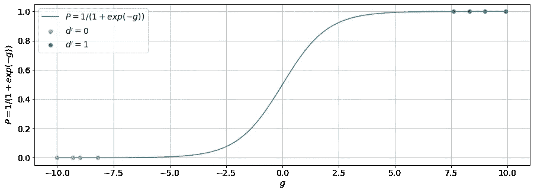
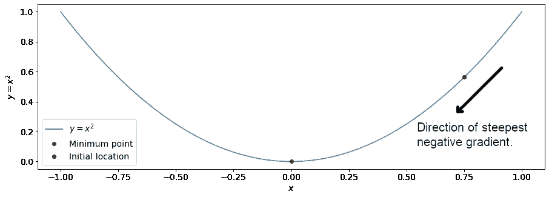

# 机器学习 102:逻辑回归

> 原文：<https://towardsdatascience.com/machine-learning-102-logistic-regression-9e6dc2807772>

## 回到分类的基础

在之前的一篇文章中，我探索了线性回归——机器学习和数据科学中使用的所有其他高级模型的基础。线性回归模型连续因变量，如股票价格。

然而，在数据科学和机器学习中，我们通常也必须处理布尔或分类相关变量。典型的布尔因变量包括像债务人的贷款违约状态——完全偿还/违约，或分类猫的图片——是猫/不是猫🐈！

用于模拟布尔因变量的最基本模型之一是逻辑回归模型。在本文中，我将深入探讨以下细节:

*   逻辑回归模型背后的基本数学。
*   布尔因变量的损失函数。
*   随机梯度下降法。
*   如何使用 Python 创建逻辑回归模型🐍。

如果您刚刚开始学习数据科学，或者尽管您已经有了很高的职业生涯，但只是想修改一些基本概念，请继续阅读，直到本文结束！


[英国斯凯岛](https://unsplash.com/s/photos/skye%2C-united-kingdom)。由[罗伯特·卢克曼](https://unsplash.com/@robertlukeman?utm_source=unsplash&utm_medium=referral&utm_content=creditCopyText)在 [Unsplash](https://unsplash.com/?utm_source=unsplash&utm_medium=referral&utm_content=creditCopyText) 上拍摄的照片。

# 布尔因变量、概率和赔率

在本节中，我们将探索逻辑回归背后的数学，从机器学习中最基本的模型开始— [线性回归](/machine-learning-101-linear-regression-72ba6c04fbf1)。

在线性回归中，因变量 *d* 连续无界，与解释变量*m*g*₁、 *g* ₂、… *gₘ* 成线性关系:*

*d*=*c*₁*g*₁+*c*₂*g*₂+…*+cₘgₘ，*

其中 *c* ₁、 *c* ₂、… *cₘ* 为与解释变量相关联的 *m* 模型参数。

然而，在二进制分类问题中，因变量 *d* 是布尔型的: *d* 只有 0 或 1 的值。由于上述线性回归方程为 *d* 返回连续且无界的值，因此不能直接用于模拟布尔因变量。

我们可以尝试将 *d* 的连续输出视为一种概率。然而，我们不能有负概率或大于 1 的概率！因此， *d* 不能作为概率来对待。

也许我们可以试着用[几率](https://en.wikipedia.org/wiki/Odds)来处理它，而不是把 *d* 当作一种概率。赔率通过以下关系与概率密切相关:

*O* = *P* / (1 - *P* )，

其中 *O* 是赔率， *P* 是概率。

当概率 *P* 的范围为[0，1]时，赔率 *O* 的范围为[0，∞)使得其对于正值是无界的。我们仍然需要考虑负值。为此，我们取几率的对数 O 得到几率的对数 l :

*l* = log( *O* )，

其中 *l* 是连续的，有值域(-∞，∞)，并且没有任何一般性损失，log 是以 *e* 为底的对数。

这正是我们需要的解决方案，以便使用上面的线性回归方程，使用赔率和概率对布尔因变量进行建模！我们需要做的就是将 *d* 视为对数比 *l* :

*l*= log(*o*)= log(*p*/(1-*p*)=*c*₁*g*₁+*c*₂*g*₂+…*+cₘgₘ.*

我们可以重新排列这个等式，用 P 代替:

*p*/(1-*p*)= exp(*c*₁*g*₁+*c*₂*g*₂+…*+cₘgₘ*)
*p*= 1/(1+exp(-(*c*₁

可以更简洁地写成:

*p*= 1/(1+exp(-**m**ᵀ**g**)，

其中 **m** 是长度为 *m* 的向量，包含模型参数:**m**=**[*c*₁， *c* ₂，… *cₘ* ]ᵀ， **g** 也是长度为 *m* 的向量，包含解释变量: **g 该方程也被称为[逻辑函数](https://en.wikipedia.org/wiki/Logistic_function)，因此被称为“逻辑回归”！****

**线性回归模型*d*=**m**ᵀ**g***已经转化为逻辑回归模型*p*= 1/(1+exp(-**m**ᵀ**g**))，将概率 *P* 建模为 **m** 和 **g** 的非线性函数！请注意，原始布尔因变量 *d* 没有出现在逻辑回归模型中——我们只处理概率！*d*’稍后将再次出现在损失函数中。***

***等式*p*= 1/(1+exp(-**m**ᵀ**g**))可能很难理解，所以让我们用图表来看看最简单的可能情况。最简单的情况，*P*= 1/(1+exp(-*g*))只有 1 个解释变量 *g* 如下图所示。当 *g* 增大时， *P* 趋于 1，当 *g* 减小时， *P* 趋于 0。图表中还包括一些合成布尔数据点，用于 *d* ' = 0 和 *d* ' = 1。***

******

***蓝色表示 *P* = 1 / (1 + exp(- *g* ))，橙色点表示 d' = 0，绿色点表示 d' = 1。作者创造的形象。***

***当 *d* ' = 1 时， *P* 理想情况下应具有接近 1 的对应值，而当 *d* ' = 0 时， *P* 应具有接近 0 的对应值。由逻辑回归模型定义的分类问题被简化为寻找一组模型参数**m**=**[*c*₁、 *c* ₂、… *cₘ* ]ᵀ ，这导致了这里描述的行为。*****

# *****布尔因变量的向量*****

*****在上一节中，我们算出了单布尔因变量 *d* 的逻辑回归方程。在现实生活中，我们更可能需要处理一个布尔因变量的向量，它对应于一组不同的测量值: **d** ' = [ *d'* ₁， *d'* ₂，… *d'ₙ* ]ᵀ.*****

*****在这种情况下，对应于 **d** 中第 *u* 个元素的概率由逻辑回归模型用一组对应的 *m* 解释变量 *Gᵤ* ₁ *、Gᵤ* ₂、… *Gᵤₘ* 来建模:*****

******pᵤ*= 1/(1+exp(-(*gᵤ*₁*c*₁*+gᵤ*₂*c*₂+…+*gᵤₘcₘ*))。*****

*****注意， *Pᵤ* 只是向量中的第 *u* 个元素: **P** = [ *P* ₁， *P* ₂，… *Pₙ* ]ᵀ.对于 **P** ,该等式也可以向量形式写成:*****

*******P**= 1/(1+exp(-**Gm**))，*****

*****其中 **G** 是一个大小为*n*×m 的矩阵，结构如下:*****

*******g**=【*g*₁₁、 *G* ₁₂、… *G* ₁ *ₘ* 、
。…….[ *G* ₂₁、 *G* ₂₂、… *G* ₂ *ₘ* 、
。…….…
。…….[ *Gₙ* ₁， *Gₙ* ₂，… *Gₙₘ* ]]，*****

*****其中*u*g**g**第一行包含 *m* 解释变量的向量 *Gᵤ* ₁ *、Gᵤ* ₂、… *Gᵤₘ* 、和**m**=**[*c*₁、*******

# ********最小化二元交叉熵损失函数********

********为了量化我们的逻辑回归模型的表现，我们需要最小化模型的概率预测 *P* 和关于模型参数 **m** 的布尔基础真值 *d* 之间的误差。********

******用于量化分类问题中的预测误差的最常用损失函数之一是[二元交叉熵](https://en.wikipedia.org/wiki/Cross_entropy)。对于第 *u* 个数据点，二元交叉熵为:******

*******lᵤ*(**m**)=-*d*'*ᵤ*原木(*pᵤ*(**m**)-(1-*d*'*ᵤ*)原木(1 - *Pᵤ* ( **m** )。******

*******Lᵤ* ( **m** )中的第一项仅在 *d'ᵤ* = 1 时有效，第二项仅在 *d* ' *ᵤ* = 0 时有效。要获得所有 *n* 个数据点的损失，我们只需求和:******

*******l*(**m**)=σ*ᵤlᵤ*(**m**)。******

******我们希望最小化关于模型参数 **m** 的损失函数 *L* ( **m** )。为此，我们将 *Lᵤ* ( **m** )相对于 **m** 进行区分:******

******∂*lᵤ*(**m**)/∂**m**=∂/∂**m**(-*d*'*ᵤ*原木(*pᵤ*(**m**)-(1-*d*'*ᵤ*)原木(1 - *Pᵤ* ( **m** ))******

******这个导数看起来令人生畏，但是我们可以使用[乘积法则](https://en.wikipedia.org/wiki/Product_rule)将∂*lᵤ*(**m**)/∂**m**分解成更简单的成分:******

******∂*lᵤ*(**m**)/∂**m**=∂*lᵤ*(**m**)/∂*pᵤ*(**m**∂*pǐ*(**m**)/∩**m**。******

******术语∂*lᵤ*(**m**)/∂*pᵤ*(**m**)可以评估为:******

******∂*lᵤ*(**m**)/∂*pᵤ*(**m**)*=-**d*'*ᵤ*/*pᵤ*+(1-*d*'*ᵤ*)/(1******

******而∂*pᵤ*(**m**)/∂**m**可以由*p*= 1/(1+exp(-**m**ᵀ**g**))计算为:******

******∂*pᵤ*(**m**)/∂**m**=-1/(1+exp(-**m**ᵀ**g**ᵤ)(-**g**t118】ᵤ**t121】exp(-**m**ᵀ**g**********

****其中**g**t140】ᵤ=[*gₙ*₁、 *Gₙ* ₂、… *Gₙₘ* ]ᵀ是包含矩阵 **G** 的第 *u* 行的向量。****

****使用这些结果，导数∂*lᵤ*(**m**)/∂**m**现在可以被评估为:****

****∂*lᵤ*(**m**)/∂**m**=(*pᵤ-**d*'*ᵤ*)/(*pᵤ*(1-*pᵤ*)**g***ᵤ**p*(1-*p*)****

****理想情况下，我们将设置∂*lᵤ*(**m**)/∂**m**= 0，并求解最佳模型参数 **m** 。不幸的是，我们无法求解出 **m** ，因为它们没有出现在∂*lᵤ*(**m**)/∂**m**的表达式中！因此，看起来我们可能需要求助于数值方法来最小化相对于 **m** 的 *Lᵤ* ( **m** )。****

# ****随机梯度下降****

****可以使用各种数值方法，例如[牛顿法](https://en.wikipedia.org/wiki/Newton's_method)或[随机梯度下降法](https://en.wikipedia.org/wiki/Stochastic_gradient_descent)来最小化逻辑回归模型的损失函数。对于本文，我们将探索随机梯度下降法，其变体仍在更高级的模型中积极使用，如神经网络或[联邦学习框架](https://arxiv.org/pdf/1602.05629.pdf)。****

****随机梯度下降是一种一阶迭代优化算法，用于通过沿最陡负梯度方向迭代移动来搜索可微函数的局部最小值。如下图所示，从绿点开始，如果我们沿着蓝色曲线朝着最陡负梯度的方向继续在 *x* 中小步前进，最终应该会到达红点——最小点。****

********

****从绿点到红点向最陡的负梯度方向移动。作者创造的形象。****

****记住，我们希望相对于 **m** 最小化 *L* ( **m** )。利用随机梯度下降算法，我们沿着最陡负梯度的方向在 **m** 中采取多个小步骤:-∂*lᵤ*(**m**)/∂**m**向 *L* ( **m** )的最小值点前进。****

****因此，我们使用∂*lᵤ*(**m**)/∂**m**对 **d** ' = [ *d'* ₁、 *d'* ₂、… *d'ₙ* ]ᵀ:中的所有 *n* 元素迭代更新模型参数 **m******

******m**:=**m**-*r*∂*lᵤ*(**m**)/∂**m，******

****其中 *R* 是某个学习率，它控制我们所走的步数的大小。****

****学习率的大小非常重要:如果 *R* 太小，步长几乎不会改变 **m** 的值，另一方面，如果 *R* 太大，那么我们可能会超过最小点！为 *R* 选择一个好的值取决于所涉及的数据。****

****随机梯度下降算法可以用伪代码编写:****

```
****# Initialize the model parameters with some initial value.
m = initialize_m()# Iterate the algorithm until some termination condition is reached.
while termination_condition == False:
    # Shuffle the rows the training data.
    shuffle_training_data() # Iterate through all the n elements in the data.
    for i in range(n):
        # Update the model parameters m using the derivative of the 
        # loss function for that element.
        m = m - R * dLdm[i] # Check if the termination condition is reached.
    check_termination_condition()****
```

# ****概述****

****我们已经讨论了很多细节，所以在继续用 Python 编码之前，让我们回顾一下我们已经讨论过的内容！****

1.  ****我们希望对布尔因变量 *d* ' ∈ {0，1}进行建模。****
2.  ****我们没有直接对布尔值建模，而是使用:*p*= 1/(1+exp(-(*c*₁*g*₁+*c*₂*g*₂+…*+cₘgₘ*))对概率建模。****
3.  ****我们用二元交叉熵来衡量模型的预测误差:
    *(**m**)=-*d*'*ᵤ*log(*pᵤ*(**m**)-(1-*d*'*ᵤ*)log(1-【t74*****
4.  ****为了找到最佳的模型参数 **m** ，我们相对于 **m** 最小化 *Lᵤ* ( **m** )。不幸的是，这个最小化问题必须使用数值方法来解决，例如随机梯度下降。****

# ****使用 Python 进行逻辑回归****

****我们现在已经做了足够的数学！在本节中，我们将使用 Python 创建一个逻辑回归模型求解器！****

****首先，我们定义实现逻辑回归模型的`logistic_regression`:****

```
**import numpy as npdef logistic_regression(G, m):
    """
    Logistic regression model. Inputs
    G: np.array of shape nxm containing the explanatory variables.
    m: np.array of length m containing the model parameters. Returns
    P: np.array of length n containing the modeled probabilities.
    """
    return 1 / (1 + np.exp(-np.dot(G, m)))**
```

****接下来我们定义`binary_cross_entropy`和`binary_cross_entropy_grad`，它们计算二元交叉熵及其梯度。****

```
**def binary_cross_entropy(d, P):
    """
    Calculates the mean binary cross entropy for all n data points. Inputs
    d: np.array of length n containing the boolean dependent 
       variables.
    P: np.array of length n containing the model's probability 
       predictions. Returns
    bce: float containing the mean binary cross entropy.
    """

    # For d = 1:
    d_1 = d[d == 1] * np.log(P[d == 1])
    # For d = 0:
    d_0 = (1 - d[d == 0]) * np.log(1 - P[d == 0])
    return -np.mean(d_1) - np.mean(d_0)def binary_cross_entropy_grad(g, d, p):
    """
    Calculates the gradient of the binary cross entropy loss for a 
    single data point. Inputs:
    g: np.array of length m containing the vector of explanatory 
       variables for 1 data point.
    d: integer containing the boolean dependent variable for 1 data 
       point.
    p: float containing the model's probability predictions for 1 
       data point. Returns:
    bce_grad: np.array of length m containing the gradients of the 
              binary cross entropy.
    """
    return g * (p - d)**
```

****最后，我们定义`SGD`，它执行随机梯度下降算法，使用所有数据点逐一迭代更新模型参数。****

```
**def SGD(d, G, m, R = 0.01):
    """
    Stochastic gradient descent. Updates the model parameters m 
    iteratively using all individual data points in d.

    Inputs
    d: np.array of length n containing the boolean dependent 
       variables.
    G: np.array of shape nxm containing the explanatory variables.
    m: np.array of length m containing the initial model parameters.
    R: float containing the SGD learning rate.

    Returns
    m: np.array of length m containing the updated model parameters.
    """
    # Shuffle the data points.
    indices = np.arange(len(d))
    np.random.shuffle(indices)
    d = d[indices]
    G = G[indices] # Iteratively update the model parameters using every single
    # data point one by one.
    for i in range(len(d)):
        P = logistic_regression(G[i], m)
        m = m - R * binary_cross_entropy_grad(G[i], d[i], P) return m**
```

****现在我们只需要一些数据来测试我们的逻辑回归求解器！我们使用从`sklearn`获得的鸢尾花分类数据集。原始数据集提供了 3 个不同的类:0、1 和 2。我们将数据集仅限于 0 和 1 的类。****

```
**from sklearn.datasets import load_iris# Load the iris flower dataset from sklearn.
data = load_iris()
G = data["data"]   # Explanatory variable matrix.
d = data["target"] # Dependent variable array.# The dataset has 3 classes. For the time being, restrict the data
# to only classes 0 and 1 in order to create boolean dependent
# variables.                  
want = (d == 0) | (d == 1)G = G[want]
d = d[want]**
```

****因为我们的逻辑回归模型****

*****p*= 1/(1+exp(-(*c*₁*g*₁+*c*₂*g*₂+…*+cₘgₘ*))****

****没有明确包括偏差项，我们需要在矩阵 **G** 的第一列添加一列 1。这列 1 将扮演偏置项的角色。****

```
**# Because we do not explicitly account for a bias term in our
# logistic regression model, we need to add a column of 1s to the
# matrix G. This will play the term of the bias term.
G = np.hstack([np.ones([len(G), 1]), G])# Take a look at the first 3 data points in the dataset.
for i in range(3):
    print(G[i], d[i]) [1\.  5.1 3.5 1.4 0.2] 0
[1\.  4.9 3\.  1.4 0.2] 0
[1\.  4.7 3.2 1.3 0.2] 0**
```

****现在我们已经准备好了数据结构 **G** 和 **d** ，是时候对模型参数 **m** 进行初步猜测了！由于每个数据点有 5 个解释变量，因此在 **m** 中将有 5 个模型参数。我们猜测模型参数的值为 1。****

```
**m = np.ones(5)**
```

****接下来，我们运行随机梯度下降解算器 20 次迭代，使用学习率 *R* = 0.01 来防止算法超过最小点。****

```
**# Run the SGD algorithm 20 times.
for i in range(20):
    # Use a learning rate of 0.01.
    m = SGD(d, G, m, 0.01) # Calculate the mean loss for all data in the dataset.
    P = logistic_regression(G, m)
    bce = binary_cross_entropy(d, P) print("Step {:3d} : m = [ ".format(i+1), end = "")
    for j in range(len(m)):
        print("{:6.3f}".format(m[j]), end = " ")
    print("], loss = {:.3f}.".format(bce)) Step   1 : m = [  0.692 -0.506 -0.080  0.640  0.961 ], loss = 0.548\. Step   2 : m = [  0.674 -0.517 -0.207  0.854  1.050 ], loss = 0.417\. Step   3 : m = [  0.643 -0.609 -0.355  0.985  1.110 ], loss = 0.322\. Step   4 : m = [  0.629 -0.620 -0.440  1.124  1.168 ], loss = 0.258\. Step   5 : m = [  0.616 -0.638 -0.514  1.234  1.214 ], loss = 0.218\. Step   6 : m = [  0.608 -0.635 -0.568  1.337  1.257 ], loss = 0.187\. Step   7 : m = [  0.598 -0.652 -0.626  1.417  1.291 ], loss = 0.165\. Step   8 : m = [  0.592 -0.652 -0.668  1.495  1.324 ], loss = 0.148\. Step   9 : m = [  0.579 -0.691 -0.726  1.545  1.348 ], loss = 0.135\. Step  10 : m = [  0.573 -0.699 -0.765  1.605  1.373 ], loss = 0.123\. Step  11 : m = [  0.568 -0.697 -0.796  1.665  1.398 ], loss = 0.113\. Step  12 : m = [  0.563 -0.702 -0.828  1.716  1.420 ], loss = 0.104\. Step  13 : m = [  0.556 -0.716 -0.862  1.759  1.439 ], loss = 0.097\. Step  14 : m = [  0.551 -0.723 -0.891  1.802  1.457 ], loss = 0.091\. Step  15 : m = [  0.547 -0.729 -0.918  1.843  1.475 ], loss = 0.086\. Step  16 : m = [  0.542 -0.736 -0.944  1.880  1.491 ], loss = 0.081\. Step  17 : m = [  0.538 -0.741 -0.968  1.916  1.506 ], loss = 0.077\. Step  18 : m = [  0.535 -0.741 -0.987  1.953  1.522 ], loss = 0.073\. Step  19 : m = [  0.531 -0.748 -1.009  1.985  1.536 ], loss = 0.069\. Step  20 : m = [  0.528 -0.748 -1.027  2.018  1.549 ], loss = 0.066.**
```

****从上面的结果来看，平均二进制交叉熵似乎一直在下降，这意味着该模型应该朝着一组令人满意的参数收敛，所以接下来让我们检查该模型的准确性。由于这是一个小数据集，我们将简单地直接打印所有 *n* 个数据点的结果，并直观地检查它们。****

```
**# Print the ground truth.
print(d)# Print the modeled probabilities of the logistic regression model, 
# rounded to the nearest integer value.
print(np.round(logistic_regression(G, m)).astype(int)) [0 0 0 0 0 0 0 0 0 0 0 0 0 0 0 0 0 0 0 0 0 0 0 0 0 0 0 0 0 0 0 0 0 0 0 0 0 0 0 0 0 0 0 0 0 0 0 0 0 0 1 1 1 1 1 1 1 1 1 1 1 1 1 1 1 1 1 1 1 1 1 1 1 1 1 1 1 1 1 1 1 1 1 1 1 1 1 1 1 1 1 1 1 1 1 1 1 1 1 1][0 0 0 0 0 0 0 0 0 0 0 0 0 0 0 0 0 0 0 0 0 0 0 0 0 0 0 0 0 0 0 0 0 0 0 0 0 0 0 0 0 0 0 0 0 0 0 0 0 0 1 1 1 1 1 1 1 1 1 1 1 1 1 1 1 1 1 1 1 1 1 1 1 1 1 1 1 1 1 1 1 1 1 1 1 1 1 1 1 1 1 1 1 1 1 1 1 1 1 1]**
```

****似乎我们的模型已经完美地分类了数据集中的每一个数据点！接下来让我们仔细看看模型的实际非舍入输出，包括 *d* ' = 1 和 *d* ' = 0 两种情况。****

```
**# Get the probability predictions from the model.
P = logistic_regression(G, m)# d' = 0
print("d' = {}, P = {:.3f}.".format(d[0], P[0]))
# d' = 1
print("d' = {}, P = {:.3f}.".format(d[-1], P[-1])) d' = 0, P = 0.023\. 
d' = 1, P = 0.975.**
```

****我们看到，当 *d* ' = 1 时， *P* 非常接近 1，当 *d* ' = 0 时， *P* 非常接近 0——这正是我们预期的行为！****

# ****提醒一句****

****在上面的例子中，使用的数据是非常容易分离的。也就是说， *d* ' = 1 和 *d* ' = 0 之间的解释变量存在明显差异。这就是我们如何在预测中获得完美结果的。****

****在实际的数据科学项目中，数据通常没有这么干净——我们需要[设计数据](https://en.wikipedia.org/wiki/Feature_engineering)中的特征，考虑 **d** 中 0 和 1 的数量之间的比例，以及[微调模型训练过程](https://en.wikipedia.org/wiki/Hyperparameter_optimization)。根据数据，其他损失函数，如[聚焦损失](https://arxiv.org/pdf/1708.02002.pdf)或[正则化损失函数](https://en.wikipedia.org/wiki/Regularization_(mathematics))可能比二元交叉熵更好。****

****在本文中，我们使用随机梯度下降来最小化损失函数。随机梯度下降并不总是适用于所有数据集，在其他数据集中，其他更高级的优化算法，如[有限内存 BFGS](https://en.wikipedia.org/wiki/Limited-memory_BFGS) 或 [Adam](https://en.wikipedia.org/wiki/Stochastic_gradient_descent#Adam) 可能适用。****

****指标也是另一个需要考虑的重要因素。在上面的例子中，我们简单地比较了模型的输出。在现实生活中，对于包含数千个数据点的数据集，这种方法显然是行不通的！使用哪种指标将取决于所涉及的数据。分类中使用的常用指标包括[准确度](https://en.wikipedia.org/wiki/Accuracy_and_precision)、[接收器工作特性](https://en.wikipedia.org/wiki/Receiver_operating_characteristic)或[精确度和召回率](https://en.wikipedia.org/wiki/Precision_and_recall)。****

****此外，我们在用于训练模型的数据上测试了我们的模型——实际上，整个数据集应该分成训练和验证数据集！该模型应在训练数据集上进行训练，然后在验证数据集上进行测试-这是为了确保该模型不只是记住了训练数据集，而且能够将其预测推广到以前没有见过的数据！****

****数据科学和机器学习是极其深入和广阔的领域！一旦你完全理解了基本原理是如何工作的，那么就开始花些时间探索更高级的话题吧！****

# ****摘要****

****在本文中，我们探索了逻辑回归模型背后的数学，并使用 Python 创建了一个基于随机梯度下降的求解器！今天探索的概念，如使用数值方法最小化损失函数可能是基本的，但适用于所有其他高级模型，如深度学习图像分类或分割模型！我希望您能够更好地理解分类模型今天是如何工作的。一如既往的感谢您的阅读，下篇文章再见！****

# ****参考****

****[1] W. M. Menke (2012)，*地球物理数据分析:离散逆理论 MATLAB 版*，Elsevier。
【2】艾伦·b·唐尼(2014)，*Think Stats Python 中的探索性数据分析*，绿茶出版社。****