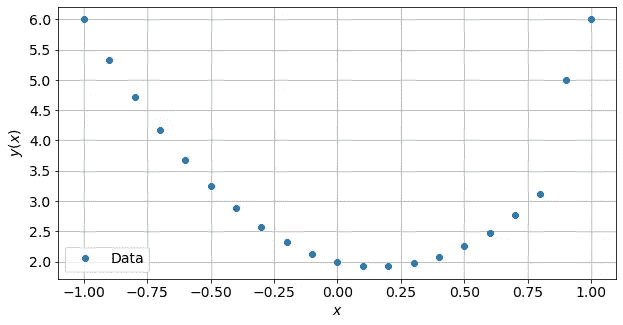
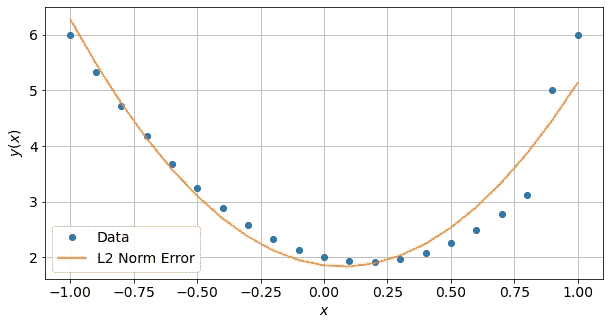
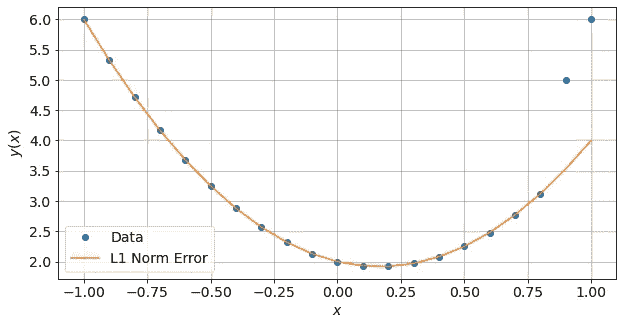
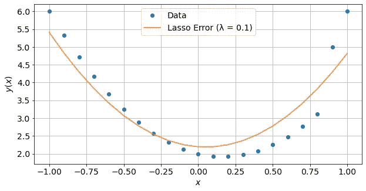
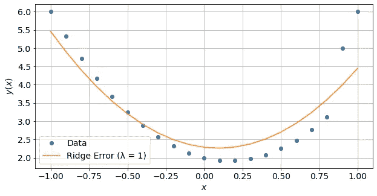

# 机器学习 103:损失函数

> 原文：<https://towardsdatascience.com/machine-learning-103-loss-functions-37b84f3e9b73>

## 为什么机器学习是一个优化问题

在之前的两篇文章中，我介绍了机器学习中使用的两个最基本的模型——[线性回归](/machine-learning-101-linear-regression-72ba6c04fbf1)和[逻辑回归](/machine-learning-102-logistic-regression-9e6dc2807772)。在这两种情况下，我们感兴趣的是搜索产生被观察目标 **d** 的最佳模型预测**d’**的一组模型参数 **m** ，并且在这两种情况下，这是通过最小化一些损失函数 *L* ( **m** )来完成的，该损失函数测量**d’**和 **d** 之间的误差。

很大一部分机器学习——从简单的线性回归到深度学习模型，本质上都涉及某种损失函数的最小化——然而，许多数据科学或机器学习书籍/教程/材料往往更强调模型本身，而不是损失函数！在这篇文章中，我们将继续前两篇文章的内容，并在以后的文章中探索更高级的模型之前，重点关注损失函数！


美国肯塔基州观测到的美丽日食。照片由[李宗盛](https://unsplash.com/@sarahleejs?utm_source=unsplash&utm_medium=referral&utm_content=creditCopyText)在 [Unsplash](https://unsplash.com/?utm_source=unsplash&utm_medium=referral&utm_content=creditCopyText) 拍摄。

# 简而言之，训练机器学习模型

很大一部分训练机器学习模型可以简化如下:

1.  我们有一组观察目标 **d** 和一组相应的解释变量 **G** 。我们希望使用相应的新值 **G** 来预测新值 **d** 。 **d** — **G** 对的例子包括信用分析中的[贷款违约状态—信用数据](https://en.wikipedia.org/wiki/Credit_analysis#Classic_credit_analysis)，物理实验中的[摆的周期—摆长的平方根](https://en.wikipedia.org/wiki/Pendulum_(mechanics)#Small-angle_approximation)，或者猫狗图像分类中的[图像标签— RGB 图像](https://en.wikipedia.org/wiki/Computer_vision)🐈/🐕。
2.  我们想要创建一个机器学习模型 *f* ( **G** ， **m** )，该模型使用一组模型参数 **m** 在给定一些解释变量**G**:**d’**=*f*(**G**， **m** )的情况下对 **d** 进行预测。
3.  训练模型 *f* ( **G** ， **m** )本质上是寻找能够给出最佳预测的 **m** 。使用某种损失函数 *L* ( **m** )来衡量模型预测的质量； **d** ，**d’**)，为了方便起见我们写成 *L* ( **m** )。损失函数本质上是测量**d’**和 **d** 之间的误差，一般来说 *L* ( **m** )的值越小，模型的预测越好。
4.  当我们最终找到导致最小 *L* ( **m** )值的 **m** 时，我们就结束了我们的搜索——对于给定的一组 **d** 和 **G** ，我们已经最小化(或优化) *L* ( **m** )！

现在，正如“最佳”是一个非常主观的词，损失函数也是如此！在某些情况下，一些损失函数会比其他函数更好，使用好的损失函数可以显著提高模型性能！不幸的是，对于某些任务，找到一个好的损失函数可能是一个不小的问题。

在许多情况下，我们通常从众所周知的损失函数开始，然后再转向更复杂的损失函数。通过使用不同的损失函数重新创建模型，我们通常最终会找到产生最佳性能模型的东西！

在接下来的两节中，我们将讨论回归和分类问题中使用的一些损失函数。

# **线性回归的损失函数**

对于这里的回归损失函数，我们将预测值和观测值之间的误差定义为: *eᵤ* ( **m** )是向量的第 *u* 个元素:

**e**(**m**)*=***d***-*f*(**G**， **m** )，*

*而 *mᵥ* 是矢量 **m** 的第 *v* 个元素。*

*为了进一步显示不同回归损失函数的效果，我们对以下问题执行线性回归:通过由等式产生的 19 个点找到最佳拟合曲线:*

**y*(*x*)= 3*x*-*x*+2、*

*在原始数据集的右侧添加了两个异常点。*

**

**从 y*(*x*)= 3*x*-*x*+2 中抽取的一些数据点，有两个离群点。作者创作的人物。*

*   ***均方误差(L2 范数)**
    *l*(**m**)=σ*ᵤ*(*eᵤ*(**m**))。
    这可能是回归问题最广泛使用的损失函数，假设数据中的噪声来自高斯分布。由于误差的平方，该损失函数受到异常值的强烈影响，如下图所示。*

**

*使用 L2 范数误差(均方差)训练的模型的最佳拟合曲线。L2 范数误差受离群数据点的影响。作者创作的人物。*

*   ***平均绝对误差(L1 范数)**
    *l*(**m**)=σ*ᵤ*|*eᵤ*(**m**)|。
    该损失函数不像均方误差那样广泛使用，因为它假设数据中的噪声来自指数分布。由于使用了误差的绝对值，该损失函数不会受到异常值的强烈影响，如下图所示——最佳拟合曲线完全忽略了两个异常点！*

**

*使用 L1 范数误差(平均绝对误差)训练的模型的最佳拟合曲线。L1 范数误差不受离群数据点的强烈影响。作者创作的人物。*

*   ***Lasso 正则化均方误差(L2 范数带 L1 正则化)**
    *l*(**m**)=σ*ᵤ*(*eᵤ*(**m**)+λσ*ᵥ*|*mᵥ*|，其中λ为待指定的超参数。如果λ = 0，这个损失函数就变成了均方误差。
    如果数据包含许多异常值，则使用 lasso 正则化均方误差，但如果假设数据中的噪声来自高斯分布。实质上，套索正则化迫使模型参数尽可能接近零。lasso 误差损失函数受异常数据点的影响不如正则化项导致的均方误差大，但比误差项平方导致的平均绝对误差大，如下图所示。*

**

*使用套索误差训练的模型的最佳拟合曲线。lasso 误差受异常数据点的影响不如均方差大，但比平均绝对误差大。作者创作的人物。*

*   ***岭正则化均方误差(L2 范数加 L2 正则化)**
    *l*(**m**)=σ*ᵤ*(*eᵤ*(**m**)+λσ*ᵥmᵥ*，其中λ为待指定的超参数。如果λ = 0，这个损失函数就变成了均方误差。
    岭正则化均方误差用于数据中存在多重共线性。理想情况下，解释变量中的任何两个特征都不应该相互关联。然而，这有时是无法避免的，可以使用岭正则化来确保模型参数具有相同的大小。下图显示了岭正则化线性回归模型的最佳拟合曲线。*

**

*使用岭误差损失函数训练的模型的最佳拟合曲线。如果数据中存在多重共线性，则岭误差会变得有意义，但这里的情况并非如此。作者创作的人物。*

# *逻辑回归的损失函数*

*在[机器学习 102:逻辑回归](/machine-learning-102-logistic-regression-9e6dc2807772)中，我们展示了对于分类问题，我们建模概率而不是实际类别。因此，分类问题中使用的损失函数直接处理来自模型的概率输出:*p*(**m**)=*f*(**G**， **m** )。*

*为了进一步显示不同损失函数的影响，我们对用 scikit-learn 打包的[乳腺癌数据集](https://scikit-learn.org/stable/modules/generated/sklearn.datasets.load_breast_cancer.html)进行了逻辑回归。原始数据集有 357 个良性(1 级)和 212 个恶性(0 级)数据点。虽然原始数据集已经不平衡，但我们通过将恶性数据点的数量减少到 50 个来进一步扭曲数据，导致 1 类和 0 类之间的比例为 87:12。*

*   ***二元交叉熵**
    *L*(**m**)=-(*y*log(*p*(**m**)+(1-*y*)log(1-*p*(**m**))。
    这是最广泛使用的二元分类损失函数。对于多类分类，存在一个等价的分类。然而，由于二进制交叉熵平等地对待类 0 和类 1，因此它通常不适合不平衡的数据集，这可以从下面的分类报告中看出-训练的模型无法检测类 0 的任何实例。*

```
 *precision    recall  f1-score   support 0       0.00      0.00      0.00        15 
           1       0.85      1.00      0.92        87 accuracy                           0.85       102
   macro avg       0.43      0.50      0.46       102
weighted avg       0.73      0.85      0.79       102*
```

*   *[**焦十字熵**](https://arxiv.org/pdf/1708.02002.pdf)
    *l*(**m**)=-(*y**α*(1-*p*(**m**)*ᵞ*log(*p*(**m**)+(1-*y*如果 *α* = 1 且 *γ* = 0，则该焦交叉熵损失转化为二元交叉熵损失。默认情况下， *α* = 0.25， *γ* = 2。
    焦点交叉熵损失是对二元交叉熵损失的扩展，它考虑了具有比例因子的两个类别的比例: *α* 和(1 - *α* ，并迫使模型关注具有调制因子的错误分类预测:(1-*p*(**m**)*ᵞ*和*p*(【)对于不平衡数据集，焦点交叉熵损失往往优于二进制交叉熵损失，如下面的分类报告所示-训练模型现在更能够检测类 0 的实例。*

```
 *precision    recall  f1-score   support 0       1.00      0.87      0.93        15
           1       0.98      1.00      0.99        87 accuracy                           0.98       102
   macro avg       0.99      0.93      0.96       102
weighted avg       0.98      0.98      0.98       102*
```

# *复杂模型的损失函数*

*在前两节中，我们介绍了回归和分类模型中一些常用的损失函数。上面的列表并不详尽，还有许多其他更复杂的损失函数！此外，某些机器学习算法使用特别定制的损失——例如[铰链损失](https://en.wikipedia.org/wiki/Hinge_loss)被广泛用于[支持向量机](https://en.wikipedia.org/wiki/Support-vector_machine)，而[基尼杂质](https://en.wikipedia.org/wiki/Decision_tree_learning#Gini_impurity)被广泛用于[基于决策树的模型](https://en.wikipedia.org/wiki/Decision_tree_learning)。*

*此外，深度学习模型等高度复杂模型的损失函数往往具有多个局部最小值。在这种情况下，在模型训练期间，优化过程很可能陷入局部最小值，而不是收敛到损失函数的全局最小值。因此，对于复杂模型，通常使用不同的随机生成的初始模型参数同时训练几个模型，以增加模型收敛的机会，并使用随机优化器，如[随机梯度下降](https://en.wikipedia.org/wiki/Stochastic_gradient_descent)，以随机将优化器踢出局部最小值。*

# *摘要*

*在本文中，我们仔细研究了损失函数在训练机器学习模型中所起的作用，以及使用不同的损失函数如何导致同一组数据的非常不同的模型性能。使用适当的损失函数将确定回归模型是否过度拟合离群数据点，或者分类模型是否过度拟合多数类。数据科学家和机器学习工程师应该注意使用适合他们正在处理的问题的损失函数！*

# *参考*

*[1] W. M. Menke (2012)，*地球物理数据分析:离散逆理论 MATLAB 版*，Elsevier。*

*[2] C. M. Bishop (2006)，*模式识别与机器学习*，Springer*

*[3]宗-林逸，普里亚·戈亚尔，罗斯·吉尔希克，明凯·何和皮奥特·多勒(2018)， [*密集物体探测的焦损失*](https://arxiv.org/pdf/1708.02002.pdf) ， [arXiv:1708.02002](https://arxiv.org/abs/1708.02002) 。*