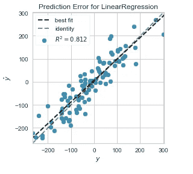
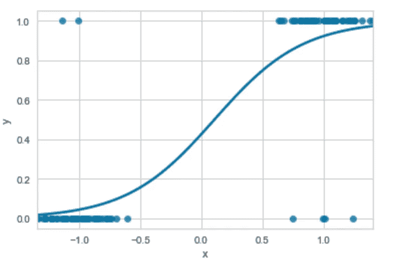
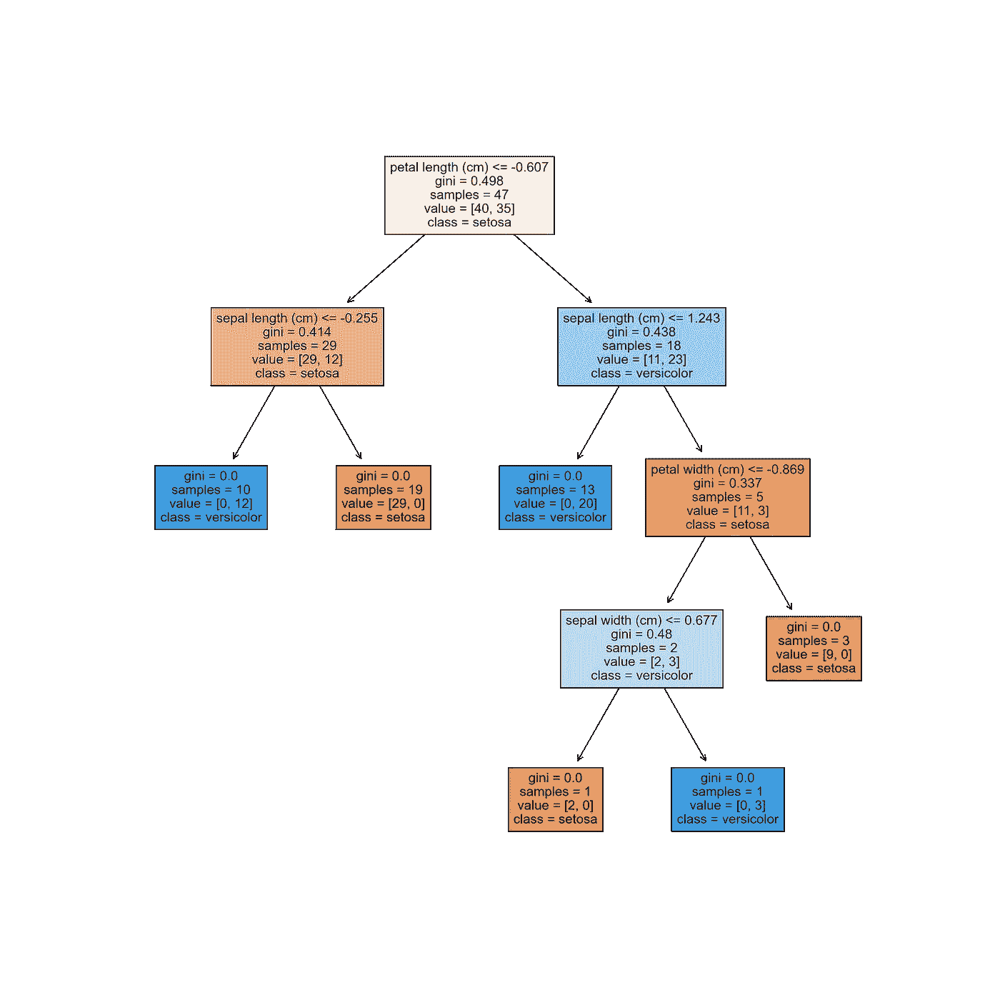
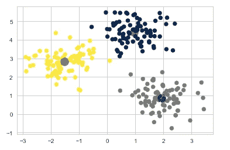

# 机器学习算法备忘单

> 原文：<https://towardsdatascience.com/machine-learning-algorithms-cheat-sheet-2f01d1d3aa37>

## 5 种常见算法的快速参考指南

凯勒·琼斯在 [Unsplash](https://unsplash.com/s/photos/choice?utm_source=unsplash&utm_medium=referral&utm_content=creditCopyText) 上拍摄的照片

机器学习的“ ***没有免费的午餐”*** 定理指出，没有单一的机器学习算法可以解决所有类型的机器学习问题。

机器学习任务可能会有很大差异，算法的选择将取决于数据的大小、维度和稀疏性等因素。目标变量、数据质量以及特征内部和特征与目标变量之间存在的相互作用和统计关系。

因此，不可能简单地选择一种算法用于“一刀切”的方法。不同的算法将更适合特定的任务，这取决于它们的具体工作方式。数据科学家通常会选择最终使用的算法，首先确定适合特定问题的算法子集，然后对这些算法进行实验以找到最佳选择。

在本文中，我将提供一个快速参考指南，介绍机器学习中最常用的五种算法。这将介绍算法的内部工作原理，以及使每个算法更适合某些任务的考虑因素。

这将包括对线性回归、逻辑回归、随机森林、XGBoost 和 K-means 的简要介绍。对于每个算法，我将涵盖以下内容:

1.  **算法如何工作。**
2.  **一个示例代码实现。**
3.  **在适当情况下使用算法的指南。**
4.  **优缺点。**

# 1.线性回归

线性回归是一种受监督的机器学习算法，用于预测连续的目标变量。对于简单的线性回归，其中有一个**自变量**(特征)和一个**因变量**(目标)，该算法可由以下等式表示。

> y = a + bX

其中 **y** 为因变量， **X** 为解释变量，**b**为直线的斜率， ***a*** 为截距。

简单的线性回归可视为散点图，其中 x 轴包含因变量，y 轴包含自变量。线性回归算法通过数据点绘制一条最佳拟合线，使预测输出和实际输出之间的差异最小化。

线性回归。作者图片

## 代码示例

## 应该在什么时候使用？

*   线性回归只能用于解决基于回归的问题。
*   因变量和自变量之间必须有线性关系。
*   残差必须形成正态分布。
*   特征之间必须没有相关性。
*   该算法假设训练数据是随机采样的。
*   最适合基于回归的问题，其中数据中的关系既线性又简单。

## 优势

*   高度可解释性和快速训练。
*   在线性可分数据上表现非常好。

## 不足之处

*   对异常值不稳健。
*   非常简单，因此它不能很好地模拟现实世界数据中的复杂性。
*   这种算法也容易过拟合。

# 2.逻辑回归

逻辑回归本质上是为适应分类问题而建模的线性回归。逻辑回归不是拟合直线，而是应用[**逻辑函数**](https://en.wikipedia.org/wiki/Logistic_function) 来压缩 0 和 1 之间的线性方程的输出。结果是穿过数据点的 S 形曲线而不是直线，如下图所示。

逻辑回归曲线。作者图片

选择介于 0 和 1 之间的阈值来分隔类别，通常为 0.5。本质上，我们在 0.5 处画一条横过 S 曲线的水平线。这条线以上的任何数据点都属于 1 类，线以下的任何数据点都属于 0 类。

## 代码示例

## 应该在什么时候使用？

*   这种算法只能用于解决分类问题。
*   特征和目标变量之间必须有线性关系。
*   观察值的数量必须大于特征的数量。
*   最适合于数据关系既线性又简单的分类问题。

## 优势

*   与线性回归一样，该算法可解释性强，训练速度快。
*   它在线性可分数据上表现非常好。

## 不足之处

*   容易过度拟合。
*   与线性回归一样，它不能很好地模拟复杂的关系。

# 3.随机森林

随机森林算法构建了一个**决策树**的“森林”。森林中的每棵树都根据一组给定的特征生成一个预测。一旦生成了所有预测，就进行多数投票，并且最常预测的类别形成最终预测。

随机森林生成的单一决策树。作者图片

决策树是一种非常直观的算法。它有一个类似流程图的结构，包含一系列代表测试的节点。每个测试的结果导致一个分裂，并且一个或多个**叶节点**被创建，直到实现最终预测。超参数决定了树增长的深度和使用的节点分裂函数。

随机森林算法遵循以下步骤序列:

1.  根据森林中树木的数量，将训练数据集随机分成多个样本。树的数量通过超参数设置。
2.  使用其中一个数据子集并行训练决策树。
3.  评估所有树的输出，并将最常发生的预测作为最终结果。

## 代码示例

## 应该在什么时候使用？

*   该算法可用于解决基于分类和回归的问题。
*   由于该算法固有地执行特征选择，因此它特别适合于具有高维数的大型数据集。

## 优势

*   它可以模拟线性和非线性关系。
*   它对异常值不敏感。
*   随机森林能够在包含缺失数据的数据集上运行良好。

## 不足之处

*   随机森林很容易过度适应，虽然这可以通过**修剪**得到一定程度的缓解。
*   它不像线性回归和逻辑回归那样具有可解释性，尽管可以提取特征重要性来提供某种程度的可解释性。

# 4.XGBoost

XGBoost 是一种基于**梯度推进**决策树的算法。它与 Random Forest 相似，都是构建一个决策树集合，但 XGBoost 不是并行训练模型，而是顺序训练模型。每个决策树从先前模型产生的错误中学习。这种顺序训练模型的技术被称为**增强**。

XGBoost 中的梯度指的是使用**弱学习者**的特定类型的增强。弱学习者是非常简单的模型，仅仅比随机机会表现得更好。该算法从一个初始的弱学习者开始。每个随后的模型都以先前决策树产生的错误为目标。这种情况会持续下去，直到无法取得进一步的改进，并最终形成一个强学习者模型。

## 代码示例

## 应该在什么时候使用？

*   它可用于解决基于分类和回归的问题。
*   XGBoost 通常被认为是对结构化数据进行监督学习的最佳和最灵活的算法之一，因此适用于广泛的数据集和问题类型。

## 优势

*   XGboost 非常灵活，在小型和大型数据集上都能很好地工作。
*   与其他复杂算法相比，该算法计算效率高，因此训练模型更快。

## 不足之处

*   它不能很好地处理非常稀疏或者非结构化的数据。
*   它被认为是一个黑盒模型，比其他一些算法更难解释。
*   由于模型从其前辈的错误中学习的机制，XGBoost 可能对异常值很敏感。

# 5.k 表示

K-means 是最流行的聚类算法之一，这是一种无监督的机器学习形式，旨在找到训练数据集中的相似示例组。

该算法首先初始化随机聚类质心。然后，对于每个数据点，通常使用距离度量 [**欧几里德**](https://en.wikipedia.org/wiki/Euclidean_distance) 距离或 [**余弦**](https://en.wikipedia.org/wiki/Cosine_similarity) 相似度来将其分配给最近的质心。一旦分配了所有数据点，质心就移动到所分配数据点的平均值。重复这些步骤，直到质心分配停止变化。

k-意味着具有可视化质心的簇。作者图片

## 代码示例

## 应该在什么时候使用？

*   K-means 只适合于非监督聚类。
*   对于这类问题，它通常被认为是一个很好的全能算法。

## 优势

*   这是一个实现起来相对简单的算法。
*   它可以用于大型数据集。
*   由此产生的聚类很容易解释。

## 不足之处

*   k 均值对异常值很敏感。
*   该算法没有找到最佳的聚类数。这必须在实现之前通过其他技术来确定。
*   聚类的结果不一致。如果 K-means 在数据集上运行多次，每次都会产生不同的结果。

本文涵盖的算法是机器学习中最广泛使用的一些算法。还有许多算法可供使用，每一种算法都有自己适合特定问题的地方。正如本文开头提到的，目前没有一种算法可以解决所有问题，尽管 XGBoost 是解决结构化数据问题的最接近的算法。

这一介绍将提供一些关于数据科学家如何以及为什么选择一种算法而不是另一种算法的见解。下面是每种算法对特定类型问题的适用性的简要总结:

*   **线性回归:**最适合解决基于回归的数据集问题，其中存在线性关系，且关系相对简单。
*   **逻辑回归:**最适合解决数据线性可分、数据集维度低的分类问题。
*   **随机森林:**最适合具有复杂关系的大型高维数据集。
*   **XGBoost:** 适用于广泛的结构化数据集和问题。与随机森林相比，计算效率更高。
*   **K-means:** 最适合解决无监督聚类问题。

感谢阅读！

# 承认

***iris 数据集用于生成本文中的决策树图:*** *该数据集用于 r . a . Fisher 1936 年的经典论文，* [*分类问题中多重测量的使用*](http://rcs.chemometrics.ru/Tutorials/classification/Fisher.pdf) *。它是在 CCO 1.0 通用版(CCO 1)许可下使用的。*