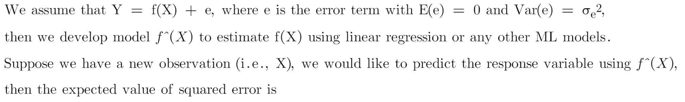
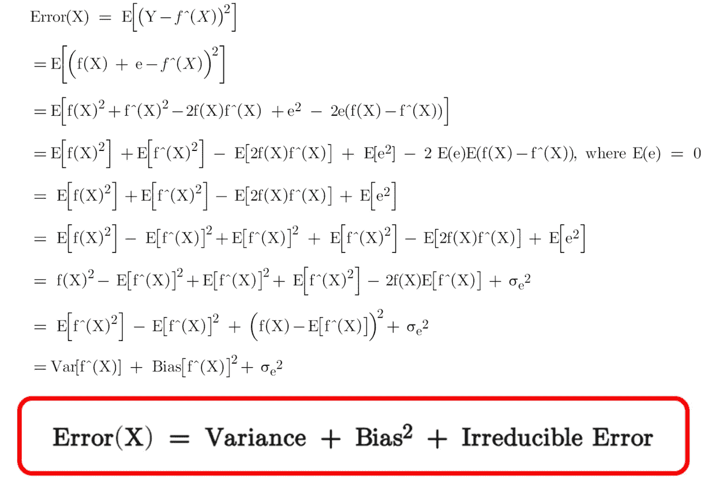
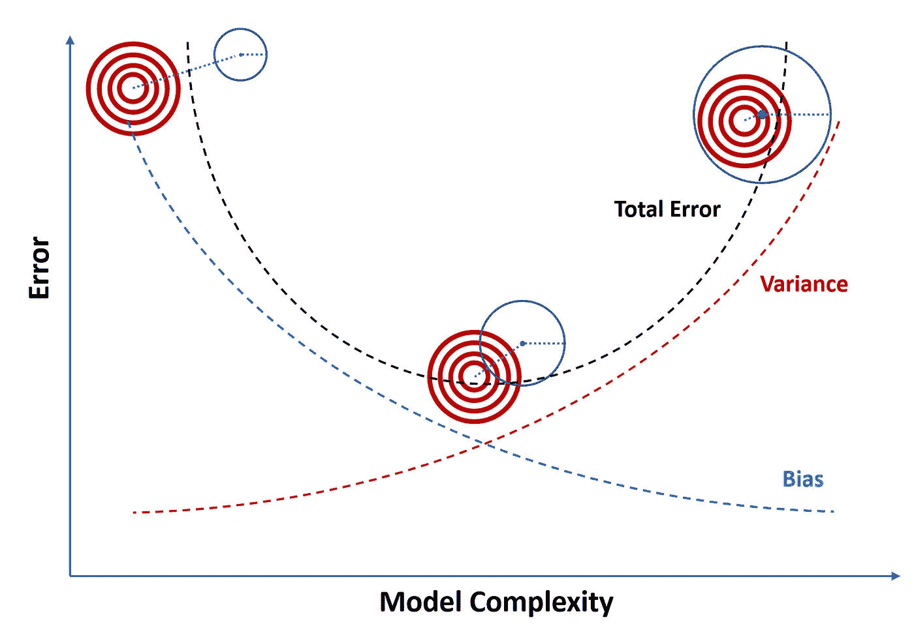
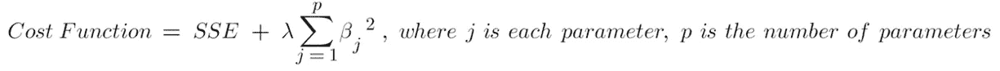
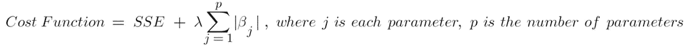
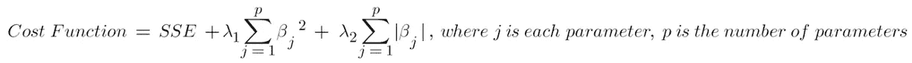
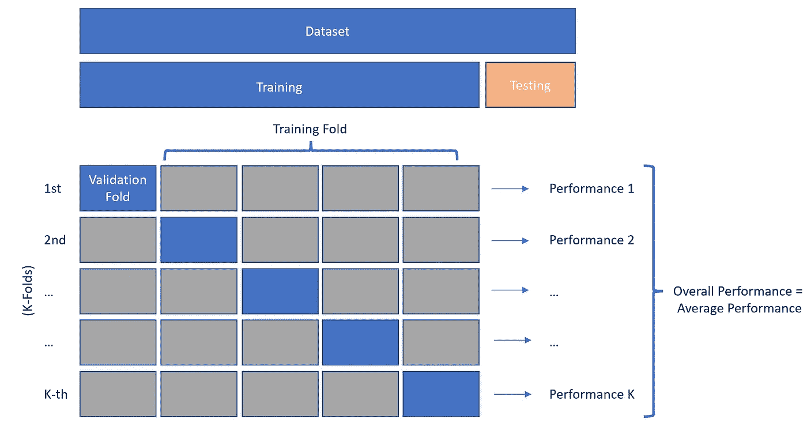

# 什么是正则化:偏差-方差权衡

> 原文：<https://towardsdatascience.com/machine-learning-bias-variance-tradeoff-and-regularization-94846f945131>

## 用看不见的数据改进预测的良好实践

马库斯·温克勒在 [Unsplash](https://unsplash.com?utm_source=medium&utm_medium=referral) 上的照片

当我们谈论使用机器学习模型的**预测**时，理解预测误差(即**偏差**和**方差**)很重要。任何机器学习模型的目标都是找到一个最小化对**看不见的**数据的预测误差的模型。在模型最小化偏差和方差之间的预测误差的能力上有一个**权衡**。理解这些概念将有助于我们解决**过拟合**和**欠拟合**的问题。

图 1(作者图片)

## 什么是偏见？

当我们开发一个模型时，我们可以用训练好的模型对目标进行单独的预测。例如，贝叶斯线性回归可以使用遵循多元高斯分布的所有可能的回归权重进行重复预测。因此，对于给定的模型，我们可能有一组不同的预测值。

在图 1 中，我们假设红色目标的中心是真实的输出值。使用训练好的模型，我们可以在蓝色圆圈内生成预测，因此蓝色圆圈的中心代表平均预测值。

> **偏差**是我们模型的**平均预测值**和我们试图预测的**真实值**之间的差异。

偏差告诉我们训练模型预测真实目标的**能力**。偏差越低，给定的训练模型就越有能力。

## 什么是方差？

在图 1 中，假设蓝色圆圈的半径代表预测值的方差。

> **方差**是对训练模型给定输入的预测值的**可变性**(又名**分布**)的度量。

方差越低，经过训练的模型做出的预测就越精确。

## 什么是不可约误差？

除了偏差和方差之外，第三种误差称为不可约误差。

> **不可约误差**代表数据中的**噪声**无法被训练好的模型解释。不管训练出来的模型有多好，它总是存在的。

## 预测误差是方差、偏差和不可约误差的总和

让我们从数学上证明**。**

********

## **什么是不合身？**

**当模型无法捕捉和概括数据的潜在趋势时，就会出现欠拟合。直觉上，它与数据拟合得不够好，因此，它会在**训练**和**测试**数据上产生很高的误差(即**高偏差**)。**

**不适合的原因可能是**

*   **缺乏开发模型的数据(例如，少量的训练数据，关键解释变量不可用)。**
*   **基础模型不能捕捉数据中的模式(例如，使用具有非线性数据的线性模型)**

## **什么是过度拟合？**

**另一方面，当模型太好地拟合训练并且它**开始对训练数据的噪声**建模时，发生过拟合。它在训练数据中具有低误差(即**低偏差**，但在测试数据中具有高误差(即**高方差**)**

**过度拟合的原因可能是**

*   **由于模型过于复杂，包括**太多变量**或包括**有问题的变量**，如高阶多项式变量、无关变量、高度相关的变量或同时受响应变量影响的变量。**
*   ****模型的过度训练**。例如，在没有显式停止标准的情况下训练决策树容易过度拟合。**

## **偏差-方差权衡**

**理想情况下，我们希望减少模型的偏差和方差。然而，这是非常困难的，有时是不可能实现的。当您试图减少定型数据的预测误差时，测试数据的预测误差可能会增加。偏差和方差经常朝着相反的方向移动。**

**当使用训练数据开发模型时，很容易拟合复杂的模型来进行偏差较小的预测，但由于测试数据的预测方差较高，可能不会产生最佳结果。**

> **或者，我们可以探索偏差和方差之间的权衡，在这种情况下，**接受一些偏差以减少方差可能会更好**。因此，我们对未知数据的预测误差会更小。**

****

**图 2(作者图片)**

# **什么是正规化？**

**正则化是一种实现偏差和方差的折衷的概念，有助于减少预测误差。先说一些常用的正则化技术。**

## ****类型 1:修改成本函数****

**在线性回归模型中，我们可以改变 [**代价函数**](/linear-regression-vs-logistic-regression-ols-maximum-likelihood-estimation-gradient-descent-bcfac2c7b8e4) 来构建实现正则化的不同模型。**

**例如，在一个**岭回归**模型中，我们将成本函数修改为**

****

**在一个**拉索回归**模型中，我们将成本函数修改为**

****

**在**弹性网回归**模型中，我们将成本函数修改为**

****

**线性回归的这三个变量与正则化相关联，正则化会损害模型的灵活性和复杂性，以防止过度拟合的风险。**

**这里λ是一个超参数，它决定了模型的灵活性将受到多大的惩罚。λ的值越高，对每个特征的权重施加的约束就越多，因此，它可以防止权重变得太大，从而避免过度拟合。然而，如果λ的值太高，可能会产生欠拟合的问题，因为关键解释变量的权重变得太小，它不能准确地解释响应变量。**

**我们可以使用 **K 倍交叉验证**找到λ的最佳值(我们将在后面介绍)。**

## **类型 2: K 倍交叉验证**

**K-Fold 交叉验证是另一种用于训练机器学习模型的流行工具。这种方法的思想很简单，我们从观测数据中创建多组训练数据，然后训练模型并基于验证数据评估模型，这类似于在看不见的数据上评估模型。它包括以下步骤，**

****

**图 3(作者图片)**

**步骤 1:我们将观察到的数据拆分成训练数据和测试数据(例如，1:9 拆分，有时需要分层)。然后，我们将训练数据随机放入训练文件夹和验证文件夹。例如，在 5 重交叉验证中，我们将有 5 组训练数据和验证数据。**

**步骤 2:在每组中，我们使用来自训练文件夹的数据训练模型，并在验证文件夹中评估模型性能。使用验证折叠评估模型模拟了 ML 模型的实际应用(即样本外预测或对未知数据的预测)。然后我们得到 K 个性能结果。**

**步骤 3:对于给定的训练模型，我们通过平均 K 个性能结果来计算总体性能分数。**

**步骤 4:挑选具有最佳总体性能得分的训练模型，并将该模型应用于测试数据以计算性能得分。**

**测试数据中的性能分数应该接近整体性能分数。如果情况更糟，那么我们需要更深入地研究数据，调查差异。**

## **类型 3:修改最大似然算法**

**另一种避免过度拟合的方法是简单地改变机器学习算法。例如，一棵过度生长的决策树容易过度拟合。为了解决这个问题，我们可以使用一个具有预定义最大树深度的随机森林。在训练神经网络的情况下，我们可以应用 dropout 方法来确保模型可以用所选节点的随机子集来概括模式。**

## **最终注释**

**为了训练一个预测误差最小的机器学习模型，我们需要确保我们探索了偏差和方差之间的权衡。正则化是我们在开发模型时需要考虑的一个重要步骤。**

**如果你对**线性回归**和**因果推断**感兴趣，这里有一些相关的帖子可以浏览。**

*   **[**因果推断:计量经济模型 vs. A/B 检验**](/causal-inference-econometric-models-vs-a-b-testing-190781fe82c5)**
*   **[**线性回归与逻辑回归:OLS、最大似然估计、梯度下降**](/linear-regression-vs-logistic-regression-ols-maximum-likelihood-estimation-gradient-descent-bcfac2c7b8e4)**
*   **[**OLS 线性回归:无偏、一致、蓝色、最佳(有效)估计量**](/linear-regression-with-ols-unbiased-consistent-blue-best-efficient-estimator-359a859f757e)**
*   **[**线性回归因果推断:省略变量和无关变量**](/understand-bias-and-variance-in-causal-inference-with-linear-regression-a02e0a9622bc)**
*   **[**用线性回归进行因果推断:内生性**](/causal-inference-with-linear-regression-endogeneity-9d9492663bac)**
*   **[**与 OLS 的线性回归:异方差和自相关**](/linear-regression-with-ols-heteroskedasticity-and-autocorrelation-c12f1f65c13)**

# **感谢您的阅读！！！**

**如果你喜欢这篇文章，并且想**请我喝杯咖啡，请[点击这里](https://ko-fi.com/aaronzhu)。****

**您可以注册一个 [**会员**](https://aaron-zhu.medium.com/membership) 来解锁对我的文章的完全访问，并且可以无限制地访问介质上的所有内容。如果你想在我发表新文章时收到电子邮件通知，请订阅。**