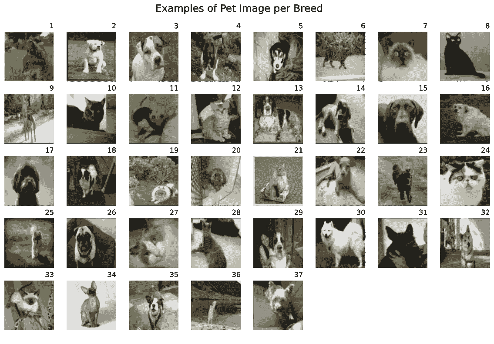
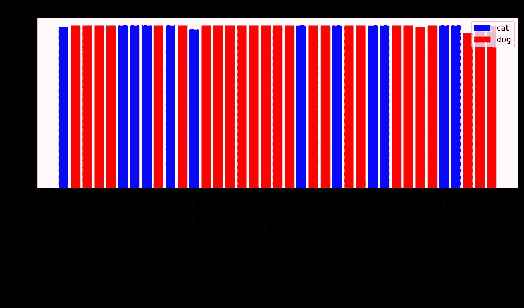
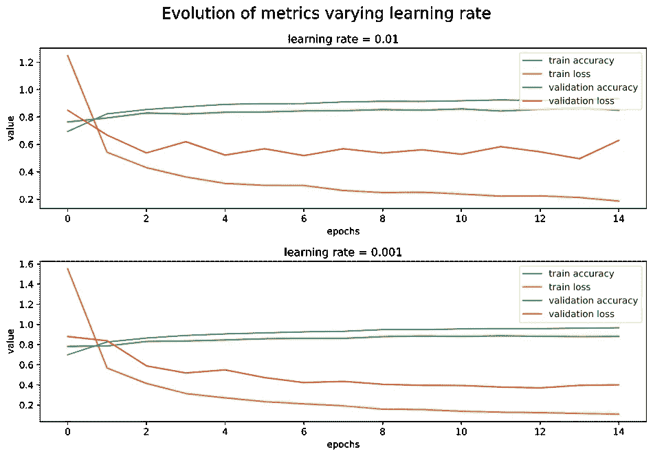
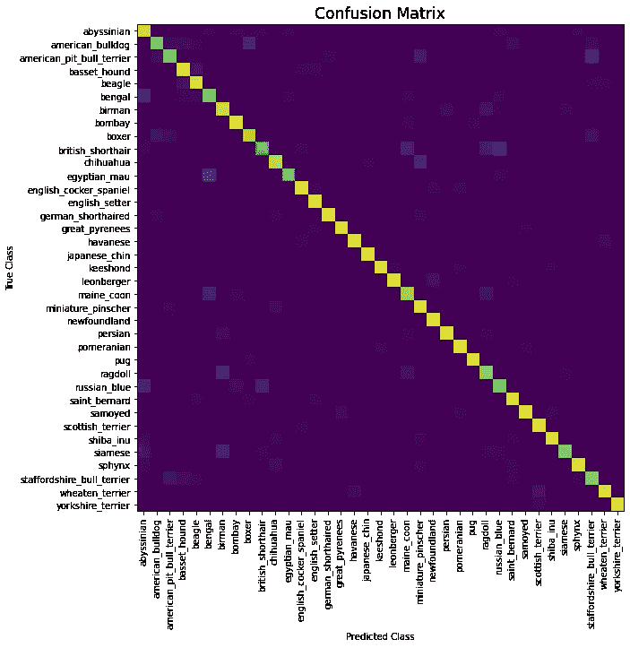
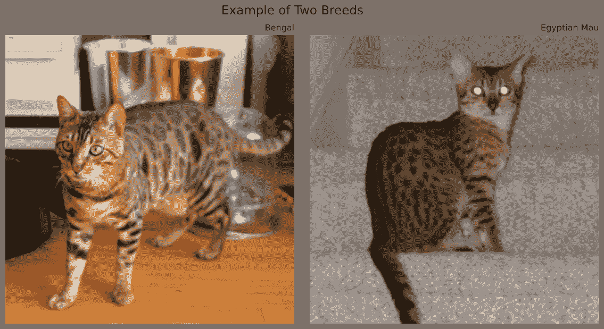
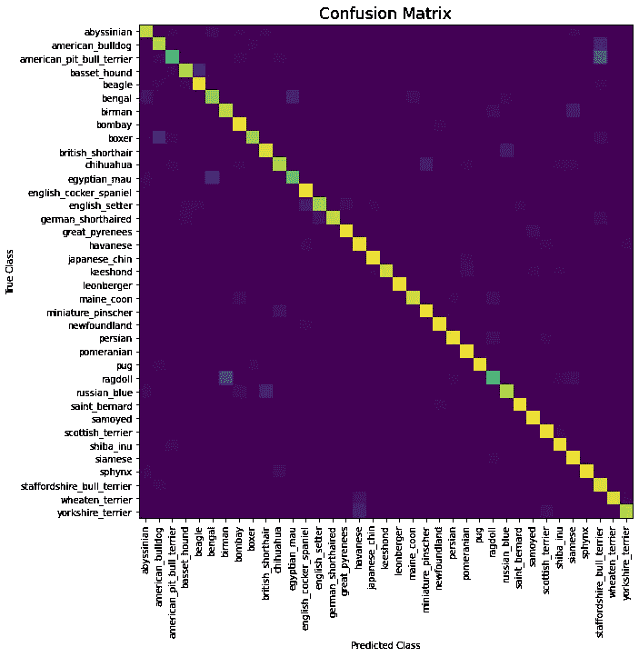

# 机器学习猫狗品种分类器

> 原文：<https://towardsdatascience.com/machine-learning-cats-and-dogs-breeds-classifier-b26a9df45000>

## [实践教程](https://towardsdatascience.com/tagged/hands-on-tutorials)

# 机器学习猫狗品种分类器

## 了解如何使用 Python 中的机器学习模型来创建猫狗品种分类器，以预测您宠物的品种

遇见卡罗莱娜(没错，是一个人的名字；不，不是我选的)——图片作者

谁不喜欢动物呢，对吧？就我个人而言，如果我能把它们放在我所有的项目中，我就能享受生活了。如果你有点像我，想探索机器学习技术，那么这个教程可能就是你正在寻找的。

# 我们要做什么？

在本教程中，我将向您展示如何获取一个充满可爱动物图像的数据集，使用一些黑魔法，最终得到一个甚至可以对您的个人宠物图片进行分类的模型。这个模型可以用在你的个人应用程序中，这样你就可以向你的朋友和家人展示你学到的很酷的东西。

这篇教程是基于我和同事 [Pedro Silva](https://www.linkedin.com/in/pedro-silva-3b41a3221/) 一起为大学课程做的一个项目。我们一起设法在测试集上创建了一个准确率为 92%的模型。也就是说，它正确地分类了未用于训练的数据集部分中 92%的图像。这不是一个糟糕的分数，但它可以被改进——我也将告诉你如何改进！

在我们开始之前，你应该知道这些技术在计算上非常昂贵，并且很可能需要很长时间来执行。但是不要因此而气馁！在等待的时候，你可以做很多事情，比如遛狗……或者喝杯咖啡，或者小睡一会儿。事实上，如果你想拖延，这是一个很好的借口；)

# 数据集

为了实现我们的目标，我们将使用 Kaggle 上的[猫狗品种分类牛津数据集](https://www.kaggle.com/zippyz/cats-and-dogs-breeds-classification-oxford-dataset)(可以根据知识共享署名-共享 4.0 国际许可证下载用于商业/研究目的)。这个数据集总共有 7384 张宠物的图片，可以分为 37 个品种(或者，在这个上下文中，**类**)。

数据集中的图像示例—数据集中的图像

这些图片都是非正式的宠物图片，就像我们通常在手机上看到的一样，这很重要，因为这意味着我们的模型将更加通用。否则，只有当照片具有某种特征或以特定方式拍摄时，它才能理解宠物品种。

我们需要验证的另一件事是每个类的图像分布。我们需要知道这一点，因为如果类别中的图像数量不完全相同，那么该模型就不太擅长预测某些品种。为了了解这种情况，让我们绘制一个图表，并开始分析数据集！

## 绘制数据集中每个类别的图片数量

首先，我们需要导入一些依赖项，并将所有图像文件名加载到一个列表中。我们发现有些图像打不开，所以我们把它们的文件名放在一个集合中，从一开始就把它们排除在外。

加载所有图像的名称

数据集包括一个文本文件，其中包含一些关于信息组织方式的信息。我们可以使用这些信息来填充 2 个字典:`info_by_name`和`info_by_id`。尽管该文件也给了我们关于图像数量的信息，但我决定不信任它，并在代码中对其进行计数。我知道这是可选的，我只是展示我是如何做的。

将相关数据保存到字典中，以便于访问

现在我们已经有了字典中提到的所有信息，我们可以继续绘制条形图。

用每个品种的图片分布绘制图表

并且输出应该如下！

每个品种图片分布的条形图—按作者分类的图片

正如我们所见，每个品种的图像数量变化不大，这很好！尽管猫和狗的图片数量差异很大，但这应该不是问题，因为分类器并不专注于确定图片是猫还是狗。

# 基本原则

现在我们已经看了数据，是时候考虑我们将要构建的基础了。因为这个问题被认为是细粒度图像分类的一个问题——它旨在区分具有非常相似特征的类别——经典的机器学习方法不会成功。

一般来说，在解决这类问题时，一个好的做法是从查看以前的类似作品开始。在研究这个问题时，我们发现一些作品特别有趣和有用:[“使用深度学习识别狗的品种”(z . rádully，C. Sulyok，Z. Vadászi 和 a . zlde)](https://ieeexplore.ieee.org/document/8524715)，[“了解你的狗品种:用深度学习识别狗的品种”(P. Borwarnginn，W. Kusakunniran，S. Karnjanapreechakorn，和
K. Thongkanchorn)](https://link.springer.com/article/10.1007/s11633-020-1261-0) 和[“狗分类成 12](http://noiselab.ucsd.edu/ECE228_2019/Reports/Report10.pdf)

普遍的看法是，卷积神经网络(CNN)对于涉及大量复杂数据的问题是最可行的，从这些数据中必须获得抽象特征，如形状和颜色，以获得准确的结果。我不会详细介绍什么是 CNN 在 Medium 上有很多关于它的文章——但我会在必要时给出一个概述。

## 迁移学习

许多被分析的文献提到**迁移学习**是一种好的方法，不仅可以提高模型的性能，还可以降低其训练的计算复杂度。

该技术包括:使用预先训练的模型作为起点；*冻结*这些图层，以避免在拟合阶段破坏它们已经拥有的信息；给它添加一些新的图层。

基本模型被用作理解图像分类任务中的共同特征的框架，例如形状和颜色。前提是这些特征对于每幅图像都是相似的，因此我们可以节省一些时间来重新使用它们之前计算的权重。另一方面，新层的目的是使模型适应新的更具体的特征，从而允许模型对我们新的和具体的数据集进行预测。

这甚至可以通过*解冻*先前训练好的模型的最后几层来改善，这个过程叫做**微调**。我们一会儿就来看看这个。

# 模型架构

由于在 **imagenet** 数据集上预训练的 **InceptionV3** 架构在文献中多次被提及，被认为是解决类似问题的迁移学习基础模型的良好架构，我们将使用它。

该架构由不同层的多种组合组成，包括**卷积层**、**批量归一化层、**和**池层**。这是一个非常深刻和复杂的网络，我不打算详述。

在基本模型的末尾，我们将添加 5 层:

*   **池层**:该层将直接与 InceptionV3 层的输出交互。通过应用将形成像素组的过滤器并对其应用操作，池化图层用于对输入进行缩减采样。在我们的例子中，使用了**平均池**，它计算那些像素组的平均值。
*   **密集层**:具有特定数量神经元的单一连接层——在我们的例子中是 256 个。选择的激活函数是 **ReLU** ，它简单地将任何负输入映射到 0，将任何正输入映射到自身。它被广泛使用，因为它是实际输入的线性函数，没有任何饱和风险。
*   **丢弃层**:其目的是根据正则化参数随机忽略前一层输出的一定百分比。这一层的目标是防止数据过度拟合。
*   **批量标准化层**:用于按顺序缩放输出，使其平均值为 0，标准差为 1。
*   **密集层**:这是输出层，全连接的一层，有 37 个神经元，每个对应我们的一个分类类。这里使用了 **SoftMax** 激活功能。与逻辑函数(如 **sigmoid** )相比，对于多分类问题，这是一个更好的激活函数。这是因为 SoftMax 输出一个概率向量，每个类对应一个值，使我们能够轻松理解哪些类具有更高的值，以及更大的概率是正确的。

我们还需要向我们的模型添加一个新的输入层，以正确的格式准备要传递给 InceptionV3 模型的图像。该图层直接与输入数据交互，并将接收到的每个值重新调整为-1 和 1 之间的值。

优化器选择为 **Adam** ，并实现随机梯度下降，其默认学习率为 0.001，我们将在稍后更改。**准确性**是我们将在培训期间用来评估模型性能的指标。

使用 **Keras** 库，很容易使用这个架构组装模型。

函数创建具有指定配置的模型

# 准备图像

为了让这些图像可以在模型中使用，我们必须对它们进行预处理。这包括将它们重新整形为(299，299，3)张量，因为这是 InceptionV3 模型输入的推荐形状。

一个常见的预处理任务是将图像的彩色图变为黑白。我们不打算这样做，因为颜色实际上是这个问题所必需的，因为它们对区分品种有特殊的重要性。此外，我们的模型需要一个三维输入。

这里我们将使用之前填充的`info_by_breed`字典来获取每张图片的品种标识符，这样我们就可以将图片数据保存在其 ID 中。

创建两个数组:一个包含正确格式的图像，另一个包含各自的 ID

现在我们有了数据，我们需要把它分成两大部分:训练和测试数据。为此，我们要做一个叫做 ***的分层拆分*** 。这意味着每一类中图像数量之间的比例在测试集中保持相等。

使用分层分离来分离训练和测试数据

# 超参数优化

尽管我们已经有了一个(希望)可行的模型，但是它的开发过程还没有结束！为了改进当前的设置，我们可以改变很多变量，以了解哪些变量可以产生最好的结果。我们将迅速探索改变**学习率**和**下降值**如何影响模型的能力。

如果您想立即测试这个模型，您可以向下滚动以了解如何。我建议您继续阅读本节，了解超参数优化的工作原理及其重要性，从我们如何发现某个配置是否适合我们的问题开始。

## k 倍交叉验证

K-Fold 交叉验证是一种众所周知的优化超参数的技术。这是一种将训练数据分为 K 部分(或**倍**)的技术。然后，该模型将在 K-1 个零件上进行训练，并在其余零件上进行验证。这要做 K 次，因为每个折叠都有机会扮演验证的角色。然后对结果进行平均。这试图解决所使用的验证数据不能很好地代表模型性能的问题。因为所有数据都间接用于验证，所以这种情况不会发生。

尽管最常见的折叠次数似乎是 5 次或 10 次，但我们决定只用 3 次，因为这个过程需要时间。由于时间限制，我们使用了 32 和 15 个时期的批量大小。我鼓励你尝试其他的价值观！

以下函数返回一个字典，其中包含一些指标随时间的变化:训练数据准确性和丢失，以及验证准确性和丢失。

在这里，您可能注意到了代码中的一些奇怪之处——函数`onehotencode_func`！其定义如下:

它有一个非常重要的目标，将我们在`y_train`数组中使用的品种 id 的十进制表示转换为另一种表示——只使用 1 和 0。每个值都将被转换成一个包含 37 个元素的数组，这些元素是我们的数据集中的类的数量，除了在与被转换的值相等的位置之外，都用 0 填充。例如，数字 0 将被转换为`[1,0,0,0,0,0,...]`，数字 3 将被转换为`[0,0,0,1,0,0,...]`。

还记得我们的**密集层**有 37 个神经元，每个神经元输出一个概率值吗？我们可以把每一个看作是数组中的一个元素。如果我们将最大值设置为 1，并将所有其他值设置为 0，我们将最终得到一个数字**一个** - **热编码**。该数字是模型对该输入的预测！

**学习率**

下一个要点中的代码对学习率的不同值执行这个过程，并将提到的度量保存在一个名为`lr`的字典中。

现在我们可以使用存储在这本字典中的数据来可视化信息。

输出应该是两个图表——每个学习率值一个图表，每个图表都有一条针对每个指标的曲线。

不同学习率指标的演变—图片由作者提供

可以清楚地看到较低的学习率如何有益于该模型。训练和验证的准确性显示出相似的曲线和值，甚至训练损失也是相似的，尽管随着学习率的降低，训练损失会有所降低。最大的区别在于验证损失。随着更大的学习速率，该曲线没有收敛到一个值，可能是因为由于更大的步长，它“跳跃”通过局部最小值。在这次经历中，我们得出结论，0.001 是所有比较中最好的学习。

**下降值**

改变其他变量的过程非常相似。下一个代码片段重复了相同的过程，但是更改了 dropout 值。

显示图表的代码与之前的非常相似！如果一切顺利，结果应该如下。

指标的演变改变了差值—按作者分类的图片

在这种情况下，差异似乎更不明显。在最后一个时期中，具有 0.25 的下降的训练精度仅好于 0.007，并且还具有大约 0.037 的较低训练损失。当参考验证数据时，精度比 0.35 的压降低 0.003，验证损失大 0.025。这里没有明确的“赢家”，但是我们将假设 0.35 是一个更好的值，因为在验证数据中结果稍微好一些。

# 模型评估

正如我们所划分的，训练集构成了总数据集的 30%,其对应于 2216 幅图像。既然我们已经发现了最佳超参数，我们终于可以用它来检查我们模型的准确性了。

首先，我们创建一个模型，并根据训练数据对其进行训练。我使用了 32 和 15 个时期的批量大小。然后，我们让它根据我们的测试数据进行预测，并将值从一次性编码转换为十进制值——预测品种的 ID，以便更好地可视化正在发生的事情。

现在有一些有趣的方法来直观显示模型预测图像的好坏。其中之一是混淆矩阵，这是理解模型预测错误的情况的一种非常好的方式。我们可以用下面的代码展示这个矩阵的热图表示。

这段代码应该会向我们展示一个如下图所示的图形。

混淆矩阵-作者图片

有趣的是，这个模型在预测埃及猫品种时遇到了一些麻烦。它经常预测品种孟加拉而不是它。当看这些图片时，就有可能明白为什么会发生这种情况，因为它们彼此相当接近，尽管有时它们有不同的皮毛颜色。然而，在绝大多数情况下，分类器能够预测正确的品种。

孟加拉猫和埃及猫图片示例-来自数据集的图片

# 微调基本模型

正如我之前所说的，在许多事情中，有一件事我们可以做，以提高模型性能，我想在这里探讨一下，这就是*解冻*预训练的 InceptionV3 模型的最后一些层。

有了一个已经根据我们的数据训练好的模型，我们现在可以*解冻*基础模型的一些层。在这种情况下，我们选择解冻基础模型层的最后三分之一。然后，该模型使用 0.0001 的非常低的学习率再训练 10 个时期。程序如下。

现在我们可以像以前一样重复同样的技术来评估我们新改进的模型。如果我们给出混淆矩阵的一个表示，我们应该得到一个这样的表示。

混淆矩阵-作者图片

很明显，这一次模型在区分孟加拉猫和埃及猫时没有那么多麻烦。我们甚至成功地将精确度、召回率、f1 分数和准确度提高到了 92%。

# 结论

这当然不是一篇短文，但是我真诚地希望你在这个过程中学到了一些东西。我们仍然可以做很多事情来改进这个模型，使它更加稳健。我把它作为家庭作业留给你:)你也可以在 GitHub 上点击查看 Jupyter 笔记本上的所有代码(以及更多)[！](https://github.com/immarianaas/cat-dog-breeds-classifier)

非常感谢您的阅读！请留下您的任何反馈意见。