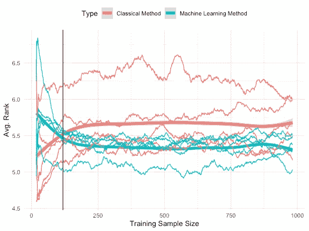

# 用于预测的机器学习:规模很重要

> 原文：<https://towardsdatascience.com/machine-learning-for-forecasting-size-matters-b5271ec784dc>

## 经典预测方法与机器学习的比较

米卡·鲍梅斯特在 [Unsplash](https://unsplash.com?utm_source=medium&utm_medium=referral) 上的照片

机器学习已经越来越多地应用于解决预测问题。ARIMA 或指数平滑等经典预测方法正在被 XGBoost、高斯过程或深度学习等机器学习回归算法所取代。然而，尽管受到越来越多的关注，但对机器学习方法的预测性能仍然存在疑虑。

Makridakis 是预测文献中最著名的名字之一，他最近提出的证据表明，对于单变量时间序列预测，经典方法系统地优于机器学习方法[1]。这包括 LSTM、多层感知器或高斯过程等算法。令人惊讶的是(或者不是，正如我们将看到的)，**其中大多数甚至无法胜过简单的季节性朴素模型—** 使用同一季节的最后观察值来预测未来观察值。后来，Makridakis 发表了另一篇文章，对需求预测进行了类似的比较[2]。在这项新的研究中，他们得出结论，机器学习方法提供了更好的需求预测性能。

第一项研究的结论是，需要找到机器学习预测模型相对于经典预测模型表现不佳的原因。

这是不是只是具体应用的问题，也就是机器学习对于需求预测表现很好但不全面？

# 尺寸很重要

照片由[安德鲁·詹金斯](https://unsplash.com/@anglue18?utm_source=medium&utm_medium=referral)在 [Unsplash](https://unsplash.com?utm_source=medium&utm_medium=referral) 上拍摄

我对此的看法是，第一项研究偏向于极小的时间序列。他们对一组超过 1000 个时间序列进行了实验，但是每个单独的时间序列都非常小。平均观察次数只有 118 次。在机器学习社区中，众所周知，当使用较大的训练集时，具有大量参数的模型往往比具有较少参数的模型表现得更好。这就是为什么深度学习只是在大型数据集变得可用之后才成为一件事情的原因之一——神经网络可以有许多参数，并且众所周知非常渴望数据。因此，很明显，对于机器学习标准来说，平均 118 个数据点可能不足以创建一个性能良好的模型。

在他们的第二项研究中，大部分系列包括了 280 多项观察。虽然对于机器学习标准来说，这仍然被认为是小规模的，但这比之前的研究中使用的要多得多。不幸的是，他们没有测试训练样本大小对结果的影响。

# 测试我的假设

我做了一些实验来测试在应用机器学习进行预测时训练样本大小很重要的假设。我尝试了五种经典方法(ARIMA、ETS、TBATS、Theta 和 Naive)和五种机器学习方法(高斯过程、M5、LASSO、随机森林和 MARS)来预测时间序列的下一个值，并通过增加训练样本量来检查它们的性能。

结果如下图 1 所示，图 1 显示了随着训练集的增长，每个模型的误差。x 轴表示训练样本大小，即有多少数据用于拟合预测模型。y 轴代表所有时间序列中每个模型的平均误差，使用交叉验证进行计算。以粗体显示的是两条平滑线，代表根据局部加权回归的每种方法的平滑误差。最后，点 118 处的垂直黑线代表 Makridakis 在实验中使用的平均样本大小。

图 1:随着训练样本量的增加，多个预测模型(分为经典和机器学习方法)的误差。图片作者。

结果显示了一个明显的趋势:**当只有少数观测值可用时，经典方法表现出更好的性能，从而证实了 Makridakis 的发现。然而，随着样本规模的增长，机器学习方法优于经典方法。**

你可以在这里查看我的文章。你可以用我在 Github 账户上分享的代码重现这些结果:

*   [https://github.com/vcerqueira/MLforForecasting](https://github.com/vcerqueira/MLforForecasting)

# 混合解决方案

自然，机器学习模型无法从小数据集进行归纳的证据可以被视为相对于传统方法的限制。特别是因为预测在宏观或微观经济领域中非常重要，在这些领域中，观测数据通常很少。在这种情况下，更简单的模型(参数更少)更可取。

尽管如此，机器学习模型可以在更大的时间序列中产生重要影响，例如传感器收集的时间序列。

也许更好的解决方案在于机器学习与经典模型的结合。这是广受欢迎的 M4 预测竞赛获胜者采用的方法。竞赛的获胜者 Slawek Smyl 使用指数平滑法对[进行去季节化](https://vcerq.medium.com/12-things-you-should-know-about-time-series-975a185f4eb2)并对序列进行归一化，同时深度神经网络(LSTM)完成外推工作。

# 外卖

*   机器学习方法在预测方面是有竞争力的，前提是它们有足够大的训练数据集；
*   当只有少量的观测值时，ARIMA 或指数平滑等经典方法是更可取的；
*   将指数平滑等经典方法与机器学习相结合，可以提高预测的准确性。

**参考文献**

[1] Makridakis，Spyros，Evangelos Spiliotis，和 Vassilios Assimakopoulos。"统计和机器学习预测方法:关注点和前进方向."*PloS one*13.3(2018):e 0194889。

[2] Spiliotis，Evangelos 等人，“每日 SKU 需求预测的统计和机器学习方法的比较”*运筹学* (2020)

[3]塞尔奎拉、熊伟、路易斯·托戈和卡洛斯·苏亚雷斯。"时间序列预测的机器学习与统计方法:大小问题." *arXiv 预印本 arXiv:1909.13316* (2019)。