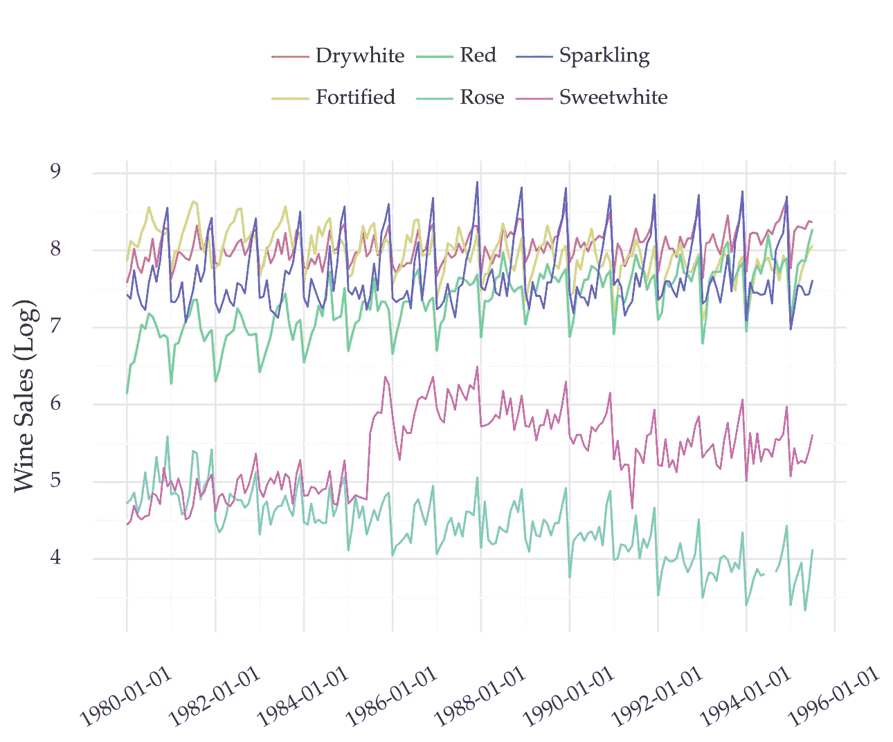
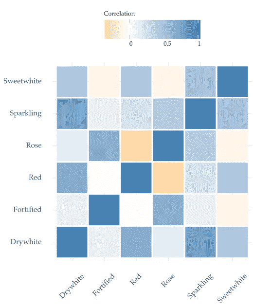
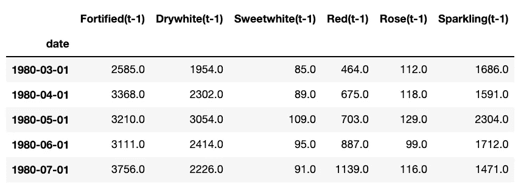
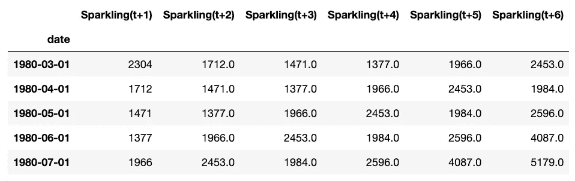
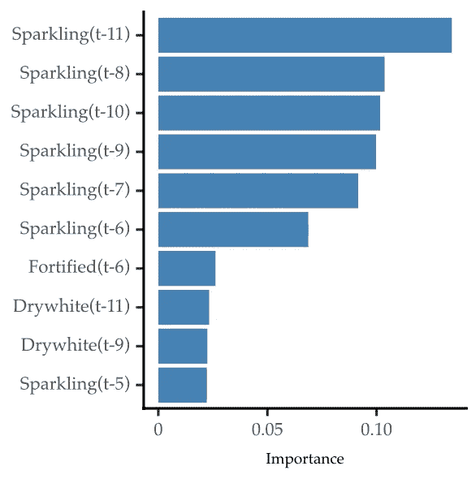

# 用于预测的机器学习:多变量时间序列的监督学习

> 原文：<https://towardsdatascience.com/machine-learning-for-forecasting-supervised-learning-with-multivariate-time-series-b5b5044fe068>

## 使用 Python 对自回归分布滞后模型的介绍。

图 1:关于每月葡萄酒销售的多元时间序列。此处为数据源[的链接。图片作者。](https://pkg.yangzhuoranyang.com/tsdl/)

在这里，您将学习如何使用多元时间序列创建预测模型。

这是我在[之前的帖子](/machine-learning-for-forecasting-transformations-and-feature-extraction-bbbea9de0ac2)的后续。在那里，我描述了单变量时间序列监督学习的主要步骤。

# 介绍

如果一个时间序列包含一个以上的变量，那么它就是多元的。

参见图 1 中的示例。它显示了不同类型的葡萄酒销售的每月多元时间序列。每种葡萄酒都是时间序列中的一个变量。

假设你想预测其中一个变量。说一下，气泡酒的销量(个人最喜欢:-)。你如何建立一个模型来做到这一点？

一种常见的方法是将该变量视为一个单变量时间序列。有很多方法可以用来模拟这些序列。例子包括 ARIMA，指数平滑，或脸书的先知。[自动回归机器学习方法越来越多地被使用](/machine-learning-for-forecasting-transformations-and-feature-extraction-bbbea9de0ac2)。

然而，其他变量可能包含关于起泡酒未来销售的重要线索。看看下面的相关矩阵。

图 2:不同类型葡萄酒之间的相关矩阵。图片作者。

起泡酒的销售(第二行)显示出与其他酒的销售有相当的相关性。

因此，尝试将这些变量包含在模型中可能是个好主意。

我们可以用一种叫做**自回归分布滞后(ARDL)** 的方法来实现。

# **自回归分布滞后**

## 单变量时间序列的自回归

顾名思义，ARDL 模型依赖于自回归。

自回归是大多数单变量时间序列模型的支柱。它分两步工作。

首先，我们将(单变量)时间序列从值序列转换为矩阵。我们用延时嵌入的方法做到这一点。尽管名字很花哨，但这种方法非常简单。这个想法是根据每个值之前的最近值来为每个值建模。[查看我之前的帖子，了解详细的解释和实现](/machine-learning-for-forecasting-transformations-and-feature-extraction-bbbea9de0ac2)。

然后，我们建立一个回归模型。未来值代表目标变量。[解释变量是过去的最近值](/machine-learning-for-forecasting-transformations-and-feature-extraction-bbbea9de0ac2)。

## 多元案例

对于多元时间序列来说，这个想法是相似的。但是，您也将其他变量的过去值添加到解释变量中。这导致了被称为**自回归分布滞后的方法。***分布式滞后*名称是指使用额外变量的滞后。

把这些放在一起。时间序列中一个变量的未来值取决于它自己的滞后和其他变量的滞后。

让我们把这个方法编码清楚。

# 把手放在某物或者某人身上

多元时间序列通常指许多相关产品的销售数据。我们将以葡萄酒销售时间序列为例。可以从[这里](https://rdrr.io/cran/Rssa/man/AustralianWine.html)或者[这里](https://pkg.yangzhuoranyang.com/tsdl/)得到。然而，ARDL 的方法也适用于零售以外的其他领域。

## 转变时间序列

我们首先使用下面的脚本转换时间序列。

我们将函数[*time _ delay _ embedding*](/machine-learning-for-forecasting-transformations-and-feature-extraction-bbbea9de0ac2)*应用于时间序列中的每个变量(第 18–22 行)。第 23 行的结果被连接成一个 pandas 数据帧。*

*解释变量( *X* )是每个时间步长上每个变量的最后 12 个已知值(第 29 行)。以下是滞后 t-1 的情况(为简明起见，省略了其他滞后):*

**

*滞后 t-1 时的解释变量样本。图片作者。*

*第 30 行定义了目标变量。这些指的是起泡酒销售的未来 6 个价值:*

**

*目标变量的样本。图片作者。*

## *建立模型*

*准备好数据后，您就可以构建模型了。下面，我使用一个随机森林应用一个简单的训练和测试周期。*

*拟合模型后(第 11 行)，我们得到测试集中的预测(第 14 行)。该模型的平均绝对误差为 288.13。*

# *选择滞后的数量*

**

*米凯尔·克里斯滕森在 [Unsplash](https://unsplash.com?utm_source=medium&utm_medium=referral) 拍摄的照片*

*我们使用每个变量的 12 个滞后作为解释变量。这在函数 *time_delay_embedding 的参数 *n_lags* 中定义。**

*应该如何设置这个参数的值？*

*很难说应该包括多少个值。这取决于输入数据和具体变量。*

*一个简单的方法是使用特征选择。首先，从大量的值开始。然后根据重要性分数或预测性能减少这个数字。*

*这是这个过程的一个简化版本。根据随机森林的重要性分数选择前 10 个特征。然后，重复训练和测试循环。*

*前 10 个特征显示出比所有原始预测器更好的预测性能。以下是这些功能的重要性:*

**

*前 10 个特征的重要性分数。作者图片*

*正如所料，目标变量(闪光)的滞后是最重要的。但是，其他变量的一些滞后也是相关的。*

# *ARDL 的延伸*

## *多目标变量*

*我们旨在预测一个单一变量(起泡酒)。如果我们有兴趣预测几个呢？*

*这将导致一种称为向量自回归(VAR)的方法。*

*像在 ARDL 一样，每个变量都是基于其滞后和其他变量的滞后来建模的。当你想预测许多变量，而不仅仅是一个变量时，使用 VAR。*

## *与全球预测模型的关系*

*值得注意的是，ARDL 并不等同于[全球预测模型](https://medium.com/towards-data-science/introduction-to-global-forecasting-models-3ca8e69a6524)。*

*在 ARDL 的情况下，每个变量的信息被添加到解释变量中。变量的数量通常很少，并且大小相同。*

*全球预测模型汇集了许多时间序列的历史观测数据。一个模型符合这些观察结果。因此，每个新的系列都作为新的观察值添加进来。此外，全球预测模型通常涉及多达数千个时间序列。在[的上一篇文章](https://medium.com/towards-data-science/introduction-to-global-forecasting-models-3ca8e69a6524)中，我描述了全球预测模型是如何运作的。这些是越来越多地用于预测的方法。*

# *外卖*

*   *多元时间序列包含两个或更多的变量；*
*   *ARDL 方法可用于多变量时间序列的监督学习；*
*   *使用特征选择策略优化滞后的数量。*
*   *如果要预测多个变量，请使用 VAR 方法。*

*感谢阅读，下一个故事再见！*

## *参考*

*[1] Rob Hyndman 和 Yangzhuoran Yang (2018)。时间序列数据库。https://pkg.yangzhuoranyang.com/tsdl/的*