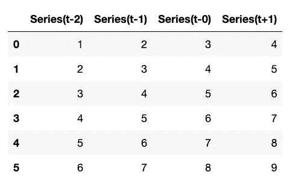
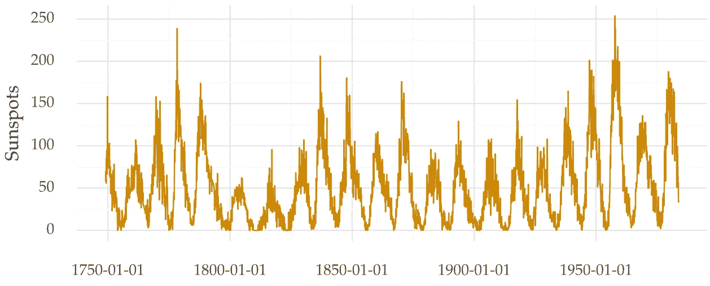
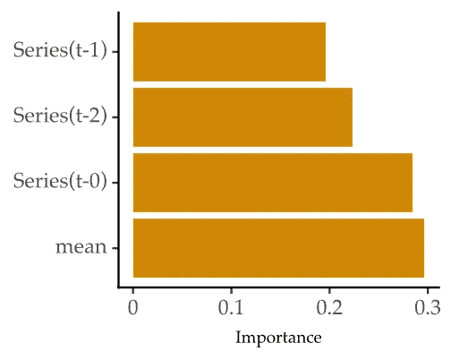

# 用于预测的机器学习:转换和特征提取

> 原文：<https://towardsdatascience.com/machine-learning-for-forecasting-transformations-and-feature-extraction-bbbea9de0ac2>

## 时间序列的监督学习。如何使用 Python 创建单变量预测模型

亚当·米格尔斯基在 [Unsplash](https://unsplash.com?utm_source=medium&utm_medium=referral) 上的照片

在本文中，您将学习使用 Python 对时间序列应用监督学习。

这包括两件事:

*   将时间序列从序列转换成表格格式；
*   基于汇总统计信息添加新功能。

# 介绍

预测是数据科学中研究最多的问题之一。目标是预测时间序列的未来值。

准确的预测对决策者来说是非常宝贵的。它们减少了未来的不确定性，从而改进了行动计划。

传统的预测方法包括 ARIMA 或指数平滑法。但是，[机器学习回归方法越来越多地被用来解决这个问题](/machine-learning-for-forecasting-size-matters-b5271ec784dc)。

机器学习方法将任务构建为监督学习。目标是基于历史数据创建一个模型。然而，还不清楚如何使用一系列值作为输入来训练模型。

事实证明，有一个巧妙的转变让我们可以做到这一点。

# 延时嵌入

模型被训练以导出观察和那些观察的结果之间的模式。

我们如何处理时间序列呢？

时间序列的值可以被认为是它之前的最近值的结果。该值作为目标变量。过去最近的值被用作解释变量。

这种过程将序列从一系列值转变为表格格式。这个变换叫做延时嵌入，是**自回归**的关键。

这里有一个 Python 函数来完成:

以下是将该函数应用于从 1 到 9 的序列时的数据集:

作者图片

以第一行为例。目标是预测数字 4(列系列(t+1))。解释变量是它之前的过去 3 个值:3、2 和 1。

延时嵌入有很强的理论基础。详情可查阅参考文献[1]。嵌入定理假定时间序列在变换前后是等价的。

## 完整示例

让我们编写一个完整的例子。我们将使用太阳黑子时间序列。该数据集可在 *pmdarima* 库中获得。它看起来是这样的:

太阳黑子时间序列。作者图片

下面是如何转换时间序列和训练自回归模型的示例。

在每一步中查看更多的上下文注释。

## 滞后次数和预测范围

转换时间序列需要指定滞后的数量。也就是我们要用多少最近的过去值来预测下一个点。

对此有一些处方。例如，检查部分自相关并确定它在哪里是显著的。您还可以使用交叉验证来优化该参数。

另一个参数是预测范围。这是您想要预测的未来步数。如果该值为 1，则该问题被称为单步提前预测。否则，[多步提前预测](/6-methods-for-multi-step-forecasting-823cbde4127a)。

值得一提的是，转换并没有取代其他预处理步骤。

您仍然需要考虑趋势和季节因素，并在需要时删除它们。

# 特征抽出

由 [Pratiksha Mohanty](https://unsplash.com/@pratiksha_mohanty?utm_source=medium&utm_medium=referral) 在 [Unsplash](https://unsplash.com?utm_source=medium&utm_medium=referral) 上拍摄的照片

自回归方法背后有一个基本假设。过去的滞后包含了足够多的关于系列将如何发展的信息。

然而，你可以从中获得更多的信息。

在机器学习中，特征工程是建立精确模型的关键部分。这也可以用于预测问题。

我们可以用统计数据总结最近的数值。这些统计数据丰富了时间序列的表示。希望这能转化为更好的预测性能。

例如，过去几个值的平均值可能很有用。它给出了级数在每个点的平滑指标。

这里有一个例子。我重复了上面的代码，但是添加了一个特性工程步骤(第 20–22 行)。

在第 21 行和第 22 行，我添加了滞后的平均值作为解释变量。这使得预测性能略有提高。

下面是功能重要性的样子:

作者图片

均值特征是最重要的特征。

在这个例子中，我添加了一个特性。但是，你只受到你的想象力的限制。

您可以测试其他几个汇总统计数据，并检查它们是否改进了模型。

# 外卖食品

*   使用时间延迟嵌入将时间序列转换为矩阵
*   时间序列中的值是根据它们过去的滞后时间建模的(自动回归)
*   用部分自相关分析或交叉验证选择滞后数
*   使用汇总统计从过去的滞后中提取更多特征

感谢阅读，下一个故事再见！

## 你可能想读的以前的故事

  

## 参考

[1]塔肯斯，芙罗莉丝。"探测湍流中的奇怪吸引子."*动力系统和湍流，沃里克 1980* 。施普林格，柏林，海德堡，1981。366–381.

[2] Bontempi、Gianluca、Souhaib Ben Taieb 和 Yann-al Le bor gne。"时间序列预测的机器学习策略."*欧洲商业智能暑期学校*。施普林格，柏林，海德堡，2012。