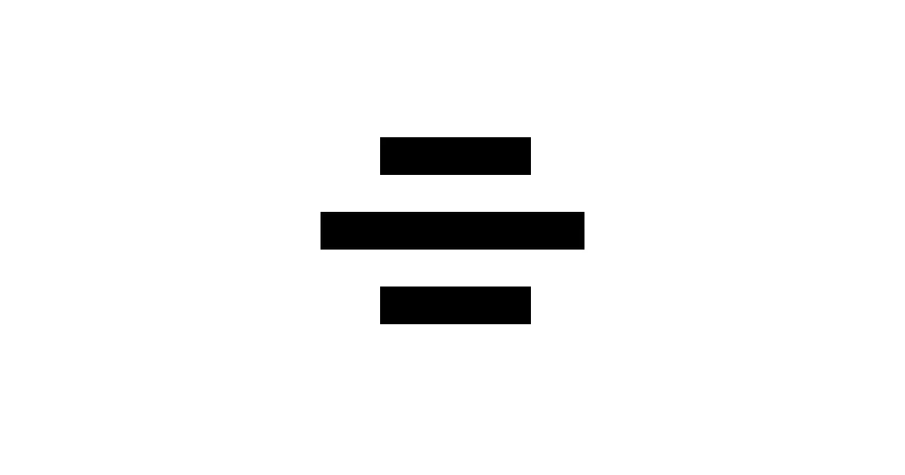
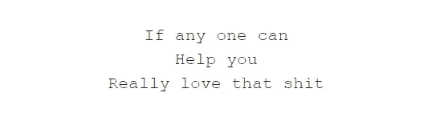
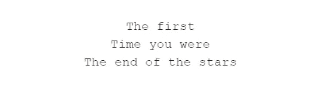
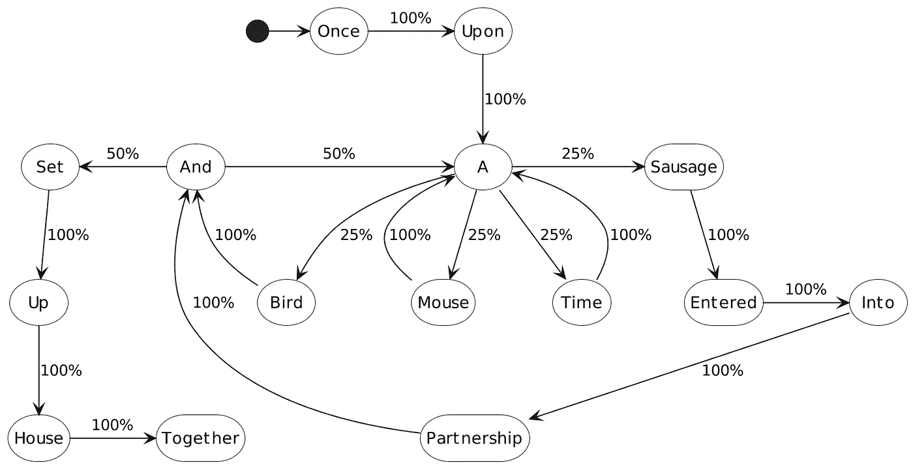
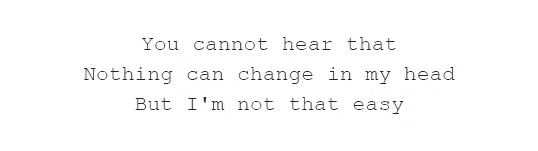

# 区块链上的机器学习

> 原文：<https://towardsdatascience.com/machine-learning-haiku-generator-on-blockchain-f6e5a801ca25>

## 我如何建立一个运行在区块链上的俳句生成器



在这篇文章中，我将描述我创建的 Bitku，一个完全在区块链上运行的俳句生成器。我开始的目标是创造真正区块链本土的艺术——在链条上产生和储存的艺术。我将描述生成艺术 NFTs 的现有景观以及它的不足之处。然后，我将介绍培训和部署第一个在区块链上运行的生产机器学习模型的过程。



[Bitku #40](https://bitku.art/#0xf61e40c19db2a9e2/40)

# 现有的创成式 NFT

生成艺术 [NFTs](https://en.wikipedia.org/wiki/Non-fungible_token) 的趋势越来越明显——艺术是由一种算法创造的，并被“铸造”以在区块链上创造出该艺术的独特表现，从而可以证明所有权。有几种生成 NFT 的现有方法:

[Art Blocks](https://www.artblocks.io/) 是最大的生成性 NFT 平台之一。艺术家们创建一个脚本(通常使用 [p5js](https://p5js.org/) )可以将一个数字转化为一件艺术品。每个数字将产生不同的输出。该脚本作为文本保存在以太坊区块链上。当你在艺术块上铸造一个 NFT 时，交易会在你的以太坊地址存储一个随机种子。为了观看艺术，你的计算机从区块链中取出脚本，取出你的种子，然后你的计算机在那个种子上运行脚本。所有的计算都发生在观看艺术品的电脑上；区块链只是一个记录剧本和谁拥有哪些种子的账本。

另一种方法是按需生成艺术，但是通过调用区块链之外的 API。这就是所谓的神谕。Oracles 通常用于访问外部数据源，比如金融应用程序的汇率。但是它们也可以用于调用一个使用 GPT-3 生成文本的 API，或者一个代表你的区块链碳排放的[像素艺术树。在这种情况下，艺术是由一个黑盒生成的，你不知道你是如何得到你所得到的结果的。结果也是离线存储的，所以区块链不能保证不变性。](https://cryptotrunks.co/)

还有一个就是提前创造艺术。例如，使用[处理](https://processing.org/)生成 100 个随机的 jpg 图像，然后在 [OpenSea](https://opensea.io/) 上将这些图像制作成 NFT。这些图像将被存储在区块链之外，使用类似 [IPFS](https://en.wikipedia.org/wiki/InterPlanetary_File_System) 的东西，区块链上的 NFT 将链接到该图像。

有真正了不起的艺术家创作出令人惊叹和新奇的艺术作品。我并不批评艺术的质量。但从技术的角度来看，我发现这些方法并不令人满意，因为它们都有一个共同点:它们将生成艺术的计算复杂性从区块链转移到其他一些计算机上，无论是你的计算机、云中的 API 还是艺术家的计算机。NFT 仅仅是作为所有权的证明，并不是艺术品本身的一部分。

没有做的是在区块链本身上运行生成代码——原因很好，我稍后会解释。

鉴于这是一个多么糟糕的主意，这正是我要做的。


[Bitku #240](https://bitku.art/#0x3a7a2af28d43354b/240)

# 这个想法

我打算做的是创造完全生活在区块链上的生成艺术，没有任何外部依赖性。只要区块链存在，任何人都应该能够确切地知道这件艺术品是什么以及它是如何产生的。

为了满足第一个要求，我们需要将艺术本身存储在区块链上，为了满足第二个要求，我们需要在区块链上运行生成过程。

## 为什么这是个坏主意

区块链，本质上，有时间和空间的限制。区块链通过在许多计算机上重复计算和存储来工作。

以以太坊为例，全世界有几千个全节点，每个全节点都会执行事务，再加上几十万个矿工，其中一部分会执行事务。试图用大量的计算来运行一个复杂的过程是不可行的，也是不环保的。

这一成本反映在执行事务的 gas 需求中。以太坊黄皮书概述了不同操作的成本，例如计算、存储或加载字节。储存 1MB 的天然气需要花费 6.4 亿美元，按照今天的天然气价格和汇率，这大约相当于 64 ETH 或 17 万美元。这只是存储，并没有计算成本的因素。

考虑到这些限制，在区块链存放视觉艺术显然是不可行的。俳句，我之前已经和 T1 一起试验过了，看起来非常适合:它们是文本——而且是很短的文本。

有了目标，下一个问题是*如何*在区块链创作俳句。我上面链接的项目使用了一个递归深度学习模型，它在磁盘上有 140MB，运行起来计算量很大。



[Bitku #29](https://bitku.art/#0xf61e40c19db2a9e2/29)

# 马尔可夫链模型

进入马尔可夫链:它们远不如最先进的深度学习模型强大——它们生成的文本更不真实。但是它们很小，很容易理解。

马尔可夫链对一系列事件进行建模，其中下一个事件的概率取决于当前状态。在我们的例子中，这可能意味着为了生成句子中的下一个单词，我们将考虑当前的单词。

下图显示了一条马尔可夫链，训练在 [*的第一句话上，鼠标、鸟和香肠*](https://etc.usf.edu/lit2go/175/grimms-fairy-tales/3079/the-mouse-the-bird-and-the-sausage/) *。*



"很久很久以前，一只老鼠、一只鸟和一根香肠合伙建立了一所房子。"|作者用 [PlantUML](https://plantuml.com/) 创建的图像

每个单词都通过前一个单词后面的那个单词的概率与其他单词相联系。要从中生成文本，如果我们从“once”开始，100%的时间我们会选择单词“once”，从那里我们总是选择“a”。在这一点上，我们有几个单词可以跟随。每当我们生成一个包含“a”的句子时，我们可能会在后面出现一个不同的单词:“一只鸟”或“一根香肠”

这些概率来自训练过程。训练是通过处理一组文本(称为语料库)并记录单词之间的每个过渡来完成的。

在这种情况下，“once”总是跟在“once”后面，所以在我们的模型中它有 100%的概率跟在它后面。而“a”后面有四个单词，每个单词出现的次数相等，所以它们都有 25%的机会。

随着语料库的增长，这变得更加复杂，但想法是相同的:词对在语料库中出现的频率将为模型提供生成该词对的概率。


[比特库#189](https://bitku.art/#0x2c479c5c9eb30f/189)

# 打造区块链俳句生成器

此时，我已经确定了我的目标和需求:构建一个可以在区块链上生成和存储俳句的马尔可夫模型。是时候建造它了！

## 流量区块链

我的第一步是选择一个区块链一起工作。由于生态系统的流行和成熟，以太坊是显而易见的选择，但由于上面提到的限制，我显然需要寻找其他地方。我将搜索重点放在区块链的利益证明(PoS)上，以最小化我需要的计算对环境的影响。

在考虑了几个选项后，我登陆了[流](https://www.onflow.org/)。Flow 是一个相对较新的应用，最出名的是《T2》和《NBA 顶级射手》，但它的应用生态系统正在不断发展。Flow 使用一种 PoS 一致性算法，该算法被划分到几个[不同类型的节点](https://nbatopshot.com/)。结果是，与大多数区块链相比，执行发生在相对较少的计算机上。很难估计在区块链上运行复杂交易的计算/能源/碳影响，因为交易目前都被收取相当于不到百分之一便士的统一费用，但可以肯定的是，这比使用以太坊等区块链低几个数量级。

相比其他 PoS 区块链，将我推向 Flow 的是它的编程语言、 [Cadence](https://docs.onflow.org/cadence/language/) 和开发者生态系统。Cadence 为智能合约编程提供了一个简单易懂的界面，尤其是对于初次接触智能合约编程的人，比如我自己。有很好的[教程](https://docs.onflow.org/cadence/tutorial/01-first-steps/)和一个在线平台，可以帮助你入门和了解 [API 参考文档](https://docs.onflow.org/cadence/language/)。Flow 和 Cadence 仍在积极开发中，因此我确实遇到了一些文档过时的地方，开发人员生态系统的一些部分仍处于早期阶段——如 JavaScript 库——但总体而言，我在 Flow 上有很好的开发体验。

## 构建生成俳句的马尔可夫模型

在上面的例子中，马尔可夫模型的状态只是当前的*字。当当前单词是“在”时，下一个单词将是“a”。从“a”有四个相等的选择。该模型的一个可能输出是:*

> 从前，香肠和老鼠合伙，老鼠和老鼠…

很容易看出我们如何产生无意义的结果。选择一个好的下一个单词需要更多关于句子的上下文。但是状态不一定只是当前的词。为了这个项目，我训练了一个马尔可夫模型，其中状态由当前单词、前一个单词和行号组成。这远非完美，但比仅使用当前单词的情况有了很大的改进，同时足够简单以适应约束条件。

训练语料来自几个[来源](https://github.com/docmarionum1/bitku/tree/main/train/corpus)。没有很多俳句训练数据，所以这个模型的大部分是在其他诗歌或散文句子上训练的，这些句子被重组为具有类似俳句的外观。总之，我有几百兆字节的训练数据。

我处理了每个“俳句”来分类从状态(行号、当前单词和前一个单词)到下一个单词的转换。在这一步之后，我有大约 650 万次转换。

以下示例显示了从当前单词(The)到“the”后面的每个单词的这些转换，以及这些转换发生了多少次。

```
the, world, 644
the, night, 474
…
the, sudden, 2
the, change, 1
```

有了这个，你可以计算从一个状态到一个单词的概率。如果这四个词是我们语料库中“the”之后仅有的四个词，“世界”发生的时间为 57.4%，“夜晚”发生的时间为 42.3%，“变化”发生的时间不到 0.1%。这意味着当我使用这个模型生成俳句时，57.4%的情况下当前单词是“the”，下一个生成的单词将是“world”，而“change”的情况很少。

创建马尔可夫模型就像计算训练数据中每个转换的概率一样简单。我从这组转换中创建了三个不同的马尔可夫模型:

*   第一个模型使用行号、当前单词和前一个单词来生成下一个单词。
*   第二个模型使用行号和当前单词来生成下一个单词。当第一个模型中不存在当前状态时，此模型是一个后备。例如，当我们在俳句的开头时，我们还没有两个单词，或者如果生成了一个不常用的词对，如“the change”，就是这种情况
*   最后一个模型专门模拟了俳句的结尾。我以前在创作俳句时遇到的一个问题是，因为俳句的篇幅有限(只有有限的行数和音节数)，所以你在诗的结尾经常会留下不完整的想法。我通过在训练数据中建立俳句末尾的状态模型来解决这个问题。如果在生成一首诗的结尾附近遇到了那个状态*，我们将选择那个选项并结束这首诗，而不是试图继续生成。*

处理训练数据和建立模型的完整代码可以在[这里](https://github.com/docmarionum1/bitku/blob/main/train/Train%20Models.ipynb)找到。

## 移植到流

训练好模型后，我必须让模型在区块链上运行。这需要将我的 Python 代码移植到 Cadence 智能合约中。Cadence 是一种“面向资源”的编程语言，它使得安全可靠地完成所有区块链部分变得非常容易——铸造 NFT，将它们存储在正确的帐户中，以及交换资金。但是尽管 Cadence 已经完全成熟，但它比 Python 这样的语言更受限制，这使得移植俳句生成代码更具挑战性。

## 缩小我的模型

但最大的挑战是找到一个由 Cadence 支持的模型表示，它足够小，可以存储在区块链上。我对这三种模式的实际限制是 1-2MB，来自 Flow 的 [4MB 事务大小限制](https://docs.onflow.org/dapp-development/smart-contracts/#storage-limits--fees)。

为了将数百 MB 的训练数据和 650 万个状态转换减少到只有几 MB，我做了以下工作:

*   将字典中的单词删减到 1000 个最常用的单词。由于新单词和其他单词之间的无数相互联系，随着字典中单词数量的增加，最终模型的大小呈指数增长。我发现 1000 是模型大小和生成的俳句种类之间的一个很好的平衡。
*   删除剩余单词之间不常见的过渡。这也是以减少产出多样性为代价的。以上面的例子为例:尽管“the”和“change”包含在 1000 字的字典中，但“the change”并不作为状态转换包含在内。这不仅节省了空间，而且有助于防止语法错误的转换。当“change”是一个名词时,“change”可能是正确的，如“给我零钱”,通常“change”是一个动词。该模型不知道一个单词被用作哪个词性，因此“change”通常会被解释为动词，后跟“my”和“your”等单词。
*   把单词压缩成更小的表示法。我的压缩方案是用唯一的字母数字代码替换单词，给最常见的单词赋予最短的代码。

当我创建模型并在 Flow 上测试它们时，获得不频繁转换的确切字数和阈值是一个迭代过程。Flow/Cadence 还处于早期阶段，Cadence 运行时的新版本迫使我几次调整模型的大小。

下面是字典中用于反转压缩的一个片段:

```
{
  "a":"END",
  "b":"START",
  "c":"\n",
  "d":"the",
  "e":"I",
  "f":"to",
  "g":"and",
  "h":"a",
  "i":"of",
  …,
  "pg":"walking",
  "ph":"lonely",
  "pi":"thousand"
}
```

“开始”和“结束”是我用来标记俳句开始和结束的符号。之后，“\n”(换行符)是最常见的，其次是“the”和“I”。“千”碰巧是字典中 1000 个单词中出现频率最低的，正如您所看到的，可以压缩为两个字符(“pi”)。

这是模型的样子:

```
{
  "d":{
    0:{"c":8,"aw":9,…,"i6":34,"d7":35},
    1:{"c":7,"bB":8,…,"gm":46,"aj":47},
    2:{"cP":1,"bG":2,…,"k9":51,"mc":52}
  }
}
```

这是单词“d”后面的单词模型，翻译过来就是“the”里面有三本字典，每一本分别对应三行俳句。对于第一行，跟在“the”后面最常见的词是“c”(“\ n”)，其次是“aw”(“only”)，最后是“D7”(“Lord”)。最大数量是 35，所以要在俳句的第一行“The”后面生成一个单词，请在 1 到 35 之间随机选择一个数字，并选择其值小于或等于该数字的第一个单词。5 会翻译成“\n”，而 9 会翻译成“only”转换成百分比，对于这个特定的情况，这意味着大约 23%的时间换行符跟在“the”后面，而其他每个单词有 3%的机会。

## 将生成代码移植到 Cadence

模型整理出来并与 Cadence 兼容后，下一步是用它们生成俳句。

基本思想是从模型中随机抽取一个词，然后用这个词随机挑选下一个词。在生成过程中，如果第一行有 5 个或更多音节，或者第二行有 7 个或更多音节，则插入一个换行符作为下一个“单词”在最后一行，如果有 4 个或更多的音节，那么我们试着从上面描述的特定于结尾的模型中提取。

虽然我一直在谈论选择“随机”单词，但我们实际上想要一个伪随机单词——一些看起来随机但行为可重复的单词。在区块链建造这座桥的好处之一是它是俳句的明确来源。我们不仅可以像了解其他 NFT 一样了解所有权历史，还可以确切地了解它是如何生成的。假设我们有种子，我们总是可以回去，追溯代码，并了解发生了什么产生任何给定的俳句。

在这种情况下，我用块的 ID 和俳句的 ID(每个俳句都用一个唯一的序列 ID 标记)作为伪随机数发生器的种子。因为块 ID 包含在种子中，所以你永远不知道在你创作之前俳句会是什么。

*如果您足够快，可能会提前知道您的事务将包含在哪个块中，但实际上这是不可预测的。

智能合约的完整代码，包括模型和生成代码，可以在[这里](https://github.com/docmarionum1/bitku/tree/main/contracts)找到。

# 结果

接下来是有趣的部分——结果。我已经在本文中介绍了其中的一些。以下是我更喜欢的几个:



[Bitku #0](https://bitku.art/#0xf61e40c19db2a9e2/0)


[比特库#5](https://bitku.art/#0xf61e40c19db2a9e2/5)


[比特库#221](https://bitku.art/#0x5f563944d3f15ed7/221)

是的，最后一个*就是*两个字。正如我之前提到的，使用区块链的一个好处是，给定随机数种子，你可以准确地计算出发生了什么。(我将把它作为一个练习留给读者；[这里的](https://flowscan.org/transaction/14db1661acbe7b3cafca679e2a1ada019f0f0d5bdc6b2f63369ea4690d567e0c/script)是产生俳句#221 的事务。)

*你可以阅读更多关于这个项目的内容，也可以在下面找到所有的源代码:*[*https://github.com/docmarionum1/bitku*](https://github.com/docmarionum1/bitku)

*如果你想阅读更多关于生成俳句的内容，可以阅读关于使用* [*深度学习*](/generating-haiku-with-deep-learning-dbf5d18b4246) *，以及关于从* [*生成俳句的工作描述*](/new-york-seeks-haikus-generating-haikus-from-nyc-government-job-descriptions-c27496a376fd) *。*

杰里米·内曼在他的网站上做着同样毫无意义的事情:[*http://jeremyneiman.com/*](http://jeremyneiman.com/)

感谢 Abigail Pope-Brooks 的编辑和反馈。

*本文中的所有图片均由作者创作，除非另有说明。*

## [1]附录:区块链中机器学习的状态

据我所知，Bitku 是第一个在生产区块链上运行的机器学习实现。

我只能找到*在智能合约中实现机器学习的另一个*源代码实例:微软研究院的[区块链](https://www.microsoft.com/en-us/research/blog/leveraging-blockchain-to-make-machine-learning-models-more-accessible/)上的分散&协作 AI(也称为[在区块链](https://www.microsoft.com/en-us/research/project/decentralized-collaborative-ai-on-blockchain/)上共享可更新模型(SUM))。

这是一个有趣的项目，其主要焦点是确定如何利用区块链来民主化训练模型，并访问它们进行预测。要点是，它们提供了一种激励机制来为模型提供数据，实现了易于更新的最大似然模型(如最近质心分类器)，从而降低了交易成本，然后允许免费访问预测，因为从区块链读取是免费的。

该项目在 Ethereum 上实现，并显示使用本地仿真器工作。我找不到任何迹象表明它被部署到 mainnet 上，而且现在使用它成本太高。但是我可以看到这种方法在 PoS 区块链上工作。

除此之外，我在区块链上找不到任何 ML 的实现。

*   有一篇[论文](https://algorithmia.com/public/documents/research/Machine_Learning_Models_on_the_Ethereum_Blockchain.pdf)提出了一个利用区块链来激励创造有效模型的方案(想想 Kaggle，但在区块链)，但据我所知，这只是理论。
*   有专门针对区块链的研究，以促进机器学习，如拟议的[学习链](https://www.researchgate.net/publication/330625714_When_Machine_Learning_Meets_Blockchain_A_Decentralized_Privacy-preserving_and_Secure_Design)，但那是一个完全不同的野兽——它使用区块链来协调和保护分布式机器学习——它不在智能合同中运行机器学习。