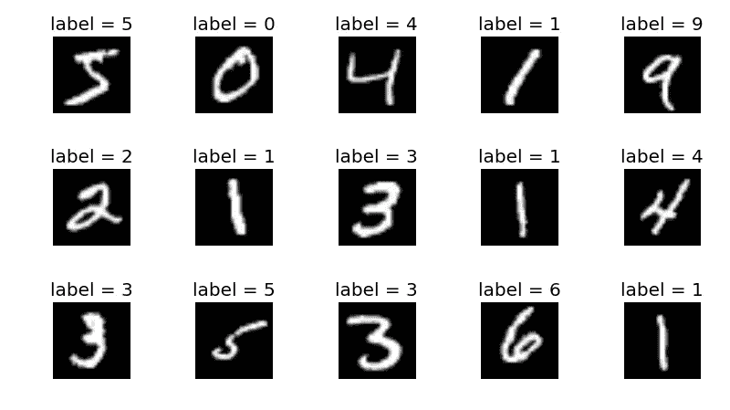

# 5 分钟机器学习

> 原文：<https://towardsdatascience.com/machine-learning-in-5-minutes-2fad75721850>

## 引起媒体热议的新兴技术

凯文·Ku 在 [Unsplash](https://unsplash.com/s/photos/machine-learning?utm_source=unsplash&utm_medium=referral&utm_content=creditCopyText) 上的照片

机器学习。它向你展示你的抖音推荐，让谷歌助手回复你的查询，这是一项可怕的技术，有一天将接管世界。但是真正的内幕是什么呢？让我们一起去看看🧐吧

# 基础知识

任何人工智能算法实际上都只是一个巨大的数学问题。你得到一堆输入，对这些输入执行数百个等式，然后得到想要的输出。

信用:塔拉普罗尔

这些圆圈中的每一个🔵代表一个数学方程式。两个圆圈之间的每条线代表一个变量，或者说权重，这是在一个叫做**训练的过程中“学会”的。**权重允许确定这些圆或**神经元、**之间关系的不同强度，这可以帮助神经网络找出最终的分类或预测。连接越强，权重值越高。

为了学习赋予机器学习算法其唯一的基于连接的值的权重值，神经网络需要**数据。**神经网络中常用的数据集的一个例子是 [MNIST](http://yann.lecun.com/exdb/mnist/) -存储在图像文件中的大量手写数字，每个数字都由其中包含的数字来标记。

MNIST 数据集

机器学习算法获取这个大规模数据集，并学习它可以用来确定如何获得该输出的**模式**。**训练数据**允许计算机查看成千上万的例子来完善它的技术。**测试数据**允许程序员测试他们的算法对训练集中没有的数据执行得有多好。

以下是在 MNIST 数据集的训练过程中会发生的情况:

1.  所有手写数字图像都被输入到模型中。
2.  每个图像中的像素序列乘以一组权重。然后产品被送入下一层。
3.  这个过程一层一层地继续，直到到达输出层。
4.  还有另一个函数，在这种情况下， [**softmax 函数**](http://deeplearning.stanford.edu/tutorial/supervised/SoftmaxRegression/) **，**应用于该输出层中的值集…
5.  计算预测值(数字分类的标签),并将其与基础事实标签进行比较，基础事实标签是包含在原始数据集中的标签，用于说明图像实际属于哪一类。

很简单，对吧？等等，我们还没完呢。真正神奇的🪄of 神经网络发生在之后*预测被计算出来，与你可能相信的相反。训练过程以所谓的**反向传播**达到高潮，它允许程序回过头来调整它认为将有助于神经网络在未来表现更好的任何数字。*

它通过计算一个**损失值**来实现这一点，损失值是模型对数据表现好坏的指标。根据使用的数据类型，有许多不同的**损失函数**用于计算该值。

一个**优化器**获取损失值，用它来计算模型的错误有多严重，并相应地调整模型的权重。一旦模型被调整，训练过程再次开始。该过程的每次运行被称为单个**时期。**

# **这是你的总结:**

1.  **向模型中输入进料**
2.  **乘以一组权重，重复！**
3.  **将 softmax 功能应用于输出**
4.  **soft max 的输出用于预测类别标签**
5.  **使用损失值和优化器返回并修复导致问题的权重(反向传播)**

一旦运行了期望数量的时期以获得性能良好的模型，训练过程就完成了。然后，在指定的测试数据上测试该模型的性能，并为在现实世界中的应用做好准备😎

# 神经网络的基本类型及其用途

本节包含不同种类的 ML 模型以及它们通常的用途。我还会链接到我的其他文章，这样你可以了解更多！

[**CNN-**卷积神经网络。](https://medium.com/@taraprole/road-signs-driving-you-crazy-e686d97f2480)主要用于对图像数据的操作，如对不同种类的路标或水果进行分类。当你看谷歌镜头或那些告诉你一张图片中有哪些种类的植物的应用程序时，那些就是 CNN。

**多层感知器。用于股票分析、垃圾邮件检测、路线规划和选举投票预测等任务。当您查看电子邮件收件箱时，注意到一些电子邮件被转到了垃圾邮件区，这很可能是受过识别网络钓鱼和诈骗训练的 MLP 所为。**

**RNNs-** 递归神经网络。用于项目顺序很重要的任务，如视频分类或语音标记。当你上传一个视频到 YouTube 上时，它会被扫描是否可能侵犯版权。这可能是 RNN 在起作用，因为必须考虑视频帧和音频文件的顺序才能正确处理它。

**强化学习-** 当你想教计算机一项技能时使用。使用一个分数系统来强化和重复想要的行为，同时以同样的方式阻止不想要的行为。例如，智能人工视频游戏敌人可以使用强化学习来学习如何正确地玩游戏。

# 摘要

1.  简单地说，人工智能算法是一个非常大的数学问题。
2.  图像或数据集等输入乘以一组权重，在训练过程中对这些权重进行优化调整，以最好地完成手头的任务。
3.  经过这些“层”的权重相乘后，到达输出层。
4.  将一个函数应用于输出图层，以获得最终的预测或分类，该预测或分类可用于做出真实世界的决策。
5.  有许多不同种类的神经网络，每一种都用于它们自己独特类型的任务(图像识别、基于数据的预测、学习新技能等)。

*我真不敢相信这篇文章已经结束了！我希望你学到了一些关于人工智能世界的新知识。如果您有任何问题，请随时通过*[*LinkedIn*](https://www.linkedin.com/in/taraprole/)*与我联系，并通过* [*订阅我的简讯*](https://taraprole.substack.com/subscribe) *定期了解我的最新动态。*