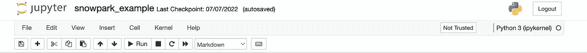
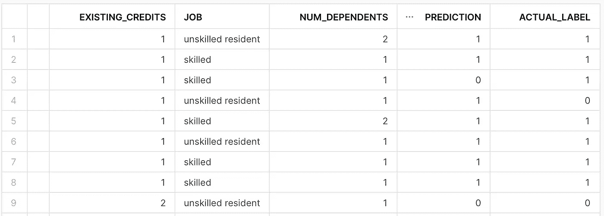

# 数据仓库中的机器学习

> 原文：<https://towardsdatascience.com/machine-learning-in-a-data-warehouse-ab0701bbf631>

## 使用 Snowpark Python 开始机器学习


[贾斯珀盖伊](https://unsplash.com/@jasperguy?utm_source=unsplash&utm_medium=referral&utm_content=creditCopyText)在 [Unsplash](https://unsplash.com/s/photos/snow?utm_source=unsplash&utm_medium=referral&utm_content=creditCopyText) 上的照片

如果您是一名商业环境中的数据科学家，您将从数据仓库或数据湖中提取大量数据用于机器学习。大多数数据科学项目需要大规模的计算能力和对所需 python 库的访问，以处理海量数据和训练机器学习模型。

通常，数据被移动到另一个位置，例如云存储桶，在那里它可以被标准数据科学工具包使用。

这种情况导致了机器学习工作流的碎片化，这是许多云提供商正在寻求解决的问题。我[之前写过](/low-effort-machine-learning-tools-9622d7d57135)关于 [BigQueryML](https://cloud.google.com/bigquery-ml/docs/introduction) ，这是一个谷歌云平台(GCP)工具，它允许机器学习模型在 GCP 的数据仓库平台内纯粹使用 SQL 来开发和训练。

[雪花](https://www.snowflake.com)，一个基于云的数据和分析平台，最近提供了另一个工具，试图以类似的方式简化数据科学的工作流程。

Snowpark Python API 允许使用数据科学家熟悉的工具在 Snowflake 中开发、训练和部署机器学习模型。与 BigQueryML 一样，可以开发模型，而无需数据离开存储位置，然而，使用 [Snowpark](https://docs.snowflake.com/en/developer-guide/snowpark/python/index.html) 而不是用 SQL 编写代码，数据科学家现在可以使用 Python。

在这篇文章中，我写了一个使用 Snowpark 开始机器学习的简要指南。这并不意味着对机器学习本身的详尽指导，所以我将跳过通常工作流程中的一些步骤，如探索性数据分析和特征工程。它旨在给出 API 的一个应用的基本介绍。

本教程中的大部分代码都受到了雪花团队提供的示例的极大启发，这些示例可以在本 [Github repo](https://github.com/Snowflake-Labs/snowpark-python-demos) 中找到。

# 首先，一些有用的定义

雪花与您可能使用过的其他数据仓库工具有一点不同，因此首先理解雪花上下文中的一些常用术语可能会有所帮助。

**数据库:**一个雪花数据库由优化的数据存储组成。通常，一个数据库包含许多模式，每个模式包含一组表。在本教程中，我们将利用数据库来存储训练数据和预测。

**仓库:** Snowflake 为大规模查询处理提供独立的计算集群。每个计算集群被称为一个虚拟仓库。这些仓库的规模可以根据您的加工需求而定。我们将使用仓库计算来执行模型训练和推理。

**Stage:**Stage 是一个存储位置，用于存储数据和构件，以便在雪花中使用。在本教程中，我们将使用一个 stage 来存储我们训练好的模型。

**存储过程:**存储过程是存储在雪花中供以后重用的函数和操作的集合。Snowpark 存储过程提供了一种机制，可以通过 Snowpark 或其他 python 库(如 sci-kit-learn)使用雪花计算来运行 Python 代码。我们将使用存储过程来执行模型训练。

**用户定义函数(UDF):**UDF 是在雪花中运行 Python 函数的另一种方法。这些过程在许多方面不同于存储过程。这篇[文章](https://alexandersks.medium.com/difference-between-stored-procedures-and-udfs-snowflake-9e5b93cdb081)详细描述了两者的区别。在本教程中，我们将使用 UDF 来使用训练好的模型生成推理。

# 建立雪地公园

如果你还没有雪花的权限，你可以在这里注册免费试用。注册后，您需要配置一个数据库、仓库和模式。雪花有一个很棒的 20 分钟指南[在这里](https://docs.snowflake.com/en/user-guide/getting-started-tutorial.html)。

对于本教程的剩余部分，我将假设您已经配置了雪花资源。

本文的设置部分介绍了 Snowpark 的本地安装。该设置基于 macOS。

Snowpark 使用 Snowflake 中的 Anaconda 环境来管理 Python 包。因此，虽然也可以使用 virtualenv，但是最好在本地复制这个环境。

要安装 Anaconda，请运行以下命令。

```
$ brew install --cask anaconda
```

接下来，将以下内容添加到您的。zshrc 文件。

```
export PATH="/usr/local/anaconda3/bin:$PATH"
```

现在，您可以通过运行以下命令来创建 conda 环境。SnowPark 目前只支持 Python 3.8。

```
$ conda create --name py38_env -c https://repo.anaconda.com/pkgs/snowflake python=3.8 numpy pandas sklearn
```

运行以下程序初始化 conda。您只需要运行一次。

```
$ conda init zsh
```

要激活环境，请运行。

```
$ conda activate my_env
```

进入环境后，安装 snowpark 和 Jupyter 笔记本。

```
$ conda install snowflake-snowpark-python$ conda install notebook
```

要运行 Jupyter 笔记本，请键入以下内容。

```
$ jupyter notebook
```

Jupyter 笔记本将推出 Python 3 内核。我的内核如下图所示。



带雪地公园的 Jupyter 笔记本。作者图片

# 雪地公园会议

一旦你设置了 Snowpark 的本地安装，你就可以开始运行代码了。使用 Snowpark API 执行的所有操作都在雪花仓库计算上运行。

要开始使用这台计算机，您需要创建一个 Snowpark 会话，该会话允许您进行身份验证并创建一个与您的数据库和仓库的连接。

要启动雪花会话，我们键入并执行以下命令:

# 数据准备

在本教程的剩余部分，我们将使用 Snowpark 来准备数据集，训练机器学习模型，然后使用该模型来生成预测。

我们将使用来自[openml.org](https://www.openml.org/search?type=data&sort=runs&id=31)的‘credit-g’数据集。这包括银行客户的许多特征，带有一个标签，表明他们是好的还是坏的信用风险。可以使用如下所示的 [sklearn](https://scikit-learn.org/stable/) API 下载数据集。

接下来，我们希望将数据帧写回 Snowflake，以用于训练模型。

以下代码将 pandas 数据帧转换为 Snowpark 数据帧，然后将其作为一个表写入 Snowflake。我们还保留了一个小数据集，用于稍后使用训练好的模型进行测试推断。这也保存为雪花中的一个表。

# 训练模型

对于模型定型，我们将创建一个存储过程。在此之前，我们需要将我们打算使用的包添加到会话中，如下所示。

我们现在可以创建存储过程了。这里的代码将数据分成测试集和训练集，并使用 scikit-learn 管道来执行预处理和训练。模型被训练，保存到指定阶段，并返回分类报告。

# 批量预测

既然我们已经训练了模型，我们想要测试在我们先前保留的推理数据集上生成预测。

在此之前，我们需要将模型位置添加到会话中。

接下来，我们创建一个 UDF 来使用该模型生成预测。

以下代码读入我们为推断保留的数据，并使用 UDF 生成预测。

让我们在雪花中查看结果表。



预测保存到雪花。作者图片

机器学习领域仍然非常分散。典型组织中的机器学习工作流由许多不同的工具组成，这些工具在该过程中扮演不同的角色。数据是这种碎片化可能严重影响机器学习模型的质量和成功的领域之一。

将数据从一个工具移动到另一个工具的需求可能会导致存储相同数据的多个副本，带来数据质量问题和潜在的安全漏洞。Snowpark 和 BigQueryML 等工具寻求最小化这种数据移动，并从本质上将数据科学引入数据仓库。

本教程简单介绍了机器学习工作流，包括 Snowpark Python API 的训练和部署。该工具远不止我在此分享的内容，还有许多实现数据科学工作流的潜在选项。为了获得更全面的指导，我参考了本文开头链接的 Snowpark 示例。

感谢阅读！