# 材料科学中的机器学习

> 原文：<https://towardsdatascience.com/machine-learning-in-materials-science-8c6c0db5ce7a>

## 探索机器学习在材料科学中的应用

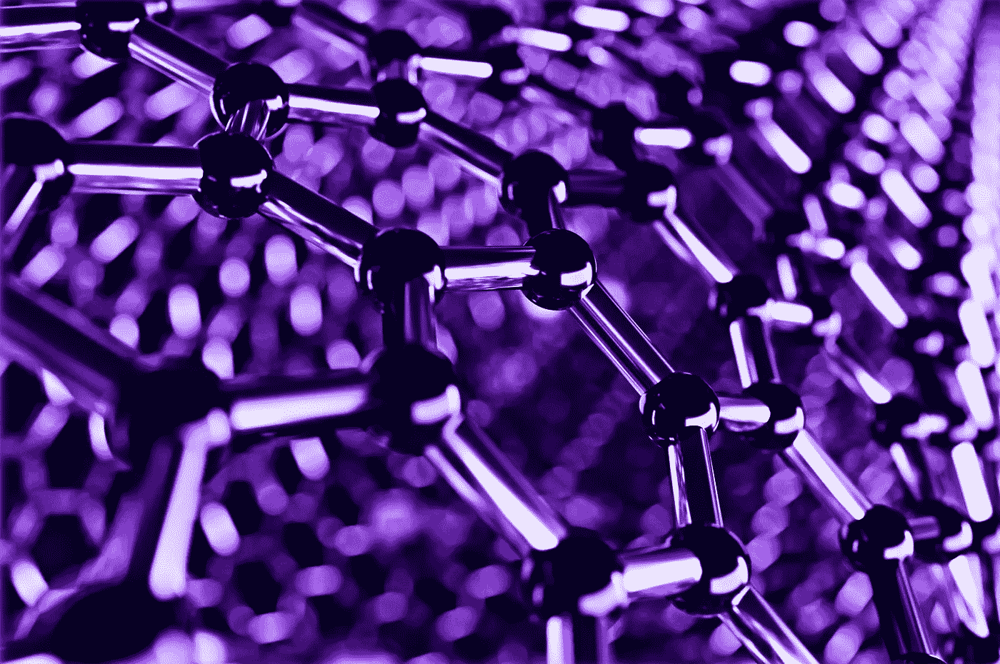

图片改编自 Adobe Stock

随着人工智能和机器学习领域的爆炸式增长，它们的*普适性*越来越明显。机器学习正在大量的子领域中发挥作用，材料科学和聚合物科学也不例外。本文将作为系列文章的第一篇，我将简要讨论与机器学习和材料科学相关的研究论文，其目标只是探索机器学习在该领域中的不同应用方式。

在这次迭代中，我们将关注聚合物。由于聚合物科学是一个非常特殊的领域，如果你正在阅读这篇文章，我假设你已经熟悉了它的基础知识。然而，如果你和我一样，只是天生好奇，我们会用一些基础知识作为论文评论的序言。我必须声明一下我的背景:虽然我在一个实验室工作过，在那里我经常进行聚合物特性测试，但我绝不是一个专家——我只是熟悉这个空间和一些使用的实验室技术。当我**试图**触及事情的科学方面时，请记住这一点。:)

## **聚合物基础**

在深入了解什么是分子水平的聚合物之前，让我们看看一些熟悉的材料，它们是很好的例子。聚合物的一些例子包括:塑料、尼龙、橡胶、木材、蛋白质和 DNA。在这种情况下，我们将主要关注塑料和尼龙等合成聚合物。

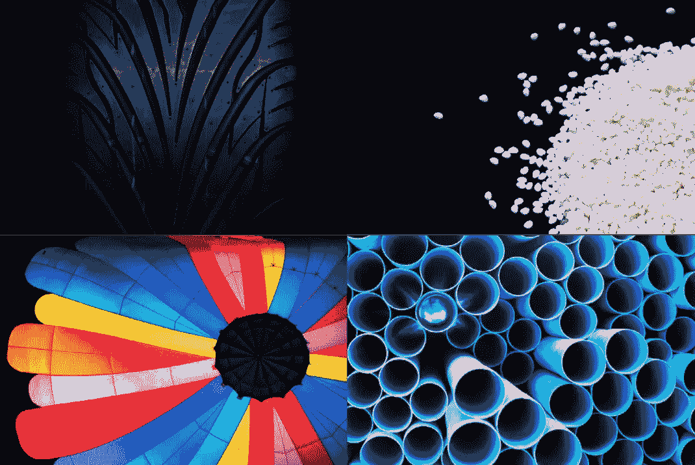

图片改编自 Adobe Stock

在分子水平上，聚合物由长链重复分子组成。在这个链中重复的分子被称为单体(或亚单位)。单体就像链条中的一环。下图显示了多个单体连接在一起形成的聚合物，其中重复序列(用括号表示)可以重复 n 次。

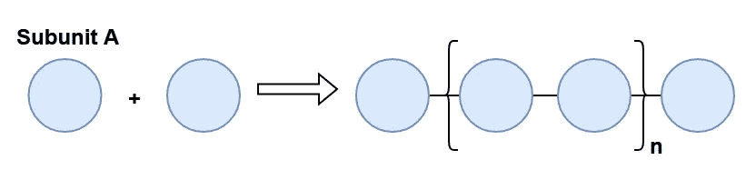

作者图片

有大量的潜在分子可以用作单体:我们将要看的论文提到，已知的化合物大约在 10⁸，而据信最多在 10⁶⁰也可能存在！让我们来看看一些经典的单体例子。

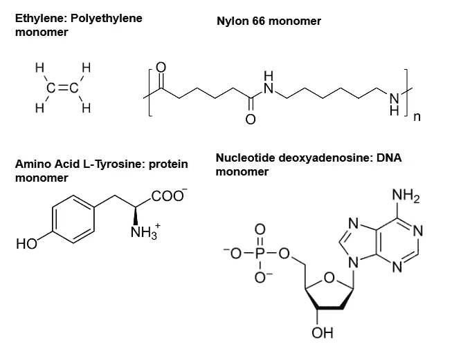

作者图片

显然，单体有各种形状和大小！这一点很重要，因为单体是材料的基本组成部分，所以不同的分子结构会导致截然不同的材料特性。分子设计(设计和发现用作单体的新分子)是聚合物科学研究的一个关键领域，我们将看到一些专注于此的论文(在这篇文章中，以及在未来的迭代中)。

聚合物链并不总是只由一种重复单元组成。**均聚物**是重复亚单元相同的聚合物，而**共聚物**将包含两种类型的亚单元。甚至还有三元共聚物(3)和四元共聚物(4)！当聚合物有一种以上的亚单元时，它们不一定要交替，如下图所示。

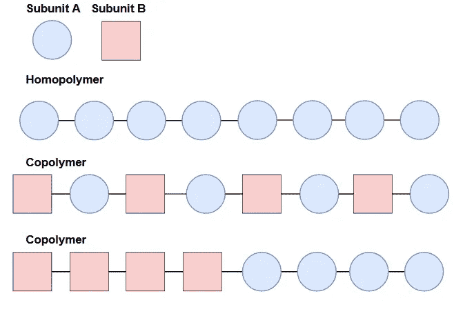

作者图片

亚基的不同组成和构型可以产生不同的性质。在一级结构(链的线性序列)之上，聚合物还可以包含支链、交联或网络结构。

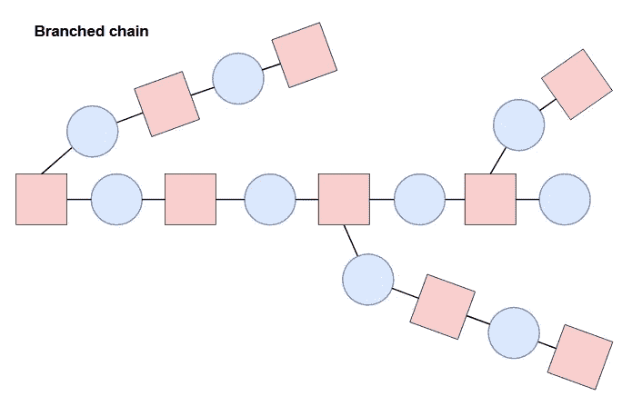

作者图片

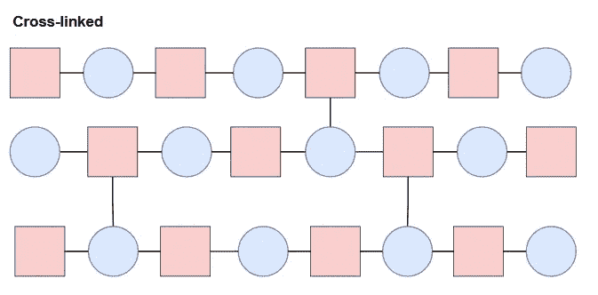

作者图片

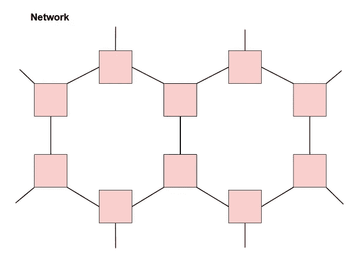

作者图片

更高级的结构取向和形态也会影响性能。进一步的细节超出了这篇文章的范围，但是这里要说明的一点是，有很多复杂性需要考虑，除此之外，在结构和组成上有无限的可能性(所有这些都会改变材料的属性和行为)。尽管如此，很明显，考虑到时间、材料和劳动力成本等因素，在实验室中探索所有可能性基本上是不可能的。这就是计算和机器学习的用武之地！

在聚合物信息学中，机器学习可以应用于聚合物的加速表征、建模和分析、性能预测和分子设计。将 ML 应用于研究工作流可以节省大量的时间和金钱，因为大多数试错过程都通过计算和预测来减少，从而大大缩小了实验室中实际工作的搜索空间。这听起来像是推进研究的一个不可思议的解决方案，但必须考虑到一些关键挑战:

*   与聚合物相关的数据有限
*   通常需要专家参与的混合方法
*   验证需要实验室分析

随着这一领域的工作越来越多，这些挑战的影响应该会大大减少。也就是说，这篇评论选择的论文专注于分子设计，并且有一个非常有趣的方法来克服这些关键挑战之一。我们去看看吧！

# **论文综述:使用分子设计算法通过机器学习辅助发现高导热聚合物**

> 吴，近藤，杨，木本，马。等【使用分子设计算法的高导热聚合物的机器学习辅助发现】(https://rdcu.be/cNgzd)。npj 计算机材料 5，66 (2019)。[https://doi.org/10.1038/s41524-019-0203-2](https://doi.org/10.1038/s41524-019-0203-2)

具有机器学习的分子设计非常有前途，并且有许多工作正在探索这个空间。在本文中，目标是设计具有高[热导率](https://www.sciencedirect.com/topics/materials-science/thermal-conductivity)的新型聚合物材料(侧重于重复亚单元的化学结构)，与最先进的[热塑性塑料](https://en.wikipedia.org/wiki/Thermoplastic)相当。

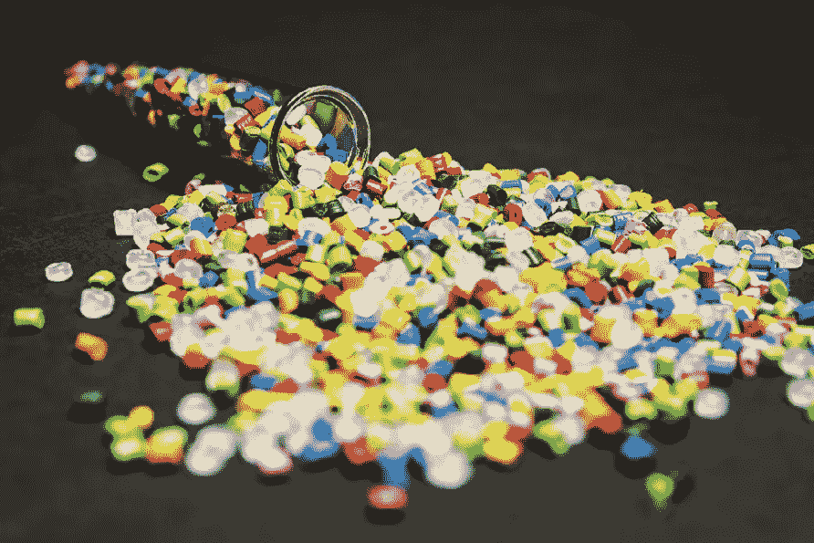

图片改编自 Adobe Stock

这篇论文的有趣之处在于，该模型提出的分子结构是在实验室合成和*验证的。引用作者的话:*

> "在聚合物的特殊情况下，设计的聚合物被合成和实验证实是前所未有的."

这项工作的另一个有趣的方面是使用领域知识来克服只有 28 个热导率数据训练实例的数据集。作者使用了替代数据，而是将[玻璃化转变温度](https://www.sciencedirect.com/topics/chemistry/glass-transition-temperature)和熔点作为“代理属性”，因为他们知道玻璃化转变温度和熔点较高的聚合物往往也具有较高的导热性。

## **使用概率语言模型的贝叶斯分子设计**

通常，当涉及到机器学习的分子设计时，预测有两个方向。“向前”方向被称为**定量结构-性质关系**，或 **QSPR** 。基本上在这个方向上，*物理和化学性质是用给定的化学结构输入来预测的*。后向方向被称为**逆 QSPR** ，正如它听起来的那样:给定一组目标物理或化学性质，一个*分子结构被预测*。

> 旁注:定量结构-活性关系(QSAR)类似于 QSPR，但它模拟的是分子结构和**生物活性**之间的关系，而不是物理/化学性质。这种类型的分子设计对于药物发现是必不可少的。

在本文中，使用了被称为贝叶斯分子设计的机器学习算法。如前所述，目标是在给定一组目标物理性质(iQSPR)的情况下设计单体单元的分子结构。化学结构使用简化的分子输入行输入系统(SMILES)符号表示，该符号实质上将化学结构压缩成一个字符串:

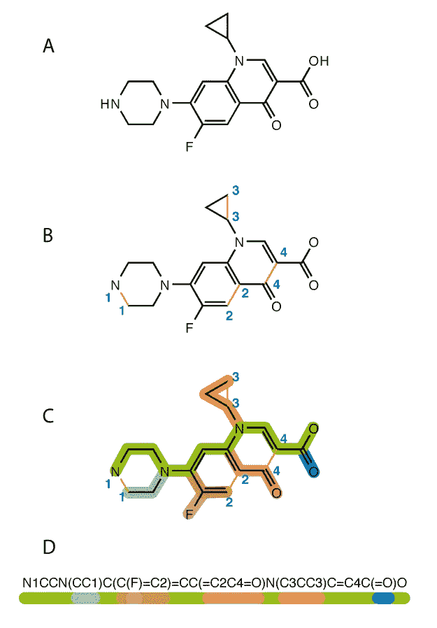

*SMILES 算法的可视化。图片来源:* [*百科*](https://en.wikipedia.org/wiki/Simplified_molecular-input_line-entry_system)

正向模型定义为`p(Y∈U|S)`，反向模型定义为`p(S|Y∈U)`:

> 给定其物理性质 **Y** 的化学结构 **S** 的概率位于区域 **U** 中，其中 **Y** 是热导率， **U** 是所需的值范围。

## **先验分布**

先验分布 **p(S)** 用于最小化模型预测的无效化学结构的出现。为了定义 **p(S)** ，在 [**PolyInfo**](https://polymer.nims.go.jp/en/) 数据库中的 14423 个均聚物上训练`n = 10`阶的 [n-gram 模型](https://web.stanford.edu/~jurafsky/slp3/3.pdf)，以学习真实且有利的结构分子模式。

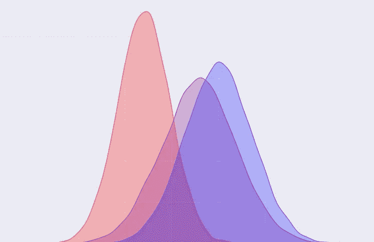

这个可视化中没有有意义的数据，只有分布:)来源:作者

## **正向预测步骤**

使用正向预测模型训练 1000 个神经网络，旨在预测**玻璃化转变温度。**和**熔化温度。**以单体化学结构作为输入。从这里开始，使用在预测**热导率**的原始目标方面表现最好的模型，并使用迁移学习和 [**MXNet**](https://github.com/apache/incubator-mxnet) 对少量*热导率*数据进行微调。

## **向后预测步骤和验证**

最后，利用先验分布和正向模型，形成反向模型，并使用顺序蒙特卡罗方法用于产生 1000 个化学结构。从这些结构中，使用 [SA 分数](https://www.researchgate.net/publication/42344111_Estimation_of_Synthetic_Accessibility_Score_of_Drug-Like_Molecules_Based_on_Molecular_Complexity_and_Fragment_Contributions)基于它们的理论可合成性和加工的容易程度选择了 3 个。

合成了 3 种选定的聚合物(称为 4、13 和 19 ),并在实验室测试了它们的热物理性质。4、13 和 19 的热导率绝对预测误差分别为 0.015、0.001 和 0.017 W/mK，表明预测值和实验值之间高度一致。最终，这些值的范围从**0.18-0.41 W/mK**，与最先进的热塑性塑料相当，并且与研究人员的目标范围一致。

这些结果确实令人兴奋，尤其是考虑到这个领域公开可用的数据仍然缺乏。如果科学界能够贡献并显著扩展可用的聚合物数据，我认为一些真正有前途的研究可以利用机器学习来完成。如果你对本文所用方法的细节感兴趣，[我鼓励你读一读](https://www.nature.com/articles/s41524-019-0203-2.epdf?sharing_token=E-iwfNr-YoElwGuzhmRbBtRgN0jAjWel9jnR3ZoTv0MHuyid8yZr0Vl4erv1AGAsyqMODXQ5YqlX4Z5s71TTgogZgQlqZgpFdZrBqNU0nPODTOhlTzOsLYIIZFpB_jKQCoUgtTuuZM4fYqpUlTCDMvlrzATIFGGMjVg4CtDfgGY%3D)！

## **结论**

看到机器学习应用到不同的领域真的很迷人，我认为在材料科学和工程领域可以取得一些非常酷和重要的成果，特别是在优化可持续发展和改善环境友好性方面。:)

希望长期延续这个系列，欢迎任何批评或改进建议！感谢阅读！

## **参考文献**

*   https://link.springer.com/article/10.1007/s10822-016-0008-z
*   https://www.ncbi.nlm.nih.gov/pmc/articles/PMC7050509/
*   https://onlinelibrary.wiley.com/doi/10.1002/inf2.12167