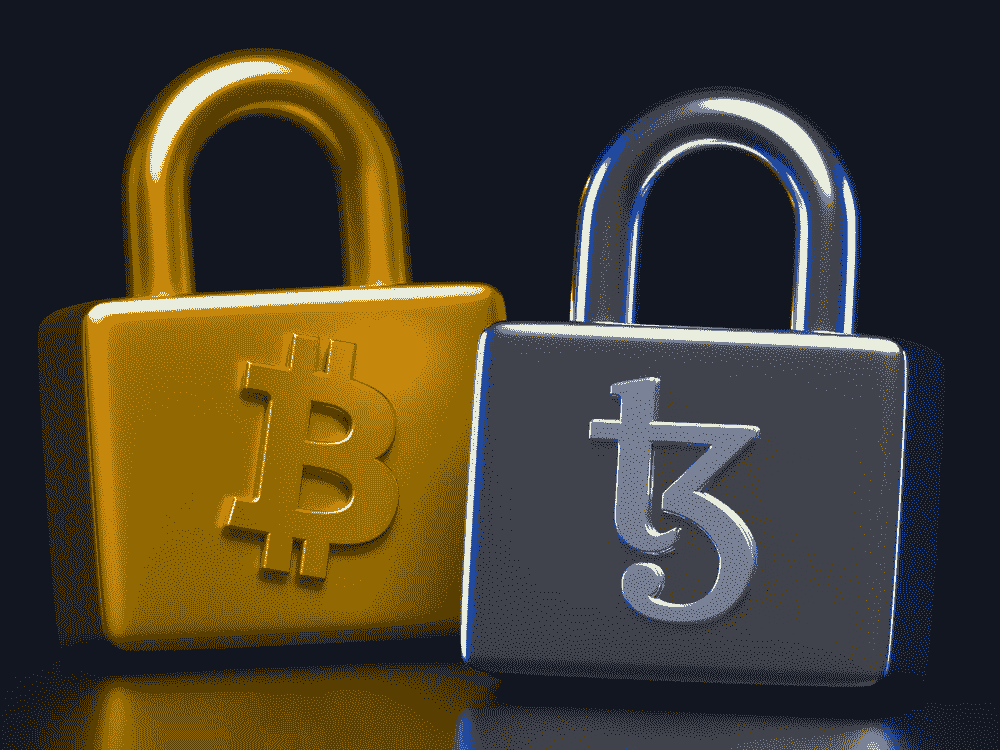
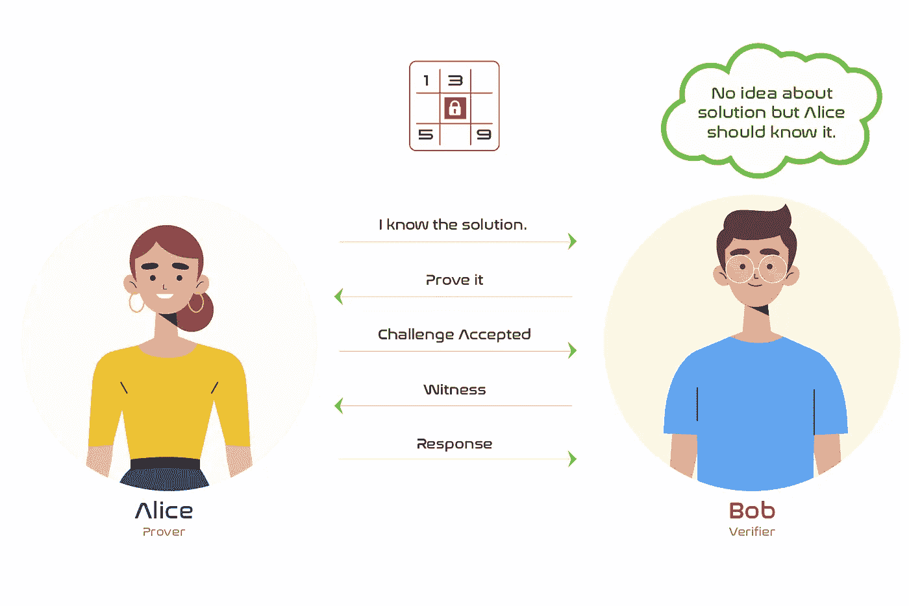
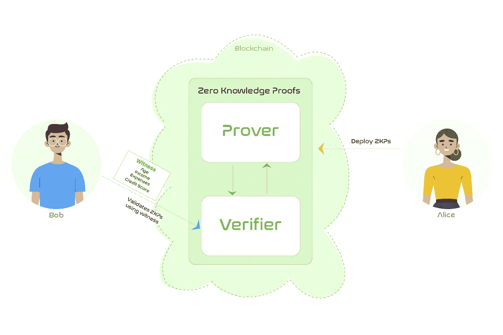
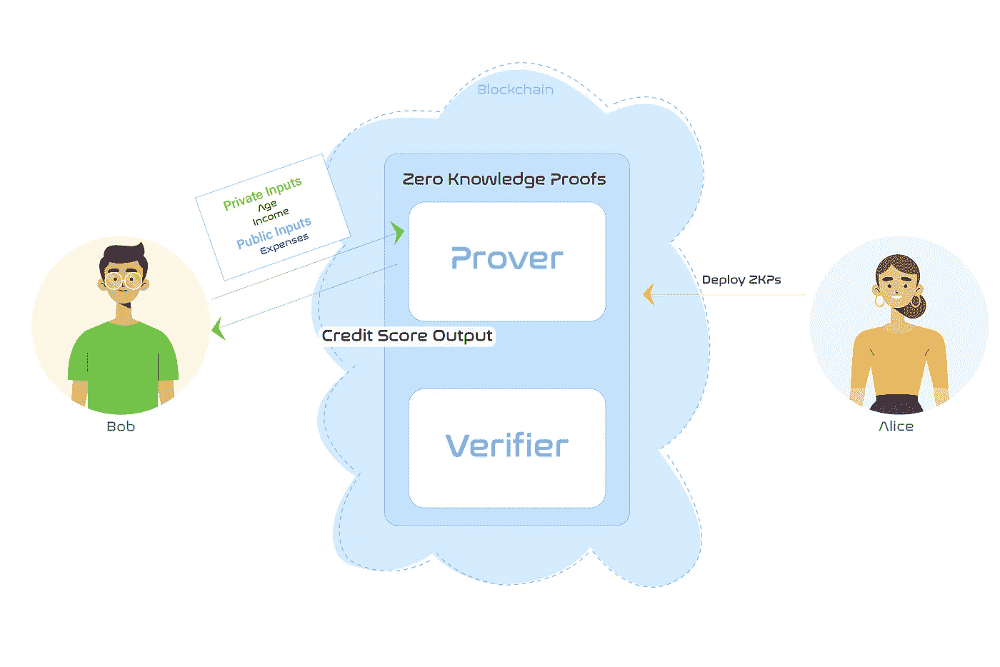
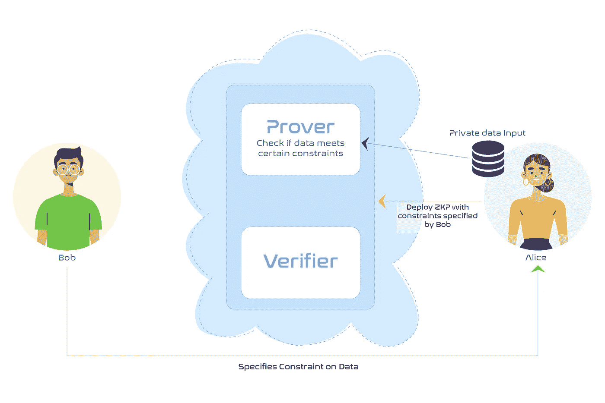
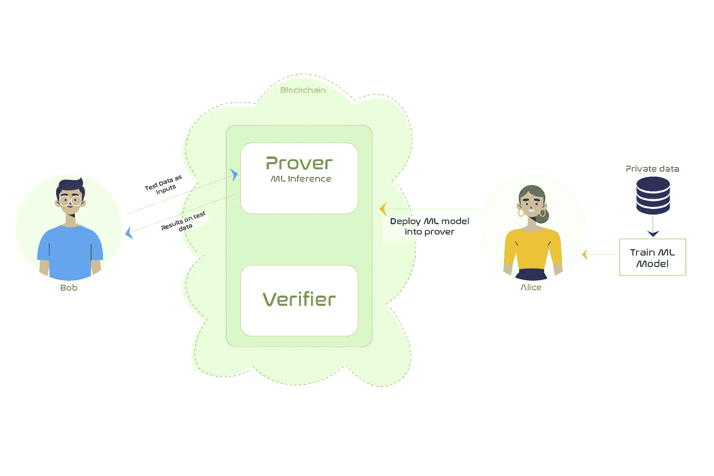

# Web 3.0 中的机器学习

> 原文：<https://towardsdatascience.com/machine-learning-in-web-3-0-8a8819a48aca>

## *了解 Web3.0 如何使机器学习能够在不侵犯隐私和保持信任的情况下工作。*

保护隐私的区块链 ML(来源: [Unsplash](https://unsplash.com/photos/0jlrb5uElec)

机器学习就是发现数据中的潜在关系。然后，这些关系可用于获得任何业务的可行见解。

然而，近年来，政府(如欧洲的 GDPR)和一般用户对数据所有权的认识日益提高。如今，人们无法接受自己的私人数据被公司随心所欲地用于分析。

这导致了以下困境:

*   公司需要对用户数据进行分析，以更好地了解和改进他们的服务。他们获得的数据越多，他们的洞察力就越强。这就产生了从其他用户或第三方公司获取数据的强烈动机。将数据作为资产出售给其他公司也有强大的金钱激励。
*   用户意识到他们的个人数据可能会被滥用或泄露给其他公司。这阻碍了他们与公司分享数据。

> 如何才能解决这一困境？
> 
> Web3.0 带来了零知识证明的思想来解决这类问题。

# 零知识证明

零知识证明在数据隐私至上的应用中非常有用。zkp 使应用程序能够证明来自数据的洞察力是正确的，而不会暴露底层数据。

ZKP 可以理解为两个参与者(证明者和验证者)之间的交互。

1.  ***证明者:*** 证明者执行一个计算，并想向任何第三方证明该计算是有效的。
2.  ***验证者* :** 验证者的角色是验证其他人所做的计算是否有效。这是通过接受来自用户的*见证*来完成的，该见证具有带输入和预期相应输出的样本测试数据点。这被用户用来验证证明者的真实性。

证明者和验证者都部署在区块链网络上，以保持透明。

让我们以数独游戏为例来演示 ZKP 的工作原理。在这里，鲍勃试图解决一个数独难题，爱丽丝说她知道答案。Bob 现在不确定 Alice 是否真的知道答案。为了给 Bob 信心，Alice 必须透露解决方案。但是这会破坏鲍勃的兴致！有没有其他方法可以让 Bob 相信 Alice 知道解决方案，而不需要透露出来？这正是 ZKP 所能做到的。

展示证明者-验证者互动的实例。作者图片

Alice 可以部署一个 ZKP(证明者-验证者),它将难题的一部分作为输入，并给出该部分的解决方案。这样，Bob 可以将一个已解决的部分连同预期结果一起作为“见证”发送给 ZKP 的验证者。验证者可以验证 Alice 的证明者是否也给出了与 Bob 的预期解相同的解。这将使 Bob 相信 Alice 确实知道解决方案。然后，他可以直接与证明者交互，以获得谜题特定部分的提示。

那么 ZKPs 到底是如何实现隐私保护机器学习的呢？

> ZKPs 可以在两种不同的情况下实现隐私保护的机器学习:
> 
> 1.私有数据分析。
> 
> 2.数据和最大似然算法市场。

# **私人数据分析**

这里*的数据是私人的*，但是*的模型必须是公开的*，以给人们对所提取的洞察力的本质的信心，并让它到达更多的受众。

我们将以信用评分应用程序为例。这里可能需要用户的私人信息，如年龄、性别、工资、过去的债务偿还记录、每月开支等。这些然后被用于计算用户的信用分数。如今，没有办法确定计算信用评分的公司是否尊重用户隐私。他们完全可以将这些数据用于其他应用程序，或者在未经用户同意的情况下将其出售给其他方。将整个应用程序放在诸如以太坊这样的公共区块链上，可以实现透明性并保护用户同意。

将整个信用评分应用程序放在以太坊上有一个主要问题。计算信用评分的 ML 模型可能是公司的专有技术。公司没有动力在以太坊这样的公共区块链上托管。这就是 zkp 发挥作用的地方。ZKPs 将核心 ML 算法逻辑加密到一个证明者中。人们可以把证明者想象成一个在黑盒子中执行计算而不向任何人透露盒子内容的实体。zk-SNARK 和 zk-STARKs 是构造这种黑盒(证明者)的流行加密方法。你可以在这里阅读更多关于这些[的内容。](https://www.blockchain-council.org/blockchain/zk-snarks-vs-zk-starks/)

我们将继续信用评分的例子，以了解这样的事情是如何实现的。让我们假设 Alice 经营一家公司，该公司根据用户的私人数据计算信用评分。该应用程序部署在 ZKP 框架内，以确保用户的数据隐私。任何用户，比如 Bob，都可以通过将一个由测试值(年龄、收入、支出)和预期结果(信用评分范围)组成的见证传递给验证者来验证这个 ZKP 应用程序的正确性。验证者使用这些值来验证证明者的输出是否与预期的见证输出相匹配。

用户(Bob)使用见证来验证信用计算的正确性。作者图片

一旦用户对信用分数计算的正确性有信心，他就可以直接与证明者交互，证明者将某些输入保密(年龄、收入)，而将其他输入公开(费用)。证明者运行计算并返回信用分数作为输出。这样，我们让 Alice 对 Bob 的数据进行计算(分析),而不会影响隐私。

用户(Bob)每天直接与证明者交互以获得信用分数。作者图片

# 数据和 ML 算法市场

**数据市场**

ML 模型随着数据变得更好。这为公司之间买卖数据创造了强大的动力。如今，如果不实际共享数据集，就无法验证数据集的质量。这就是 zkp 再次出手相救的地方。

ZKPs 可用于构建一个证明器，该证明器使用某些计算来检查数据是否满足某些约束或属性，作为健全性检查。证明者将保持数据的私密性，并且它在公共区块链上的事实将确保在验证过程中没有舞弊。这确保了购买者在购买数据集之前对数据质量有信心。

如果 Alice 要向 Bob 出售私有数据集，她必须确保数据满足 Bob 指定的某些约束。根据 Bob 的约束构建 ZKP 应用程序，并将其部署到公共区块链上。然后，Alice 可以将她的私有数据集作为输入发送给证明者，并显示她的数据满足所有必要的约束。

Bob 在向 Alice 购买之前验证数据。作者图片

**ML 算法市场**

有时，手头的问题可能是销售 ML 算法和相关的预训练模型。在这里，我们也面临着在卖给卖家之前得到卖家确认的问题。ZKPs 在这里的使用方式与上面讨论的数据市场问题非常相似。

我们可以通过 ZKPs 将预先训练好的模型部署到证明者中。然后，购买者可以发送测试数据集来验证该模型在测试集上的表现是否令人满意。这确保了购买者在购买之前对 ML 算法有信心。

下图显示了 Alice 如何将 ML 模型训练和部署到 ZKP 框架中。这使得 bob 能够在从 Alice 那里购买 ML 算法之前，在定制的测试数据集上测试模型的性能。

Bob 在购买前验证了 Alice 的 ML 模型。作者图片

# 参考

[1] Horace Pan，Francis Ho，和 Henri Palacci， [ZK 机器学习](https://0xparc.org/blog/zk-mnist)，0xPARC，2022 年 8 月访问

[2]尼克·乌尔文，[以太坊数据市场](https://github.com/nulven/EthDataMarketplace)，于 2022 年 8 月到访