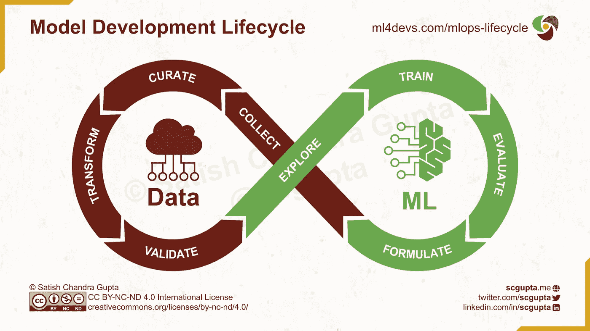
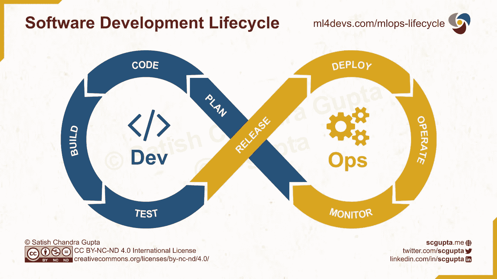
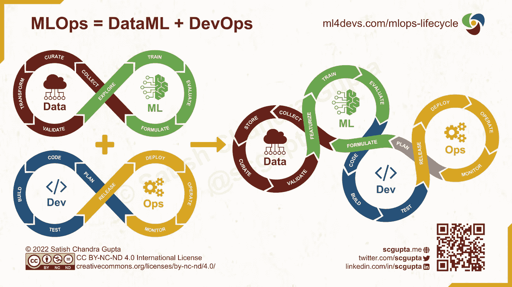

# MLOps:机器学习生命周期

> 原文：<https://towardsdatascience.com/machine-learning-lifecycle-in-mlops-era-5b45284c0e34>

苏珊·d·威廉姆斯在 [Unsplash](https://unsplash.com/photos/VMKBFR6r_jg) 上的照片

## MLOps

## 面向 MLOps 时代的机器学习生命周期将模型和软件开发结合在一起，以构建 ML 辅助产品

构建机器学习产品或 ML 辅助产品功能涉及两个不同的学科:

*   **模型开发:**数据科学家——在统计学、线性代数和微积分方面技术高超——训练、评估和选择表现最佳的统计或神经网络模型。
*   **模型部署:**开发人员——在软件设计和工程方面非常熟练——构建一个健壮的软件系统，将其部署在云上，并对其进行扩展以服务于大量并发的模型推理请求。

当然，这是一个严重的过度简化。构建有用且成功的人工智能辅助产品还需要其他一些重要的专业知识:

*   **数据工程:**构建数据管道，从不同的来源收集数据，对其进行筛选和转换，并将其转化为同质的、干净的数据，这些数据可以安全地用于训练模型。
*   **产品设计:**了解业务需求，确定有影响力的目标和相关业务矩阵；为这些目标定义产品特性或用户故事，认识到 ML 更适合解决的潜在问题；设计用户体验，不仅将 ML 模型预测与其余产品功能无缝结合，而且收集用户(再)行为作为模型结果的隐式评估，并使用它来改进模型。
*   **安全分析:**通过结合模型结果和其他可公开获得的信息或数据，确保软件系统、数据和模型是安全的，没有个人身份信息(PII)被泄露。
*   **人工智能伦理:**确保遵守所有适用的法律，并添加措施以防止任何类型的偏见(例如，限制模型的范围，添加人工监督等。)

随着越来越多的型号被部署到生产中，MLOps 的重要性自然也就越来越大。人们越来越关注 ML 模型在整个产品中的无缝设计和功能。鉴于模型开发可能对产品和业务产生的后果，它不能在筒仓中完成。

我们需要一个适应 ML 辅助产品和 MLOps 现实的 ML 生命周期。它应该促进所有利益相关者的可见性，而不会对数据科学家和工程师的现有工作流造成太多的改变。

在本文的其余部分，我首先给出了典型的模型开发和软件开发工作流的概述，然后介绍了如何将这两者结合起来，以适应在 MLOps 时代构建 ML 辅助产品的需求。

# 模型开发生命周期

让我们暂时把在线部署模型放到生产中。十多年来，数据科学家一直在构建统计和神经网络模型。通常，这些模型被离线(即手动执行)用于[预测分析](https://www.ml4devs.com/articles/drivetrain-approach-actionable-insights-from-descriptive-diagnostic-predictive-prescriptive-data-analytics/)。

模型开发包括两组活动:数据准备和模型训练。它从制定一个 ML 问题开始，以模型评估结束。

模型开发生命周期。图片由作者提供。

## 规划

数据科学家将业务目标转化为机器学习问题。您可能需要考虑几个因素:

*   **业务目标:**缩小到可以服务于业务目标的一小组 ML 问题。
*   **错误的代价:**没有一个 ML 模型可以做到 100%准确。假阳性和假阴性的代价是什么？例如，如果一个图像分类模型错误地预测一个健康人患乳腺癌，进一步的测试将纠正它。但是，如果该模型未能诊断出患者的癌症，那么由于检测过晚，它可能是致命的。
*   **数据可用性:**这可能令人惊讶，但您可能从没有数据开始，然后启动您的数据收集。随着数据变得越来越丰富，它可能会使更多类型的模型变得可行。例如，如果您要在没有标记数据的情况下进行异常检测，您可以从各种非监督聚类算法开始，并将不在任何聚类中的点标记为异常。但是当你收集用户对你的模型的反应时，你会有一个带标签的数据集。然后，您可能想要尝试监督分类模型是否会执行得更好。
*   **评估指标:**根据问题的表述，您还应该指定一个模型性能指标进行优化，该指标应该与您的业务目标的业务指标保持一致。

## 收集

从内部应用程序和外部来源收集必要的数据。可能是通过废弃 web、从您的移动应用程序或 web 服务中捕获事件流、从运营(OLTP)数据库、应用程序日志中捕获变更数据(CDC)流等。您可以将所有需要的数据摄取到您的[数据管道](https://www.ml4devs.com/articles/scalable-efficient-big-data-analytics-machine-learning-pipeline-architecture-on-cloud/)中，该管道由数据工程师设计和维护。

## 副牧师

收集的数据几乎从来都不是原始的。您需要清理它，删除重复项，填充缺失值，并将其存储在数据仓库或数据湖中。如果是为了训练一个有监督的 ML 模型，那么你也必须标记它。此外，您必须对其进行分类，以便能够轻松发现和正确理解。尽可能多地尝试自动化，但是有些部分需要手动完成(特别是贴标签)。

## 改变

一旦数据被清理，您可以转换它以适应分析和 ML 建模。它可能需要改变结构、与其他表连接、沿重要维度聚合或汇总、计算附加特征等。数据工程师应该将数据管道中的所有数据自动化。

## 使生效

实施质量检查，维护一段时间内的统计分布日志，并创建触发器，以便在任何检查失败或分布波动超出预期限制时发出警报。数据工程师与数据科学家一起在数据管道中实施这些验证。

## 探索

数据科学家执行探索性数据分析(EDA ),以了解各种要素与他们希望模型预测的目标值之间的关系。他们也做特性工程，这很可能导致增加更多的转换和验证检查(前两个阶段)。

## 火车

数据科学家训练多种模式，运行实验，比较模型性能，调整超参数，并选择几个性能最佳的模型。

## 评价

根据业务目标和度量标准评估模型特征。一些反馈可能导致甚至不同地调整和表述 ML 问题，并再次重复整个过程。

这个 Data-ML 无限循环不是线性的。在每一个阶段，你并不总是前进到下一个阶段。一旦发现问题，你就回到相关的前一阶段去适应它们。所以从每一个阶段到前一个阶段都有隐含的边。

它类似于开发人员遵循的 DevOps 循环。不是每个进入测试阶段的代码都会进展到发布阶段。如果测试失败，它将返回到代码(有时甚至是计划)阶段，以便纠正问题。

# 软件开发生命周期

DevOps 无限循环是软件开发生命周期的事实上的标准，用于在云上快速构建和部署软件应用程序和服务。

它由两组活动组成:设计和开发软件系统，部署和监控软件服务和应用程序。

软件开发生命周期。图片由作者提供。

## 计划

这是任何产品或产品特性的第一阶段。您讨论业务目标和关键业务指标，以及哪些产品功能有助于实现它们。你深入到终端用户的问题，并讨论用户旅程以解决这些问题，并收集所需的数据来评估 ML 模型在现实世界中的表现。

## 密码

设计和开发软件，端到端的产品或应用程序，而不仅仅是 ML 模型。建立应用程序代码用来调用模型推理和使用其结果的契约和 API，以及将收集哪些用户反应和反馈。

让开发人员、数据工程师和数据科学家达成共识非常重要。这将减少以后令人讨厌的意外。

## 建设

这一阶段促进了各种部件的持续集成，因为它们会演化并打包成一种将被发布的形式。它可以是库或 SDK、docker 映像或应用程序二进制文件(例如 Android 应用程序的 apk)。

## 试验

单元测试、集成测试、覆盖测试、性能测试、负载测试、隐私测试、安全测试和偏差测试。想出这里适用的各种软件和 [ML 模式测试](https://www.ml4devs.com/newsletter/002-model-evaluation-vs-model-testing-vs-model-explainability/)，并尽可能地自动化它们。

测试是在一个与目标生产环境相似的试运行环境中进行的，但不是为相似的规模而设计的。它可能有虚拟的、人为的或匿名的数据来端到端地测试软件系统。

## 释放；排放；发布

一旦所有的自动化测试通过，并且在某些情况下，测试结果被手工检查，软件代码或模型被批准发布。就像代码一样，模型也应该被版本化，必要的元数据应该被自动捕获。正如 docker 映像在 docker repo 中被版本化一样，模型也应该在模型 repo 中被持久化。

如果模型与服务于模型的微服务的代码一起打包，那么 docker 映像也有模型映像。这是持续集成结束和持续部署接管的地方。

## 部署

从 docker repo 或模型存储中挑选已发布的工件，并将其部署到生产基础设施上。根据您的需求，您可以选择[基础设施即服务(IaaS)、容器即服务(CaaS)或平台即服务(PaaS)](https://www.ml4devs.com/articles/serverless-architecture-for-microservices-on-aws-vs-google-cloud-vs-azure-as-iaas-caas-paas-faas/) 。

您还可以使用 TensorFlow Serve、PyTorch Serve 或类似 SageMaker 和 Vertex AI 的服务来部署您的模型服务。

## 操作

一旦部署了服务，您可能会决定先发送一小部分流量。金丝雀部署是分阶段更新的常用策略(例如 2%、5%、10%、25%、75%、100%)。如果出现问题、意外行为或指标下降，您可以回滚部署。

一旦门户对 100%的流量开放，您的部署基础架构应该会正常关闭旧服务。它还应该随着负载的峰值和下降而扩展。Kubernetes 和 KubeFlow 是实现这一目的的常用工具。

## 班长

在这个最后阶段，您不断地监控服务的健康状况、错误、延迟、模型预测、异常值和输入模型特性的分布等。如果出现问题，根据问题的严重性和诊断结果，您可以将系统回滚到旧版本，发布修补程序，触发模型重新培训，或者执行任何其他需要的操作。

# MLOps 生命周期

目前，数据科学家开发一个模型，然后"[把它扔过墙](https://wiki.c2.com/?ThrownOverTheWall)"给开发人员和 ML 工程师，与系统的其余部分集成，并在生产中部署它，这是很常见的。

ML 和 Dev 筒仓和分散的所有权是许多 ML 项目失败的最常见原因之一。统一模型和软件开发生命周期为所有涉众提供了急需的可见性。

模型开发和软件开发需要结合在一起，以构建 ML 辅助的产品。图片由作者提供。

## 计划步骤是起点

产品规划高于一切。定义业务目标和设计用户体验不仅应该包括产品功能，还应该包括如何将模型结果和捕捉用户反应融入产品设计。

与传统软件不同，当随着时间的推移收集更多的数据时，产品的 ML 方面的用户体验可能需要更新才能从中受益，即使没有“新功能”

## 首先构建没有 ML 的产品

我通常首先用基于规则的试探法或虚拟模型构建一个端到端的应用程序，完全切断 Data-ML 循环。这是一个基线模型，有助于收集数据。它还通过展示模型将如何在产品中使用来为数据科学家提供背景。

## 模型和软件开发的不同节奏

开发一个 ML 模型和开发软件是完全不同的。软件系统可以增量开发(某些部分不工作)。不像软件块，ML 模型不能被分解成细粒度。

单一生命周期并不排除数据、ML、Dev 和 Ops 车轮以不同的速度旋转。事实上，这已经发生在 DevOps。在一些团队中，并不是每个开发冲刺都会带来新版本的部署。另一方面，一些团队每小时部署一次新版本，也就是在一次冲刺中部署数百次。让每个轮子以自己的最佳速度旋转。

## 整合所有权，早期集成，经常迭代

这是我对提高开发和部署 ML 辅助产品的成功率的三点看法:

*   **巩固所有权:**负责端到端项目的跨职能团队。
*   **早期集成:**实现一个简单的(基于规则的或者虚拟的)模型，首先开发一个端到端的产品特性。
*   **经常迭代:**构建更好的模型，替换简单的模型，监控，重复。

# 摘要

MLOps 时代的机器学习生命周期将模型开发和软件开发结合成一个永恒的结。在构建 ML 辅助的产品和功能时，它促进了所有利益相关者的可见性。

MLOps 生命周期 MLOps 时代的机器学习生命周期将数据、ML、Dev 和 Ops 集成在一个循环中。图片由作者提供。

**如果你喜欢这个，请:**

*原载于*<https://www.ml4devs.com/articles/mlops-machine-learning-life-cycle/>**。**