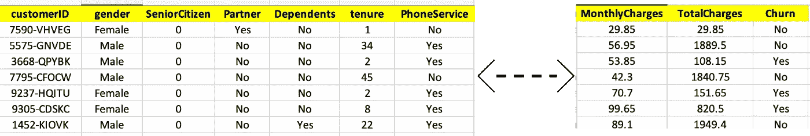
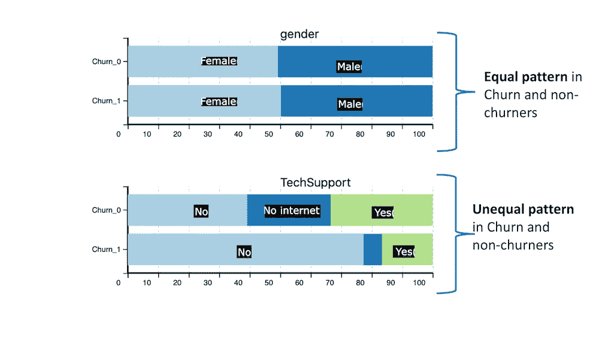
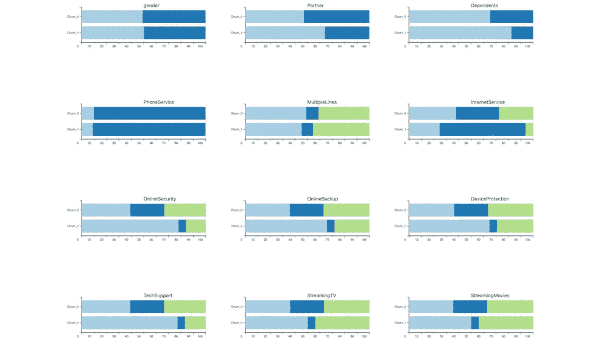
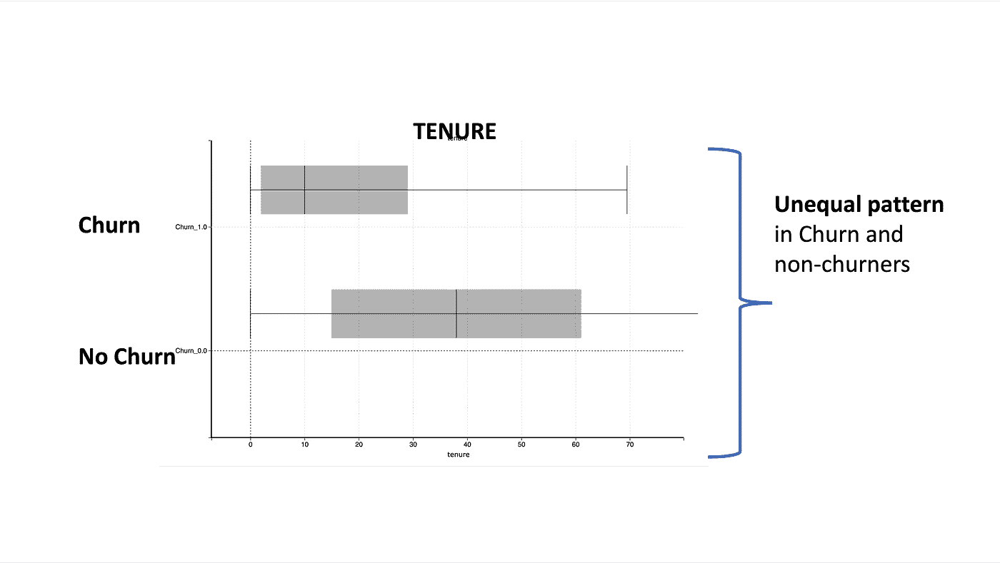
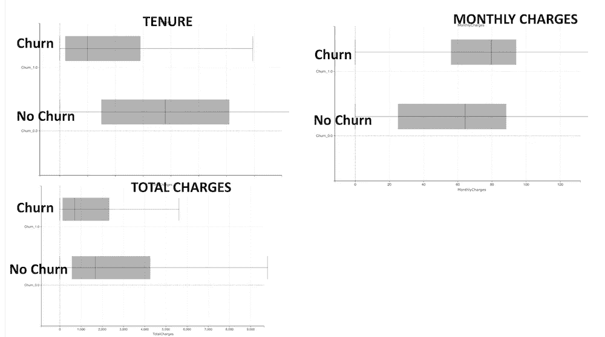
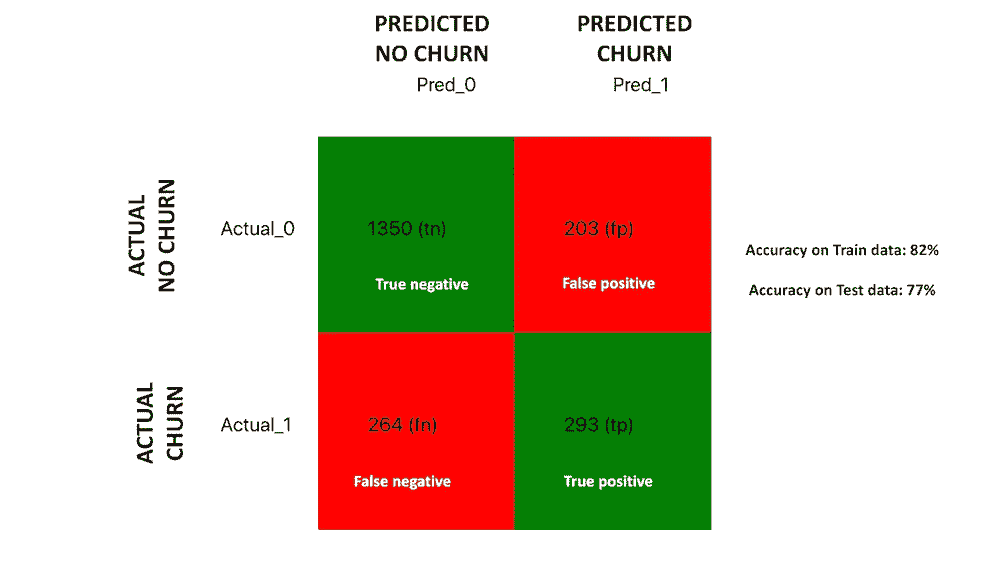
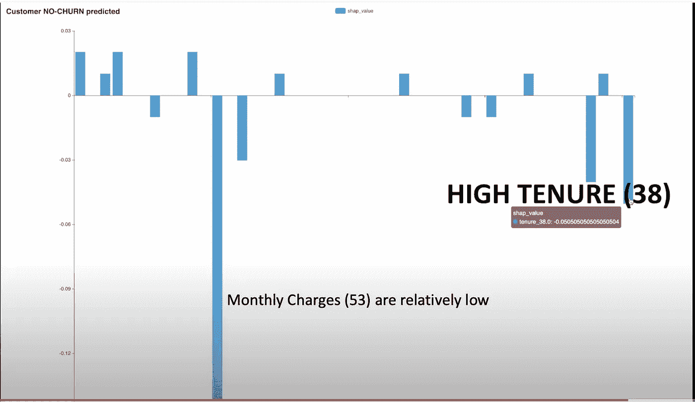

# 机器学习魔法三角

> 原文：<https://towardsdatascience.com/machine-learning-magic-triangle-b1ee85c7a3fd>

## 思考机器学习过程的新方法

迈克尔·泽兹奇在 [Unsplash](https://unsplash.com/s/photos/magic-triangle?utm_source=unsplash&utm_medium=referral&utm_content=creditCopyText) 上的照片

下面显示的机器学习流程看起来熟悉吗？这是所有数据科学家和机器学习工程师都习惯在工作中看到和使用的流程。

标准机器学习流程(图片由作者提供)

虽然这是一个完美的机器学习流程，但它有以下低效之处

*   它专注于数据科学的发展，而忽略了开发问题的业务假设的重要部分
*   这是一个开放的流程。然而，高效的机器学习需要在开始和结束之间形成闭环

在这篇博客文章中，我想介绍一种思考机器学习过程的新方法。我把它命名为机器学习魔术三角。

机器学习魔三角(图片由作者提供)

它试图克服标准机器学习流程的低效率。

*   它侧重于开发问题的业务假设。这非常重要，因为它将数据探索步骤转化为业务语言中的假设
*   通过确保模型解释与初始假设相匹配，这是一个闭环流程。

我举个例子说明一下过程。

让我举一个电信公司的例子。该公司收集与客户人口统计数据、客户所拥有的服务以及客户是否有过不愉快经历相关的数据。样本数据如下所示。

电信客户流失数据集(图片由作者提供)

使用这些数据，我们可以开发一个机器学习模型，用于预测可能流失的客户。目标变量是客户流失，这是我们需要预测的。其他列称为分类(非数字)特征和数字特征。

现在让我们来看看开发预测模型所需的步骤。使用这些数据，我们可以开发一个机器学习模型，用于预测可能流失的客户。

我们将经历机器学习神奇三角的以下步骤。

**数据探索和假设**:在这一步中，我们将探索数据，并提出一个假设，解释客户为什么会流失。

机器学习:我们将训练一个机器学习模型，它将能够预测客户是否会流失。

**模型解释**:我们将通过预测已知的流失案例并解释结果来理解机器学习模型。这个解释可以用最初的假设来检验。

# 数据探索和假设

数据探索有助于理解客户为什么会流失。一种有用的数据探索技术是分析**分类(非数字)与目标变量(变动)**。

下面是性别与流失/不流失以及技术支持与流失/不流失的例子。就性别而言，我们看到，女性与男性的比例相当于搅拌者和非搅拌者。这意味着性别对搅拌没有影响。

但是，对于技术支持，我们发现没有技术支持的客户流失率更高。因此，技术支持是决定客户流失的一个重要因素。

分类(非数字)与目标变量(变动)-按作者分类的图像

下图是对所有分类变量的分析。你会发现不同的服务(除了电话服务)有助于区分搅拌者和非搅拌者

所有分类(非数字)与目标变量(变动)-按作者分类的图像

我们可以使用箱线图可视化对**数字变量**进行同样的分析。下面是任期与目标变量的一个例子。我们可以观察到，任期较短的客户很可能会流失。

数字变量与目标(图片由作者提供)

下面显示的是对所有数值变量的分析。你会发现高月费和低总费用也是流失的原因。高总费用也意味着高任期。

所有数字变量与目标(图片由作者提供)

基于以上数据探索，我们可以做出以下**假设:**

> 月费**高的客户**和月费**低的客户(新客户)**更容易流失。此外，这些相对较新的客户支付较高的月费，**并没有将所有服务都包括在较高的月费中。因此，尽管每月收费很高，但他们可能并没有获得价值和服务，所以他们可能会陷入困境**

> 开发这样的文本解释有助于用商业语言描述问题。这也可以帮助业务线领导理解机器学习工作的目标。

# 机器学习模型

现在让我们训练一个机器学习模型。机器学习算法有很多种，这里用的是 XGBoost。

使用因变量(X)作为所有人口统计字段、服务类型和计费字段来训练该模型。目标变量(Y)是客户流失。机器学习模型将尝试在 X 变量和 y 之间建立关系。

数据分为训练(70%的数据)和测试(30%的数据)。机器学习模型是基于训练数据开发的。然后，该模型用于预测测试数据的流失。然后将预测的流失和实际的流失与测试数据进行比较。结果可以被可视化为如下所示的混淆矩阵。

训练和测试数据准确性都很好。所以我们可以保留基于 XGBoost 的机器学习模型。

机器学习模型的输出可以被可视化为如下所示的混淆矩阵。

混淆矩阵-作者图片

# 预测流失和解释预测

现在是使用机器学习模型进行预测的时候了。预测是在名为 score dataset 的数据集上进行的，score dataset 是一些不是模型训练的记录。

现在让我们来解释一些预测。例如，预测客户 6894-LFHLY 会流失。SHAP 解释器将显示如下所示的可视化。

> 正柱表示该因素有助于客户流失。负柱表示该因素不会导致客户流失。

我们看到，导致客户流失的主要因素是合同和总费用。合同是月合同，总费用(75)相对较低，表明任期较短。这个解释也符合最初的假设。

对流失客户的 SHAP 分析

现在让我们以客户 9767-FFLEM 为例，预计他不会流失。预测的解释如下所示。我们发现月费和租期是阻止客户流失的主要因素。任期(38)是高的，因此客户没有搅动。**这个解释也符合最初的假设**

针对非频繁交易客户的 SHAP 分析(图片来自作者)

> 你会发现我们闭合了假设和模型解释之间的回路。这使机器学习流程有了目的，并有助于确保结果与问题的商业解释相匹配

这就是机器学习神奇三角的力量！

机器学习魔三角(图片由作者提供)

# 结论

标准的机器学习流程侧重于数据科学的发展，而忽略了对问题的商业假设的发展。

机器学习三角有助于克服标准流程的低效率，方法是专注于开发问题的业务假设，以及关闭预测和假设之间的循环

# 数据集引用

电信数据集可在此获得。[T5T7**允许商业和非商业使用。**](https://www.ibm.com/community/terms-of-use/download/)

  

请**订阅**每当我发布一个新的故事时，请保持通知。

  

你也可以通过我的推荐链接**加入 Medium**

  

# 额外资源

# 网站(全球资讯网的主机站)

你可以访问我的网站进行零编码分析。[**https://experiencedatascience.com**](https://experiencedatascience.com/)

# **Youtube 频道**

**这是我在 https://www.youtube.com/c/DataScienceDemonstrated 的 YouTube 频道
T5 的链接**