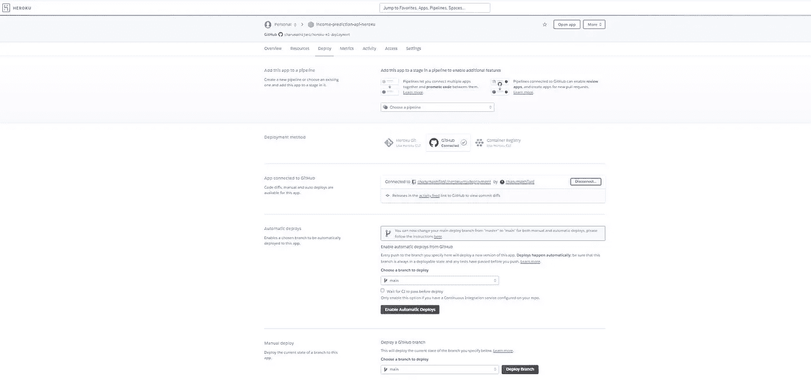
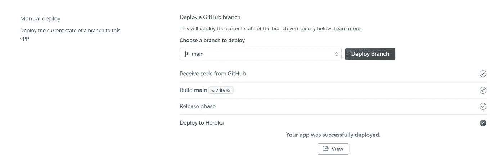
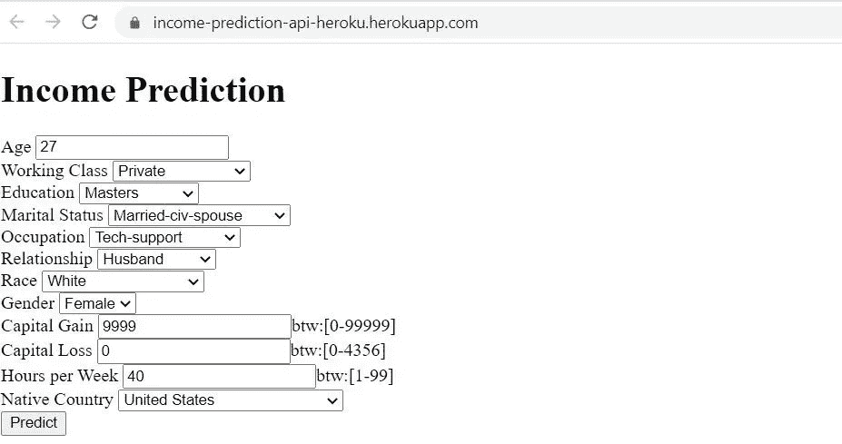
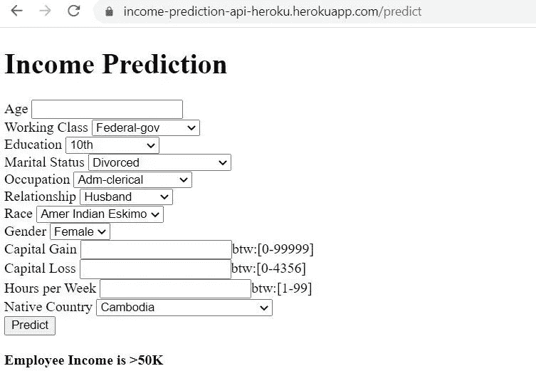
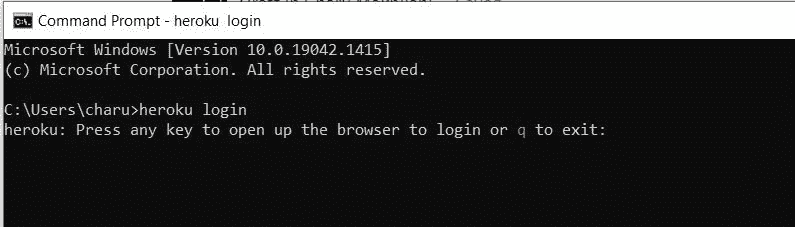

# 使用 Flask 在 Heroku 上部署机器学习模型

> 原文：<https://towardsdatascience.com/machine-learning-model-deployment-on-heroku-using-flask-467acb4a34da>

# 使用 Flask 在 Heroku 上部署机器学习模型

## 机器学习平台即服务

凯文·Ku 在 Unsplash 上的照片

几周前，我写了一篇关于使用 Spark 部署机器学习模型的帖子，如果你想批量而非实时地进行预测，这是一种部署 ML 模型的好方法。

 [## 使用 Spark 的机器学习模型部署

### Spark 使 ML 部署更容易

towardsdatascience.com](/machine-learning-model-deployment-using-spark-585e80b2eae1) 

但是如果你想要实时预测，那么这个解决方案并不理想，因为…

1.  做出预测需要几秒钟，而且不是实时的。
2.  手动部署会有一些停机时间。
3.  没有 UI 来测试解决方案。

将机器学习模型部署为服务可以解决大多数问题，预测将是实时的。但是会有一些问题，比如可伸缩性、监控和服务中断。尽管有许多云提供商来解决这些问题并提供 24*7 支持。尽管如此，如果你是一家小公司或者刚刚开始从事 AI/ML，并且不想花更多时间来处理云部署或 DevOps 任务，并且想要一个快速部署选项，那么使用 Flask 在 Heroku 上部署你的机器学习模型将解决你的所有问题。

# Heroku 使用烧瓶

Heroku 是 Salesforce 的平台即服务工具。Heroku 由 AWS 支持，所有 Heroku 应用程序/服务都托管在 AWS 上。AWS 提供基础设施并处理所有负载平衡、资源利用、联网、日志记录、监控，Heroku 充当中间人，提供具有所有云功能的可扩展、自动化的快速部署平台。使用 Flask 将提供 UI 来测试，并且它可以与企业级应用程序集成。

作者图片

## 使用 Flask 在 Heroku 上部署的步骤

使用 Flask 在 Heroku 上部署从创建机器学习模型到部署有 7 个步骤。这些步骤对于所有机器学习模型都是一样的，你可以使用这些步骤在 Heroku 上部署任何 ML 模型。

1.  创建 ML 模型并保存(pickle)它
2.  为 UI 和 python 主文件(app.py)创建 Flask 文件，这些文件可以从步骤 1 中取消选取机器学习模型并进行预测
3.  创建 requirements.txt 来设置 Flask web app 和所有 python 依赖项
4.  创建 Procfile 以启动 Flask app 命令
5.  在 Github repo 中提交步骤 1、2、3 和 4 中的文件
6.  在 Heroku 上创建账户/登录，创建一个 app，连接 Github repo，选择 branch
7.  在 Heroku 上选择手动部署(或启用自动部署)

**大功告成！！**

您可以在 Heroku 仪表板中检查日志或使用 Heroku CLI。在日志的结尾，它会给出访问 UI 上部署的应用程序的 URL。该网址将有语法像-【https://app-name.herokuapp.com/】

# **深潜**

**现在让我们来看看上面 7 个步骤的实际代码实现(用 python)。**

**在**步骤 1** 中，我们创建一个 ML 模型并将其保存在 pickle 文件中。**

**这里第 3 行中的 gbc 是为收入预测而训练的梯度提升分类器模型。如果你想知道我是如何创建这个梯度推进预测模型的，请参考 GitHub [链接](https://github.com/charumakhijani/heroku-ml-deployment/blob/main/IncomePrediction.ipynb)。**

**在第二步**中，**我们将创建 flask 文件——index.html 和 app.py**

****index.html，**是一个烧瓶 UI [文件](https://github.com/charumakhijani/heroku-ml-deployment/blob/main/templates/index.html)，用于向模型提供输入(或特征)。**

****app.py** ，是一个 python 主文件，它从步骤 1 中解开梯度增强模型，呈现 flask UI 页面 index.html，并基于来自 UI 的输入进行预测。**

**在**步骤 3** 中，我们将创建 requirements.txt 来添加 flask 应用程序的所有依赖项。**

**在**步骤 4** 中，我们将创建 Procfile 来指定 Heroku app 在启动时执行的命令。**

**在**步骤 5** 中，我们将把步骤 1–4 中的所有文件添加到 Github repo 中。收益预测的 Github 回购[可以在这里](https://github.com/charumakhijani/heroku-ml-deployment)找到。**

**在**步骤 6** 中，我们将登录 Heroku 并创建一个新的 app，这里是-收入-预测-api-heroku。**

****

**作者图片**

**接下来，我们将在步骤 5 中创建的 GitHub repo 连接到 Heroku 应用程序，并选择一个分支。**

****

**作者图片**

**最后，在**步骤 7** 中，选择手动(或自动)部署，您可以看到构建日志滚动。一旦应用程序被部署，您将在日志中获得应用程序的 URL 并显示成功消息。**

****

**作者图片**

**点击“查看”,将带您进入第 2 步中的 Flask UI 页面。**

****

**作者图片**

**一旦你填写了所有的字段并点击预测，它将给出最终的预测结果。**

****

**作者图片**

## **Heroku 日志**

**您可以在 [heroku-cli](https://devcenter.heroku.com/articles/heroku-cli) 中查看 Heroku 应用程序部署日志。下载 cli 后，打开命令提示符并登录 Heroku。**

****

**作者图片**

**登录后，您可以使用命令查看部署日志**

**heroku logs -app**

****

**作者图片**

**您可以在日志中看到所有加载的构建库和应用程序部署步骤。如果在部署过程中出现任何错误/失败，这些日志对于调试更有用。**

> **就这样！使用这些简单的步骤，任何机器学习模型都可以部署在 Heroku 上，以获得实时预测。**

## ****局限性****

1.  ****成本-** Heroku 每小时的定价比 AWS/Azure 贵很多。所以如果你在 Heroku 上使用多个大规模的应用，那肯定会是一件成本更高的事情。**
2.  **与 AWS/Azure 相比，Heroku 支持的地理区域有限。**
3.  ****手动扩展-** Heroku 不提供 web 应用的自动扩展，但允许手动水平和垂直扩展。**
4.  ****部署与 Git 链接-** Heroku 部署与 Git 链接，如果您使用其他版本控制工具，这是一个限制。**

# ****结论****

**使用 Heroku 生产 ML 模型是一个很好的选择，如果你正在部署一个中小规模的应用程序，不要担心自动伸缩，只想专注于构建 ML 应用程序而不是基础设施。**

**虽然使用 Heroku 部署会花费更多；同样的成本可以通过更少的资源来构建/监控本地/云基础架构和执行开发运维任务来节省。Heroku 是初学者友好的，你可以在几秒钟内创建一个服务器并部署应用程序。在 AWS 的支持下，Heroku 提供了所有的云平台功能，如扩展、日志、监控、配置和健康检查。此外，您还可以获得 24x7 全天候运营支持，并且不会停机/停机时间最短。**

**要使用 Heroku 访问实时预测的完整代码，请参考 GitHub [链接](https://github.com/charumakhijani/heroku-ml-deployment)。**

****如果您想了解更多模型部署策略，请参考-****

** [## 生产机器学习模型

### 将模型部署到产品中是一件复杂的事情。

medium.com](https://medium.com/swlh/productionizing-machine-learning-models-bb7f018f8122) 

谢谢你的阅读。如果你喜欢这个故事，请喜欢，分享和关注更多这样的内容。如往常一样，请联系我们以获得任何问题/评论/反馈。

*Github:*[https://github.com/charumakhijani](https://github.com/charumakhijani) *领英:*[https://www.linkedin.com/in/charumakhijani/](https://www.linkedin.com/in/charumakhijani/)**